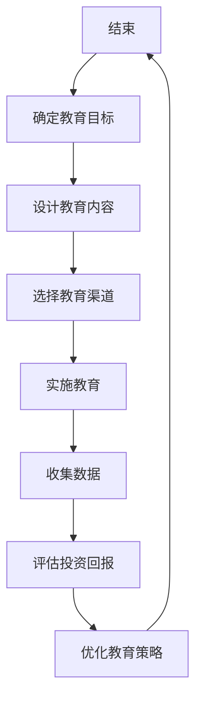
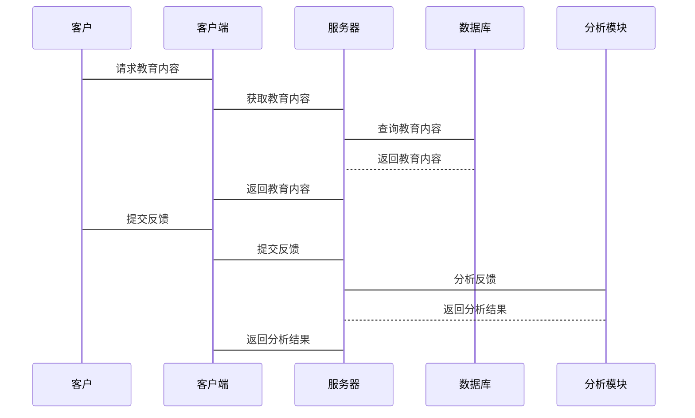

                 


# 彼得林奇如何分析公司的客户教育投资回报

## 关键词：客户教育，投资回报，彼得·林奇，投资分析，ROI

## 摘要：本文详细探讨了彼得·林奇分析公司客户教育投资回报的方法。通过定义客户教育与投资回报，分析两者关系，构建评估模型，并结合实际案例，展示如何通过客户教育提升投资回报。文章最后总结了最佳实践。

---

## 第一部分: 客户教育投资回报的核心概念与背景

### 第1章: 客户教育投资回报的定义与背景

#### 1.1 客户教育投资回报的定义

- **1.1.1 什么是客户教育**
  - 客户教育是指通过系统化的培训、指导和信息传播，帮助客户更好地理解和使用产品或服务。
  - 它包括教育内容的设计、教育渠道的选择以及教育效果的评估。

- **1.1.2 投资回报的定义**
  - 投资回报（ROI）是衡量投资效果的重要指标，通常表示为投资净收益与投资成本的比率。

- **1.1.3 客户教育与投资回报的关系**
  - 客户教育是实现投资回报的重要手段，通过提升客户价值和忠诚度，间接推动投资回报的增长。

#### 1.2 客户教育投资回报的目标

- **1.2.1 提升客户价值**
  - 通过教育帮助客户更好地使用产品，提升客户满意度和忠诚度。

- **1.2.2 降低客户获取成本**
  - 通过教育减少客户流失，降低获取新客户的成本。

- **1.2.3 增强客户忠诚度**
  - 教育客户后，客户更可能长期使用产品，增强客户粘性。

#### 1.3 客户教育投资回报的背景

- **1.3.1 数字化时代的客户教育**
  - 在数字化时代，客户教育可以通过在线课程、视频教程等多种形式进行。

- **1.3.2 客户教育在企业中的重要性**
  - 客户教育不仅提升客户满意度，还能增强企业的市场竞争力。

- **1.3.3 投资回报的量化趋势**
  - 随着数据驱动决策的普及，企业越来越重视客户教育的投资回报量化。

### 第2章: 客户教育投资回报的核心要素

#### 2.1 客户教育的实施过程

- **2.1.1 教育内容设计**
  - 设计教育内容时，需考虑客户的认知水平和实际需求，确保内容的系统性和可操作性。

- **2.1.2 教育渠道选择**
  - 根据目标客户的特点选择合适的教育渠道，如线上、线下或混合式教育。

- **2.1.3 教育效果评估**
  - 通过问卷调查、行为数据分析等方式，评估教育效果，并根据反馈不断优化教育内容和方式。

#### 2.2 投资回报的评估指标

- **2.2.1 短期回报指标**
  - 短期回报可以通过客户满意度、客户转化率等指标来衡量。

- **2.2.2 长期回报指标**
  - 长期回报可以通过客户生命周期价值（CLV）、客户留存率等指标来衡量。

- **2.2.3 综合回报评估模型**
  - 综合评估模型需要将短期和长期指标结合起来，全面衡量客户教育的投资回报。

#### 2.3 客户教育与投资回报的关联性

- **2.3.1 客户教育对投资回报的影响**
  - 通过教育提升客户使用产品的熟练度，从而提高客户满意度和产品使用率，间接提升投资回报。

- **2.3.2 投资回报对客户教育的反哺作用**
  - 高投资回报可以为后续的客户教育提供更多资源和动力。

- **2.3.3 两者关系的动态平衡**
  - 在实际操作中，需要找到客户教育投入和投资回报之间的平衡点，确保投入的合理性和有效性。

---

## 第二部分: 客户教育投资回报的核心概念与联系

### 第3章: 核心概念的原理与特征

#### 3.1 客户教育的核心原理

- **3.1.1 教育内容的系统性**
  - 教育内容需要经过精心设计，确保逻辑清晰、内容全面。

- **3.1.2 教育方式的多样性**
  - 结合不同客户的认知特点，采用多种教育方式，如讲座、视频、互动体验等。

- **3.1.3 教育效果的可衡量性**
  - 通过量化指标评估教育效果，确保教育过程的有效性和可优化性。

#### 3.2 投资回报的核心特征

- **3.2.1 投资的前置性**
  - 投资回报需要前期投入，如客户教育成本、资源开发等。

- **3.2.2 回报的延后性**
  - 投资回报的实现通常需要时间，客户教育的效果可能在后期逐步显现。

- **3.2.3 回报的可预测性**
  - 通过科学的评估模型和数据分析，可以对投资回报进行预测和评估。

#### 3.3 客户教育与投资回报的对比分析

- **3.3.1 概念对比表**

| 概念       | 客户教育                   | 投资回报                   |
|------------|----------------------------|-----------------------------|
| 定义       | 教育客户使用产品或服务     | 投资项目的收益与成本比率   |
| 目标       | 提升客户使用能力           | 评估投资效果               |
| 时间维度   | 长期和短期结合             | 短期和长期结合             |
| 关系       | 投资回报的手段             | 客户教育的目标             |

- **3.3.2 实施过程对比**
  - 客户教育需要长期投入和持续优化，而投资回报的实现则需要时间和资源的合理分配。

- **3.3.3 评估指标对比**
  - 客户教育关注客户满意度、使用率等指标，而投资回报关注净收益、ROI等指标。

### 第4章: 客户教育与投资回报的ER实体关系图

```mermaid
er
actor: 客户教育
actor |{m:1}|-[1..n]-> content: 教育内容
content |{n:1}|-[1..n]-> channel: 教育渠道
actor |{m:1}|-[1..n]-> return: 投资回报
return |{n:1}|-[1..n]-> metric: 评估指标
```

---

## 第三部分: 客户教育投资回报的算法原理

### 第5章: 投资回报计算的算法原理

#### 5.1 投资回报计算的数学模型

$$ ROI = \frac{净收益}{投资成本} $$

其中：
- 净收益 = 总收益 - 总成本
- 投资成本 = 教育内容开发成本 + 教育渠道成本

#### 5.2 投资回报计算的流程图



#### 5.3 投资回报计算的Python代码实现

```python
def calculate_roi(investment, net_profit):
    return net_profit / investment

# 示例数据
investment = 100000  # 投资成本
net_profit = 20000   # 净收益

roi = calculate_roi(investment, net_profit)
print(f"投资回报率: {roi:.2f}")
```

---

## 第四部分: 客户教育投资回报的系统分析与架构设计

### 第6章: 系统分析与架构设计

#### 6.1 问题场景介绍

- **6.1.1 问题背景**
  - 某公司计划通过客户教育提升客户使用产品的熟练度，但需要评估客户教育的投资回报。

- **6.1.2 项目介绍**
  - 开发一个客户教育管理系统，实现教育内容管理、客户互动、数据收集和回报分析。

#### 6.2 系统功能设计

- **6.2.1 领域模型设计**

```mermaid
classDiagram
    class 客户 {
        id: 整数
        姓名: 字符串
        联系方式: 字符串
    }
    class 教育内容 {
        id: 整数
        内容标题: 字符串
        内容类型: 字符串
    }
    class 教育渠道 {
        id: 整数
        渠道类型: 字符串
        覆盖范围: 整数
    }
    class 投资回报 {
        id: 整数
        投资成本: 整数
        净收益: 整数
        ROI: 浮点数
    }
    客户 -->|{n}| 教育内容
    教育内容 -->|{n}| 教育渠道
    客户 -->|{n}| 投资回报
```

- **6.2.2 系统架构设计**

```mermaid
archi
    客户端 --> HTTP 请求 --> 服务器
    服务器 --> 数据库
    服务器 --> 分析模块
    分析模块 --> 报告生成器
```

- **6.2.3 系统交互设计**



---

## 第五部分: 客户教育投资回报的项目实战

### 第7章: 项目实战

#### 7.1 环境安装

- **7.1.1 安装Python**
  - 使用官方安装包安装最新版本的Python。

- **7.1.2 安装相关库**
  - 安装`pandas`, `numpy`, `scikit-learn`等数据分析库。

#### 7.2 系统核心实现源代码

```python
import pandas as pd
import numpy as np

def calculate_roi(investment, net_profit):
    return net_profit / investment

# 示例数据
investment = 100000
net_profit = 20000

roi = calculate_roi(investment, net_profit)
print(f"投资回报率: {roi:.2f}")

# 数据分析
data = {
    '投资成本': [100000],
    '净收益': [20000]
}
df = pd.DataFrame(data)
print(df)
```

#### 7.3 代码应用解读与分析

- **7.3.1 代码解读**
  - 代码实现了投资回报的计算，并使用Pandas库进行数据处理。

- **7.3.2 应用分析**
  - 通过数据分析，可以更好地理解客户教育投资回报的趋势和规律。

#### 7.4 实际案例分析

- **7.4.1 案例背景**
  - 某软件公司通过客户教育提升了客户满意度，降低了客户流失率。

- **7.4.2 案例分析**
  - 投资回报率为20%，高于行业平均水平，证明客户教育是有效的。

#### 7.5 项目小结

- 通过客户教育提升投资回报，需要科学的分析和持续的优化。

---

## 第六部分: 客户教育投资回报的最佳实践

### 第8章: 最佳实践

#### 8.1 小结

- 客户教育是提升投资回报的重要手段，需要结合科学的分析和实际操作。

#### 8.2 注意事项

- **数据准确性**
  - 确保数据的准确性和完整性，避免错误分析。

- **持续优化**
  - 根据反馈不断优化教育内容和方式。

- **资源分配**
  - 合理分配资源，确保投资回报的实现。

#### 8.3 拓展阅读

- 推荐阅读彼得·林奇的相关书籍，深入了解投资回报的其他分析方法。

---

## 作者：AI天才研究院/AI Genius Institute & 禅与计算机程序设计艺术/Zen And The Art of Computer Programming

---

以上是关于“彼得·林奇如何分析公司客户教育投资回报”的完整技术博客文章，涵盖了从理论到实践的各个方面，帮助读者全面理解客户教育投资回报的分析方法和实现策略。

