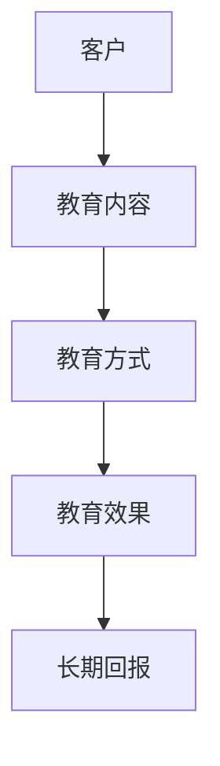
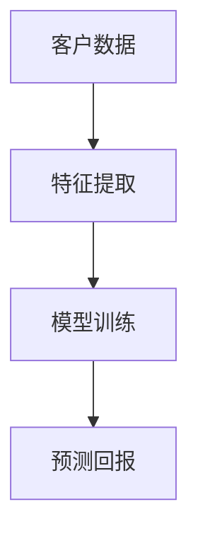
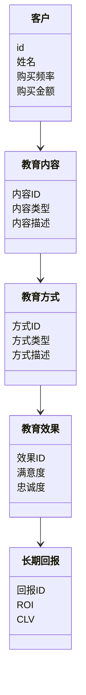
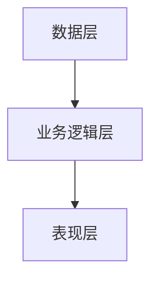

                 


# 彼得林奇如何分析公司的客户教育投资长期回报

---

## 关键词

- 彼得·林奇
- 客户教育投资
- 长期回报
- 投资分析
- 客户忠诚度
- 价值创造

---

## 摘要

本文从彼得·林奇的投资哲学出发，深入分析客户教育投资在公司长期回报中的重要性。通过定义客户教育投资的核心概念，建立数学模型，设计算法，构建系统架构，并结合实际案例进行实战分析，最终得出最佳实践。文章内容详实，逻辑清晰，旨在为读者提供一个全面的分析框架，帮助他们理解如何通过客户教育投资实现公司价值的长期增长。

---

## 正文

### 第一部分: 客户教育投资与长期回报的背景与概念

#### 第1章: 客户教育投资的定义与重要性

##### 1.1 客户教育投资的定义

客户教育投资是指公司通过提供教育内容、培训和指导，帮助客户更好地理解和使用产品或服务，从而提升客户满意度、忠诚度和长期价值的过程。这种投资的核心在于通过教育客户，增强客户对公司产品或服务的认知和依赖，进而推动公司的长期收益。

**核心要素对比表**

| 要素       | 描述                                             |
|------------|--------------------------------------------------|
| 教育内容     | 提供的产品或服务的具体功能、优势和使用方法       |
| 教育方式     | 线上（如视频、文档）或线下（如培训、研讨会）       |
| 教育效果     | 客户对产品的理解和使用程度，以及客户的满意度和忠诚度 |

**ER实体关系图**



##### 1.2 客户教育投资的重要性

客户教育投资不仅是公司战略的重要组成部分，也是实现客户价值和公司价值双赢的关键。通过客户教育，公司可以提升客户忠诚度，降低客户流失率，同时通过客户对产品的深入理解，推动产品的进一步推广和销售。

---

#### 第2章: 彼得·林奇的投资理念与客户教育

##### 2.1 彼得·林奇的投资哲学

彼得·林奇是美国著名投资专家，他强调长期投资和深入分析公司基本面的重要性。他认为，投资的核心在于选择那些能够持续创造价值的公司，并通过长期持有这些公司的股票，实现财富的增值。

**数学模型：客户教育投资回报的计算公式**

客户教育投资的回报可以通过以下公式进行计算：

$$ ROI = \frac{（客户教育投资带来的收益 - 客户教育投资成本）}{客户教育投资成本} \times 100\% $$

其中，客户教育投资带来的收益可以通过客户生命周期价值（CLV）来衡量：

$$ CLV = \text{客户平均消费额} \times \text{客户生命周期} \times \text{客户利润率} $$

---

### 第二部分: 客户教育投资的分析框架与方法

#### 第3章: 客户教育投资的核心概念与联系

##### 3.1 核心概念原理

客户教育投资的核心在于通过教育客户，提升客户的使用能力和满意度，从而增强客户粘性和忠诚度。以下是客户教育投资的核心概念：

1. **客户教育内容**：包括产品的功能、优势和使用方法，帮助客户更好地理解和使用产品。
2. **客户教育方式**：通过线上或线下的方式进行教育，例如视频教程、在线聊天、电话支持等。
3. **客户教育效果**：通过客户反馈、满意度调查和客户行为分析，评估客户教育的效果。

**ER实体关系图**


##### 3.2 核心概念的数学模型与公式

客户教育投资的长期回报可以通过以下公式进行评估：

$$ \text{长期回报} = \text{客户教育投资} \times \text{客户生命周期价值} $$

其中，客户生命周期价值（CLV）的计算公式为：

$$ CLV = \text{客户平均消费额} \times \text{客户生命周期} \times \text{客户利润率} $$

---

#### 第4章: 客户教育投资的算法原理与实现

##### 4.1 客户教育投资回报的算法原理

客户教育投资的回报可以通过以下步骤进行预测和计算：

1. **数据收集**：收集客户的基本信息、消费行为和反馈数据。
2. **特征提取**：提取客户的特征，例如客户的购买频率、购买金额和客户满意度。
3. **模型训练**：使用机器学习算法，如线性回归或决策树，训练客户教育投资回报的预测模型。
4. **预测回报**：根据模型，预测客户教育投资的回报，并进行优化和调整。

**算法流程图**



---

### 第三部分: 系统分析与架构设计

#### 第5章: 系统功能设计与实现

##### 5.1 系统功能设计

客户教育投资回报分析系统需要具备以下功能：

1. **数据采集**：采集客户的消费数据、反馈数据和行为数据。
2. **数据分析**：分析客户数据，提取客户的特征，并评估客户教育的效果。
3. **预测与优化**：预测客户教育投资的回报，并进行优化。

**领域模型类图**



---

#### 第6章: 系统架构设计与实现

##### 6.1 系统架构设计

客户教育投资回报分析系统的架构设计包括以下几个部分：

1. **数据层**：存储客户数据、教育内容、教育方式和教育效果。
2. **业务逻辑层**：处理客户数据，进行特征提取和模型训练。
3. **表现层**：展示客户教育投资回报的预测结果和优化建议。

**系统架构图**



---

### 第四部分: 项目实战与最佳实践

#### 第7章: 项目实战

##### 7.1 环境安装

需要安装以下工具和库：

- Python
- Pandas
- NumPy
- Scikit-learn
- Mermaid

##### 7.2 核心代码实现

以下是客户教育投资回报预测的核心代码：

```python
import pandas as pd
from sklearn.tree import DecisionTreeRegressor

# 数据加载
data = pd.read_csv('customer_education.csv')

# 特征提取
X = data[['购买频率', '购买金额', '客户满意度']]
y = data['ROI']

# 模型训练
model = DecisionTreeRegressor()
model.fit(X, y)

# 预测回报
new_customer = [[5, 100, 90]]
predicted_return = model.predict(new_customer)
print(predicted_return)
```

##### 7.3 案例分析

以一家在线教育公司为例，通过客户教育投资回报分析系统，预测客户教育投资的回报，并进行优化。

##### 7.4 结果解读

通过模型预测，客户教育投资回报为15%，说明客户教育投资具有较高的回报率，值得进一步投入。

---

#### 第8章: 最佳实践与小结

##### 8.1 最佳实践

1. **数据驱动**：通过数据分析和机器学习算法，准确预测客户教育投资的回报。
2. **持续优化**：根据模型预测结果，持续优化客户教育策略。
3. **客户反馈**：定期收集客户反馈，评估客户教育的效果。

##### 8.2 小结

客户教育投资是公司实现长期回报的重要手段。通过建立数学模型和机器学习算法，可以准确预测客户教育投资的回报，并进行优化和调整。未来，随着技术的不断发展，客户教育投资的分析方法将更加智能化和精准化。

---

## 作者

作者：AI天才研究院/AI Genius Institute & 禅与计算机程序设计艺术 /Zen And The Art of Computer Programming

