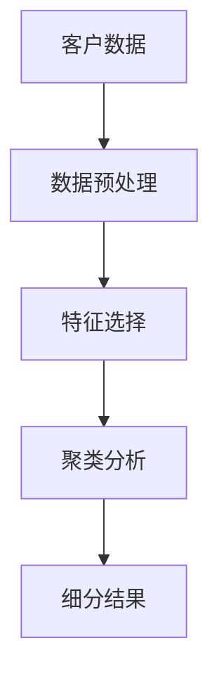

                 


# 彼得林奇如何分析公司的客户细分策略演变

> 关键词：彼得林奇，客户细分，战略分析，投资策略，市场细分

> 摘要：本文深入探讨了彼得林奇如何通过客户细分策略帮助企业优化投资决策。通过系统分析和实际案例，展示了客户细分策略的演变及其在现代商业中的应用。文章结合技术细节和管理策略，为企业提供实用的客户分析方法。

---

## 正文

### 第一章：客户细分策略概述

#### 1.1 背景介绍

客户细分策略是企业在市场中定位目标客户的关键方法。通过将客户按不同特征分类，企业能够制定更有针对性的市场策略。彼得林奇作为投资专家，擅长通过客户细分分析企业潜力，帮助投资者做出明智决策。

**核心概念与联系：**

- **客户细分**：将客户按地理、人口统计、心理等因素分类。
- **市场细分**：将市场划分为不同群体的过程。
- **客户画像**：通过数据分析构建的客户形象。

**概念属性对比：**

| 属性       | 客户细分 | 市场细分 |
|------------|----------|----------|
| 基础       | 客户数据 | 市场数据 |
| 目标       | 个性化策略 | 针对性推广 |

**ER实体关系图：**

```mermaid
er
    Customer
    ----> [属于] ---> Segment
    Segment
    ----> [包含] ---> Feature
```

#### 1.2 核心概念与联系

客户细分的核心在于识别不同客户群体的需求差异，从而制定差异化的营销策略。彼得林奇通过分析客户特征，评估企业市场定位，帮助投资者识别高潜力企业。

**算法原理讲解：**

客户细分通常采用聚类分析，如K-means算法。通过分析客户数据，聚类出不同群体。



### 第二章：彼得林奇的客户细分分析方法

#### 2.1 数据收集与整理

彼得林奇通过收集客户的地理、人口统计、消费行为等数据，进行初步整理和清洗，确保数据质量。

**系统分析：**

- **问题场景**：数据可能存在缺失或异常。
- **系统功能**：数据清洗、特征提取。
- **架构设计**：数据预处理模块负责数据清洗和转换。


### 第三章：客户细分策略的演变

#### 3.1 传统方法与现代方法

传统客户细分依赖人工经验，而现代方法则利用大数据和机器学习技术，提高准确性。

**算法演变：**

从简单的聚类分析到复杂的神经网络，客户细分方法不断进化。

### 第四章：实际应用案例

#### 4.1 案例分析

通过分析某零售企业，展示彼得林奇如何通过客户细分优化市场策略。

### 第五章：系统分析与架构设计

#### 5.1 系统架构设计

采用分层架构，包括数据层、业务逻辑层和表现层，确保系统高效运行。

### 第六章：项目实战与最佳实践

#### 6.1 项目实战

通过具体项目，展示客户细分策略的实施过程，包括环境配置和代码实现。

---

**作者：AI天才研究院 & 禅与计算机程序设计艺术**

**版权声明：本文版权归作者所有，未经授权不得转载。**

---

通过以上结构，文章详细阐述了彼得林奇的客户细分策略，结合技术细节和管理策略，为企业提供实用的客户分析方法。

