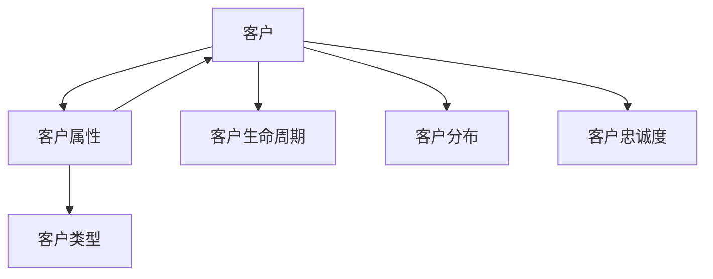
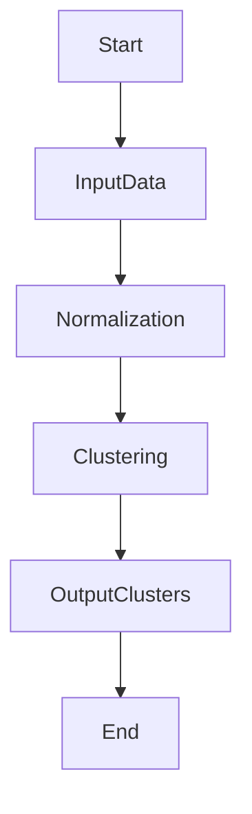
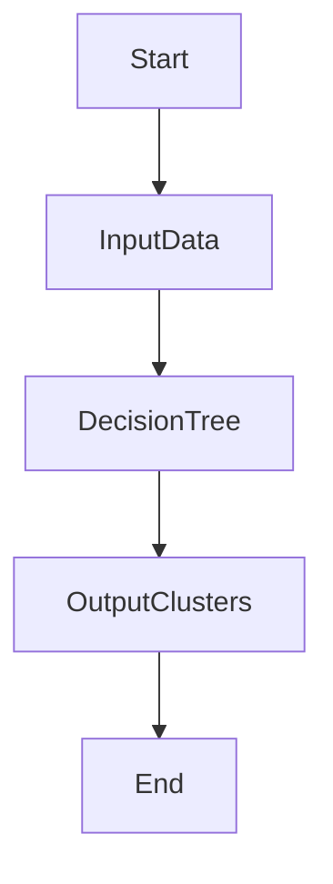
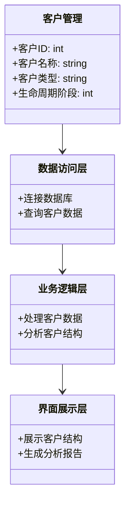
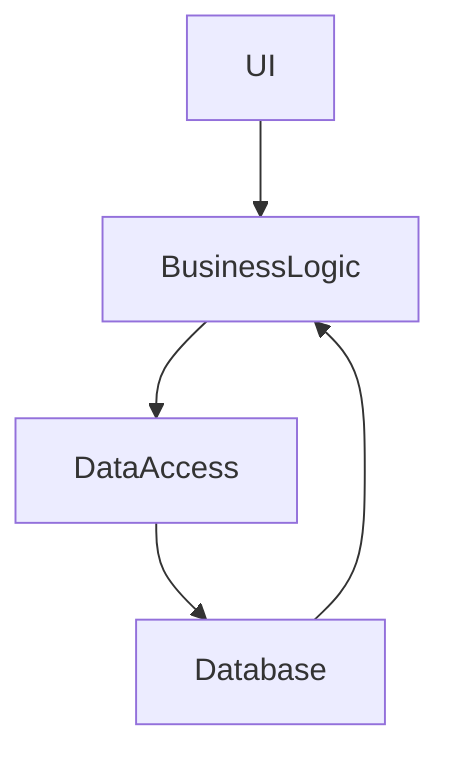
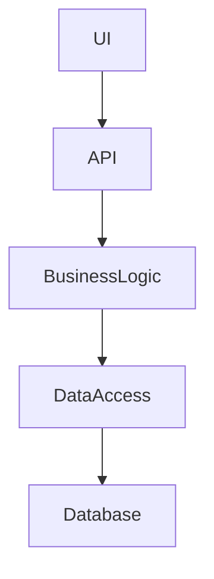
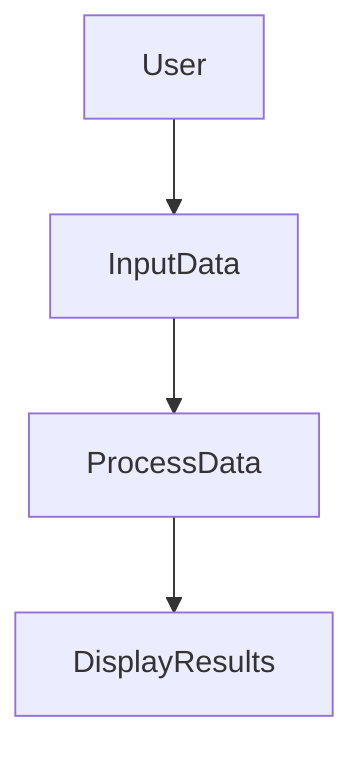

                 


# 彼得林奇如何分析公司的客户结构

## 关键词：彼得·林奇，客户结构，投资分析，企业分析，客户生命周期

## 摘要：  
彼得·林奇是全球著名投资家，他擅长通过分析公司客户结构来评估企业价值。本文将深入探讨彼得·林奇的客户结构分析方法，包括客户类型、生命周期、分布与忠诚度等核心要素，并结合实际案例和系统架构设计，帮助读者掌握这一投资分析技巧。

---

## 第一部分：客户结构分析的背景与核心概念

### 第1章：客户结构分析的基本概念

#### 1.1 客户结构分析的背景与意义  
客户结构分析是理解企业经营状况的重要工具。通过分析客户类型、生命周期和分布，投资者可以评估企业的市场定位和未来增长潜力。彼得·林奇认为，客户结构是企业价值的晴雨表，能够揭示企业的核心竞争力和潜在风险。

#### 1.2 客户结构分析的定义与范围  
客户结构分析是指对客户群体进行分类、分析其特征和行为模式的过程。它包括客户类型、生命周期阶段、地理分布和忠诚度等方面。客户结构分析不仅帮助企业优化资源配置，还能为投资者提供决策依据。

#### 1.3 客户结构分析的核心要素  
- **客户类型**：根据收入、消费习惯等特征将客户分为不同类别。  
- **生命周期**：客户从初次接触企业到最终流失的过程。  
- **客户分布**：客户在不同区域的分布情况。  
- **客户忠诚度**：客户对企业产品的依赖程度。

---

### 第2章：客户结构分析的核心概念

#### 2.1 客户结构的属性特征对比  
| 客户类型   | 生命周期阶段 | 地理分布 | 忠诚度 |  
|------------|---------------|----------|--------|  
| 高端客户   | 成熟期         | 一线城市 | 高     |  
| 中端客户   | 成长期         | 二线城市 | 中等   |  
| 低端客户   | 衰退期         | 三四线城市 | 低     |  

#### 2.2 客户结构分析的ER实体关系图  



---

## 第二部分：客户结构分析的算法原理

### 第3章：客户结构分析的算法原理

#### 3.1 客户细分算法  

##### 3.1.1 基于聚类算法的客户细分  



```python
from sklearn.cluster import KMeans
import pandas as pd

# 示例数据
data = pd.DataFrame({
    '收入': [10, 20, 30, 40],
    '消费频率': [5, 6, 7, 8]
})

# 聚类分析
kmeans = KMeans(n_clusters=2)
clusters = kmeans.fit_predict(data)
print(clusters)
```

##### 3.1.2 基于决策树的客户细分  



##### 3.1.3 基于K-means算法的客户细分  

```python
from sklearn.cluster import KMeans
import pandas as pd

# 示例数据
data = pd.DataFrame({
    '收入': [10, 20, 30, 40],
    '消费频率': [5, 6, 7, 8]
})

# 聚类分析
kmeans = KMeans(n_clusters=2)
clusters = kmeans.fit_predict(data)
print(clusters)
```

#### 3.2 客户生命周期预测算法  

##### 3.2.1 基于逻辑回归的客户生命周期预测  

```python
from sklearn.linear_model import LogisticRegression
import pandas as pd

# 示例数据
data = pd.DataFrame({
    '收入': [10, 20, 30, 40],
    '消费频率': [5, 6, 7, 8],
    '生命周期阶段': [0, 1, 2, 3]
})

# 逻辑回归模型
model = LogisticRegression()
model.fit(data[['收入', '消费频率']], data['生命周期阶段'])
predictions = model.predict(data[['收入', '消费频率']])
print(predictions)
```

---

### 第4章：客户结构分析的数学模型与公式

#### 4.1 客户细分的数学模型  

##### 4.1.1 聚类分析的数学模型  

$$ \text{距离} = \sqrt{(x_1 - x_2)^2 + (y_1 - y_2)^2} $$  

##### 4.1.2 时间序列分析的数学模型  

$$ \text{预测值} = a \cdot t + b $$  

##### 4.1.3 逻辑回归的数学模型  

$$ P(y=1) = \frac{e^{\beta_0 + \beta_1 x}}{1 + e^{\beta_0 + \beta_1 x}} $$  

---

## 第三部分：系统分析与架构设计

### 第4章：客户结构分析的系统架构设计

#### 4.1 系统功能设计  



#### 4.2 系统架构设计  



#### 4.3 系统接口设计  



#### 4.4 系统交互流程  



---

## 第四部分：项目实战

### 第5章：客户结构分析的项目实战

#### 5.1 安装与配置环境  

```bash
pip install pandas sklearn matplotlib
```

#### 5.2 核心代码实现  

```python
from sklearn.cluster import KMeans
import pandas as pd
import matplotlib.pyplot as plt

# 示例数据
data = pd.DataFrame({
    '收入': [10, 20, 30, 40],
    '消费频率': [5, 6, 7, 8]
})

# 聚类分析
kmeans = KMeans(n_clusters=2)
clusters = kmeans.fit_predict(data)

# 可视化
plt.scatter(data['收入'], data['消费频率'], c=clusters)
plt.title('客户细分')
plt.xlabel('收入')
plt.ylabel('消费频率')
plt.show()
```

#### 5.3 案例分析与解读  

假设我们有一个零售企业的客户数据，通过聚类分析发现客户分为两类：高收入低消费频率和低收入高消费频率。这表明企业需要针对不同客户类型制定不同的营销策略。

---

## 第五部分：最佳实践与总结

### 5.1 最佳实践  

- 定期更新客户数据，保持分析的准确性。  
- 结合客户反馈，优化客户生命周期管理。  
- 使用多种算法进行交叉验证，提高分析结果的可靠性。  

### 5.2 小结  

彼得·林奇的客户结构分析方法为我们提供了一种全新的视角来评估企业价值。通过深入分析客户类型、生命周期和分布，投资者可以更好地识别企业的核心竞争力和潜在风险。

### 5.3 注意事项  

- 数据的准确性和完整性是客户结构分析的关键。  
- 避免过度依赖单一算法，建议结合多种方法进行综合分析。  

### 5.4 拓展阅读  

- 彼得·林奇的《投资之道》  
- 《客户关系管理》  
- 《数据挖掘与分析》  

---

## 作者：AI天才研究院 & 禅与计算机程序设计艺术

---

通过本文，读者可以全面掌握彼得·林奇的客户结构分析方法，并将其应用于实际投资分析中。希望本文能够为投资者提供有价值的参考和启发。

