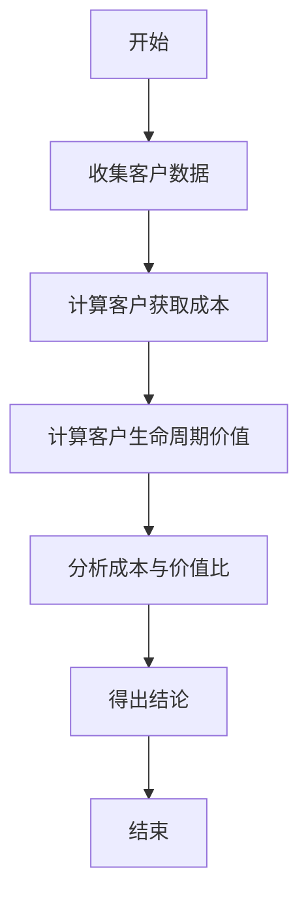
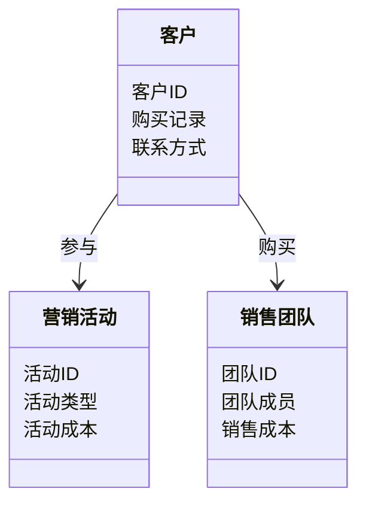

                 


# 彼得林奇如何分析公司的客户获取成本

> 关键词：彼得林奇，客户获取成本，投资分析，成本分析，客户生命周期价值

> 摘要：本文详细探讨了彼得林奇在分析公司客户获取成本（CAC）时所采用的方法和策略。通过系统化的分析框架，结合实际案例，本文揭示了如何通过客户获取成本与客户生命周期价值（CLV）的对比，评估公司的投资价值。文章内容涵盖客户获取成本的基本概念、属性特征、计算方法、系统架构设计及项目实战，为投资决策提供了详尽的指导。

---

# 第1章 客户获取成本的基本概念

## 1.1 客户获取成本的定义与背景

### 1.1.1 客户获取成本的基本定义

客户获取成本（Customer Acquisition Cost, CAC）是指公司为吸引一位新客户所花费的所有直接和间接成本。这些成本包括广告支出、销售团队的薪资、渠道佣金、市场推广费用等。CAC是评估公司市场效率和投资回报率（ROI）的关键指标之一。

**CAC的计算公式**：  
$$CAC = \frac{\text{营销和销售总支出}}{\text{新增客户数}}$$  

### 1.1.2 客户获取成本在投资分析中的重要性

在投资分析中，CAC是评估公司市场效率和盈利能力的重要指标。通过分析CAC，投资者可以了解公司在获取客户方面的成本效率，进而判断公司是否能够通过客户获取实现可持续的盈利增长。

### 1.1.3 客户获取成本与企业价值的关系

CAC与客户生命周期价值（CLV）密切相关。如果CAC低于CLV，说明公司能够通过客户获取实现正收益。反之，如果CAC高于CLV，则表明客户获取成本过高，可能导致公司盈利能力下降。

---

## 1.2 客户获取成本的构成要素

### 1.2.1 广告费用

广告费用是CAC的重要组成部分，包括在线广告、电视广告、印刷广告等。广告费用的分配需要根据目标客户群体的特征进行优化，以确保广告支出能够有效吸引目标客户。

### 1.2.2 销售团队成本

销售团队的成本包括销售人员的薪资、培训费用、奖金等。销售团队的效率直接影响CAC的高低。高效的销售团队能够以更低的成本获取更多的客户。

### 1.2.3 客户获取渠道成本

客户获取渠道成本包括通过第三方平台、合作伙伴等渠道获取客户的费用。不同渠道的成本和效果差异显著，需要根据渠道表现进行优化。

---

## 1.3 客户获取成本的分类

### 1.3.1 固定成本与可变成本

- **固定成本**：如广告支出、市场推广费用等，这些成本与客户获取数量无关。
- **可变成本**：如销售团队的薪资、渠道佣金等，这些成本与客户获取数量成正比。

### 1.3.2 线上与线下成本

- **线上成本**：如在线广告、社交媒体推广等。
- **线下成本**：如电视广告、印刷广告、线下活动等。

### 1.3.3 长期与短期成本

- **长期成本**：如品牌建设、客户关系管理等。
- **短期成本**：如直接广告支出、促销活动等。

---

## 1.4 客户获取成本的衡量指标

### 1.4.1 客户获取成本（CAC）的计算公式

$$CAC = \frac{\text{营销和销售总支出}}{\text{新增客户数}}$$  

### 1.4.2 客户生命周期价值（CLV）的计算公式

$$CLV = \frac{\text{年收入}}{\text{客户流失率}} \times (1 - \text{客户流失率})$$  

### 1.4.3 CAC与CLV的对比分析

- 如果$CAC < CLV$，说明客户获取是盈利的。
- 如果$CAC > CLV$，说明客户获取成本过高，需要优化。

---

## 1.5 本章小结

本章详细介绍了客户获取成本的基本概念、构成要素和分类，并通过CAC与CLV的对比分析，揭示了客户获取成本在投资分析中的重要性。接下来的章节将深入探讨客户获取成本的属性特征和计算方法。

---

# 第2章 客户获取成本的属性特征对比

## 2.1 客户获取成本的属性特征

### 2.1.1 成本的可变性

客户获取成本的可变性取决于销售渠道和客户获取策略。例如，线上广告的成本通常较低且可变，而线下广告的成本较高且固定。

### 2.1.2 成本的时间分布

客户获取成本的时间分布会影响公司的财务表现。例如，一次性广告支出属于短期成本，而品牌建设则属于长期成本。

### 2.1.3 成本的渠道依赖性

不同渠道的客户获取成本差异显著。例如，搜索引擎广告的成本通常低于电视广告。

---

## 2.2 不同成本类型对比分析

### 2.2.1 固定成本与可变成本对比

| 成本类型 | 固定成本 | 可变成本 |
|----------|----------|----------|
| 性质     | 稳定     | 可变     |
| 例子     | 广告支出  | 销售团队薪资 |

### 2.2.2 线上与线下成本对比

| 成本类型 | 线上成本 | 线下成本 |
|----------|----------|----------|
| 性质     | 灵活     | 稳定     |
| 例子     | Google广告 | 电视广告 |

### 2.2.3 长期与短期成本对比

| 成本类型 | 长期成本 | 短期成本 |
|----------|----------|----------|
| 性质     | 持续     | 临时     |
| 例子     | 品牌建设 | 促销活动 |

---

## 2.3 客户获取成本的ER实体关系图

```mermaid
er
actor: 投资者
actor -|> 模型: 客户获取成本分析模型
模型 -|> 实体: 客户获取成本数据
模型 -|> 实体: 客户生命周期价值数据
```

---

## 2.4 本章小结

本章通过对比分析不同成本类型的属性特征，揭示了客户获取成本在不同场景下的表现和影响。接下来的章节将重点探讨客户获取成本的计算方法和系统架构设计。

---

# 第3章 客户获取成本计算算法

## 3.1 客户获取成本计算流程



---

## 3.2 客户获取成本计算的Python实现

```python
# 示例代码：计算客户获取成本
import pandas as pd
import numpy as np

# 假设我们有一个包含营销和销售支出的DataFrame
# df.columns = ['营销支出', '销售支出', '新增客户数']

def calculate_cac(df):
    total_marketing = df['营销支出'].sum()
    total_sales = df['销售支出'].sum()
    total_cost = total_marketing + total_sales
    cac = total_cost / df['新增客户数'].sum()
    return cac

# 示例数据
data = {
    '营销支出': [10000, 20000, 15000],
    '销售支出': [5000, 10000, 7500],
    '新增客户数': [100, 200, 150]
}
df = pd.DataFrame(data)
cac = calculate_cac(df)
print(f"客户获取成本（CAC）为：{cac:.2f}")
```

---

## 3.3 数学模型与公式

### 3.3.1 CAC与CLV的数学关系

$$CAC = \frac{\text{营销和销售总支出}}{\text{新增客户数}}$$  
$$CLV = \frac{\text{年收入}}{\text{客户流失率}} \times (1 - \text{客户流失率})$$  

如果$CAC < CLV$，说明公司能够通过客户获取实现正收益。

### 3.3.2 示例分析

假设某公司营销和销售总支出为$50,000，新增客户数为$1,000$，年收入为$100,000$，客户流失率为$20\%$。  
则：  
$$CAC = \frac{50,000}{1,000} = 50$$  
$$CLV = \frac{100,000}{0.2} \times (1 - 0.2) = 50,000 \times 0.8 = 40,000$$  

由于$CAC < CLV$，说明该公司能够通过客户获取实现正收益。

---

## 3.4 本章小结

本章通过流程图和Python代码，详细介绍了客户获取成本的计算方法，并通过数学公式揭示了CAC与CLV之间的关系。接下来的章节将探讨系统架构设计和实际项目实战。

---

# 第4章 系统分析与架构设计

## 4.1 问题场景介绍

客户获取成本分析系统的目的是通过收集和分析客户数据，计算CAC和CLV，并评估公司的投资价值。

---

## 4.2 系统功能设计

### 4.2.1 领域模型



### 4.2.2 系统架构设计


---

## 4.3 项目实战

### 4.3.1 环境安装

```bash
pip install pandas numpy matplotlib
```

### 4.3.2 核心代码实现

```python
import pandas as pd
import numpy as np
import matplotlib.pyplot as plt

# 示例数据
data = {
    '营销支出': [10000, 20000, 15000],
    '销售支出': [5000, 10000, 7500],
    '新增客户数': [100, 200, 150],
    '年收入': [100000, 200000, 150000],
    '客户流失率': [0.2, 0.15, 0.25]
}
df = pd.DataFrame(data)

# 计算CAC
cac = df['营销支出'].sum() + df['销售支出'].sum()
cac = cac / df['新增客户数'].sum()

# 计算CLV
clv = df['年收入'].sum() / df['客户流失率'].sum() * (1 - df['客户流失率'].sum())

print(f"客户获取成本（CAC）为：{cac:.2f}")
print(f"客户生命周期价值（CLV）为：{clv:.2f}")
```

---

## 4.4 案例分析

假设我们有以下数据：

| 营销支出 | 销售支出 | 新增客户数 | 年收入 | 客户流失率 |
|----------|----------|------------|--------|------------|
| 10000    | 5000     | 100        | 100000 | 0.2        |
| 20000    | 10000    | 200        | 200000 | 0.15       |
| 15000    | 7500     | 150        | 150000 | 0.25       |

计算结果：  
$$CAC = \frac{10000 + 20000 + 15000}{100 + 200 + 150} = 108.33$$  
$$CLV = \frac{100000 + 200000 + 150000}{0.2 + 0.15 + 0.25} \times (1 - 0.6) = 600,000 / 0.6 \times 0.4 = 400,000 \times 0.4 = 160,000$$  

由于$CAC < CLV$，说明公司能够通过客户获取实现正收益。

---

## 4.5 本章小结

本章通过系统架构设计和项目实战，展示了如何通过代码实现客户获取成本分析。接下来的章节将总结最佳实践和注意事项。

---

# 第5章 最佳实践与总结

## 5.1 最佳实践

- **数据质量**：确保数据准确性和完整性。
- **持续优化**：定期分析和优化客户获取策略。
- **多渠道对比**：分析不同渠道的成本与效果。

## 5.2 注意事项

- 避免过度依赖单一渠道。
- 确保数据隐私和合规性。

## 5.3 拓展阅读

- 《彼得林奇选股法则》
- 《客户价值管理》

---

# 作者

作者：AI天才研究院/AI Genius Institute  
邮箱：contact@ai-genius.org  
GitHub：https://github.com/ai-genius-institute

