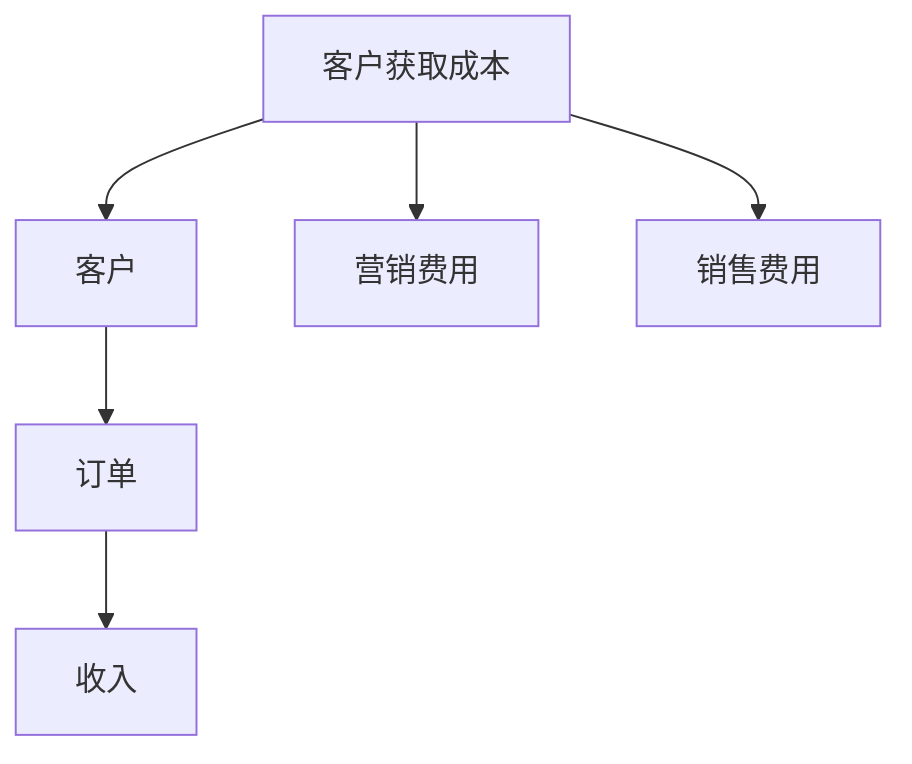
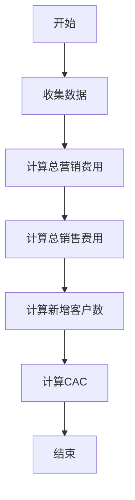
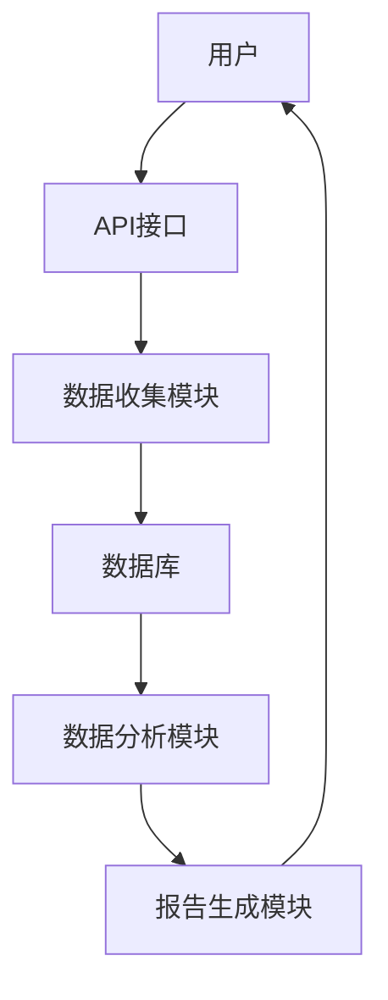

                 


# 彼得·林奇如何分析公司的客户获取成本效率变化

> 关键词：客户获取成本（CAC）、彼得·林奇、投资分析、客户生命周期价值（CLV）、财务指标、投资回报率

> 摘要：本文深入探讨了彼得·林奇如何分析公司的客户获取成本（CAC）效率变化。从CAC的定义、计算方法，到其与客户生命周期价值（CLV）的关系，再到CAC比率的分析，本文详细阐述了CAC在投资决策中的重要性。通过系统分析和实际案例，本文为读者提供了如何优化CAC效率的实践指导。

---

# 第一部分: 背景介绍与核心概念

---

## 第1章: 客户获取成本（CAC）的定义与重要性

### 1.1 什么是客户获取成本（CAC）

客户获取成本（Customer Acquisition Cost，CAC）是指公司获取一个新客户的平均成本，包括营销费用和销售费用。CAC是企业评估客户获取效率和成本效益的重要指标。

#### 1.1.1 CAC的定义

CAC的计算公式为：

$$
\text{CAC} = \frac{\text{总营销费用} + \text{总销售费用}}{\text{新增客户数}}
$$

CAC反映了公司在获取客户方面的效率。如果CAC过高，意味着公司在获取客户方面投入了过多资源，可能需要优化营销和销售策略。

#### 1.1.2 CAC的核心要素

- **营销费用**：包括广告、市场推广、渠道费用等。
- **销售费用**：包括销售团队的工资、客户关系管理（CRM）系统费用等。
- **新增客户数**：公司在一定时间内新增的客户数量。

#### 1.1.3 CAC在企业中的重要性

CAC是企业评估客户获取效率的重要指标。如果CAC低于客户生命周期价值（CLV），公司可以在获取客户的同时实现盈利。反之，如果CAC高于CLV，公司可能在获取客户上投入过多，导致亏损。

---

### 1.2 彼得·林奇与CAC分析

彼得·林奇是美国著名投资专家，以其在投资管理领域的卓越表现而闻名。他在评估公司时，非常关注客户获取成本（CAC）的变化。他认为，CAC的变化能够反映公司的市场拓展能力和成本控制能力。

#### 1.2.1 彼得·林奇的投资者背景

彼得·林奇是富达投资集团的前首席投资官，管理过多只共同基金，创造了卓越的投资业绩。他的投资哲学注重基本面分析，尤其是公司的财务指标和市场策略。

#### 1.2.2 CAC分析在投资中的作用

在投资分析中，彼得·林奇认为CAC是评估公司盈利能力的重要指标。如果公司能够通过优化CAC来提高客户获取效率，将有助于提升整体盈利能力。

#### 1.2.3 彼得·林奇的CAC分析方法

彼得·林奇关注CAC的变化趋势，分析公司是否能够在获取客户的同时降低成本。他通常会比较公司当前的CAC与行业平均水平，判断公司的市场竞争力。

---

### 1.3 CAC与客户生命周期价值（CLV）的关系

客户生命周期价值（Customer Lifetime Value，CLV）是指一个客户在生命周期内为企业带来的总收入减去获取和维护该客户的成本。CAC与CLV的比值是评估客户获取效率的重要指标。

#### 1.3.1 CLV的定义

CLV的计算公式为：

$$
\text{CLV} = \text{客户平均收入} \times \text{客户生命周期长度} - \text{客户维护成本}
$$

#### 1.3.2 CAC与CLV的对比

| 指标 | CAC | CLV |
|------|------|------|
| 定义 | 获取客户成本 | 客户生命周期内为企业带来的净收益 |
| 计算公式 | CAC = (营销费用 + 销售费用) / 新增客户数 | CLV = (客户平均收入 × 客户生命周期长度) - 客户维护成本 |
| 作用 | 评估客户获取效率 | 评估客户价值 |

#### 1.3.3 CAC比率的计算与意义

CAC比率 = CAC / CLV

- **当CAC比率 < 1**：客户获取成本低于客户生命周期价值，公司能够通过获取客户实现盈利。
- **当CAC比率 > 1**：客户获取成本高于客户生命周期价值，公司可能在获取客户上投入过多，需要优化策略。

---

## 1.4 本章小结

本章介绍了客户获取成本（CAC）的定义、核心要素及其在企业中的重要性。同时，阐述了彼得·林奇在CAC分析中的独特视角，以及CAC与客户生命周期价值（CLV）的关系。通过这些分析，读者可以理解CAC在投资决策中的重要性。

---

# 第二部分: 核心概念与联系

---

## 第2章: CAC的核心概念与属性对比

### 2.1 CAC的核心概念

CAC不仅仅是营销和销售费用的简单相加，还需要考虑客户获取的效率和质量。高质量的客户通常具有更高的生命周期价值，从而降低CAC的整体风险。

#### 2.1.1 CAC的计算公式

$$
\text{CAC} = \frac{\text{营销费用} + \text{销售费用}}{\text{新增客户数}}
$$

#### 2.1.2 CAC的属性特征

- **成本驱动因素**：包括广告支出、销售团队效率、渠道合作成本等。
- **客户质量**：高质量客户通常具有更高的CLV，能够降低CAC的风险。
- **时间维度**：CAC的计算通常基于特定时间窗口（如季度或年度）。

#### 2.1.3 CAC的边界与外延

- **边界**：CAC的计算仅限于客户获取阶段的成本，不包括客户维护成本。
- **外延**：CAC与客户获取策略、市场定位、品牌影响力等因素密切相关。

---

### 2.2 CAC与其他财务指标的关系

#### 2.2.1 与客户满意度（CSAT）的关系

客户满意度（CSAT）是衡量客户对产品或服务满意程度的指标。虽然CAC关注客户获取成本，但高客户满意度有助于提高客户保留率，从而降低CAC的整体风险。

#### 2.2.2 与客户保留率（CCR）的关系

客户保留率（Customer Churn Rate，CCR）是衡量客户流失率的指标。高CCR意味着客户更愿意继续购买，从而降低CAC的整体风险。

#### 2.2.3 与客户生命周期价值（CLV）的关系

如前所述，CAC与CLV的关系是评估客户获取效率的核心指标。

---

### 2.3 CAC的ER实体关系图

以下是CAC的ER实体关系图：



---

## 2.4 本章小结

本章详细分析了CAC的核心概念及其与客户生命周期价值（CLV）、客户满意度（CSAT）和客户保留率（CCR）的关系。通过ER实体关系图，读者可以清晰理解CAC与其他指标之间的联系。

---

# 第三部分: 算法原理讲解

---

## 第3章: CAC的计算与分析算法

### 3.1 CAC计算的算法流程

以下是CAC计算的算法流程图：



---

### 3.2 CAC的计算公式

$$
\text{CAC} = \frac{\text{营销费用} + \text{销售费用}}{\text{新增客户数}}
$$

例如，假设某公司在季度内投入了100万元的营销费用和50万元的销售费用，新增客户数为1000人，则：

$$
\text{CAC} = \frac{100 + 50}{1000} = 0.15 \text{万元/人}
$$

---

### 3.3 CAC的Python代码实现

以下是CAC的Python代码实现示例：

```python
# 计算CAC的Python代码示例

# 输入数据
营销费用 = 100  # 单位：万元
销售费用 = 50    # 单位：万元
新增客户数 = 1000

# 计算CAC
cac = (营销费用 + 销售费用) / 新增客户数
print(f"CAC = {cac:.2f} 万元/人")
```

---

## 3.4 本章小结

本章通过算法流程图和Python代码示例，详细讲解了CAC的计算方法。通过实际案例分析，读者可以理解如何通过数据分析优化CAC效率。

---

# 第四部分: 系统分析与架构设计方案

---

## 第4章: CAC的系统分析与架构设计方案

### 4.1 问题场景介绍

公司在市场竞争中需要实时监控客户获取成本（CAC）的变化，以优化营销和销售策略。如何高效计算和分析CAC，是公司面临的重要问题。

---

### 4.2 系统功能设计

以下是CAC分析系统的功能设计：

#### 4.2.1 数据收集模块

- 收集营销费用、销售费用和新增客户数。
- 数据来源包括财务报表、CRM系统和营销渠道报告。

#### 4.2.2 数据分析模块

- 计算CAC。
- 对比CAC与行业平均水平。
- 生成CAC变化趋势图。

#### 4.2.3 报告生成模块

- 输出CAC分析报告。
- 提供优化建议。

---

### 4.3 系统架构设计

以下是CAC分析系统的架构图：



---

## 4.4 本章小结

本章通过系统分析与架构设计方案，展示了如何构建一个高效的CAC分析系统。该系统能够实时监控CAC变化，为公司优化客户获取策略提供支持。

---

# 第五部分: 项目实战

---

## 第5章: CAC分析项目实战

### 5.1 项目环境安装

以下是CAC分析项目所需的环境安装：

```bash
pip install pandas matplotlib seaborn
```

---

### 5.2 项目核心实现

以下是CAC分析的核心代码实现：

```python
import pandas as pd
import matplotlib.pyplot as plt
import seaborn as sns

# 数据加载
data = pd.read_csv("customer_acquisition.csv")

# 计算CAC
data['CAC'] = (data['营销费用'] + data['销售费用']) / data['新增客户数']

# 绘制CAC变化趋势图
plt.figure(figsize=(10, 6))
sns.lineplot(x='时间', y='CAC', data=data)
plt.title('CAC变化趋势图')
plt.xlabel('时间')
plt.ylabel('CAC')
plt.show()
```

---

## 5.3 项目小结

本章通过实际案例分析，展示了如何通过Python代码实现CAC分析。读者可以按照步骤操作，完成CAC的计算与可视化。

---

# 第六部分: 最佳实践

---

## 第6章: 最佳实践

### 6.1 小结

CAC是评估客户获取效率的重要指标。通过优化CAC，公司可以降低客户获取成本，提高整体盈利能力。

---

### 6.2 注意事项

- 数据质量：确保营销费用、销售费用和新增客户数的准确性。
- 持续监控：定期计算CAC，分析其变化趋势。
- 结合CLV：将CAC与CLV结合分析，评估客户获取效率。

---

### 6.3 拓展阅读

- 《彼得·林奇的投资哲学》
- 《客户生命周期价值分析》
- 《营销分析与数据挖掘》

---

# 作者

作者：AI天才研究院/AI Genius Institute & 禅与计算机程序设计艺术/Zen And The Art of Computer Programming

