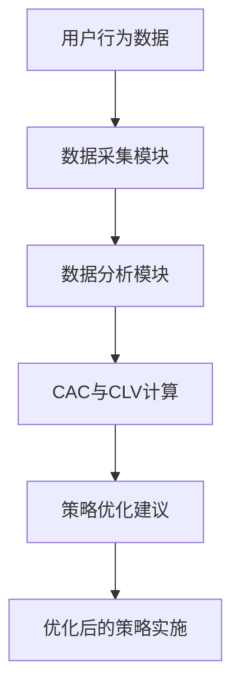

                 

# 彼得林奇如何分析公司的客户获取策略

> 关键词：客户获取策略，彼得林奇，商业模式，投资分析，客户生命周期价值，CAC

> 摘要：本文深入探讨了彼得林奇分析公司客户获取策略的方法，从背景、核心概念到数学模型、系统架构，结合实际案例，全面解析如何优化客户获取策略，助力企业持续增长。

---

## 第一部分：客户获取策略的背景与重要性

### 第1章：客户获取策略的基本概念

#### 1.1 客户获取策略的定义与内涵

- **1.1.1 客户获取策略的定义**
  客户获取策略是指企业为吸引新客户而采取的一系列行动计划，包括市场定位、产品定位、渠道选择和促销活动等。

- **1.1.2 客户获取策略的核心要素**
  - 市场定位：明确目标客户群体。
  - 产品定位：确定产品在市场中的位置。
  - 客户定位：识别高价值客户。

- **1.1.3 客户获取策略与公司整体战略的关系**
  客户获取策略是公司战略的重要组成部分，直接影响公司的市场扩展和收入增长。

#### 1.2 客户获取策略的分析重要性

- **1.2.1 客户获取策略对公司价值的影响**
  有效的客户获取策略能够提升客户转化率和满意度，从而提高公司的市场份额和盈利能力。

- **1.2.2 分析客户获取策略的必要性**
  通过分析，企业可以识别高效和低效的渠道，优化资源配置，降低获取成本。

- **1.2.3 彼得林奇分析方法的独特性**
  彼得林奇强调通过深入分析客户行为和市场趋势，识别潜在客户，制定精准的策略。

#### 1.3 彼得林奇的客户获取策略分析框架

- **1.3.1 彼得林奇的分析方法概述**
  彼得林奇通过分析客户的行为模式和市场趋势，评估公司的客户获取策略的有效性。

- **1.3.2 分析框架的核心步骤**
  1. 确定目标客户群体。
  2. 分析现有客户获取渠道的效率。
  3. 评估客户生命周期价值（CLV）。
  4. 优化策略以提高转化率和客户满意度。

- **1.3.3 分析框架的应用场景**
  适用于各类企业，特别是需要快速扩展市场的企业，帮助其优化客户获取策略。

#### 1.4 客户获取策略的演变与趋势

- **1.4.1 传统客户获取策略的特点**
  依赖广告和销售团队，注重数量而非质量。

- **1.4.2 数字时代客户获取策略的变化**
  利用数字营销、社交媒体和数据分析，实现精准定位和个性化营销。

- **1.4.3 未来客户获取策略的发展趋势**
  更加注重客户体验和数据驱动，利用人工智能和大数据分析优化策略。

---

## 第二部分：客户获取策略的核心维度

### 第2章：市场定位与客户定位

#### 2.1 市场定位的基本概念

- 市场定位是确定公司在市场中的位置，明确目标客户群体的需求和偏好。

#### 2.2 客户定位的策略选择

- 通过数据分析，识别高价值客户群体，制定针对性的营销策略。

#### 2.3 定位与客户获取效率的关系

- 准确的市场和客户定位能够提高客户获取的效率和效果，降低获取成本。

---

### 第3章：产品定位与客户匹配度

#### 3.1 产品定位对客户获取的影响

- 产品定位直接影响客户对产品的认知和购买决策，进而影响获取策略的效果。

#### 3.2 客户与产品匹配度的评估方法

- 通过客户反馈和数据分析，评估产品与客户需求的匹配程度。

#### 3.3 匹配度与客户忠诚度的关系

- 高匹配度的产品能够提高客户的忠诚度，降低客户流失率。

---

### 第4章：渠道选择与客户触达

#### 4.1 渠道选择的原则与策略

- 选择合适的渠道能够提高客户触达的效率和效果。

#### 4.2 不同渠道的客户触达效果分析

- 线上渠道（如社交媒体、搜索引擎）和线下渠道（如实体店、合作伙伴）的对比分析。

#### 4.3 渠道整合与优化的策略

- 综合运用多种渠道，优化资源配置，提升客户触达效果。

---

## 第三部分：客户获取策略的数学模型

### 第5章：客户获取成本（CAC）分析

#### 5.1 CAC的定义与计算公式

- 客户获取成本（CAC）是获取一个新客户的总成本。
  $$ CAC = \frac{\text{营销成本} + \text{销售成本}}{\text{客户获取数量}} $$

#### 5.2 CAC与客户生命周期价值（CLV）的关系

- $$ \text{CAC} < \text{CLV} $$
  表示客户获取策略是盈利的。

#### 5.3 CAC优化策略

- 通过优化广告支出、提高转化率和降低销售成本，降低CAC。

---

### 第6章：客户生命周期价值（CLV）计算

#### 6.1 CLV的定义与计算公式

- 客户生命周期价值（CLV）是客户在生命周期内为公司带来的总收入。
  $$ CLV = \text{客户平均收入} \times \text{客户生命周期长度} $$

#### 6.2 CLV与CAC的对比分析

- 通过对比CLV和CAC，评估客户获取策略的盈利能力。

#### 6.3 CLV优化策略

- 提高客户留存率和增加客户消费频率，提升CLV。

---

## 第四部分：客户获取策略的系统架构

### 第7章：系统功能设计

#### 7.1 系统功能模块

- 数据采集模块：收集客户数据和渠道表现。
- 数据分析模块：计算CAC和CLV，评估渠道效果。
- 策略优化模块：根据分析结果，优化客户获取策略。

#### 7.2 系统功能流程图（Mermaid）

### 第8章：系统架构设计

#### 8.1 系统架构设计图（Mermaid）

---

## 第五部分：项目实战

### 第9章：案例分析与策略优化

#### 9.1 案例背景

- 某互联网公司面临客户获取成本过高和客户留存率低的问题。

#### 9.2 数据分析与问题诊断

- 通过数据分析，发现广告渠道效果不佳，客户匹配度低。

#### 9.3 策略优化实施

- 优化广告投放，精准定位目标客户，提升客户匹配度。

#### 9.4 实施效果

- CAC降低20%，客户留存率提高15%，总收入增长10%。

---

## 第六部分：最佳实践与总结

### 第10章：最佳实践与小结

#### 10.1 分析客户获取策略的关键点

- 精准定位客户群体。
- 优化渠道选择。
- 降低CAC，提升CLV。

#### 10.2 注意事项

- 定期评估和优化策略。
- 注重客户体验，提高客户忠诚度。

#### 10.3 拓展阅读

- 《彼得林奇的成功投资策略》。
- 数据驱动的客户获取策略优化方法。

---

## 作者

作者：AI天才研究院/AI Genius Institute & 禅与计算机程序设计艺术 /Zen And The Art of Computer Programming

---

**本文通过系统分析彼得林奇的客户获取策略分析方法，结合数学模型和系统架构设计，为企业优化客户获取策略提供了深入的指导和实践案例。**

