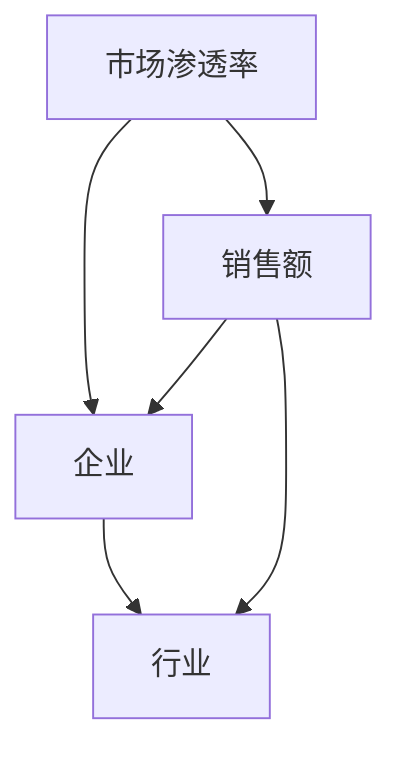

                 


# 彼得林奇如何分析公司的市场渗透率

> 关键词：彼得·林奇，市场渗透率，投资分析，行业分析，竞争分析

> 摘要：本文详细探讨了彼得·林奇如何分析公司的市场渗透率，从基本概念、计算方法、分析框架到实际应用，系统性地介绍了市场渗透率在投资决策中的重要性及其分析方法。通过具体的案例分析，深入解读了彼得·林奇的投资理念和分析技巧，为投资者提供了实用的指导。

---

# 第一部分：市场渗透率的基本概念与背景

## 第1章：市场渗透率的定义与背景

### 1.1 市场渗透率的定义与背景

#### 1.1.1 市场渗透率的定义
市场渗透率（Market Penetration Rate）是指一家企业在目标市场中所占的销售额比例。它反映了企业在市场中的份额和影响力，是衡量企业市场地位的重要指标。

#### 1.1.2 市场渗透率的重要性
市场渗透率不仅是企业评估自身竞争力的关键指标，也是投资者分析企业投资价值的重要依据。高市场渗透率通常意味着企业具有较强的市场影响力和较高的品牌认知度。

#### 1.1.3 市场渗透率与企业竞争的关系
市场渗透率与企业竞争密切相关。高市场渗透率意味着企业在市场中占据更大的份额，具有更强的定价权和议价能力。相反，低市场渗透率可能意味着企业市场竞争力较弱，需要进一步提升市场份额。

### 1.2 彼得·林奇与投资分析

#### 1.2.1 彼得·林奇的投资者背景
彼得·林奇是美国著名的投资专家，曾管理富达麦哲伦基金，取得了卓越的投资业绩。他以其独特的投资理念和深入的基本面分析闻名。

#### 1.2.2 彼得·林奇的投资理念
彼得·林奇强调基本面分析和长期投资。他认为，投资成功的关键在于选择具有强大竞争优势、良好管理团队和可持续增长潜力的企业。

#### 1.2.3 彼得·林奇与市场渗透率分析
彼得·林奇在其投资分析中，常常关注企业的市场渗透率。他认为，市场渗透率是评估企业市场地位和竞争优势的重要指标，能够帮助投资者识别具有长期增长潜力的企业。

### 1.3 市场渗透率在投资分析中的作用

#### 1.3.1 市场渗透率与企业价值的关系
市场渗透率高的企业通常具有较高的收入和利润，从而具备更高的企业价值。然而，过高的市场渗透率可能意味着企业面临较大的竞争压力，难以进一步扩大市场份额。

#### 1.3.2 市场渗透率与行业竞争格局
通过分析市场渗透率，投资者可以了解行业内的竞争格局。高市场渗透率的企业通常在行业中占据主导地位，而低市场渗透率的企业可能面临激烈的竞争或市场进入壁垒。

#### 1.3.3 市场渗透率与投资决策的关联
市场渗透率是投资者评估企业投资价值的重要指标。通过分析市场渗透率，投资者可以判断企业的市场地位、竞争优势和未来增长潜力，从而做出更明智的投资决策。

---

## 第2章：市场渗透率的核心概念与计算方法

### 2.1 市场渗透率的计算公式

#### 2.1.1 市场渗透率的数学模型
$$ \text{市场渗透率} = \frac{\text{企业销售额}}{\text{行业总销售额}} \times 100\% $$

---

### 2.2 市场渗透率的核心要素

#### 2.2.1 企业销售额的定义与计算
企业销售额是指企业在一定时期内实现的销售收入，通常包括产品销售收入和服务收入。计算企业销售额需要考虑企业的财务报表和市场数据。

#### 2.2.2 行业总销售额的定义与计算
行业总销售额是指行业内所有企业在一定时期内实现的总销售收入。计算行业总销售额需要参考行业报告、市场调研数据或政府统计资料。

#### 2.2.3 市场渗透率的边界与外延
市场渗透率的边界包括企业的目标市场和整体市场。外延则包括企业的市场影响力、品牌知名度和客户忠诚度等因素。

---

### 2.3 市场渗透率与其他市场指标的对比

#### 2.3.1 与市场占有率的对比
市场占有率（Market Share）与市场渗透率类似，但两者侧重点不同。市场占有率指企业在市场中的份额，而市场渗透率则强调企业销售额占行业总销售额的比例。

#### 2.3.2 与市场份额的对比
市场份额（Market Share）是企业在市场中所占的销售比例，与市场渗透率在计算方式上相似，但侧重点不同。市场份额更关注企业的相对地位，而市场渗透率更关注企业的绝对市场份额。

#### 2.3.3 与市场增长率的对比
市场增长率（Market Growth Rate）衡量的是市场整体的销售额增长速度，与市场渗透率无直接关系。但市场增长率高的行业可能为市场渗透率提供更大的增长空间。

---

## 2.4 市场渗透率的属性特征对比表格

| 指标       | 定义                                         | 计算公式                                         | 用途                           |
|------------|----------------------------------------------|------------------------------------------------|--------------------------------|
| 市场渗透率  | 企业销售额占行业总销售额的比例               | $$ \frac{\text{企业销售额}}{\text{行业总销售额}} \times 100\% $$ | 评估企业市场地位               |
| 市场占有率  | 企业在市场中的份额                         | $$ \frac{\text{企业销售额}}{\text{行业总销售额}} \times 100\% $$ | 评估市场竞争能力               |
| 市场增长率  | 市场规模的变动幅度                         | $$ \frac{\text{本期销售额} - \text{上期销售额}}{\text{上期销售额}} \times 100\% $$ | 评估市场发展潜力               |

---

## 2.5 本章小结

---

# 第3章：市场渗透率的分析模型与工具

## 3.1 市场渗透率的分析模型

### 3.1.1 SWOT分析模型
SWOT分析模型帮助企业评估内部优势和劣势，以及外部机会和威胁。通过结合市场渗透率，可以更全面地分析企业的市场地位和竞争优势。

### 3.1.2 波斯顿咨询集团矩阵（BCG矩阵）
BCG矩阵通过分析市场增长率和市场占有率，帮助企业确定产品组合的优先级。市场渗透率高的产品通常处于成熟市场，适合采取维持或收割策略。

### 3.1.3 市场渗透率与企业生命周期的关系
市场渗透率与企业生命周期密切相关。企业从初创期到成熟期，市场渗透率逐渐提高，直至达到行业饱和点。

---

## 3.2 市场渗透率的分析工具

### 3.2.1 数据可视化工具（如Excel、Tableau）
通过数据可视化工具，投资者可以直观地观察市场渗透率的变化趋势，发现市场动态和潜在机会。

### 3.2.2 市场分析工具（如行业分析报告）
行业分析报告提供了详细的市场数据和趋势分析，帮助投资者全面了解企业的市场渗透率及其背后的因素。

### 3.2.3 投资分析软件（如Morningstar）
投资分析软件提供了丰富的市场数据和分析工具，投资者可以利用这些工具快速计算市场渗透率，并进行深入的分析。

---

## 3.3 市场渗透率的ER实体关系图



---

## 3.4 本章小结

---

# 第4章：彼得·林奇的市场渗透率分析方法

## 4.1 彼得·林奇的市场渗透率分析框架

### 4.1.1 行业分析法
彼得·林奇强调行业分析的重要性。他通常会选择市场渗透率高且行业增长潜力大的行业进行投资。例如，在科技行业，高市场渗透率的公司通常具有更强的技术优势和市场影响力。

### 4.1.2 竞争对手分析法
彼得·林奇认为，市场渗透率的高低不仅反映了企业的市场地位，也反映了其与竞争对手的对比情况。他通过分析竞争对手的市场渗透率，判断企业的竞争优势和潜在风险。

---

## 4.2 彼得·林奇的市场渗透率分析步骤

### 4.2.1 确定目标行业
彼得·林奇通常会选择具有增长潜力大的行业进行投资。他通过分析行业趋势、市场容量和竞争格局，选择市场渗透率适中且具有增长潜力的行业。

### 4.2.2 收集市场数据
彼得·林奇强调数据的重要性。他通过收集企业的财务报表、行业报告和市场调研数据，计算企业的市场渗透率，并进行深入分析。

### 4.2.3 分析市场渗透率
彼得·林奇通过分析市场渗透率，评估企业的市场地位和竞争优势。他重点关注市场渗透率高且具有增长潜力的企业，避免投资于市场渗透率过低或过高的企业。

### 4.2.4 判断投资价值
彼得·林奇结合市场渗透率和其他财务指标，评估企业的投资价值。他认为，市场渗透率高的企业通常具有较高的收入和利润，具备更强的抗风险能力和增长潜力。

---

## 4.3 彼得·林奇的市场渗透率分析实例

### 4.3.1 案例背景
假设某科技公司A在目标市场中的市场渗透率为20%，而行业平均市场渗透率为15%。彼得·林奇认为，公司A的市场渗透率高于行业平均水平，具有较大的市场影响力和竞争优势。

### 4.3.2 分析过程
1. **行业分析**：公司A所在的行业市场规模为100亿美元，市场渗透率为15%。公司A的市场渗透率为20%，表明其在行业中占据领先地位。
2. **竞争对手分析**：公司A的主要竞争对手B和C的市场渗透率分别为18%和12%。公司A的市场渗透率高于竞争对手，具有更强的市场影响力。
3. **财务指标分析**：公司A的销售额增长率为25%，净利润率为18%，表明其具有较强的盈利能力和增长潜力。
4. **投资决策**：基于以上分析，彼得·林奇认为公司A具有较高的投资价值，决定将其纳入投资组合。

---

## 4.4 本章小结

---

# 第5章：系统分析与架构设计方案

## 5.1 系统分析框架

### 5.1.1 数据收集与处理
投资者需要收集企业的财务报表、行业报告和市场调研数据，确保数据的准确性和完整性。

### 5.1.2 分析模型设计
设计合理的分析模型，包括市场渗透率的计算、行业对比分析和竞争对手分析等。

### 5.1.3 工具选择
选择合适的数据分析工具和投资分析软件，提高分析效率和准确性。

---

## 5.2 系统架构设计

### 5.2.1 功能模块设计
- 数据输入与管理模块：用于输入和管理企业的市场数据。
- 市场渗透率计算模块：根据公式计算企业的市场渗透率。
- 行业与竞争对手对比模块：分析企业的市场渗透率与行业平均水平和竞争对手的对比。
- 投资决策支持模块：基于分析结果，提供投资建议和决策支持。

### 5.2.2 系统交互设计
- 用户输入企业的市场数据。
- 系统计算市场渗透率并生成可视化图表。
- 系统提供行业和竞争对手的对比分析。
- 用户根据分析结果做出投资决策。

---

## 5.3 项目实战：市场渗透率分析系统实现

### 5.3.1 环境安装
- 安装Python编程语言和相关数据分析库（如Pandas、Matplotlib）。
- 安装投资分析软件（如Morningstar）。

### 5.3.2 核心代码实现

```python
import pandas as pd
import matplotlib.pyplot as plt

# 假设企业数据和行业数据存储在Excel文件中
df_company = pd.read_excel('company_data.xlsx')
df Industry = pd.read_excel('industry_data.xlsx')

# 计算市场渗透率
market_penetration = (df_company['Sales'] / df_industry['Industry Sales'] * 100).round(2)

# 可视化市场渗透率
plt.figure(figsize=(10, 6))
plt.bar(df_company['Company'], market_penetration)
plt.title('Market Penetration Rate Analysis')
plt.xlabel('Company Name')
plt.ylabel('Market Penetration Rate (%)')
plt.show()
```

### 5.3.3 代码应用解读与分析
上述代码通过Python和Pandas库读取企业的销售数据和行业销售数据，计算市场渗透率，并使用Matplotlib库生成可视化图表。投资者可以通过该代码快速计算和分析企业的市场渗透率，直观了解企业的市场地位。

---

## 5.4 本章小结

---

# 第6章：项目实战与案例分析

## 6.1 案例背景

### 6.1.1 案例行业选择
假设我们选择科技行业作为分析对象，分析某科技公司在该行业的市场渗透率。

### 6.1.2 案例企业选择
选择公司A、B和C作为分析对象，分别计算它们的市场渗透率，并进行对比分析。

---

## 6.2 分析过程

### 6.2.1 数据收集
- 收集公司A、B、C的销售数据。
- 收集科技行业的总销售额数据。

### 6.2.2 数据分析
使用之前介绍的市场渗透率计算公式，计算公司A、B、C的市场渗透率，并进行对比分析。

### 6.2.3 可视化展示
使用Python和Matplotlib库生成市场渗透率的可视化图表，直观展示企业的市场地位。

---

## 6.3 分析结果与解读

### 6.3.1 市场渗透率计算结果
- 公司A：20%
- 公司B：18%
- 公司C：12%

### 6.3.2 分析结果解读
公司A的市场渗透率最高，表明其在行业中的市场份额最大，具有较强的市场影响力。公司C的市场渗透率最低，表明其市场竞争力较弱，需要进一步提升市场份额。

---

## 6.4 投资决策建议

### 6.4.1 投资建议
基于市场渗透率分析结果，投资者可以考虑将公司A作为重点投资对象，因其市场渗透率高且具有较大的增长潜力。同时，公司C需要关注其市场渗透率的提升，可能需要进一步优化产品和服务，提升品牌知名度。

### 6.4.2 风险提示
尽管公司A的市场渗透率较高，但需要关注行业竞争加剧和市场饱和的风险。投资者应持续关注行业动态和企业财务表现，及时调整投资策略。

---

## 6.5 本章小结

---

# 第7章：总结、最佳实践与注意事项

## 7.1 总结

### 7.1.1 市场渗透率的重要性
市场渗透率是衡量企业市场地位和竞争优势的重要指标，能够帮助投资者评估企业的投资价值。

### 7.1.2 彼得·林奇的分析方法
彼得·林奇通过行业分析、竞争对手分析和财务指标分析，综合评估企业的市场渗透率和投资潜力。

---

## 7.2 最佳实践

### 7.2.1 数据收集与分析
投资者应注重数据的准确性和全面性，确保市场渗透率分析的科学性和可靠性。

### 7.2.2 行业与竞争对手分析
通过行业和竞争对手分析，全面了解企业的市场地位和竞争优势，避免仅依赖市场渗透率单一指标做出投资决策。

### 7.2.3 长期投资与风险管理
市场渗透率分析应结合企业的长期增长潜力和风险管理，避免短期波动对企业投资价值的误判。

---

## 7.3 注意事项

### 7.3.1 数据的准确性和完整性
市场渗透率的计算依赖于准确和完整的数据，投资者应确保数据来源可靠。

### 7.3.2 行业差异与特殊性
不同行业的市场渗透率计算和分析方法可能存在差异，投资者应充分考虑行业特性和市场环境。

### 7.3.3 动态调整与持续关注
市场环境和企业状况不断变化，投资者应持续关注市场渗透率的变化，并及时调整投资策略。

---

## 7.4 未来研究方向

### 7.4.1 市场渗透率与企业创新的关系
研究市场渗透率与企业创新能力的关系，探索创新对企业市场渗透率提升的驱动作用。

### 7.4.2 数字化工具的应用
随着大数据和人工智能技术的发展，投资者可以利用更先进的数字化工具，提高市场渗透率分析的效率和准确性。

### 7.4.3 全球化市场的分析
随着全球化的深入，投资者应关注跨国企业的市场渗透率，分析其在全球市场中的表现和潜力。

---

## 7.5 本章小结

---

# 作者：AI天才研究院/AI Genius Institute & 禅与计算机程序设计艺术/Zen And The Art of Computer Programming

---

通过以上步骤，我们详细探讨了彼得·林奇如何分析公司的市场渗透率，从基本概念、计算方法、分析框架到实际应用，系统性地介绍了市场渗透率在投资决策中的重要性及其分析方法。通过具体的案例分析，深入解读了彼得·林奇的投资理念和分析技巧，为投资者提供了实用的指导。

