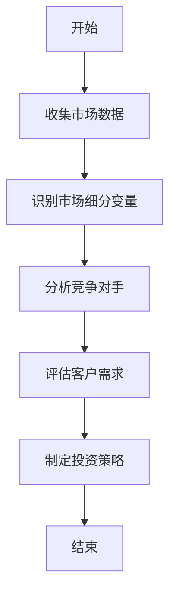
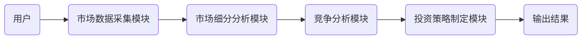

                 


# 彼得林奇如何分析公司的市场细分策略

## 关键词：
彼得·林奇、市场细分策略、投资分析、竞争分析、客户价值、市场份额

## 摘要：
彼得·林奇作为世界著名投资家，以其独特的市场细分分析方法闻名。本文详细探讨了彼得·林奇如何通过市场细分策略来分析公司，包括其分析框架、核心概念、算法原理、系统架构设计以及实际案例分析。通过这些内容，读者将深入了解如何将市场细分策略应用于投资决策，并掌握彼得·林奇分析方法的核心精髓。

---

# 第一部分: 市场细分策略与彼得·林奇的分析框架

## 第1章: 市场细分策略概述

### 1.1 市场细分的基本概念
#### 1.1.1 市场细分的定义
市场细分是指将整体市场按照消费者的需求、偏好、行为等因素进行划分，形成若干个具有相似特征的子市场。每个子市场的消费者具有相近的需求和购买习惯，企业可以根据这些子市场的特点制定相应的营销策略。

#### 1.1.2 市场细分的核心要素
- **消费者需求**：不同消费者对产品或服务的需求存在差异。
- **地理因素**：地理位置、气候等因素影响市场细分。
- **人口统计**：年龄、性别、收入水平等人口特征。
- **心理因素**：消费者的价值观、生活方式等。
- **行为因素**：购买习惯、消费频率等。

#### 1.1.3 市场细分与企业竞争策略的关系
市场细分帮助企业更好地满足不同消费者的需求，从而提高市场竞争力。通过市场细分，企业可以制定更有针对性的营销策略，提升品牌忠诚度和市场份额。

### 1.2 彼得·林奇的市场细分分析框架
#### 1.2.1 彼得·林奇的投资者背景
彼得·林奇是富达投资集团的前董事长，以分析公司基本面和市场趋势闻名。他注重从市场细分的角度分析公司的竞争优势和潜在风险。

#### 1.2.2 林奇的市场细分分析方法
林奇通过分析市场的细分变量（如行业、产品类型、客户群体等）来评估公司的市场地位。他强调关注行业内的竞争对手和客户的需求变化，从而找出投资机会。

#### 1.2.3 林奇分析框架的适用性
林奇的分析框架适用于各种行业和市场环境，尤其在竞争激烈的市场中，能够帮助企业发现潜在的机会和威胁。

### 1.3 市场细分策略的背景与意义
#### 1.3.1 当前市场环境的变化
随着市场竞争的加剧，市场细分变得越来越重要。企业需要通过细分市场来更好地满足消费者的需求。

#### 1.3.2 市场细分在企业战略中的作用
市场细分帮助企业明确目标客户群体，制定更有针对性的营销策略，从而提高市场占有率和盈利能力。

#### 1.3.3 林奇分析方法的现代价值
林奇的分析方法结合了市场细分和竞争分析，为企业提供了全面的市场洞察，帮助企业制定更有效的投资和营销策略。

### 1.4 本章小结
本章介绍了市场细分的基本概念和林奇的市场细分分析框架，强调了市场细分在企业竞争策略中的重要性。

---

## 第2章: 市场细分的核心概念与联系

### 2.1 市场细分的原理
#### 2.1.1 市场细分的逻辑基础
市场细分的逻辑基础是消费者需求的多样性。通过细分市场，企业可以更好地满足不同消费者的需求，提高客户满意度和忠诚度。

#### 2.1.2 市场细分的数学模型
市场细分的数学模型可以帮助企业量化不同子市场的潜力。例如，使用聚类分析来识别不同的客户群体。

#### 2.1.3 市场细分的经济学解释
从经济学角度来看，市场细分是企业通过专业化生产和服务，满足不同消费者需求的一种策略。

### 2.2 核心概念对比分析
#### 2.2.1 不同市场细分方法的对比
- **基于地理因素的细分**：适用于区域性产品。
- **基于人口统计的细分**：适用于快消品行业。
- **基于心理因素的细分**：适用于高端品牌。

#### 2.2.2 林奇分析框架与其他方法的异同
林奇的分析框架注重竞争分析，而其他方法更注重客户群体的划分。

#### 2.2.3 市场细分与客户价值的关系
市场细分帮助企业识别高价值客户群体，从而优化资源配置，提高客户满意度。

### 2.3 实体关系图与流程图
#### 2.3.1 市场细分的ER图
```mermaid
er
  actor: 客户
  actor: 产品
  actor: 市场细分策略
  relation: "参与" --> 客户 --|{n}|--> 产品
  relation: "影响" --> 市场细分策略 --|{n}|--> 产品
```

#### 2.3.2 林奇分析流程图


### 2.4 本章小结
本章通过对比分析和图表展示了市场细分的核心概念及其与林奇分析框架的关系。

---

## 第3章: 彼得·林奇市场细分分析的算法原理

### 3.1 林奇分析方法的数学模型
#### 3.1.1 市场份额计算公式
$$ \text{市场份额} = \frac{\text{企业销售额}}{\text{市场总销售额}} $$

#### 3.1.2 市场细分变量的选取
林奇通过分析市场细分变量（如行业、产品类型、客户群体）来评估公司的市场地位。

#### 3.1.3 市场潜力预测模型
$$ \text{市场潜力} = \sum_{i=1}^{n} (\text{细分市场}_i \times \text{市场规模}_i) $$

### 3.2 算法实现
#### 3.2.1 Python代码实现
```python
import pandas as pd

# 假设我们有一个市场数据的DataFrame df，包含各细分市场的销售额
# 计算市场份额
def calculate_market_share(company_sales, market_sales):
    return company_sales / market_sales

# 示例数据
df = pd.DataFrame({
    '细分市场': ['A', 'B', 'C'],
    '公司销售额': [100, 150, 200],
    '市场总销售额': [500, 600, 700]
})

# 计算市场份额
df['市场份额'] = df.apply(lambda x: calculate_market_share(x['公司销售额'], x['市场总销售额']), axis=1)
print(df)
```

#### 3.2.2 算法流程
1. 收集市场数据。
2. 识别市场细分变量。
3. 计算各细分市场的市场份额。
4. 分析竞争对手的市场份额。
5. 制定投资策略。

### 3.3 本章小结
本章通过数学模型和代码示例展示了林奇分析方法的实现过程。

---

## 第4章: 系统分析与架构设计方案

### 4.1 问题场景介绍
假设我们是一家科技公司，希望通过市场细分策略优化产品线，提升市场份额。

### 4.2 系统功能设计
- **市场数据采集**：收集各细分市场的销售数据。
- **市场细分分析**：识别市场细分变量，计算市场份额。
- **竞争分析**：分析竞争对手的市场份额和产品策略。
- **投资策略制定**：基于分析结果制定投资策略。

### 4.3 系统架构设计


### 4.4 系统接口设计
- **输入接口**：市场数据输入。
- **输出接口**：市场份额分析结果、投资策略建议。

### 4.5 本章小结
本章通过系统架构设计展示了如何将林奇的分析方法转化为一个可操作的系统。

---

## 第5章: 项目实战

### 5.1 环境安装
安装Python和相关库（如Pandas）。

### 5.2 核心代码实现
```python
import pandas as pd

# 示例数据
data = {
    '细分市场': ['A', 'B', 'C'],
    '公司销售额': [100, 150, 200],
    '市场总销售额': [500, 600, 700]
}

df = pd.DataFrame(data)

# 计算市场份额
df['市场份额'] = df['公司销售额'] / df['市场总销售额']

print(df)
```

### 5.3 案例分析
以科技公司为例，分析其在各细分市场的表现，制定相应的投资策略。

### 5.4 本章小结
本章通过实际案例展示了如何应用林奇的分析方法进行市场细分。

---

## 第6章: 总结与展望

### 6.1 总结
彼得·林奇的市场细分分析方法为企业提供了全面的市场洞察，帮助企业制定有效的投资策略。

### 6.2 最佳实践 tips
- 定期更新市场数据。
- 细分市场变量的选择应根据行业特点进行调整。
- 结合定量分析和定性分析。

### 6.3 注意事项
- 数据的准确性和及时性至关重要。
- 分析结果应与实际市场环境相结合。

### 6.4 拓展阅读
推荐阅读彼得·林奇的相关书籍，深入理解其分析方法。

---

## 作者：AI天才研究院/AI Genius Institute & 禅与计算机程序设计艺术 /Zen And The Art of Computer Programming

---

通过以上内容，您已经深入了解了彼得·林奇如何分析公司的市场细分策略，以及如何将这些方法应用于实际投资决策中。希望这篇文章对您有所帮助！

