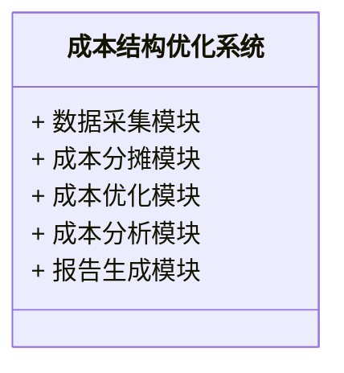
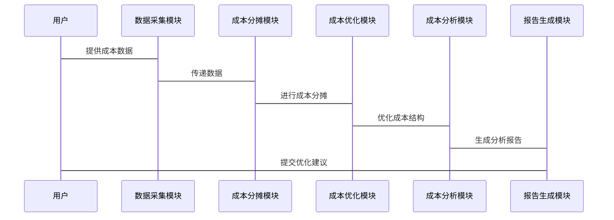

                 


# 彼得林奇如何分析公司的成本结构优化能力

## 关键词：彼得林奇, 成本结构, 成本优化, 投资分析, 企业成本管理

## 摘要：彼得林奇作为世界著名投资经理，以其独特的成本结构分析方法闻名。本文将详细探讨彼得林奇的成本结构优化分析方法，包括成本结构的核心要素、优化目标、行业差异、分析模型、系统设计与实现等内容，帮助读者深入了解如何优化企业成本结构，提升企业竞争力和投资价值。

---

# 第1章: 成本结构优化能力分析的背景与重要性

## 1.1 成本结构优化的定义与重要性

### 1.1.1 成本结构的基本概念
成本结构是指企业在生产或服务过程中，各项成本的构成及其比例关系。合理的成本结构能够帮助企业降低运营成本，提高利润率和竞争力。

### 1.1.2 成本结构优化的必要性
在激烈的市场竞争中，优化成本结构是企业提升利润和竞争力的关键。通过优化成本结构，企业可以降低成本，增强盈利能力，同时提高资金周转效率。

### 1.1.3 彼得林奇的成本分析方法
彼得林奇在其投资生涯中，注重对企业成本结构的深入分析，以识别潜在的投资机会。他通过分析企业的成本构成、成本控制能力和成本优化潜力，评估企业的投资价值。

## 1.2 企业成本结构的核心要素

### 1.2.1 原材料成本
原材料成本是制造业企业的主要成本之一。优化原材料采购策略、供应商管理和库存管理是降低原材料成本的关键。

### 1.2.2 生产成本
生产成本包括直接人工成本和制造费用。通过优化生产流程、提高生产效率和减少浪费，可以有效降低生产成本。

### 1.2.3 管理与销售费用
管理费用和销售费用是企业运营中的重要组成部分。通过优化管理流程、精简组织结构和提高销售效率，可以降低管理与销售费用。

### 1.2.4 财务费用与利息支出
财务费用包括利息支出和其他财务相关费用。优化资本结构、降低负债水平和合理管理财务支出是降低财务费用的关键。

## 1.3 成本结构优化的目标与边界

### 1.3.1 成本结构优化的目标
成本结构优化的目标是在保证产品质量和企业运营的前提下，降低各项成本，提高利润率和企业竞争力。

### 1.3.2 成本结构优化的边界
成本结构优化需要在企业战略目标和资源限制的前提下进行。同时，需要平衡成本降低与质量、效率之间的关系。

### 1.3.3 成本结构优化的误区
在成本结构优化过程中，需要注意避免过于追求短期成本降低而忽视长期发展的误区。同时，要避免过度优化导致成本刚性增加的情况。

## 1.4 成本结构优化的行业差异

### 1.4.1 制造业的成本结构特点
制造业的成本结构主要由原材料成本和生产成本构成。通过优化生产流程和采购策略，可以有效降低制造成本。

### 1.4.2 服务业的成本结构特点
服务业的成本结构主要由人工成本和管理费用构成。通过优化服务流程、提高员工效率和降低管理费用，可以有效降低成本。

### 1.4.3 高 tech行业的成本结构特点
高 tech行业的成本结构复杂，包括研发费用、生产成本和销售费用等。通过技术创新、优化研发流程和降低生产成本，可以有效提高企业竞争力。

## 1.5 本章小结
本章介绍了成本结构优化的定义与重要性，分析了企业成本结构的核心要素，探讨了成本结构优化的目标与边界，并总结了不同行业成本结构的特点。通过这些分析，我们可以更好地理解彼得林奇的成本结构优化方法。

---

# 第2章: 彼得林奇的成本分析方法

## 2.1 彼得林奇投资理念概述

### 2.1.1 彼得林奇的投资者画像
彼得林奇是一位注重基本面分析的投资者，他通过深入研究企业的财务状况、市场地位和竞争优势，寻找具有长期增长潜力的企业进行投资。

### 2.1.2 彼得林奇的投资策略
彼得林奇的投资策略注重长期价值，他寻找那些具有稳定增长潜力、管理团队优秀、财务状况健康的企业进行投资。

### 2.1.3 彼得林奇的成本分析框架
彼得林奇的成本分析框架包括对企业成本结构的全面分析，识别成本构成、成本控制能力以及成本优化潜力，评估企业的投资价值。

## 2.2 彼得林奇的成本分析模型

### 2.2.1 成本分摊法
成本分摊法是将总成本按一定比例分摊到各个产品或业务单元上，以便更准确地评估每个业务的成本和盈利能力。

### 2.2.2 边际成本法
边际成本法是分析增加一单位产品或服务的成本，帮助企业在生产和销售决策中优化成本结构。

### 2.2.3 成本效益分析
成本效益分析是比较不同成本优化方案的投入与产出，选择能够带来最大收益的成本优化方案。

## 2.3 彼得林奇的成本优化策略

### 2.3.1 成本控制的关键点
彼得林奇注重从原材料采购、生产流程、管理费用等方面入手，寻找成本控制的关键点。

### 2.3.2 成本优化的路径选择
彼得林奇认为，成本优化需要结合企业的实际情况，选择适合的成本优化路径，如技术创新、流程优化和供应商谈判等。

### 2.3.3 成本优化的长期与短期策略
彼得林奇强调，成本优化需要兼顾长期和短期目标，短期优化可以快速提升企业利润，长期优化则有助于企业的可持续发展。

## 2.4 彼得林奇的成本分析案例

### 2.4.1 某制造业的成本结构分析
通过分析某制造业企业的原材料成本和生产成本，彼得林奇识别出可以通过优化采购策略和生产流程降低成本的潜力。

### 2.4.2 某服务业的成本结构优化
通过对某服务业企业的管理费用和销售费用的分析，彼得林奇提出通过精简组织结构和提高销售效率降低成本的优化方案。

### 2.4.3 某高 tech企业的成本优化实践
针对某高 tech企业，彼得林奇通过分析研发费用和生产成本，提出了通过技术创新和优化研发流程降低成本的建议。

## 2.5 本章小结
本章详细介绍了彼得林奇的成本分析方法，包括他的投资理念、成本分析模型和成本优化策略，并通过具体案例展示了这些方法的实际应用。

---

# 第3章: 成本结构优化的核心概念与联系

## 3.1 成本结构的核心要素

### 3.1.1 原材料成本
原材料成本是制造业企业的主要成本之一，优化原材料采购和库存管理可以有效降低成本。

### 3.1.2 生产成本
生产成本包括直接人工成本和制造费用，优化生产流程和提高生产效率可以降低生产成本。

### 3.1.3 管理与销售费用
管理费用和销售费用是企业运营中的重要组成部分，优化管理流程和提高销售效率可以降低管理与销售费用。

### 3.1.4 财务费用与利息支出
财务费用包括利息支出和其他财务相关费用，优化资本结构和合理管理财务支出可以降低财务费用。

## 3.2 成本结构的核心概念对比

### 3.2.1 成本类型对比
| 成本类型 | 定义 | 特点 | 优化方法 |
|---------|------|------|----------|
| 原材料成本 | 企业生产所需的原材料费用 | 占比高，波动大 | 优化采购策略、供应商管理 |
| 生产成本 | 生产过程中的直接人工成本和制造费用 | 占比高，刚性强 | 优化生产流程、提高效率 |
| 管理费用 | 企业日常管理活动的支出 | 占比中等，刚性强 | 精简组织结构、优化管理流程 |
| 销售费用 | 销售过程中的相关支出 | 占比中等，灵活性高 | 提高销售效率、优化销售渠道 |

### 3.2.2 成本结构优化的关键点
- 原材料成本：优化采购策略、供应商谈判、库存管理。
- 生产成本：优化生产流程、提高生产效率、减少浪费。
- 管理费用：精简组织结构、优化管理流程、降低行政支出。
- 销售费用：提高销售效率、优化销售渠道、降低销售成本。

## 3.3 成本结构优化的ER实体关系图

```mermaid
erd
  title 成本结构优化的ER实体关系图
  Customer [顾客]
  Product [产品]
  CostType [成本类型]
  Cost [成本]
  Supplier [供应商]
  PurchaseOrder [采购订单]
  SalesOrder [销售订单]
  link 顾客 -o-> 销售订单
  link 产品 -o-> 销售订单
  link 产品 -o-> 成本
  link 成本类型 -o-> 成本
  link 供应商 -o-> 采购订单
  link 采购订单 -o-> 成本
```

---

## 3.4 成本结构优化的联系

### 3.4.1 成本结构与企业竞争力
合理的成本结构可以降低企业的运营成本，提高利润率和竞争力。通过优化成本结构，企业可以更好地应对市场竞争，提升市场地位。

### 3.4.2 成本结构与企业利润
优化成本结构可以降低企业的总成本，从而提高企业的利润。通过降低成本，企业可以增加净利润，提升股东价值。

### 3.4.3 成本结构与企业资源分配
成本结构优化涉及到企业资源的合理分配。通过优化成本结构，企业可以更有效地利用资源，提高资源利用效率。

## 3.5 本章小结
本章分析了成本结构的核心要素，通过对比表格和ER实体关系图，展示了成本结构优化的关键点和联系。这些分析为后续的成本结构优化提供了理论基础。

---

# 第4章: 成本结构优化的算法原理

## 4.1 成本结构优化的数学模型

### 4.1.1 成本分摊模型
$$C_i = \frac{C_{total}}{N} \times Q_i$$
其中，$C_i$ 是第 $i$ 个产品分摊的成本，$C_{total}$ 是总成本，$N$ 是产品总数，$Q_i$ 是第 $i$ 个产品的数量。

### 4.1.2 边际成本模型
$$MC = \frac{ΔC}{ΔQ}$$
其中，$MC$ 是边际成本，$ΔC$ 是产量变化引起的成本变化，$ΔQ$ 是产量变化。

## 4.2 成本结构优化算法的实现步骤

### 4.2.1 数据收集与预处理
- 收集企业的成本数据，包括原材料成本、生产成本、管理费用和销售费用等。
- 数据清洗和标准化，确保数据的准确性和一致性。

### 4.2.2 成本分摊与优化
- 使用成本分摊模型，将总成本合理分摊到各个产品或业务单元。
- 识别成本控制的关键点，提出优化建议。

### 4.2.3 边际成本分析
- 计算不同产量下的边际成本，确定最优生产规模。
- 通过边际成本分析，优化生产流程，降低生产成本。

## 4.3 成本结构优化的Python实现

### 4.3.1 环境安装
- 安装Python和相关库，如NumPy、Pandas、Matplotlib等。

### 4.3.2 数据读取与处理
```python
import pandas as pd

# 读取成本数据
cost_data = pd.read_csv('cost.csv')

# 数据预处理
cost_data['Total Cost'] = cost_data['原材料成本'] + cost_data['生产成本'] + cost_data['管理费用'] + cost_data['销售费用']
```

### 4.3.3 成本分摊与优化
```python
# 成本分摊
cost_data['分摊成本'] = cost_data['Total Cost'] / len(cost_data) * cost_data['数量']

# 边际成本分析
def calculate边际成本(data):
    data['边际成本'] = data['Total Cost'].diff() / data['数量'].diff()
    return data

optimized_data = calculate边际成本(cost_data)
```

### 4.3.4 可视化展示
```python
import matplotlib.pyplot as plt

optimized_data.plot(kind='bar', x='产品', y='分摊成本')
plt.title('成本分摊与优化')
plt.show()
```

## 4.4 本章小结
本章通过数学模型和Python代码，详细讲解了成本结构优化的算法原理和实现步骤。通过成本分摊模型和边际成本分析，帮助企业优化成本结构，降低成本。

---

# 第5章: 成本结构优化的系统分析与架构设计

## 5.1 系统分析与功能设计

### 5.1.1 问题场景介绍
企业需要优化成本结构，降低成本，提高利润。为了实现这一目标，企业需要一个智能化的成本结构优化系统。

### 5.1.2 系统功能设计
- 数据采集与管理：收集和管理企业的成本数据。
- 成本分摊与优化：使用算法对成本进行分摊和优化。
- 成本分析与报告：生成成本分析报告，提供优化建议。

### 5.1.3 领域模型设计


## 5.2 系统架构设计

### 5.2.1 系统架构图
```mermaid
containerDiagram
    container 企业成本系统 {
        component 数据采集模块
        component 成本分摊模块
        component 成本优化模块
        component 成本分析模块
        component 报告生成模块
    }
```

### 5.2.2 系统接口设计
- 数据接口：与企业财务系统对接，获取成本数据。
- 报告接口：生成成本分析报告，供管理层查看。

### 5.2.3 系统交互流程


## 5.3 本章小结
本章通过系统分析与架构设计，构建了一个智能化的成本结构优化系统。通过模块化设计和系统交互流程，帮助企业实现成本结构的智能化优化。

---

# 第6章: 成本结构优化的项目实战

## 6.1 项目环境与数据准备

### 6.1.1 环境安装
- 安装Python和相关库，如NumPy、Pandas、Matplotlib等。

### 6.1.2 数据准备
```python
import pandas as pd

# 读取成本数据
cost_data = pd.read_csv('cost.csv')

# 数据预处理
cost_data['Total Cost'] = cost_data['原材料成本'] + cost_data['生产成本'] + cost_data['管理费用'] + cost_data['销售费用']
```

## 6.2 系统核心实现

### 6.2.1 成本分摊与优化
```python
# 成本分摊
cost_data['分摊成本'] = cost_data['Total Cost'] / len(cost_data) * cost_data['数量']

# 边际成本分析
def calculate边际成本(data):
    data['边际成本'] = data['Total Cost'].diff() / data['数量'].diff()
    return data

optimized_data = calculate边际成本(cost_data)
```

### 6.2.2 可视化展示
```python
import matplotlib.pyplot as plt

optimized_data.plot(kind='bar', x='产品', y='分摊成本')
plt.title('成本分摊与优化')
plt.show()
```

## 6.3 项目小结
通过本项目，我们实现了成本结构优化的系统核心功能，包括成本分摊与优化、边际成本分析和可视化展示。通过具体案例的分析，验证了系统的有效性和实用性。

---

# 第7章: 成本结构优化的最佳实践与注意事项

## 7.1 最佳实践 tips

### 7.1.1 数据质量
确保数据的准确性和完整性，数据质量是成本分析的基础。

### 7.1.2 持续优化
成本结构优化是一个持续的过程，需要不断监控和调整。

### 7.1.3 团队协作
成本结构优化需要企业内部多个部门的协作，包括财务、生产、销售等。

## 7.2 小结
成本结构优化是企业提升竞争力和利润的重要手段。通过彼得林奇的成本分析方法和系统的优化设计，企业可以实现成本结构的优化，降低成本，提高利润。

## 7.3 注意事项

### 7.3.1 避免短期优化
过于追求短期成本降低可能导致长期成本刚性增加，需要平衡短期与长期目标。

### 7.3.2 避免过度优化
过度优化可能导致成本结构过于僵化，影响企业的灵活性和创新能力。

### 7.3.3 风险管理
成本结构优化过程中需要考虑各种风险因素，如市场变化、政策调整等，确保优化方案的可行性。

## 7.4 拓展阅读
- 彼得林奇的其他投资策略和成本分析方法。
- 成本结构优化的最新技术和发展趋势。

## 7.5 本章小结
本章总结了成本结构优化的最佳实践和注意事项，帮助企业在实际操作中避免误区，提高优化效果。

---

# 作者信息

作者：AI天才研究院/AI Genius Institute & 禅与计算机程序设计艺术 /Zen And The Art of Computer Programming

