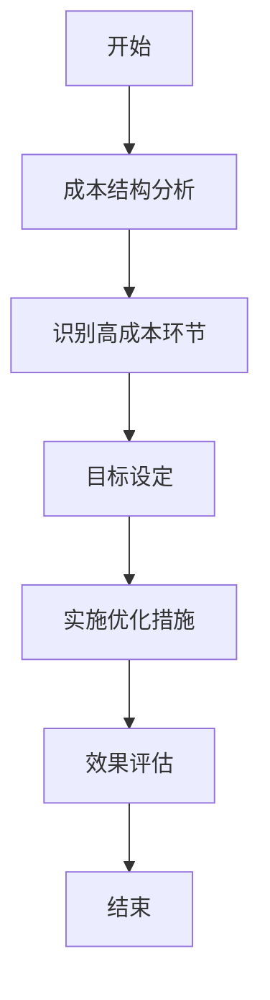
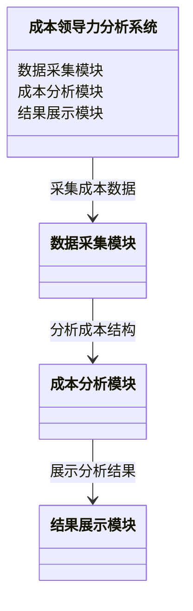

                 


# 彼得林奇如何分析公司的成本领导力

> 关键词：彼得·林奇，成本领导力，投资分析，竞争优势，成本结构

> 摘要：本文详细探讨了彼得·林奇如何分析公司的成本领导力，从定义、原理、数学模型到实际案例分析，系统地阐述了如何通过成本优势来构建竞争优势，帮助投资者识别具备持续成本优势的企业。

---

## 第一部分: 成本领导力的背景与概念

### 第1章: 成本领导力的定义与重要性

#### 1.1 成本领导力的核心概念

##### 1.1.1 成本领导力的定义
成本领导力是指企业在行业内通过有效管理和优化成本结构，从而在价格或效率上获得竞争优势的能力。它不仅关注单个成本的降低，更注重整体成本结构的优化，以实现长期的成本优势。

##### 1.1.2 成本领导力的核心要素
- **成本结构分析**：了解企业的固定成本和变动成本比例，识别成本的主要组成部分。
- **成本控制能力**：企业通过技术创新、流程优化等手段降低成本的能力。
- **成本竞争优势**：企业在价格或质量上与竞争对手相比更具吸引力的优势。

##### 1.1.3 成本领导力与竞争优势的关系
成本领导力是企业在市场中获得竞争优势的关键因素之一。通过降低成本，企业可以提供更具竞争力的价格，或在相同价格下提供更高的产品或服务质量。

#### 1.2 彼得·林奇的成本分析方法

##### 1.2.1 彼得·林奇的投资理念
彼得·林奇强调基本面分析，认为企业的财务健康状况和成本结构是决定投资价值的关键因素。他主张投资那些具有持续成本优势的企业，这些企业能够在行业中长期保持竞争力。

##### 1.2.2 成本领导力在投资分析中的地位
在彼得·林奇的分析框架中，成本领导力是评估企业竞争优势的重要指标。他通过分析企业的成本结构、毛利率和营业利润率，判断企业是否具备持续的成本优势。

##### 1.2.3 成本领导力的行业适用性
成本领导力的分析在不同行业中的侧重点可能有所不同。例如，在制造业，成本领导力可能更多关注生产流程的优化；而在零售业，则可能更关注供应链管理和库存成本。

---

### 第2章: 成本领导力的背景与问题背景

#### 2.1 企业成本管理的现状

##### 2.1.1 传统成本管理的局限性
传统成本管理方法往往关注于单个成本项目的优化，缺乏对整体成本结构的系统性分析。这种做法可能导致局部优化，而忽视整体成本的最优配置。

##### 2.1.2 现代成本管理的创新方向
现代成本管理强调系统性和战略性，注重通过技术创新、流程优化和组织结构调整来实现整体成本的最优控制。同时，大数据和人工智能技术的应用也为成本管理提供了新的工具和方法。

##### 2.1.3 成本领导力的提出背景
随着市场竞争的加剧，企业单纯依靠价格优势已经难以维持竞争优势。成本领导力作为一种更高级的成本管理理念，强调通过系统优化和持续改进来实现长期的成本优势。

#### 2.2 成本领导力的核心问题

##### 2.2.1 成本结构的优化问题
企业需要分析自身的成本结构，识别高成本环节，并通过技术创新和管理优化来降低整体成本。

##### 2.2.2 成本竞争力的评估问题
如何准确评估企业的成本竞争力，是成本领导力分析的关键问题。这需要结合行业基准和企业自身的财务数据进行综合评估。

##### 2.2.3 成本领导力的可持续性问题
成本领导力的实现需要企业在长期运营中持续优化成本结构，而不仅仅是短期的 cost-cutting 行为。因此，可持续性是成本领导力成功的重要因素。

---

## 第二部分: 成本领导力的核心概念与联系

### 第4章: 成本领导力的原理与模型

#### 4.1 成本领导力的原理分析

##### 4.1.1 成本领导力的基本原理
成本领导力的核心在于通过优化成本结构，提高企业的运营效率和利润率。它不仅关注成本的绝对值，更注重成本与收益的平衡。

##### 4.1.2 成本领导力的实现机制
- **技术创新**：通过引入新技术降低生产成本。
- **流程优化**：优化业务流程，减少浪费。
- **规模效应**：通过扩大生产规模降低单位成本。

##### 4.1.3 成本领导力的动态调整
成本领导力不是一成不变的，企业需要根据市场环境和内部条件的变化，动态调整成本结构和管理策略。

#### 4.2 成本领导力的数学模型

##### 4.2.1 成本领导力的数学表达式
成本领导力可以通过以下公式进行量化评估：

$$
\text{成本领导力} = \frac{\text{行业平均成本} - \text{企业实际成本}}{\text{行业平均成本}} \times 100\%
$$

##### 4.2.2 成本领导力的评估公式
通过比较企业与行业竞争对手的成本结构，可以评估企业的成本领导力：

$$
\text{成本优势} = \text{企业成本} - \text{竞争对手成本}
$$

##### 4.2.3 成本领导力的优化模型
为了实现成本领导力的持续优化，企业可以采用以下步骤：

1. **成本结构分析**：识别高成本环节。
2. **目标设定**：设定成本优化的目标。
3. **实施优化措施**：通过技术创新、流程优化等手段降低成本。
4. **效果评估**：定期评估成本优化的效果，并进行调整。

---

#### 4.3 成本领导力的 mermaid 流程图


---

#### 4.4 成本领导力的Python代码实现示例
以下是一个简单的成本分析代码示例：

```python
# 定义成本数据
industry_avg_cost = 100
company_cost = 80

# 计算成本领导力
cost_leadership = (industry_avg_cost - company_cost) / industry_avg_cost * 100

print(f"成本领导力为：{cost_leadership}%")
```

---

#### 4.5 成本领导力的行业案例
以某制造企业为例，假设行业平均成本为100，企业实际成本为80，计算成本领导力为：

$$
\text{成本领导力} = \frac{100 - 80}{100} \times 100\% = 20\%
$$

这表明该企业在成本结构上比行业平均水平低20%，具有显著的成本优势。

---

## 第5章: 成本领导力与竞争对手的对比

### 5.1 竞争对手的成本分析

#### 5.1.1 竞争对手的成本结构
通过分析竞争对手的成本结构，可以识别其高成本环节，并评估其成本优势。

#### 5.1.2 竞争对手的成本优势
比较竞争对手的成本结构，可以发现其成本优势所在，从而制定相应的竞争策略。

#### 5.1.3 竞争对手的成本劣势
识别竞争对手的成本劣势，可以帮助企业制定更有针对性的成本优化策略。

### 5.2 成本领导力的行业案例

#### 5.2.1 行业中的成本领导者
以沃尔玛为例，其通过高效的供应链管理和规模化采购，实现了显著的成本优势。

#### 5.2.2 成本领导力的行业差异
不同行业中的成本领导力侧重点不同，例如制造业注重生产流程优化，而零售业则注重供应链管理。

#### 5.2.3 成本领导力的行业趋势
随着技术进步和市场竞争加剧，成本领导力在各个行业中的重要性日益凸显。

---

## 第三部分: 成本领导力的系统分析与架构设计

### 第6章: 系统分析与架构设计

#### 6.1 问题场景介绍
为了分析公司的成本领导力，我们需要构建一个系统化的分析框架，包括数据采集、分析模型和结果展示等功能。

#### 6.2 系统功能设计

##### 6.2.1 领域模型 mermaid 类图


#### 6.3 系统架构设计

##### 6.3.1 系统架构 mermaid 架构图
```mermaid
client --> 服务层: 发送成本数据
服务层 --> 数据库: 存储成本数据
服务层 --> 分析模块: 分析成本结构
分析模块 --> 结果展示层: 展示分析结果
```

---

## 第四部分: 项目实战

### 第7章: 项目实战

#### 7.1 环境配置
需要安装Python和相关数据处理库，例如Pandas和Matplotlib。

#### 7.2 核心实现

##### 7.2.1 成本分析代码
```python
import pandas as pd
import matplotlib.pyplot as plt

# 读取成本数据
data = pd.read_csv('cost_data.csv')

# 计算成本领导力
data['成本领导力'] = (data['行业平均成本'] - data['企业成本']) / data['行业平均成本'] * 100

# 可视化结果
data.plot(kind='bar', x='企业名称', y='成本领导力')
plt.title('成本领导力分析')
plt.xlabel('企业名称')
plt.ylabel('成本领导力（%）')
plt.show()
```

#### 7.3 案例分析

##### 7.3.1 环境配置
安装必要的Python库，如Pandas和Matplotlib。

##### 7.3.2 代码实现
如上文所述的Python代码。

##### 7.3.3 案例分析
以某行业为例，分析企业的成本领导力，识别具有成本优势的企业。

##### 7.3.4 项目总结
通过实际案例分析，验证成本领导力分析方法的有效性，并总结经验教训。

---

## 第五部分: 最佳实践、小结、注意事项和拓展阅读

### 第8章: 最佳实践与小结

#### 8.1 最佳实践 tips
- 定期进行成本结构分析，及时调整优化策略。
- 结合行业趋势和技术进步，持续改进成本管理方法。

#### 8.2 小结
成本领导力是企业在竞争中获得优势的重要因素。通过系统化的分析和优化，企业可以实现持续的成本优势，提升整体竞争力。

#### 8.3 注意事项
- 成本优化需要结合企业的实际情况，避免一刀切。
- 注重短期成本控制的同时，也要考虑长期的可持续性。

#### 8.4 拓展阅读
建议进一步阅读彼得·林奇的著作，深入理解他的投资理念和分析方法。

---

## 作者信息

作者：AI天才研究院/AI Genius Institute & 禅与计算机程序设计艺术 /Zen And The Art of Computer Programming

