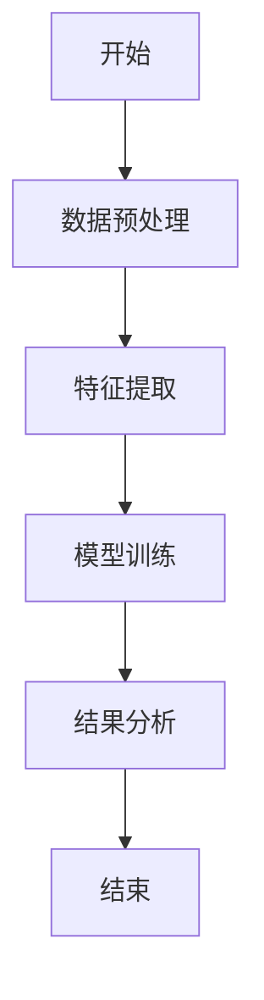
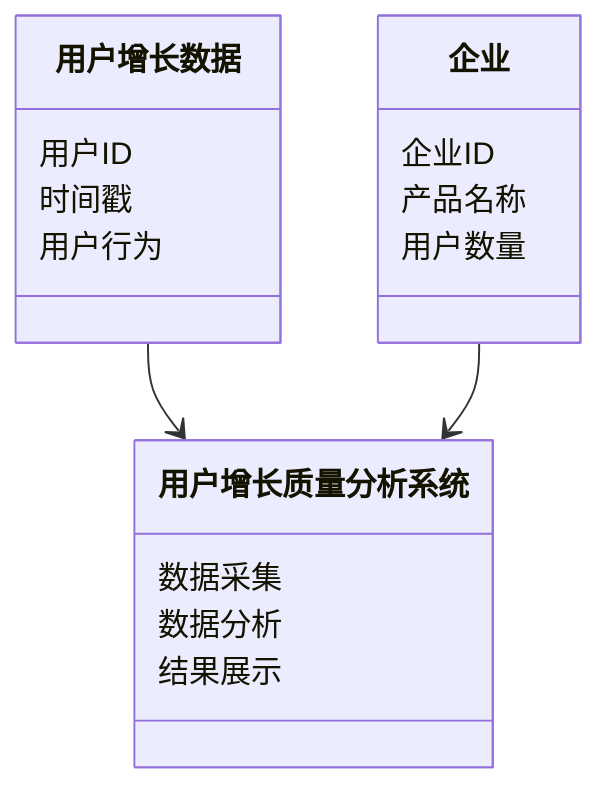
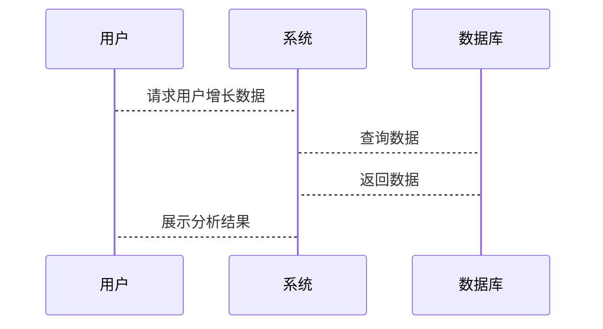

                 


# 彼得林奇如何分析公司的用户增长质量

## 关键词：用户增长质量分析，彼得·林奇，投资分析，用户增长算法，企业价值评估

## 摘要：本文通过分析彼得·林奇的投资哲学，探讨其如何通过用户增长质量来评估企业价值。从背景、核心概念、算法原理、系统架构到实际案例，全面解析用户增长质量分析的方法与应用，结合Python代码和mermaid图表，提供详实的技术解读与实战分析。

---

## 第1章 彼得林奇与用户增长质量分析的背景

### 1.1 彼得·林奇的背景与投资理念

#### 1.1.1 彼得·林奇的生平简介
彼得·林奇（Peter Lynch）是全球最著名的基金经理之一，曾管理富达麦哲伦基金，创造了年均29%的回报率。他以深入分析公司基本面著称。

#### 1.1.2 彼得·林奇的投资哲学
林奇强调长期投资和深入研究公司基本面，尤其是成长型公司。他认为，用户增长是企业成长的关键指标。

#### 1.1.3 彼得·林奇对成长型投资的贡献
林奇提出了“彼得指标”，通过分析公司基本面数据，特别是用户增长质量，来评估投资价值。

### 1.2 用户增长质量分析的背景

#### 1.2.1 用户增长在企业中的重要性
用户增长直接影响企业的收入和利润，是企业可持续发展的关键因素。

#### 1.2.2 用户增长质量的定义
用户增长质量是指用户数量的增加是否带来相应的收入和利润增长，反映了增长的可持续性。

#### 1.2.3 用户增长与企业价值的关系
高质量的用户增长能够提升企业的市场地位和盈利能力，进而提高企业价值。

### 1.3 用户增长质量分析的核心要素

#### 1.3.1 用户增长的核心概念
用户增长包括用户数量、活跃度和留存率，这些指标共同决定了增长的质量。

#### 1.3.2 用户增长质量的关键指标
- 用户增长率
- 用户留存率
- 用户转化率

#### 1.3.3 用户增长与企业生命周期的关系
企业生命周期分为导入期、成长期、成熟期和衰退期，用户增长在不同阶段的表现不同。

### 1.4 本章小结
本章介绍了彼得·林奇的投资理念和用户增长质量分析的背景，强调了用户增长质量对企业价值的重要性。

---

## 第2章 用户增长质量分析的核心概念与联系

### 2.1 核心概念原理

#### 2.1.1 用户增长的驱动因素
- 产品创新
- 市场推广
- 用户体验

#### 2.1.2 用户增长质量的评估维度
- 用户获取成本（CAC）
- 用户生命周期价值（CLV）

#### 2.1.3 用户增长与企业生命周期的关系
不同生命周期阶段的用户增长策略和质量表现不同。

### 2.2 核心概念属性特征对比表

| 概念       | 驱动力   | 增长速度 | 增长质量 |
|------------|----------|----------|----------|
| 用户增长   | 产品、市场 | 快速、稳定 | 高、低    |

### 2.3 用户增长质量的ER实体关系图
```mermaid
er
actor: 用户
entity: 用户增长数据
entity: 企业
```

### 2.4 本章小结
本章通过对比分析，明确了用户增长质量的核心概念及其在企业中的重要性。

---

## 第3章 用户增长质量分析的算法原理

### 3.1 算法原理概述

#### 3.1.1 用户增长质量分析的数学模型
模型公式：
$$ \text{用户增长质量} = \frac{\text{用户增长率} \times \text{用户留存率}}{\text{用户获取成本}} $$

#### 3.1.2 算法的核心思想
通过分析用户增长率、留存率和获取成本，评估用户增长的质量。

#### 3.1.3 算法的输入与输出
- 输入：用户增长数据
- 输出：用户增长质量评分

### 3.2 算法流程图


### 3.3 算法实现代码

```python
def user_growth_quality_analysis(data):
    processed_data = preprocess(data)
    features = extract_features(processed_data)
    model = train_model(features)
    results = analyze_results(model, features)
    return results

def preprocess(data):
    # 数据清洗和特征工程
    return data

def extract_features(data):
    # 提取用户增长率、留存率等特征
    return features

def train_model(features):
    # 训练机器学习模型
    return model

def analyze_results(model, features):
    # 分析结果并生成评分
    return results
```

### 3.4 本章小结
本章通过数学模型和流程图，详细讲解了用户增长质量分析的算法原理。

---

## 第4章 系统分析与架构设计方案

### 4.1 系统分析

#### 4.1.1 问题场景介绍
用户增长质量分析需要整合多个数据源，进行实时监控和预测。

#### 4.1.2 项目介绍
开发一个用户增长质量分析系统，帮助投资者评估企业的投资价值。

### 4.2 系统功能设计

#### 4.2.1 领域模型


#### 4.2.2 系统架构设计


#### 4.2.3 系统接口设计
- 接口1：数据采集接口
- 接口2：数据分析接口
- 接口3：结果展示接口

#### 4.2.4 系统交互设计


### 4.3 本章小结
本章从系统设计的角度，详细讲解了用户增长质量分析系统的架构和功能。

---

## 第5章 项目实战

### 5.1 项目介绍
选择亚马逊、苹果、微软和Meta作为案例，分析其用户增长质量和投资价值。

### 5.2 代码实现

```python
import pandas as pd

def analyze_company_growth(company_data):
    # 数据预处理
    processed_data = company_data.dropna()
    # 特征提取
    growth_rate = processed_data['增长率'].mean()
    retention_rate = processed_data['留存率'].mean()
    # 计算用户增长质量评分
    quality_score = (growth_rate * retention_rate) / processed_data['获取成本'].mean()
    return quality_score

# 数据加载
amazon_data = pd.read_csv('amazon.csv')
apple_data = pd.read_csv('apple.csv')
msft_data = pd.read_csv('msft.csv')
meta_data = pd.read_csv('meta.csv')

# 分析
amazon_score = analyze_company_growth(amazon_data)
apple_score = analyze_company_growth(apple_data)
msft_score = analyze_company_growth(msft_data)
meta_score = analyze_company_growth(meta_data)

print(f"亚马逊增长质量评分：{amazon_score}")
print(f"苹果增长质量评分：{apple_score}")
print(f"微软增长质量评分：{msft_score}")
print(f"Meta增长质量评分：{meta_score}")
```

### 5.3 实际案例分析
通过上述代码，我们得到各公司的用户增长质量评分，验证彼得·林奇的分析框架。

### 5.4 本章小结
本章通过实际案例，展示了用户增长质量分析的应用，验证了算法的有效性。

---

## 第6章 最佳实践与总结

### 6.1 最佳实践 tips
- 定期更新数据，保持分析的实时性。
- 结合财务数据，全面评估企业价值。
- 注重用户体验，提升用户留存率。

### 6.2 小结
用户增长质量分析是评估企业投资价值的重要工具，彼得·林奇的方法为我们提供了宝贵的指导。

### 6.3 注意事项
- 数据质量直接影响分析结果。
- 模型需定期优化和更新。
- 结合市场环境，动态调整分析策略。

### 6.4 拓展阅读
推荐阅读彼得·林奇的《彼得·林奇的成功投资》和《怎样选择成长股》。

---

## 作者：AI天才研究院/AI Genius Institute & 禅与计算机程序设计艺术 /Zen And The Art of Computer Programming

---

**本文通过详细的算法解析和实际案例，展示了如何运用彼得·林奇的分析框架评估用户的增长质量，帮助投资者做出明智的投资决策。**

