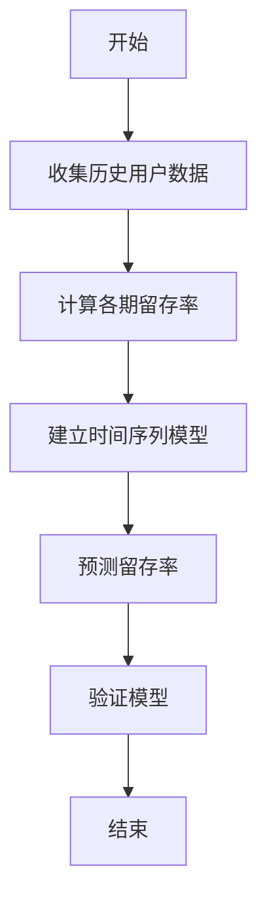
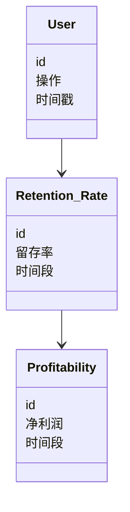
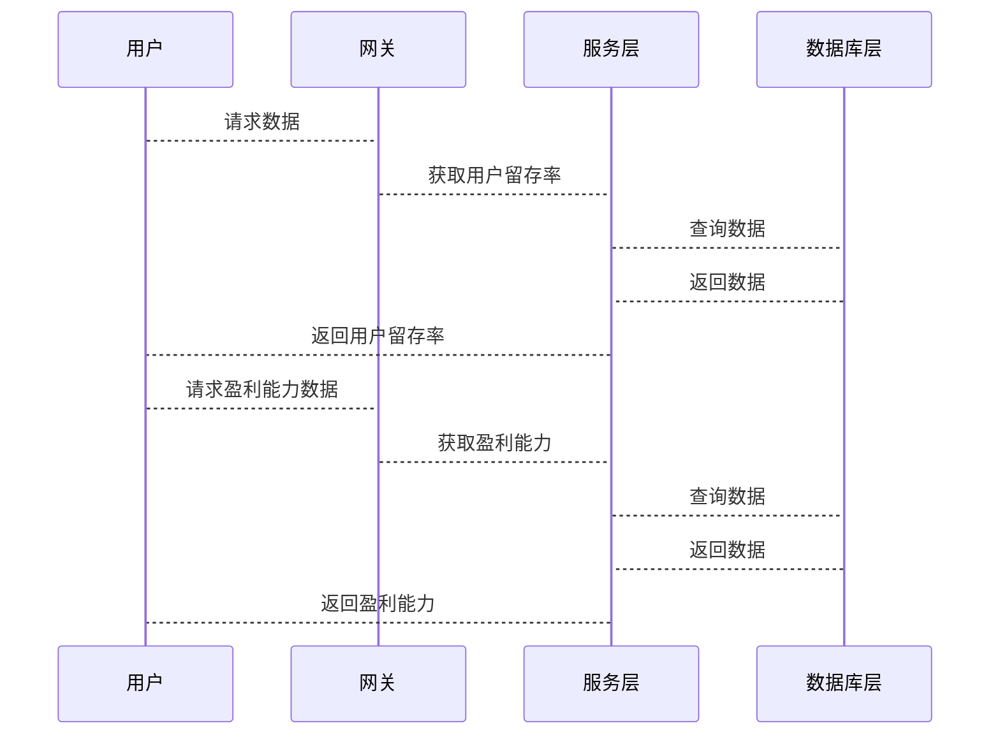

                 


# 彼得林奇如何分析公司的用户留存率与盈利能力关系

## 关键词：用户留存率，盈利能力，彼得·林奇，投资分析，公司分析

## 摘要：  
本文探讨了彼得·林奇如何通过分析公司的用户留存率和盈利能力来评估其投资价值。文章详细介绍了用户留存率和盈利能力的核心概念，分析了两者之间的关系，并通过数学模型和实例展示了如何利用这些指标进行投资决策。

---

## 第一部分: 背景介绍

### 第1章: 用户留存率与盈利能力的核心概念

#### 1.1 问题背景与问题描述
##### 1.1.1 用户留存率的定义与重要性
用户留存率是衡量用户粘性和产品吸引力的关键指标。留存率高意味着用户更愿意持续使用产品，这通常与更高的收入和盈利能力相关。  

##### 1.1.2 盈利能力的定义与关键指标  
盈利能力是企业创造利润的能力，常用的指标包括净利润率、毛利率和营业利润率。  

##### 1.1.3 问题解决的目标与意义  
通过分析用户留存率和盈利能力，投资者可以更好地评估公司的长期发展潜力和投资价值。  

#### 1.2 核心概念的边界与外延
##### 1.2.1 用户留存率的边界条件  
用户留存率的计算通常基于特定的时间段和用户群体。  

##### 1.2.2 盈利能力的外延范围  
盈利能力不仅与财务表现相关，还与公司的运营效率和市场策略有关。  

##### 1.2.3 两者之间的关系与联系  
用户留存率高通常会带来更高的收入和盈利能力，但盈利能力还受到成本控制和定价策略的影响。  

#### 1.3 核心概念的结构与组成
##### 1.3.1 用户留存率的构成要素  
用户留存率由用户行为数据和产品特性决定，包括用户满意度和产品功能。  

##### 1.3.2 盈利能力的核心要素  
盈利能力由收入、成本和费用构成，反映了公司的财务健康状况。  

##### 1.3.3 两者的相互作用机制  
用户留存率影响收入，而收入和成本结构共同决定盈利能力。  

### 第2章: 彼得·林奇的分析框架

#### 2.1 彼得·林奇的投资理念
##### 2.1.1 投资的核心原则  
林奇强调长期投资和基本面分析，注重公司的内在价值。  

##### 2.1.2 价值投资的内涵  
价值投资关注于找到被市场低估的公司，通过分析公司的财务状况和竞争优势来判断其长期价值。  

##### 2.1.3 林奇的选股策略  
林奇偏好那些具有强大竞争优势、高用户留存率和稳定盈利能力的公司。  

#### 2.2 林奇分析用户留存率的方法
##### 2.2.1 留存率的计算公式  
用户留存率 = (期末留存用户数 / 期初用户数) × 100%  

##### 2.2.2 留存率的行业基准  
不同行业的用户留存率基准不同，通常需要结合行业特点进行分析。  

##### 2.2.3 留存率与用户生命周期的关系  
用户生命周期包括获取、留存和流失阶段，留存率反映了用户在生命周期中的表现。  

#### 2.3 林奇分析盈利能力的技巧
##### 2.3.1 净利润的计算与关键指标  
净利润 = 收入 - 成本 - 费用  

##### 2.3.2 盈利能力的驱动因素  
盈利能力受到收入增长、成本控制和定价策略的影响。  

##### 2.3.3 盈利能力与企业价值的关系  
盈利能力是决定企业价值的重要因素，高盈利能力通常意味着更高的市场估值。  

---

## 第二部分: 核心概念与联系

### 第3章: 用户留存率与盈利能力的关系

#### 3.1 核心概念的原理
##### 3.1.1 用户留存率对收入的影响  
高用户留存率通常意味着更高的收入，因为用户更可能持续购买产品或服务。  

##### 3.1.2 盈利能力对用户留存率的反向影响  
盈利能力高通常意味着公司能够提供更好的产品和服务，从而提高用户留存率。  

##### 3.1.3 两者的动态平衡机制  
用户留存率和盈利能力需要在长期发展中保持动态平衡，过低的留存率可能导致收入下降，而过低的盈利能力可能无法吸引和保留用户。  

#### 3.2 核心概念的属性对比
##### 3.2.1 用户留存率的属性特征  
- 时间依赖性：用户留存率依赖于时间段的选择。  
- 用户行为驱动：用户留存率受用户行为和产品特性的驱动。  

##### 3.2.2 盈利能力的属性特征  
- 财务驱动性：盈利能力由财务数据决定。  
- 竞争性：盈利能力受行业竞争和市场环境的影响。  

##### 3.2.3 两者属性的对比分析  
| 属性 | 用户留存率 | 盈利能力 |
|------|------------|----------|
| 驱动因素 | 用户行为、产品特性 | 收入、成本、费用 |
| 数据类型 | 比率 | 利润率、净利润率 |
| 时间范围 | 短期和长期 | 短期和长期 |

#### 3.3 ER实体关系图架构
```mermaid
er
  User --|> Retention_Rate: 用户留存率
  Retention_Rate --|> Profitability: 盈利能力
  User --|> Company: 公司
  Company --|> Profitability: 盈利能力
```

---

## 第三部分: 算法原理讲解

### 第4章: 用户留存率预测模型

#### 4.1 算法原理
##### 4.1.1 基于历史数据的预测方法  
用户留存率的预测通常基于历史数据，可以通过时间序列分析或回归分析进行建模。  

##### 4.1.2 留存率预测的数学模型  
$$ R_{t} = \alpha R_{t-1} + \beta + \epsilon $$  
其中，\( R_{t} \) 表示第 \( t \) 期的留存率，\( \alpha \) 是自回归系数，\( \beta \) 是截距，\( \epsilon \) 是误差项。  

##### 4.1.3 算法的实现步骤  
1. 收集历史用户数据。  
2. 计算各期的留存率。  
3. 建立时间序列模型进行预测。  
4. 验证模型的准确性。  

#### 4.2 算法流程图  


---

## 第五章: 盈利能力分析的数学模型

### 5.1 盈利能力预测模型
##### 5.1.1 净利润预测公式  
$$ \text{净利润} = \text{收入} - \text{成本} - \text{费用} $$  

##### 5.1.2 盈利能力驱动因素分析  
$$ \text{净利润率} = \frac{\text{净利润}}{\text{收入}} \times 100\% $$  

##### 5.1.3 结合用户留存率的盈利能力预测  
通过分析用户留存率对收入的影响，可以预测未来的盈利能力。  

---

## 第四部分: 系统分析与架构设计

### 第5章: 系统分析与架构设计

#### 5.1 问题场景介绍  
我们设计一个系统来分析公司的用户留存率和盈利能力，帮助投资者做出更明智的投资决策。  

#### 5.2 系统功能设计  
##### 5.2.1 领域模型设计  


##### 5.2.2 系统架构设计  


##### 5.2.3 系统接口设计  
- API接口：提供用户数据和财务数据的接口。  

##### 5.2.4 系统交互设计  


---

## 第五部分: 项目实战

### 第6章: 项目实战

#### 6.1 环境安装  
安装必要的开发工具和数据分析库，如Python、Pandas、Matplotlib等。  

#### 6.2 系统核心实现源代码  
```python
import pandas as pd
import matplotlib.pyplot as plt

# 示例数据加载
data = pd.read_csv('user_retention.csv')

# 用户留存率计算
data['留存率'] = data.groupby('用户ID')['时间戳'].transform('count') / data.groupby('用户ID')['时间戳'].transform('max') 

# 可视化
plt.plot(data['时间'], data['留存率'])
plt.title('用户留存率趋势')
plt.xlabel('时间')
plt.ylabel('留存率')
plt.show()
```

#### 6.3 代码应用解读与分析  
上述代码展示了如何计算和可视化用户留存率，帮助投资者了解用户行为趋势。  

#### 6.4 实际案例分析  
以一家互联网公司为例，分析其用户留存率和盈利能力的关系，展示如何通过模型预测未来的盈利能力。  

---

## 第六部分: 最佳实践与总结

### 第7章: 最佳实践

#### 7.1 小结  
用户留存率和盈利能力是评估公司投资价值的重要指标，通过分析它们之间的关系，投资者可以做出更明智的决策。  

#### 7.2 注意事项  
- 数据质量是关键，确保数据准确性和完整性。  
- 结合行业特点和公司具体情况，灵活调整分析方法。  

#### 7.3 拓展阅读  
建议阅读彼得·林奇的书籍《彼得·林奇的成功投资法则》和《价值投资入门》。  

---

## 作者：AI天才研究院/AI Genius Institute & 禅与计算机程序设计艺术 /Zen And The Art of Computer Programming

