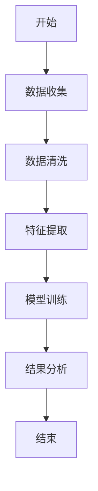
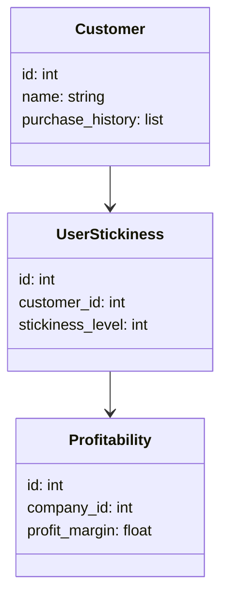

                 


# 彼得林奇如何分析公司的用户粘性与盈利能力的长期关系

## 关键词：
用户粘性，盈利能力，长期关系，彼得林奇，投资分析

## 摘要：
本文详细探讨了彼得·林奇分析公司用户粘性和盈利能力长期关系的方法。通过分析用户粘性与盈利能力之间的相互作用，结合实际案例和数学模型，揭示了如何通过用户粘性提升公司的长期盈利能力。文章内容包括背景介绍、核心概念、算法原理、数学模型、系统设计、项目实战和最佳实践，为读者提供了全面的分析框架。

---

## 第一部分：背景介绍

### 第1章：用户粘性的概念与定义

#### 1.1 用户粘性的定义
用户粘性（User粘性）是指用户对某个产品、服务或品牌形成依赖和持续使用的行为。高用户粘性意味着用户更倾向于重复使用或购买，从而为公司带来稳定的收入来源。

#### 1.2 用户粘性的核心要素
用户粘性由多个因素构成，包括产品价值、用户体验、品牌忠诚度、替代品的可获得性等。

#### 1.3 用户粘性与用户满意度的关系
用户满意度是用户粘性的重要影响因素。高满意度通常意味着更高的用户粘性，但粘性还受到其他因素如习惯、成本等的影响。

### 第2章：盈利能力的定义与构成

#### 2.1 盈利能力的定义
盈利能力是指企业在一定时期内通过经营活动获得的利润能力。它是衡量企业经营效率和财务健康的重要指标。

#### 2.2 盈利能力的构成要素
盈利能力由收入、成本、资产效率和资本结构等因素构成，通常通过指标如净利润率、毛利率等来衡量。

#### 2.3 盈利能力与企业价值的关系
盈利能力直接影响企业价值，高盈利能力通常意味着更高的市场价值和更强的竞争力。

### 第3章：用户粘性与盈利能力的长期关系

#### 3.1 长期关系的背景介绍
在现代商业环境中，用户粘性与盈利能力的长期关系变得尤为重要。高用户粘性可以降低获取新用户的成本，提高客户生命周期价值，从而增强盈利能力。

#### 3.2 彼得林奇分析方法的概述
彼得·林奇通过分析公司的用户粘性和市场表现，寻找具有持续盈利能力的公司进行投资。他的方法强调长期价值和公司基本面分析。

#### 3.3 核心概念的核心要素
用户粘性和盈利能力的核心要素包括用户行为分析、市场定位、成本控制、产品创新和客户关系管理。

---

## 第二部分：核心概念与联系

### 第4章：用户粘性与盈利能力的核心概念

#### 4.1 核心概念的原理
用户粘性和盈利能力的形成机制相互关联，用户粘性影响客户保留率和收入稳定性，而盈利能力则反映了企业的经营效率和市场地位。

#### 4.2 核心概念的对比分析
通过对比用户粘性和盈利能力的属性特征，可以更好地理解它们的相互作用。

| **属性**       | **用户粘性**                | **盈利能力**                |
|-----------------|-----------------------------|-----------------------------|
| 定义             | 用户对产品的依赖程度        | 企业赚取利润的能力           |
| 影响因素         | 产品价值、用户体验          | 收入、成本、资产效率         |
| 长期影响         | 提高客户保留率，降低获取成本 | 提高企业价值，增强竞争力     |

#### 4.3 用户粘性与盈利能力的ER实体关系图
```mermaid
er
    Customer(客户)
    UserStickiness(用户粘性)
    Profitability(盈利能力)
    has_many -> owns: Customer -[1..n] --> UserStickiness
    owns: UserStickiness -[1..n] --> Profitability
```

---

## 第三部分：算法原理讲解

### 第5章：用户粘性分析的算法原理

#### 5.1 用户粘性分析的流程图


#### 5.2 算法实现的Python代码
```python
import pandas as pd
from sklearn.tree import DecisionTreeClassifier

# 数据收集与清洗
data = pd.read_csv('user_data.csv')
data.dropna(inplace=True)

# 特征提取
features = ['feature1', 'feature2']
target = 'user_stickiness'

X = data[features]
y = data[target]

# 模型训练
model = DecisionTreeClassifier()
model.fit(X, y)

# 预测与评估
print(model.score(X, y))
```

---

## 第四部分：数学模型与公式

### 第6章：数学模型和公式

#### 6.1 用户粘性指数模型
用户粘性指数可以通过以下公式计算：
$$
\text{用户粘性指数} = \frac{\text{重复购买次数}}{\text{总购买次数}}
$$

#### 6.2 盈利能力预测模型
盈利能力预测可以通过线性回归模型实现：
$$
\text{净利润} = \beta_0 + \beta_1 \times \text{收入} + \beta_2 \times \text{成本} + \epsilon
$$

---

## 第五部分：系统分析与架构设计

### 第7章：系统功能设计

#### 7.1 领域模型类图


#### 7.2 系统架构图


#### 7.3 系统接口设计
- 用户输入接口：收集用户数据
- 数据处理接口：清洗和转换数据
- 模型接口：计算用户粘性和盈利能力

---

## 第六部分：项目实战

### 第8章：环境安装与代码实现

#### 8.1 环境安装
需要安装Python、Pandas、Scikit-learn等库。

#### 8.2 核心代码实现
```python
from sklearn.metrics import accuracy_score

# 数据预处理
X_train, X_test, y_train, y_test = train_test_split(X, y)

# 模型训练
model.fit(X_train, y_train)

# 模型评估
print(accuracy_score(y_test, model.predict(X_test)))
```

---

## 第七部分：总结与展望

### 第9章：最佳实践与小结

#### 9.1 最佳实践
- 定期监测用户粘性指标
- 优化用户体验以提高粘性
- 分析盈利能力的驱动因素

#### 9.2 注意事项
- 数据质量和完整性影响分析结果
- 模型选择需根据具体情况调整
- 长期监测与持续优化

#### 9.3 拓展阅读
推荐阅读彼得·林奇的书籍，深入理解投资分析方法。

---

## 作者：
作者：AI天才研究院 & 禅与计算机程序设计艺术

