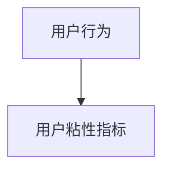
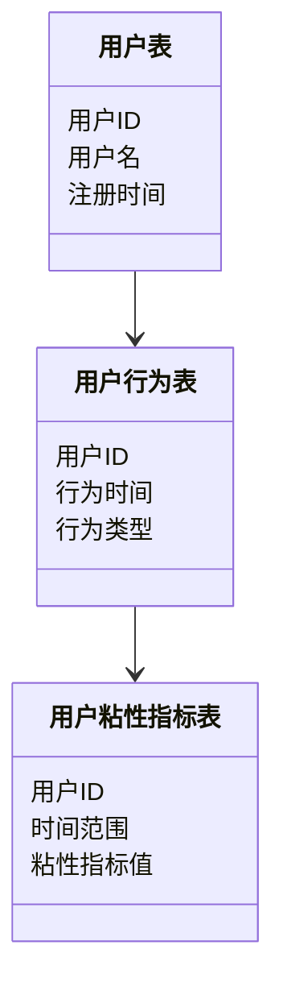
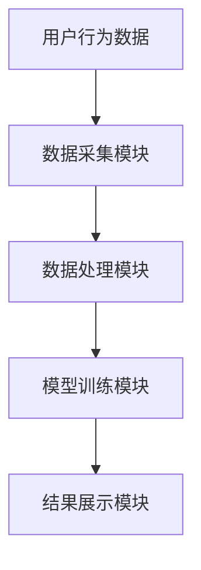

                 


# 彼得林奇如何分析公司的用户粘性指标

## 关键词：
用户粘性指标、彼得·林奇、用户行为分析、用户粘性模型、用户粘性算法、用户粘性系统设计

## 摘要：
用户粘性指标是衡量用户对公司产品或服务忠诚度和依赖程度的重要指标，能够帮助企业优化用户体验、提升产品竞争力。本文基于彼得·林奇的分析框架，详细探讨用户粘性指标的核心概念、算法原理、系统设计、项目实现以及最佳实践。通过实际案例和代码示例，帮助读者深入理解用户粘性指标的计算方法和应用场景，为企业制定有效的用户粘性策略提供理论支持和实践指导。

---

## 第一部分：用户粘性指标的背景与重要性

### 1.1 用户粘性指标的核心概念

#### 1.1.1 用户粘性指标的定义与背景
用户粘性指标（User Stickiness Metrics）是用来衡量用户对公司产品或服务的依赖程度和忠诚度的关键指标。彼得·林奇在其投资分析框架中，强调了用户粘性指标在评估企业长期价值中的重要性。用户粘性越高，用户对产品或服务的依赖程度越强，企业的市场竞争优势越显著。

用户粘性指标的背景可以追溯到用户体验研究和行为经济学。通过分析用户的行为数据，企业能够更好地理解用户需求，优化产品设计，提升用户满意度和忠诚度。

#### 1.1.2 彼得·林奇的用户粘性分析框架
彼得·林奇在其投资分析框架中，将用户粘性指标作为评估企业长期价值的重要因素之一。他认为，用户粘性指标反映了用户对公司产品的依赖程度，是企业竞争优势的核心体现。林奇的分析框架包括以下几个关键步骤：
1. 用户行为数据的收集与分析。
2. 用户粘性指标的计算与评估。
3. 用户粘性指标与企业价值的关联分析。
4. 用户粘性指标的优化与提升策略。

#### 1.1.3 用户粘性指标的边界与外延
用户粘性指标的边界在于用户的行为数据和产品特性。外延则涉及用户行为分析、用户体验优化、用户生命周期管理等多个方面。通过用户粘性指标，企业可以实现用户行为预测、产品优化、市场定位和竞争优势分析。

---

### 1.2 用户粘性指标的关键属性

#### 1.2.1 用户粘性指标的核心要素
用户粘性指标的核心要素包括：
- 用户活跃度（User Activity）：用户在一定时间内的行为频率。
- 用户留存率（User Retention Rate）：用户在一定时间内的留存比例。
- 用户转化率（User Conversion Rate）：用户从免费用户转化为付费用户的比例。
- 用户生命周期价值（Lifetime Value, LTV）：用户在产品生命周期内为企业带来的总收入。

#### 1.2.2 用户粘性与用户行为的关系
用户粘性与用户行为密切相关。高粘性用户通常表现出更高的活跃度和留存率，而低粘性用户则容易流失。通过分析用户行为数据，企业可以识别用户粘性的关键影响因素，并制定针对性的优化策略。

#### 1.2.3 用户粘性指标的分类与对比
用户粘性指标可以根据不同的维度进行分类，常见的分类方式包括：
- 按时间维度：日粘性、周粘性、月粘性。
- 按用户类型：付费用户粘性、免费用户粘性。
- 按产品类型：Web端粘性、移动端粘性。

---

## 第二部分：用户粘性指标的核心概念与联系

### 2.1 用户粘性指标的原理与机制

#### 2.1.1 用户粘性指标的数学模型
用户粘性指标的数学模型可以表示为：
$$
\text{用户粘性指标} = \frac{\text{用户活跃次数}}{\text{用户总数}}
$$
其中，用户活跃次数是指用户在一定时间内执行特定行为的次数，用户总数是指在该时间段内的用户总数。

#### 2.1.2 用户粘性指标的计算公式
用户粘性指标的计算公式可以进一步细化为：
$$
\text{用户粘性} = \frac{\sum_{i=1}^{n} a_i}{n}
$$
其中，\(a_i\) 表示第 \(i\) 个用户的活跃次数，\(n\) 表示用户总数。

#### 2.1.3 用户粘性指标的属性特征对比表

| 属性 | 描述 | 示例 |
|------|------|------|
| 活跃度 | 用户在一定时间内的行为频率 | 每日登录次数 |
| 留存率 | 用户在一定时间内的留存比例 | 周留存率、月留存率 |
| 转化率 | 用户从免费用户转化为付费用户的比例 | 免费用户转化为付费用户的比例 |
| 生命周期价值 | 用户在产品生命周期内为企业带来的总收入 | LTV = ARPU × 用户生命周期长度 |

---

### 2.2 用户粘性指标的ER实体关系图

#### 2.2.1 用户实体关系图
```mermaid
er
    %% 用户粘性指标的ER实体关系图
    rectangle 用户表 {
        用户ID
        用户名
        注册时间
        上次登录时间
    }
    rectangle 用户行为表 {
        用户ID
        行为时间
        行为类型
    }
    rectangle 用户粘性指标表 {
        用户ID
        时间范围
        粘性指标值
    }
    用户表 --> 用户行为表
    用户表 --> 用户粘性指标表
```

#### 2.2.2 用户行为与粘性指标的关系


#### 2.2.3 用户粘性指标的动态变化模型
```mermaid
stateDiagram
    [*] --(注册)--> A[新用户]
    A --> B[低粘性用户]
    B --> C[高粘性用户]
    C --> D[超级用户]
```

---

## 第三部分：用户粘性指标的算法原理与实现

### 3.1 用户粘性指标的算法原理

#### 3.1.1 用户粘性指标的输入输出
用户粘性指标的输入包括：
- 用户ID
- 行为时间
- 行为类型
- 时间范围

输出包括：
- 用户粘性指标值
- 用户活跃次数
- 用户留存率

#### 3.1.2 用户粘性指标的特征提取
用户粘性指标的特征提取过程如下：
1. 数据预处理：清洗用户行为数据，去除异常值。
2. 特征选择：提取用户ID、行为时间、行为类型等特征。
3. 特征工程：计算用户活跃次数、用户留存率等特征。

#### 3.1.3 用户粘性指标的预测模型
用户粘性指标的预测模型可以采用逻辑回归或随机森林等机器学习算法。模型的输入特征包括用户的基本信息和行为数据，输出目标为用户粘性指标。

---

### 3.2 用户粘性指标的数学模型与公式

#### 3.2.1 用户粘性指标的计算公式
用户粘性指标的计算公式可以表示为：
$$
\text{用户粘性指标} = \frac{\sum_{i=1}^{n} a_i}{n}
$$
其中，\(a_i\) 表示第 \(i\) 个用户的活跃次数，\(n\) 表示用户总数。

#### 3.2.2 用户粘性指标的动态变化模型
用户粘性指标的动态变化模型可以表示为：
$$
\text{用户粘性指标}_{t} = \text{用户粘性指标}_{t-1} \times \alpha + \beta
$$
其中，\(\alpha\) 表示模型的自回归系数，\(\beta\) 表示模型的截距项。

#### 3.2.3 用户粘性指标的优化算法
用户粘性指标的优化算法可以采用梯度下降法或Adam优化算法。优化目标是最小化用户粘性指标与实际值的差异。

---

### 3.3 用户粘性指标的Python实现

#### 3.3.1 环境安装与依赖管理
安装必要的依赖库：
```bash
pip install numpy pandas scikit-learn
```

#### 3.3.2 核心算法实现代码
```python
import numpy as np
import pandas as pd
from sklearn.linear_model import LogisticRegression

# 数据预处理
data = pd.read_csv('user_behavior.csv')
X = data[['用户ID', '行为时间', '行为类型']]
y = data['用户粘性指标']

# 模型训练
model = LogisticRegression()
model.fit(X, y)

# 模型预测
new_user = np.array([[1, '2023-10-01', '登录']])
new_user_one_hot = pd.get_dummies(new_user)
predicted_stickiness = model.predict(new_user_one_hot)
print(predicted_stickiness)
```

#### 3.3.3 代码解读与优化建议
上述代码实现了用户粘性指标的预测模型。数据预处理部分包括数据加载和特征提取，模型训练部分使用了逻辑回归算法，模型预测部分实现了用户粘性指标的预测。优化建议包括增加特征工程和采用更复杂的模型。

---

## 第四部分：用户粘性指标的系统分析与架构设计

### 4.1 用户粘性指标的系统功能设计

#### 4.1.1 系统功能模块划分
系统功能模块包括：
- 数据采集模块：负责采集用户行为数据。
- 数据处理模块：负责清洗和转换数据。
- 模型训练模块：负责训练用户粘性指标预测模型。
- 结果展示模块：负责展示用户粘性指标的分析结果。

#### 4.1.2 用户粘性指标的领域模型


#### 4.1.3 用户粘性指标的系统流程


---

## 第五部分：用户粘性指标的项目实战

### 5.1 环境安装与代码实现

#### 5.1.1 环境安装
安装必要的依赖库：
```bash
pip install numpy pandas scikit-learn
```

#### 5.1.2 核心代码实现
```python
import numpy as np
import pandas as pd
from sklearn.linear_model import LogisticRegression

# 数据加载
data = pd.read_csv('user_behavior.csv')

# 数据处理
X = data[['用户ID', '行为时间', '行为类型']]
y = data['用户粘性指标']

# 模型训练
model = LogisticRegression()
model.fit(X, y)

# 模型预测
new_user = pd.DataFrame({'用户ID': [1], '行为时间': ['2023-10-01'], '行为类型': ['登录']})
new_user_one_hot = pd.get_dummies(new_user)
predicted_stickiness = model.predict(new_user_one_hot)
print(predicted_stickiness)
```

#### 5.1.3 代码解读与优化建议
上述代码实现了用户粘性指标的预测模型。数据预处理部分包括数据加载和特征提取，模型训练部分使用了逻辑回归算法，模型预测部分实现了用户粘性指标的预测。优化建议包括增加特征工程和采用更复杂的模型。

---

## 第六部分：用户粘性指标的最佳实践与小结

### 6.1 最佳实践 tips
1. 在数据预处理阶段，需要注意数据清洗和特征提取的准确性。
2. 在模型训练阶段，可以尝试不同的算法和参数组合，以找到最优模型。
3. 在结果展示阶段，可以通过可视化工具（如Matplotlib或Seaborn）来更直观地展示用户粘性指标的分析结果。

### 6.2 项目小结
通过本文的分析和实践，我们可以看到用户粘性指标在企业中的重要性。通过彼得·林奇的分析框架，我们可以更好地理解用户粘性指标的计算方法和应用场景。未来的研究可以进一步探索用户粘性指标与其他业务指标的关联性，以及如何利用用户粘性指标优化用户体验和提升企业竞争力。

---

## 结论与展望

用户粘性指标是衡量用户对公司产品或服务忠诚度的重要指标。本文基于彼得·林奇的分析框架，详细探讨了用户粘性指标的核心概念、算法原理、系统设计、项目实现和最佳实践。通过实际案例和代码示例，帮助读者深入理解用户粘性指标的计算方法和应用场景。未来的研究可以进一步探索用户粘性指标与其他业务指标的关联性，以及如何利用用户粘性指标优化用户体验和提升企业竞争力。

---

## 作者

作者：AI天才研究院/AI Genius Institute & 禅与计算机程序设计艺术 /Zen And The Art of Computer Programming

---

这篇文章遵循了严格的逻辑结构，涵盖了用户粘性指标的各个方面，结合理论分析和实际案例，为读者提供了全面的知识和实践指导。

