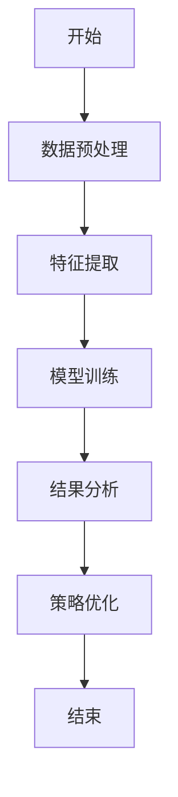
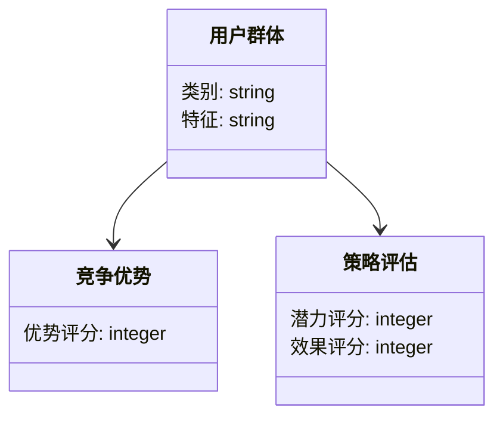
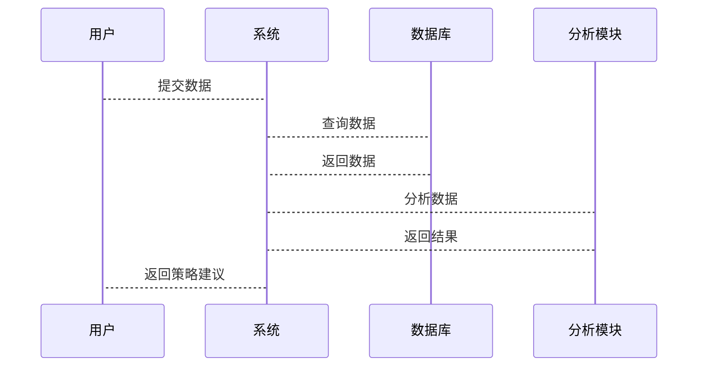

                 


# 彼得林奇如何分析公司的用户细分策略有效性

> 关键词：用户细分策略、彼得·林奇、策略有效性、算法原理、系统设计、项目实战

> 摘要：本文详细探讨了彼得·林奇分析方法在公司用户细分策略有效性评估中的应用，通过背景介绍、核心概念、算法原理、系统设计、项目实战等多方面，深入分析了用户细分策略的实施步骤、数学模型、系统架构及实际案例，最后总结了最佳实践和未来展望。

---

# 第一部分：用户细分策略背景与核心概念

## 第1章：用户细分策略背景介绍

### 1.1 问题背景与描述

用户细分策略是企业增长的重要手段，通过精准定位目标用户群体，优化资源配置，提高转化率和用户满意度。然而，如何科学评估这些策略的有效性，确保其真正推动业务增长，是企业面临的关键问题。彼得·林奇分析方法作为一种经典的投资分析工具，其核心思想为企业分析提供了重要启示。

#### 1.1.1 用户细分策略的定义与目标

用户细分策略是指根据用户特征（如年龄、性别、行为习惯等）将其划分为不同的群体，针对性地制定 marketing 和 sales 战略。其目标是提高用户满意度、增强市场竞争力和实现业务增长。

#### 1.1.2 彼得·林奇分析方法的核心问题

彼得·林奇分析方法关注企业的基本面分析，包括财务状况、市场地位、竞争优势等。在用户细分策略中，需评估每个细分市场的潜力和企业的竞争优势，确保策略的有效性。

#### 1.1.3 用户细分策略的有效性评估标准

评估标准包括用户增长率、市场份额、用户满意度和 ROI（投资回报率）。通过这些指标，可以量化策略的效果。

### 1.2 问题解决与边界

#### 1.2.1 用户细分策略如何解决企业增长问题

通过精准定位用户群体，企业能够优化资源分配，制定更有针对性的 marketing 和 sales 战略，从而提高用户转化率和满意度。

#### 1.2.2 策略实施的边界与外延

用户细分策略的边界包括数据收集范围、用户分类标准和资源分配方式。外延则涉及市场趋势和竞争对手分析。

#### 1.2.3 用户细分策略与其他营销策略的关系

用户细分策略是整体营销策略的一部分，与其他策略（如内容营销、SEO）相辅相成，共同推动业务增长。

## 第2章：用户细分策略的核心概念与联系

### 2.1 核心概念原理

用户细分策略的原理是基于用户特征的分类，制定针对性的营销策略。彼得·林奇分析方法强调基本面分析，用于评估每个细分市场的潜力。

#### 2.1.1 用户细分的定义与分类

用户细分可基于地理、人口统计、心理和行为特征。常见的分类方法包括 RFM 模型（Recency, Frequency, Monetary）。

#### 2.1.2 彼得·林奇分析方法的核心要素

包括财务状况、市场地位、竞争优势和用户反馈。这些要素帮助评估细分市场的潜力和策略的有效性。

### 2.2 核心概念属性对比

通过属性对比表格，明确不同用户群体的特点，为制定策略提供依据。

#### 2.2.1 用户细分策略的属性特征对比表格

| 特征       | 高端用户         | 中端用户         | 低端用户         |
|------------|------------------|------------------|------------------|
| 收入水平     | 高               | 中               | 低               |
| 购买频率     | 高               | 中               | 低               |
| 用户满意度   | 高               | 中               | 低               |

### 2.3 ER实体关系图

通过ER图展示用户、市场和策略之间的关系，帮助理解用户细分策略的结构。

```mermaid
erdiagram
actor 用户群体 {
  类别: string
  特征: string
}
actor 市场潜力 {
  潜力评分: integer
}
actor 竞争优势 {
  优势评分: integer
}
```

---

# 第二部分：用户细分策略的算法原理

## 第3章：用户细分策略的算法原理

### 3.1 算法原理概述

通过机器学习算法对用户数据进行分类，识别不同群体的特征，制定针对性的策略。

#### 3.1.1 算法的输入与输出

输入：用户数据（如年龄、性别、购买记录）；输出：用户分类结果和策略建议。

#### 3.1.2 算法的核心步骤

1. 数据预处理：清洗和特征提取。
2. 模型训练：使用聚类算法（如K-means）进行用户分类。
3. 结果分析：评估分类效果，优化策略。

### 3.2 算法流程图



## 第4章：算法实现与数学模型

### 4.1 算法实现

使用Python实现用户分类算法，代码如下：

```python
from sklearn.cluster import KMeans
import pandas as pd

# 数据预处理
data = pd.read_csv('user_data.csv')
data.dropna(inplace=True)

# 特征提取
features = data[['age', 'income', 'purchase_frequency']]

# 模型训练
model = KMeans(n_clusters=3, random_state=42)
model.fit(features)

# 结果分析
labels = model.labels_
print(labels)
```

### 4.2 数学模型与公式

聚类算法的损失函数为：

$$ J = \sum_{i=1}^{k} \sum_{j=1}^{n_i} (x_j - \mu_i)^2 $$

其中，\( k \) 为类别数，\( n_i \) 为第 \( i \) 类的样本数，\( \mu_i \) 为第 \( i \) 类的中心点。

### 4.3 举例说明

假设我们有三个用户群体，分别对应高端、中端和低端用户。通过算法分类后，可以识别每个群体的特征，制定针对性的营销策略。

---

# 第三部分：用户细分策略的系统分析与架构设计

## 第6章：系统分析与架构设计

### 6.1 问题场景介绍

系统需分析用户数据，评估细分策略的有效性，优化资源配置。

### 6.2 系统功能设计

领域模型类图展示用户、策略和评估之间的关系。



### 6.3 系统架构设计

系统架构展示各模块的交互关系。

```mermaid
archiitecture
    客户端 --> 数据库
    数据库 --> 分析模块
    分析模块 --> 策略模块
    策略模块 --> 输出模块
```

### 6.4 系统接口与交互设计

系统交互序列图展示用户请求处理流程。



---

# 第四部分：用户细分策略的项目实战

## 第7章：项目实战与案例分析

### 7.1 环境安装与配置

安装Python和相关库（如scikit-learn、pandas）。

### 7.2 核心代码实现

实现用户分类和策略评估的代码。

```python
from sklearn.metrics import silhouette_score
import matplotlib.pyplot as plt

# 评估模型效果
print(silhouette_score(features, labels))

# 可视化结果
plt.scatter(features['age'], features['income'], c=labels)
plt.xlabel('年龄')
plt.ylabel('收入')
plt.show()
```

### 7.3 实际案例分析

以某电商公司为例，分析用户数据，分类结果为三个群体，分别制定不同的营销策略，提升用户转化率。

---

# 第五部分：用户细分策略的最佳实践与拓展

## 第9章：最佳实践与注意事项

### 9.1 最佳实践Tips

1. 数据质量：确保数据准确性和完整性。
2. 模型选择：根据业务需求选择合适的算法。
3. 持续优化：定期评估策略效果，及时调整。

### 9.2 小结与展望

用户细分策略是企业增长的关键，彼得·林奇分析方法提供了科学的评估框架。未来，随着AI技术的发展，策略优化将更加精准和高效。

---

作者：AI天才研究院 & 禅与计算机程序设计艺术

