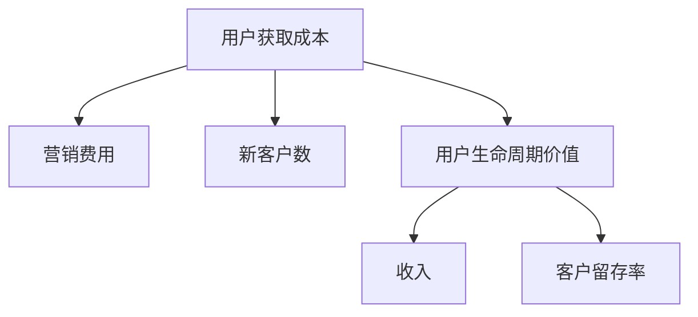
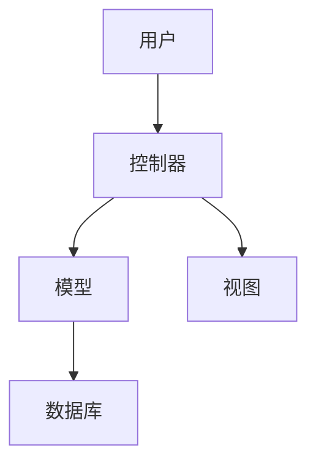

                 


# 彼得林奇如何分析公司的用户获取成本趋势

**关键词**：用户获取成本（CAC）、彼得林奇、投资分析、LTV、营销费用、CAC/LTV比率

**摘要**：本文详细探讨了彼得林奇分析公司用户获取成本（CAC）的趋势方法。从CAC的基本概念到其在投资分析中的应用，再到实际案例的分析，文章系统地介绍了如何通过CAC趋势分析来评估企业的市场策略和投资价值。文章还结合了数学模型和实际操作，为读者提供了全面的指导。

---

# 彼得林奇如何分析公司的用户获取成本趋势

## 第1章: CAC的基本概念与背景分析

### 1.1 CAC的定义与重要性
CAC（Customer Acquisition Cost，用户获取成本）是指企业获取一位新客户的平均成本。它是企业市场活动中的一项重要指标，直接反映了企业的市场推广效率和客户获取能力。CAC的计算公式为：

$$CAC = \frac{\text{营销费用}}{\text{新客户数}}$$

CAC的重要性体现在以下几个方面：
1. **成本控制**：CAC越低，企业的市场推广效率越高。
2. **盈利能力**：CAC与用户生命周期价值（LTV）的比率（CAC/LTV）是衡量企业投资回报率的重要指标。
3. **市场竞争力**：CAC的变化趋势反映了市场竞争状况和企业市场策略的有效性。

### 1.2 彼得林奇的分析方法
彼得林奇作为著名的投资专家，他在分析企业时注重基本面研究，尤其关注企业的市场策略和成本结构。他在分析CAC时，通常会结合以下几个方面：
1. **行业趋势**：分析所在行业的CAC趋势，判断企业是否具备成本优势。
2. **财务数据**：通过企业的财务报表，计算CAC，并与LTV进行对比，评估投资价值。
3. **市场策略**：研究企业的市场推广策略，判断其是否能够持续获取高质量客户。

### 1.3 CAC的趋势分析背景
随着数字经济的发展，用户获取成本呈现上升趋势。特别是在互联网行业，CAC的增加反映了市场竞争的加剧和用户获取难度的增加。彼得林奇认为，分析CAC的趋势可以帮助投资者判断企业的市场策略是否合理，以及企业的长期盈利能力。

---

## 第2章: CAC的核心概念与数学模型

### 2.1 CAC的计算公式与影响因素
CAC的计算公式为：

$$CAC = \frac{\text{营销费用}}{\text{新客户数}}$$

影响CAC的主要因素包括：
1. **营销费用**：包括广告支出、渠道推广费用等。
2. **新客户数**：企业获取的新客户数量。
3. **市场策略**：不同的市场策略会影响营销费用和新客户数。
4. **行业竞争**：行业竞争加剧会推高CAC。

### 2.2 CAC与LTV的关系
用户生命周期价值（LTV）是指客户在其生命周期内为企业带来的总收益。LTV的计算公式为：

$$LTV = \frac{\text{年收入}}{\text{客户留存率}}$$

CAC与LTV的比率（CAC/LTV）是衡量企业投资回报率的重要指标。一般来说，CAC/LTV比率越低，企业的投资回报率越高。

### 2.3 CAC的实体关系图（ER图）
以下是CAC的实体关系图：



---

## 第3章: CAC趋势的分析方法

### 3.1 CAC趋势的预测模型
为了分析CAC的趋势，可以使用回归分析模型。以下是一个简单的线性回归模型：

$$\text{预测CAC} = a \times \text{历史CAC} + b$$

其中，a和b是回归系数，需要通过历史数据进行拟合。

### 3.2 CAC趋势分析的实际案例
以某互联网公司为例，分析其过去三年的CAC趋势：

| 年份 | 营销费用（万元） | 新客户数（人） | CAC（元/人） |
|------|------------------|----------------|--------------|
| 2020 | 100              | 5000           | 20           |
| 2021 | 120              | 4800           | 25           |
| 2022 | 150              | 4500           | 33.33        |

从上表可以看出，尽管营销费用逐年增加，但新客户数却在减少，导致CAC逐年上升。这表明公司的市场推广效率在下降，市场竞争可能加剧。

### 3.3 CAC趋势分析的注意事项
1. **数据准确性**：分析CAC趋势时，需要确保数据的准确性和完整性。
2. **行业对比**：将企业的CAC与行业平均水平进行对比，判断企业的市场地位。
3. **动态调整**：根据市场变化，动态调整市场策略，优化CAC。

---

## 第4章: 系统分析与架构设计

### 4.1 系统功能设计
为了分析CAC趋势，可以构建一个数据分析系统，包括以下几个模块：
1. **数据采集**：收集企业的营销费用和新客户数。
2. **数据处理**：对数据进行清洗和转换。
3. **数据分析**：使用回归分析预测CAC趋势。
4. **数据可视化**：将分析结果以图表形式展示。

### 4.2 系统架构设计
以下是系统的架构图：



### 4.3 系统实现代码
以下是Python代码实现：

```python
import pandas as pd
import numpy as np
from sklearn.linear_model import LinearRegression

# 数据加载
data = pd.DataFrame({
    'Year': [2020, 2021, 2022],
    'MarketingCost': [100, 120, 150],
    'NewCustomers': [5000, 4800, 4500]
})

# 数据处理
X = data[['Year']]
y = data['MarketingCost'] / data['NewCustomers']

# 模型训练
model = LinearRegression()
model.fit(X, y)

# 预测CAC
predicted_CAC = model.predict([[2023]])
print(predicted_CAC)
```

---

## 第5章: 项目实战与最佳实践

### 5.1 项目环境安装
需要安装以下Python库：
```bash
pip install pandas numpy scikit-learn
```

### 5.2 代码实现
以下是完整的代码实现：

```python
import pandas as pd
import numpy as np
from sklearn.linear_model import LinearRegression
import matplotlib.pyplot as plt

# 数据加载
data = pd.DataFrame({
    'Year': [2020, 2021, 2022],
    'MarketingCost': [100, 120, 150],
    'NewCustomers': [5000, 4800, 4500]
})

# 数据处理
X = data[['Year']]
y = data['MarketingCost'] / data['NewCustomers']

# 模型训练
model = LinearRegression()
model.fit(X, y)

# 预测CAC
predicted_CAC = model.predict([[2023]])
print(f"2023年的预测CAC为：{predicted_CAC[0]:.2f}")

# 数据可视化
plt.plot(data['Year'], y, 'b-', label='实际CAC')
plt.plot([2020, 2021, 2022, 2023], [y[0], y[1], y[2], predicted_CAC[0]], 'r-', label='预测CAC')
plt.xlabel('年份')
plt.ylabel('CAC（元/人）')
plt.title('CAC趋势分析')
plt.legend()
plt.show()
```

### 5.3 项目小结
通过以上代码，我们可以清晰地看到企业的CAC趋势，并对未来进行预测。这种分析方法可以帮助投资者更好地理解企业的市场策略和投资价值。

---

## 第6章: 最佳实践与注意事项

### 6.1 小结
- CAC是企业市场活动中的一项重要指标，分析其趋势可以帮助投资者判断企业的市场策略和投资价值。
- 彼得林奇的分析方法注重基本面研究，结合企业的财务数据和市场策略，进行综合判断。

### 6.2 注意事项
- 数据的准确性和完整性是分析的基础。
- 需要结合行业平均水平进行对比分析。
- 动态调整市场策略，优化CAC。

### 6.3 拓展阅读
- 《彼得林奇选股法则》
- 《数据分析实战》

---

# 作者：AI天才研究院/AI Genius Institute & 禅与计算机程序设计艺术 /Zen And The Art of Computer Programming

