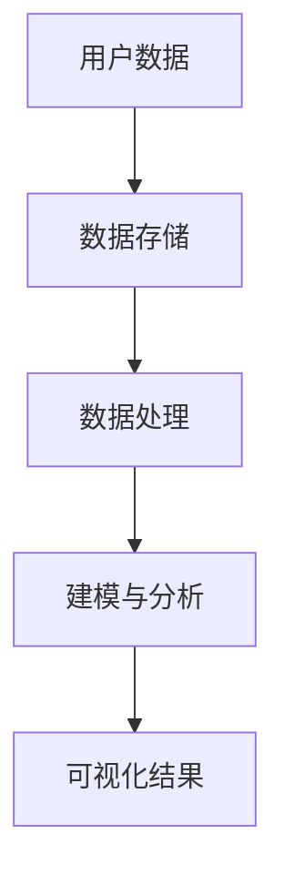

                 


# 彼得林奇如何分析公司的用户获取成本趋势

## 关键词：用户获取成本（CAC）、趋势分析、彼得林奇、投资分析框架、用户增长策略、数据建模、机器学习

## 摘要：  
本文深入探讨了彼得·林奇如何分析公司的用户获取成本（CAC）趋势，结合技术背景与投资分析框架，从用户获取成本的构成、趋势分析方法、行业案例研究、系统设计与实现等方面展开详细论述。通过数据分析与建模，结合彼得林奇的投资哲学，为企业提供用户增长策略的实践指南。

---

# 第一部分：背景与基础

## 第1章：用户获取成本（CAC）的核心概念

### 1.1 用户获取成本（CAC）的定义与构成  
- **用户获取成本（CAC）**是指企业获取一个新用户的总成本，包括营销推广、广告投放、销售团队等费用。  
- **显性成本**：直接用于获取用户的支出，如广告费、推广费、渠道分佣等。  
- **隐性成本**：间接成本，如技术支持、客服成本、研发投入等。  

CAC是衡量企业用户增长效率的关键指标，直接影响企业的盈利能力与估值。

### 1.2 用户获取成本趋势分析的必要性  
- **CAC趋势分析**帮助企业识别用户获取成本的变化规律，优化资源配置。  
- **CAC与企业估值的关系**：低CAC意味着更高的用户获取效率，企业估值可能更高。  
- **常见误区**：仅关注短期CAC，忽视长期趋势；忽略隐性成本的累积效应。  

### 1.3 彼得·林奇的投资分析框架  
- 彼得·林奇是著名投资经理，其分析框架以基本面分析为核心。  
- **CAC分析**：林奇关注用户获取成本的变化趋势，判断企业的市场竞争力与盈利能力。  
- **行业比较**：通过对比同行业企业的CAC，识别是否存在竞争优势。  

---

## 第2章：用户获取成本的构成与建模

### 2.1 用户获取成本的显性与隐性构成  
| 成本类型 | 具体内容 |  
|--------|--------|  
| 显性成本 | 广告费、渠道推广费、销售佣金等 |  
| 隐性成本 | 用户支持成本、技术维护成本等 |  

显性成本直接影响CAC的短期变化，而隐性成本则影响企业的长期盈利能力。

### 2.2 用户获取成本建模  
用户获取成本模型可以通过以下公式表示：  
$$ CAC = \frac{\text{营销支出}}{\text{新增用户数}} $$  

**模型属性对比：**  
| 属性 | 显性CAC | 隐性CAC |  
|------|--------|--------|  
| 计算方式 | 直接计算 | 间接估算 |  
| 影响因素 | 广告支出、推广活动 | 技术支持、客服成本 |  

### 2.3 用户获取成本的动态变化分析  
- **时间序列分析**：通过历史数据识别CAC的周期性与趋势性。  
- **趋势预测**：基于回归分析或机器学习模型预测未来CAC的变化。  

---

## 第3章：用户获取成本趋势分析的核心方法

### 3.1 数据驱动的CAC趋势分析  
- **数据收集**：收集过去3-5年的CAC数据，包括显性和隐性成本。  
- **数据清洗**：去除异常值，填补缺失数据。  
- **数据可视化**：通过折线图或柱状图展示CAC的变化趋势。  

### 3.2 统计学方法在CAC趋势分析中的应用  
- **时间序列分析**：使用ARIMA模型预测未来CAC值。  
- **回归分析**：分析CAC与用户生命周期价值（LTV）的关系。  
- **趋势分析指标**：计算年复合增长率（CAGR）等指标。  

### 3.3 机器学习方法在CAC趋势分析中的应用  
- **算法选择**：随机森林、XGBoost等适合时间序列预测。  
- **模型实现**：训练模型预测未来CAC值，并计算预测误差。  

---

## 第4章：彼得·林奇的用户获取成本分析框架

### 4.1 林奇分析框架的核心要素  
- **企业基本面**：盈利能力、用户留存率、CAC/LTV比率。  
- **行业竞争**：分析行业内企业的CAC水平，判断企业的竞争优势。  
- **用户行为**：通过用户调研与数据分析，识别CAC的驱动因素。  

### 4.2 林奇对CAC趋势的判断  
- 林奇认为，CAC的长期下降趋势表明企业竞争优势明显。  
- 通过对比行业内企业的CAC趋势，识别是否存在成本优势。  

---

## 第5章：系统设计与架构

### 5.1 系统功能设计  
- **数据采集模块**：实时采集用户获取成本数据。  
- **建模与分析模块**：基于机器学习模型预测CAC趋势。  
- **可视化模块**：生成趋势图表，便于用户理解。  

### 5.2 系统架构设计  


### 5.3 系统接口设计  
- **数据接口**：RESTful API，提供CAC数据查询服务。  
- **模型接口**：提供CAC趋势预测的API。  

---

## 第6章：项目实战

### 6.1 环境配置  
- **Python版本**：Python 3.8+  
- **依赖库**：pandas、numpy、scikit-learn、matplotlib  

### 6.2 核心代码实现  
```python
import pandas as pd
from sklearn.ensemble import RandomForestRegressor
from sklearn.metrics import mean_absolute_error

# 数据加载
data = pd.read_csv('cac_trend.csv')

# 特征工程
features = data[['year', 'marketing_cost', 'new_users']]
target = data['cac']

# 模型训练
model = RandomForestRegressor(n_estimators=100)
model.fit(features, target)

# 预测与评估
predictions = model.predict(features)
print(mean_absolute_error(target, predictions))
```

### 6.3 代码解读与分析  
- **数据加载**：读取CAC趋势数据。  
- **特征工程**：提取影响CAC的主要因素。  
- **模型训练**：使用随机森林回归模型预测CAC。  
- **结果评估**：计算预测误差，评估模型性能。  

---

## 第7章：总结与展望

### 7.1 总结  
- 彼得·林奇的分析框架为企业提供了用户获取成本趋势分析的思路。  
- 数据建模与机器学习方法为CAC趋势预测提供了技术支持。  

### 7.2 注意事项  
- 数据质量直接影响分析结果，需谨慎处理数据。  
- 模型预测结果需结合企业实际情况进行调整。  

### 7.3 拓展阅读  
- Peter Lynch, *The Intelligent Investor*  
- 常见的机器学习算法与时间序列分析技术  

---

# 作者  
作者：AI天才研究院 & 禅与计算机程序设计艺术

