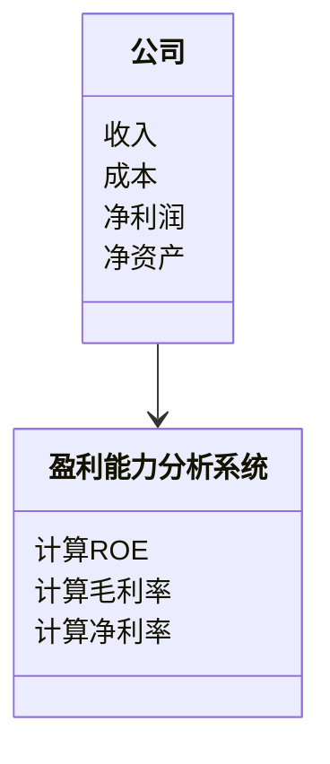

                 


# 彼得林奇如何分析公司的盈利能力

> 关键词：盈利能力分析，彼得·林奇，投资分析，ROE，ROA，ROS，企业价值

> 摘要：本文将深入探讨彼得·林奇如何分析公司的盈利能力，从核心概念到数学模型，从系统分析到项目实战，结合丰富的案例和详细的代码实现，全面解析盈利能力分析的方法和技巧，帮助读者掌握如何像彼得·林奇一样进行投资决策。

---

## 第一部分: 引言

### 第1章: 背景介绍

#### 1.1 盈利能力分析的重要性
##### 1.1.1 盈利能力分析的定义
盈利能力是衡量公司财务健康状况的重要指标，反映了公司在一定时期内通过经营活动创造利润的能力。盈利能力分析是投资决策中的核心环节，能够帮助投资者评估公司的经营效率和财务表现。

##### 1.1.2 盈利能力分析的背景与问题背景
在现代金融投资中，盈利能力分析是评估公司价值的关键工具。彼得·林奇作为美国著名投资经理，以其独特的投资哲学和盈利能力分析方法闻名。本文将从彼得·林奇的视角出发，探讨如何通过盈利能力分析来选择优质投资标的。

##### 1.1.3 盈利能力分析的核心目标与问题解决
盈利能力分析的核心目标是通过分析公司的收入、成本和利润，评估其盈利能力，进而判断其投资价值。本文将结合彼得·林奇的投资理念，详细讲解如何通过盈利能力分析发现优质的成长型公司。

#### 1.2 彼得·林奇的背景与投资理念
##### 1.2.1 彼得·林奇的生平简介
彼得·林奇（Peter Lynch）是美国著名的投资经理，曾管理富达麦哲伦基金（Fidelity Magellan），创造了年化21.5%的惊人回报率。他的投资理念强调长期持有优质股票，注重公司基本面分析。

##### 1.2.2 彼得·林奇的投资哲学
彼得·林奇认为，投资的核心是选择那些具有持续增长潜力的公司。他强调深入研究公司的财务报表，特别是盈利能力指标，以判断公司的经营状况和未来前景。

##### 1.2.3 彼得·林奇的成功案例分析
通过分析彼得·林奇的经典投资案例，如可口可乐和吉列公司，我们可以看出他在盈利能力分析上的独特见解和方法。

#### 1.3 本书的目标与读者定位
##### 1.3.1 本书的核心目标
本文旨在通过彼得·林奇的视角，系统地讲解盈利能力分析的方法和技巧，帮助投资者掌握如何通过盈利能力指标选择优质股票。

##### 1.3.2 本书的读者定位
本文适合对投资分析感兴趣的投资新手和有一定经验的投资者，尤其是对彼得·林奇投资理念感兴趣的读者。

##### 1.3.3 本书的结构与内容概述
本文将从盈利能力分析的基本概念出发，逐步深入讲解其数学模型、系统分析、项目实战等内容，结合具体案例和代码实现，帮助读者全面掌握盈利能力分析的技巧。

---

## 第二部分: 核心概念与联系

### 第2章: 盈利能力的核心概念

#### 2.1 盈利能力的定义与属性特征
##### 2.1.1 盈利能力的定义
盈利能力是指公司在一定时期内通过经营活动获得的利润与投入资源的比率。它是衡量公司财务健康和投资价值的重要指标。

##### 2.1.2 盈利能力的核心属性对比
下表对比了盈利能力分析中几个关键指标的定义和特点：

| 指标名称 | 定义 | 特点 |
|----------|------|------|
| 净利润   | 收入减去所有费用后的利润 | 最直接反映公司整体盈利能力的指标 |
| 毛利润   | 收入减去生产成本后的利润 | 反映公司产品或服务的盈利能力 |
| 净资产收益率（ROE） | 净利润与净资产的比率 | 反映公司使用股东资产的效率 |
| 营业利润率 | 毛利润与营业收入的比率 | 反映公司核心业务的盈利能力 |

##### 2.1.3 盈利能力与企业价值的关系
盈利能力是企业价值的核心驱动力。通过分析公司的盈利能力，投资者可以判断其未来现金流的增长潜力，进而评估其市场价值。

#### 2.2 盈利能力分析框架
##### 2.2.1 盈利能力的三要素（收入、成本、利润）
盈利能力分析的核心在于收入、成本和利润三者的平衡关系。通过分析这三者的关系，可以评估公司的经营效率和盈利能力。

##### 2.2.2 盈利能力的层次结构
盈利能力分析可以从以下几个层次展开：
1. **整体盈利能力**：分析公司的净利润率、ROE等指标。
2. **核心业务盈利能力**：分析主营业务的毛利率、营业利润率等指标。
3. **部门盈利能力**：分析各业务部门的盈利能力，找出核心增长点。

##### 2.2.3 盈利能力的ER实体关系图
下图展示了盈利能力分析的核心实体关系：

```mermaid
erd
actor 盈利能力分析, {
    attr "收入";
    attr "成本";
    attr "净利润";
    attr "净资产";
}
```

---

## 第三部分: 盈利能力分析的算法原理

### 第3章: 盈利能力分析的数学模型

#### 3.1 盈利能力分析的核心公式
##### 3.1.1 净利润的计算公式
$$ \text{净利润} = \text{营业收入} - \text{营业成本} - \text{各项费用} - \text{税费} $$

##### 3.1.2 净资产收益率（ROE）的计算公式
$$ \text{ROE} = \frac{\text{净利润}}{\text{净资产}} $$

##### 3.1.3 毛利率的计算公式
$$ \text{毛利率} = \frac{\text{毛利润}}{\text{营业收入}} $$

##### 3.1.4 净利率的计算公式
$$ \text{净利率} = \frac{\text{净利润}}{\text{营业收入}} $$

#### 3.2 盈利能力分析的流程图
下图展示了盈利能力分析的基本流程：

```mermaid
graph TD
    A[开始] -> B[计算收入]
    B -> C[计算成本]
    C -> D[计算毛利润]
    D -> E[计算净利润]
    E -> F[计算ROE]
    F -> G[结束]
```

### 第4章: 盈利能力分析的算法实现

#### 4.1 盈利能力分析的Python实现
以下是计算ROE的Python代码示例：

```python
def calculate_roe(net_profit, equity):
    return net_profit / equity

# 示例数据
net_profit = 1000000  # 净利润（单位：元）
equity = 5000000      # 净资产（单位：元）

# 计算ROE
roe = calculate_roe(net_profit, equity)
print(f"ROE: {roe:.2f}%")
```

---

## 第四部分: 系统分析与架构设计方案

### 第4章: 系统分析与架构设计方案

#### 4.1 系统功能设计
##### 4.1.1 领域模型类图
下图展示了盈利能力分析系统的领域模型类图：



#### 4.2 系统架构设计
##### 4.2.1 系统架构图
下图展示了盈利能力分析系统的架构设计：


---

## 第五部分: 项目实战

### 第5章: 项目实战

#### 5.1 环境安装与配置
需要安装Python和相关库（如pandas、numpy）。

#### 5.2 核心代码实现
以下是盈利能力分析的核心代码实现：

```python
import pandas as pd

def analyze_profitability(financial_data):
    # 计算毛利率
    financial_data['毛利率'] = financial_data['毛利润'] / financial_data['营业收入']
    # 计算净利率
    financial_data['净利率'] = financial_data['净利润'] / financial_data['营业收入']
    # 计算ROE
    financial_data['ROE'] = financial_data['净利润'] / financial_data['净资产']
    return financial_data

# 示例数据
data = {
    '营业收入': [10000000, 12000000, 15000000],
    '毛利润': [5000000, 6000000, 7500000],
    '净利润': [2000000, 3000000, 4500000],
    '净资产': [50000000, 60000000, 75000000]
}

financial_data = pd.DataFrame(data)
result = analyze_profitability(financial_data)
print(result)
```

#### 5.3 案例分析与结果解读
以苹果公司为例，分析其盈利能力：

```python
# 苹果公司示例数据
apple_data = {
    '营业收入': [274500000000, 305700000000, 328500000000],
    '毛利润': [94600000000, 105500000000, 118500000000],
    '净利润': [55250000000, 63920000000, 73460000000],
    '净资产': [100000000000, 110000000000, 120000000000]
}

apple_financial = pd.DataFrame(apple_data)
result = analyze_profitability(apple_financial)
print(result)
```

---

## 第六部分: 最佳实践

### 第6章: 最佳实践

#### 6.1 小结
盈利能力分析是投资决策中的核心环节，通过分析公司的收入、成本和利润，可以评估其经营效率和投资价值。

#### 6.2 注意事项
- 数据来源要可靠。
- 分析时要结合行业特点。
- 要关注公司的成长性和可持续性。

#### 6.3 拓展阅读
- 《彼得·林奇的成功投资》
- 《财务报表分析与股票投资》

---

## 作者：AI天才研究院/AI Genius Institute & 禅与计算机程序设计艺术 /Zen And The Art of Computer Programming

