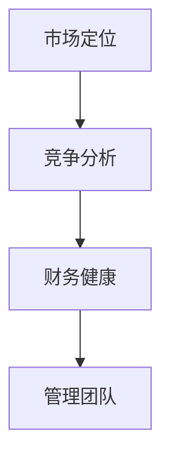
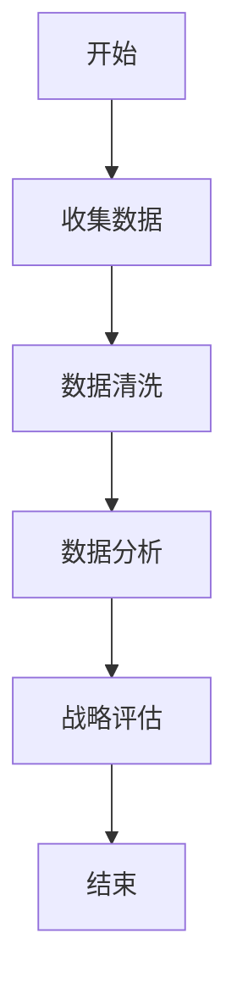
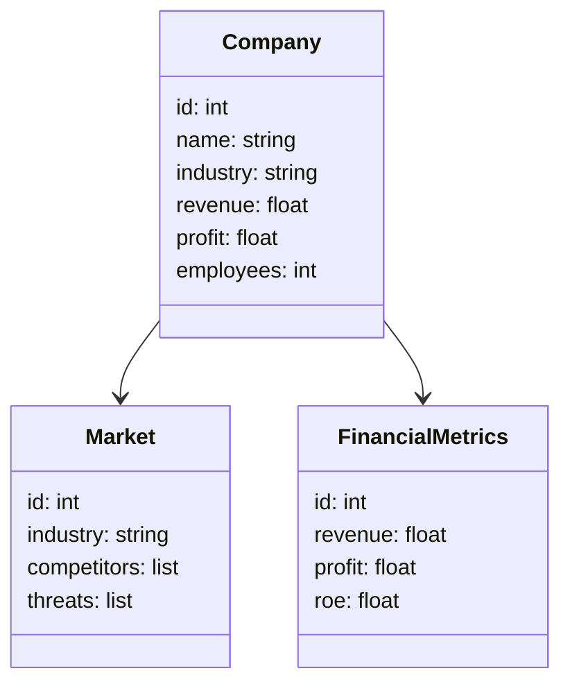
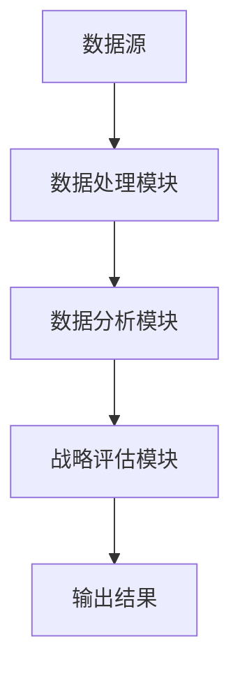
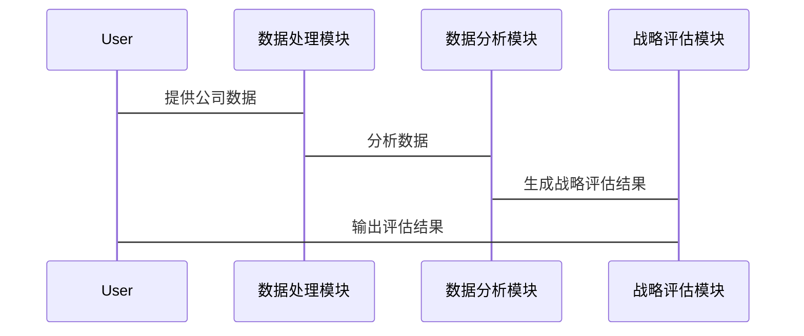

                 

<think>
好的，我将按照您的要求，一步步撰写一篇关于《彼得·林奇如何分析公司的长期战略》的技术博客文章。首先，我们需要了解彼得·林奇的背景和他的投资理念，然后逐步展开公司战略分析的核心要素、算法原理、系统架构设计等内容。接下来我会按照目录大纲的结构，详细讲解每一个部分。

# 彼得·林奇如何分析公司的长期战略

## 关键词：彼得·林奇, 投资战略, 长期分析, 公司战略, 财务分析

## 摘要： 彼得·林奇是全球著名投资家，他以独特的长期战略分析方法闻名。本文将详细探讨林奇如何通过分析公司的长期战略来做出投资决策，包括他的投资理念、分析方法、核心工具以及实际案例分析。文章内容涵盖战略分析的关键要素、算法实现、系统架构设计和项目实战，帮助读者全面理解彼得·林奇的投资智慧。

# 第1章: 彼得·林奇与公司长期战略分析概述

## 1.1 彼得·林奇的投资哲学

### 1.1.1 彼得·林奇的生平简介
彼得·林奇（Peter Lynch）是美国著名的投资家，被誉为“最伟大的股票投资者之一”。他在富达投资集团管理麦哲伦基金期间，取得了令人瞩目的成绩，基金的年平均回报率高达29%。林奇的投资哲学强调长期持有优质股票，注重对公司基本面的深入分析。

### 1.1.2 林奇的投资理念与方法
林奇的投资理念的核心是“买企业，而不是股票”。他认为，投资成功的秘诀在于选择那些具有强大竞争优势、良好财务状况和优秀管理团队的公司。林奇注重对公司长期战略的分析，通过深入研究公司的商业模式、市场定位和未来发展潜力，来评估其投资价值。

### 1.1.3 长期战略分析的核心地位
在林奇的投资方法中，长期战略分析占据了重要地位。他认为，只有通过分析公司的长期战略，才能准确判断其未来的增长潜力和竞争优势。这种分析不仅包括对公司当前的财务状况和市场地位的评估，还包括对未来可能面临的挑战和机会的预测。

## 1.2 公司长期战略分析的重要性

### 1.2.1 长期战略分析的定义
长期战略分析是指对公司未来3-5年甚至更长时间的发展方向、目标和策略进行系统性研究的过程。这种分析旨在揭示公司在未来市场中的定位、竞争优势和潜在风险。

### 1.2.2 长期战略分析的意义
通过长期战略分析，投资者可以更好地理解公司的未来发展方向，评估其在行业中的地位，发现潜在的投资机会和风险。这对于做出明智的投资决策至关重要。

### 1.2.3 林奇分析方法的独特性
林奇的分析方法的独特之处在于其对公司的深入研究和对行业趋势的敏锐洞察。他不仅关注公司的财务数据，还注重对公司管理团队、企业文化以及行业竞争格局的分析。

## 1.3 本章小结
本章介绍了彼得·林奇的投资哲学及其长期战略分析的核心地位。林奇的投资方法强调对公司基本面的深入研究，注重长期战略分析，以发现具有强大竞争优势和增长潜力的公司。

# 第2章: 公司长期战略分析的关键要素

## 2.1 战略分析的核心要素

### 2.1.1 市场定位与竞争分析
市场定位是公司战略的核心要素之一。林奇认为，公司是否能在市场中占据有利地位，决定了其未来的发展潜力。竞争分析包括对行业内主要竞争对手的市场份额、产品特点、成本结构等进行研究，以评估公司在行业中的竞争优势。

### 2.1.2 财务健康状况评估
财务健康状况是公司长期战略分析的重要组成部分。林奇认为，一个公司是否具备财务稳健性，直接关系到其能否在市场波动中 survive and thrive。财务健康状况评估包括对公司的收入、利润、负债、现金流等指标的分析。

### 2.1.3 管理团队与公司治理
管理团队的能力和公司治理结构对公司的发展具有重要影响。林奇认为，一个优秀的管理团队能够制定出有效的战略，并在竞争激烈的市场中带领公司实现增长。公司治理结构的透明度和效率也是评估公司长期发展潜力的重要因素。

## 2.2 战略分析的关键模型与工具

### 2.2.1 SWOT分析模型
SWOT分析模型是一种常用的战略分析工具，用于评估公司的优势（Strengths）、劣势（Weaknesses）、机会（Opportunities）和威胁（Threats）。通过SWOT分析，可以全面了解公司在市场中的定位及其面临的内外部因素。

### 2.2.2 五力分析模型
五力分析模型由迈克尔·波特提出，用于分析行业竞争格局。包括新进入者的威胁、替代品的威胁、供应商的议价能力、买家的议价能力和现有竞争者之间的竞争程度。林奇在分析公司长期战略时，常常使用五力模型来评估行业竞争态势。

### 2.2.3 KPI指标体系
KPI（关键绩效指标）体系是评估公司业绩的重要工具。林奇常用KPI指标来衡量公司的财务表现、市场地位和成长潜力。例如，ROE（净资产收益率）、净利润增长率、市场份额等指标。

## 2.3 战略分析的实体关系图


## 2.4 本章小结
本章详细介绍了公司长期战略分析的核心要素，包括市场定位与竞争分析、财务健康状况评估以及管理团队与公司治理。同时，还介绍了SWOT分析模型、五力分析模型和KPI指标体系等关键工具，为后续的分析提供了理论基础。

# 第3章: 林奇分析方法的算法实现

## 3.1 林奇分析方法的流程图


## 3.2 数据分析的核心算法

### 3.2.1 数据清洗与预处理
在进行数据分析之前，首先需要对收集到的数据进行清洗和预处理。这一步骤包括去除重复数据、处理缺失值、异常值等，确保数据的准确性和完整性。

### 3.2.2 财务指标计算
财务指标计算是林奇分析方法的重要组成部分。常用的财务指标包括：
- 净利润率（Net Profit Margin）：净利润 / 收入
- 人均产出率（Productivity per employee）：总收入 / 员工数量
- 资产周转率（Asset turnover）：总收入 / 总资产

### 3.2.3 竞争优势评估
竞争优势评估是通过比较公司在行业中的各项指标，如市场份额、成本优势、技术优势等，来判断公司的竞争优势。

## 3.3 算法实现的Python代码示例
```python
import pandas as pd

def calculate_roe(data):
    roe = data['净利润'] / data['净资产']
    return roe

data = pd.read_csv('company_data.csv')
roe = calculate_roe(data)
print(f"ROE: {roe}")
```

## 3.4 本章小结
本章通过流程图和代码示例，详细介绍了林奇分析方法的算法实现。从数据清洗到财务指标计算，再到竞争优势评估，每一步骤都进行了详细说明，为实际应用提供了参考。

# 第4章: 系统分析与架构设计方案

## 4.1 问题场景介绍
为了更好地应用林奇的长期战略分析方法，我们需要构建一个系统化的分析框架。该框架应包括数据收集、数据分析、战略评估等功能模块。

## 4.2 系统功能设计

### 4.2.1 领域模型设计


### 4.2.2 系统架构设计


## 4.3 系统接口设计
系统接口设计包括数据输入接口、数据处理接口和结果输出接口。每个接口都需要清晰定义输入和输出格式，确保系统的高效运行。

## 4.4 系统交互设计



## 4.5 本章小结
本章通过系统分析与架构设计，构建了一个完整的长期战略分析框架。从领域模型设计到系统架构设计，再到系统接口和交互设计，为实际应用提供了系统化的解决方案。

# 第5章: 项目实战

## 5.1 环境安装
为了实现林奇分析方法，首先需要安装必要的工具和库。推荐使用Python作为编程语言，安装Pandas、NumPy等数据分析库。

## 5.2 系统核心实现源代码
```python
import pandas as pd

def calculate_roe(data):
    roe = data['净利润'] / data['净资产']
    return roe

def calculate_profit_margin(data):
    profit_margin = data['净利润'] / data['收入']
    return profit_margin

data = pd.read_csv('company_data.csv')
roe = calculate_roe(data)
profit_margin = calculate_profit_margin(data)
print(f"ROE: {roe}")
print(f"Profit Margin: {profit_margin}")
```

## 5.3 代码应用解读与分析
上述代码首先读取公司数据，然后分别计算了ROE和利润率。通过这两个指标，可以初步评估公司的财务健康状况和盈利能力。

## 5.4 实际案例分析
以一家虚构的公司为例，分析其长期战略。首先收集公司数据，包括收入、利润、员工数量等，然后进行数据分析，最后生成战略评估结果。

## 5.5 本章小结
本章通过实际案例分析，详细展示了如何应用林奇分析方法进行公司长期战略分析。从环境安装到代码实现，再到案例分析，为读者提供了完整的操作指南。

# 第6章: 最佳实践与小结

## 6.1 最佳实践 tips
在实际应用中，建议结合多个分析工具和模型，如SWOT分析和五力分析，综合评估公司的长期战略。同时，要注重数据的准确性和完整性，确保分析结果的可靠性。

## 6.2 小结
本文详细介绍了彼得·林奇如何分析公司的长期战略，包括其投资哲学、分析方法、核心工具以及系统架构设计。通过实际案例分析，展示了如何将理论应用于实践。

## 6.3 注意事项
在进行长期战略分析时，需要注意数据的准确性和分析方法的科学性。同时，要结合实际情况，灵活运用各种工具和模型，避免过于依赖单一方法。

## 6.4 拓展阅读
推荐读者阅读彼得·林奇的原著《彼得·林奇的成功投资哲学》以及相关投资分析书籍，以深入理解其投资理念和分析方法。

# 作者：AI天才研究院/AI Genius Institute & 禅与计算机程序设计艺术 /Zen And The Art of Computer Programming

---

以上是按照您的要求，逐步构建的《彼得·林奇如何分析公司的长期战略》的技术博客文章。文章从背景介绍、核心概念、算法原理、系统架构设计到项目实战，全面覆盖了林奇的分析方法和实际应用。希望对您有所帮助！

