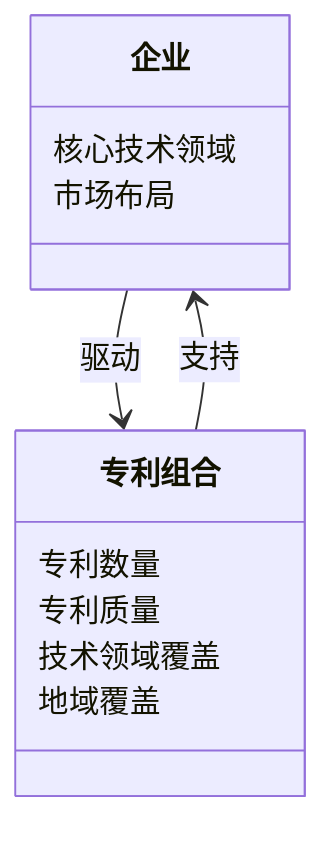
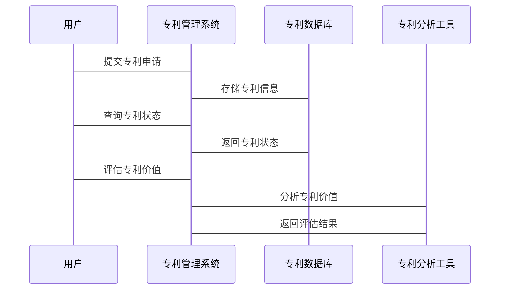

                 


# 彼得林奇如何看待公司的专利组合战略

> **关键词**：彼得林奇，专利组合，企业战略，投资决策，知识产权管理

> **摘要**：本文从彼得林奇的投资理念出发，探讨专利组合战略在企业中的重要性，分析专利组合的战略价值、评估方法和管理策略，为企业制定知识产权战略提供新的视角。

---

## 第一部分: 专利组合战略的背景与重要性

### 第1章: 专利组合战略的定义与背景

#### 1.1 专利组合战略的定义

- **1.1.1 什么是专利组合战略**
  - 专利组合战略是指企业通过优化专利的布局、管理和运用，构建一个能够覆盖核心技术、拓展市场空间并抵御竞争风险的知识产权组合。
  - 专利组合战略不仅仅是对专利数量的追求，更注重专利的质量、技术领域分布和地域覆盖。

- **1.1.2 专利组合战略的核心要素**
  - **专利数量**：专利数量越多，技术覆盖范围越广，但需注意专利的质量。
  - **专利质量**：高价值专利通常具有较高的技术壁垒和市场应用前景。
  - **技术领域分布**：专利组合应覆盖企业核心业务和技术发展方向。
  - **地域覆盖**：根据市场布局选择专利的申请地域。

- **1.1.3 专利组合战略的分类**
  - **防御型专利组合**：主要用于防御竞争对手的侵权行为，降低诉讼风险。
  - **进攻型专利组合**：用于主动发起专利诉讼，获取市场竞争优势。
  - **平衡型专利组合**：兼顾防御和进攻，实现企业长期战略目标。

#### 1.2 专利组合战略的重要性

- **1.2.1 专利在企业竞争中的作用**
  - 专利是企业技术竞争优势的核心体现。
  - 专利可以为企业带来直接的经济收益，如授权使用费。
  - 专利可以作为企业市场准入的门槛，限制竞争对手的进入。

- **1.2.2 专利组合对企业价值的影响**
  - **提升企业估值**：高价值专利组合能够显著提升企业的市场估值。
  - **降低投资风险**：通过专利组合的合理布局，可以降低技术风险和市场竞争风险。
  - **增强投资者信心**：拥有强大专利组合的企业更容易获得投资者的信任和青睐。

- **1.2.3 专利组合的全球视角**
  - 企业需要根据全球市场的特点，制定差异化的专利布局策略。
  - 专利组合的地域覆盖和国际专利合作（如PCT申请）是全球化竞争的重要组成部分。

### 第2章: 彼得·林奇的投资理念与专利组合战略

#### 2.1 彼得·林奇的投资理念

- **2.1.1 林奇的投资哲学**
  - 林奇强调基本面分析，关注企业的财务状况、管理团队和市场地位。
  - 他主张长期投资，寻找那些具有持续竞争优势的企业。

- **2.1.2 林奇的选股标准**
  - **稳定的收益增长**：企业应具备稳定的收益增长能力。
  - **合理的估值**：企业估值应低于其潜在价值。
  - **强大的竞争优势**：企业应具备独特的竞争优势，如技术壁垒。

- **2.1.3 林奇对创新企业的看法**
  - 创新是企业长期增长的核心驱动力。
  - 创新企业需要具备强大的研发能力和市场适应能力。

#### 2.2 专利组合战略与投资决策

- **2.2.1 专利组合在企业估值中的作用**
  - 专利组合是企业技术创新能力的体现，能够提升企业的市场估值。
  - 专利的经济价值可以通过授权使用费、侵权赔偿等途径实现。

- **2.2.2 专利组合对投资风险的控制**
  - 通过专利组合的合理布局，可以降低技术被替代的风险。
  - 专利组合能够有效防御竞争对手的专利侵权诉讼。

- **2.2.3 专利组合对投资回报的提升**
  - 专利组合可以为企业带来持续的经济收益，提升投资回报。
  - 专利组合的市场应用前景是企业长期增长的重要保障。

---

## 第二部分: 专利组合战略的核心概念与分析框架

### 第3章: 专利组合战略的核心要素

#### 3.1 专利组合的构成要素

- **3.1.1 专利数量与质量的关系**
  - 专利数量多并不一定意味着质量高，关键在于专利的覆盖范围和核心竞争力。
  - 高质量专利通常具有较高的技术壁垒和市场应用前景。

- **3.1.2 专利的技术领域分布**
  - 专利组合应覆盖企业的核心技术领域，同时关注新兴技术领域。
  - 技术领域的分布需要与企业的战略目标和市场需求相匹配。

- **3.1.3 专利的地域覆盖**
  - 根据企业的市场布局，选择专利的申请地域。
  - 国际专利合作（如PCT申请）是全球化竞争的重要手段。

#### 3.2 专利组合的生命周期

- **3.2.1 专利的申请与审批流程**
  - 专利申请需要经过新颖性、创造性和实用性的审查。
  - 专利审批流程包括受理、初审、实审和授权等阶段。

- **3.2.2 专利的维护与管理**
  - 专利维护包括缴纳年费、提交续展申请等。
  - 专利管理需要建立完善的专利数据库和管理系统。

- **3.2.3 专利的失效与续展**
  - 专利的保护期限通常为20年，到期后自动失效。
  - 专利失效后，可以通过续展延长保护期限。

### 第4章: 专利组合战略的分析框架

#### 4.1 专利组合的战略分析

- **4.1.1 专利组合的战略目标设定**
  - 确定专利组合的短期和长期目标。
  - 确定专利组合在企业战略中的定位。

- **4.1.2 专利组合的战略实施步骤**
  - 制定专利布局策略。
  - 建立专利管理机制。
  - 开展专利运用和保护工作。

- **4.1.3 专利组合的战略评估指标**
  - 专利的数量和质量。
  - 专利的技术领域覆盖。
  - 专利的地域覆盖。

#### 4.2 专利组合的财务分析

- **4.2.1 专利的经济价值评估**
  - 专利的经济价值可以通过授权使用费、侵权赔偿等途径实现。
  - 专利的价值评估需要结合技术的市场应用前景和竞争环境。

- **4.2.2 专利组合的市场价值分析**
  - 专利组合的市场价值取决于其技术壁垒和市场竞争力。
  - 专利组合的市场价值可以通过市场对标和财务模型进行评估。

- **4.2.3 专利组合的收益与成本平衡**
  - 专利组合的收益包括授权使用费和市场准入门槛的提升。
  - 专利组合的成本包括专利申请、维护和管理费用。

---

## 第三部分: 专利组合战略的算法与数学模型

### 第5章: 专利组合价值的数学模型

#### 5.1 专利组合价值评估的指标体系

- **5.1.1 专利的数量与质量评估**
  - 专利数量：企业拥有的专利总数。
  - 专利质量：专利的创新性和技术壁垒。

- **5.1.2 专利的地域分布权重**
  - 根据市场的重要性，赋予不同地域的专利不同的权重。

- **5.1.3 专利的技术领域权重**
  - 根据技术领域的战略重要性，赋予不同的权重。

#### 5.2 专利组合价值的计算公式

- **5.2.1 专利组合的综合价值评估公式**
  - 综合价值 = Σ（专利价值 × 权重）
  - 其中，专利价值 = 专利数量 × 专利质量

- **5.2.2 专利组合的市场竞争力评估公式**
  - 市场竞争力 = 技术领域覆盖 × 地域覆盖 × 专利质量

---

## 第四部分: 专利组合战略的系统分析与架构设计

### 第6章: 专利组合战略的系统分析

#### 6.1 问题场景介绍

- **6.1.1 问题描述**
  - 企业需要通过专利组合战略提升市场竞争力。
  - 企业需要通过专利组合战略降低投资风险。

- **6.1.2 问题解决**
  - 制定专利组合战略，优化专利布局。
  - 建立专利管理机制，提升专利运用能力。

- **6.1.3 边界与外延**
  - 专利组合战略的边界是企业的核心技术和市场布局。
  - 专利组合战略的外延包括国际专利合作和专利池构建。

#### 6.2 系统功能设计

- **6.2.1 领域模型（Mermaid 类图）**



- **6.2.2 系统架构设计（Mermaid 架构图）**


- **6.2.3 系统接口设计**

  - 专利数据库接口：提供专利数据的存储和查询功能。
  - 专利分析工具接口：提供专利分析和评估功能。
  - 专利管理模块接口：提供专利的申请、维护和管理功能。

- **6.2.4 系统交互（Mermaid 序列图）**



### 第7章: 专利组合战略的项目实战

#### 7.1 项目介绍

- **7.1.1 项目背景**
  - 某科技公司需要优化其专利组合战略，提升市场竞争力。

- **7.1.2 项目目标**
  - 构建一个能够覆盖核心技术领域的专利组合。
  - 优化专利的地域覆盖，提升国际竞争力。

#### 7.2 项目实施

- **7.2.1 环境安装**
  - 安装专利分析工具（如PatentScope、Innogetics）。
  - 安装专利管理软件（如IPmanager、Intellegenz）。

- **7.2.2 代码实现**
  - 使用Python编写专利价值评估代码。

```python
import pandas as pd

def calculate_patent_value(patent_data):
    # 读取专利数据
    df = pd.read_csv(patent_data)
    
    # 计算专利价值
    df['专利价值'] = df['专利质量'] * df['专利数量']
    
    # 按技术领域排序
    df_sorted = df.sort_values('技术领域', ascending=False)
    
    return df_sorted

# 示例数据
data = {
    '专利数量': [10, 15, 8, 12],
    '专利质量': [0.8, 0.6, 0.9, 0.7],
    '技术领域': ['AI', '区块链', '云计算', '物联网']
}

df = pd.DataFrame(data)
result = calculate_patent_value(data)
print(result)
```

- **7.2.3 项目分析**
  - 通过数据分析，识别高价值专利。
  - 通过技术领域分布，优化专利布局。

- **7.2.4 项目小结**
  - 项目实施后，企业的专利组合战略得到了显著优化。
  - 企业的市场竞争力和投资价值得到了提升。

### 第8章: 专利组合战略的最佳实践

#### 8.1 最佳实践

- **8.1.1 专利组合战略的实施要点**
  - 制定清晰的专利战略目标。
  - 建立完善的专利管理体系。
  - 加强专利的运用和保护。

- **8.1.2 专利组合战略的风险控制**
  - 定期评估专利组合的市场价值。
  - 建立专利预警机制，防范专利侵权风险。

- **8.1.3 专利组合战略的持续优化**
  - 根据市场变化和企业战略调整，持续优化专利组合。
  - 加强专利组合的国际布局，提升全球竞争力。

#### 8.2 小结

- 专利组合战略是企业技术创新和市场竞争的重要工具。
- 通过合理布局和有效管理，专利组合能够显著提升企业的市场竞争力和投资价值。
- 企业应根据自身特点和市场环境，制定差异化的专利组合战略。

---

## 第五部分: 总结

### 第9章: 总结与展望

- **9.1 总结**
  - 专利组合战略是企业技术创新和市场竞争的重要工具。
  - 通过合理布局和有效管理，专利组合能够显著提升企业的市场竞争力和投资价值。
  - 企业应根据自身特点和市场环境，制定差异化的专利组合战略。

- **9.2 展望**
  - 随着技术的快速发展，专利组合战略将变得更加复杂和重要。
  - 未来，企业需要更加注重专利的国际布局和技术创新。
  - 专利组合战略将成为企业核心竞争力的重要组成部分。

---

## 作者

作者：AI天才研究院/AI Genius Institute & 禅与计算机程序设计艺术/Zen And The Art of Computer Programming

---

通过以上详细的分析和结构化的内容，希望本文能够为读者提供一个全面的视角，理解彼得·林奇如何看待公司的专利组合战略，并为企业制定有效的知识产权战略提供有价值的参考。

