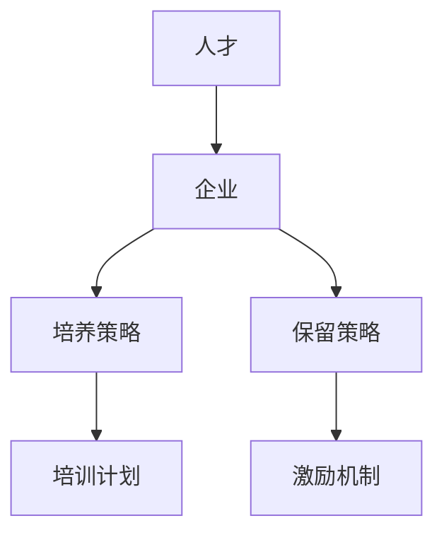
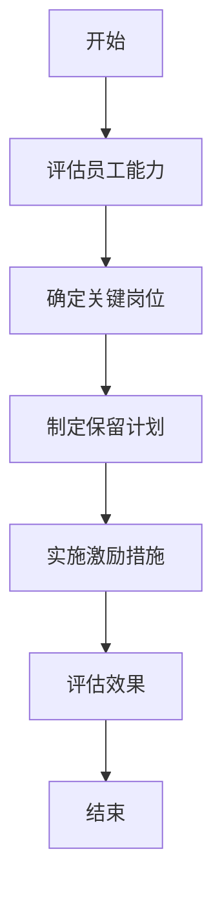
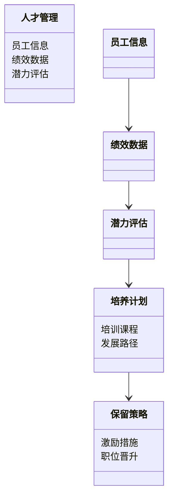
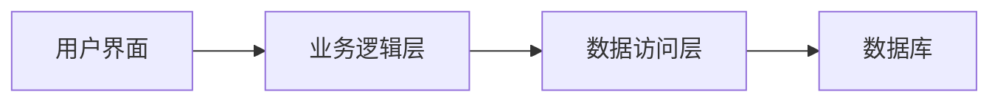
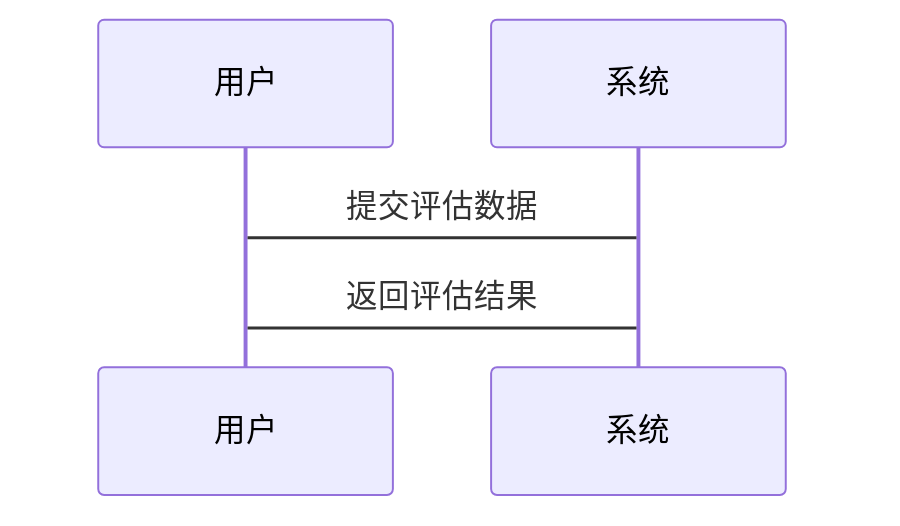

                 


# 彼得林奇如何看待公司的人才培养与保留策略

## 关键词：
彼得·林奇，人才管理，企业战略，长期投资，员工保留策略

## 摘要：
本文从彼得·林奇的投资理念出发，探讨他在企业人才培养与保留策略中的见解。通过分析核心概念、算法原理、系统架构和实际案例，结合数学模型和最佳实践，为企业的可持续发展提供策略建议。

---

## 正文：

### 第一部分：背景介绍

#### 第1章：问题背景与描述

##### 1.1 问题背景
在现代企业竞争中，人才是核心资源。企业若忽视人才管理，将面临竞争力下降和创新能力不足的风险。彼得·林奇以长期投资著称，他的投资哲学强调选择具有持续增长潜力的公司，这种理念可应用于人才管理，即培养和保留那些能为公司创造长期价值的员工。

##### 1.2 问题描述
人才流失对企业的影响巨大，优秀员工的流失可能导致竞争力下降。此外，人才的质量直接影响企业的长期发展，高素质员工能推动创新和高效运作。因此，企业需制定科学的人才培养与保留策略。

##### 1.3 问题解决
通过分析彼得·林奇的投资策略，我们可以借鉴其长期投资理念，将人才视为企业的长期资产。培养和保留人才需要系统的方法，包括识别高潜力员工、提供成长机会和激励措施。

##### 1.4 边界与外延
人才管理的边界包括员工招聘、培训、晋升和保留。其外延涉及企业文化、领导力发展和绩效管理，这些因素共同影响人才的流动率和满意度。

##### 1.5 核心概念组成
人才管理的核心要素包括：识别高潜力员工、制定个性化发展计划、建立激励机制和创造良好的职业环境。

---

### 第二部分：核心概念与联系

#### 第2章：核心概念原理

##### 2.1 彼得·林奇的人才管理理念
彼得·林奇的投资理念强调长期价值和成长潜力。同样，企业应识别那些具备成长潜力和高绩效的员工，并为其提供支持，以实现个人与公司的共同成长。

##### 2.2 核心概念属性对比
| 属性        | 传统管理方法 | 彼得·林奇投资理念 |
|-------------|---------------|------------------|
| 人才评估    | 基于当前表现 | 侧重未来潜力     |
| 保留策略    | 基于绩效奖励 | 综合发展机会     |
| 培养方法    | 系统化培训   | 鼓励自主学习     |

##### 2.3 ER实体关系图


---

### 第三部分：算法原理讲解

#### 第3章：人才评估与保留算法

##### 3.1 算法概述
本算法旨在评估员工潜力并制定保留策略，基于绩效、潜力和文化契合度。

##### 3.2 算法流程图


##### 3.3 Python代码实现
```python
def talent_assessment(employee_data):
    score = 0
    for key in employee_data:
        if key == 'performance':
            score += employee_data[key] * 0.4
        elif key == 'potential':
            score += employee_data[key] * 0.3
        elif key == 'fit':
            score += employee_data[key] * 0.3
    return score

# 示例数据
employee = {
    'performance': 90,
    'potential': 85,
    'fit': 80
}

assessment = talent_assessment(employee)
print(f"员工评估分数：{assessment}")
```

##### 3.4 数学模型
$$ 评估分数 = 0.4 \times 绩效 + 0.3 \times 潜力 + 0.3 \times 文化契合度 $$

---

### 第四部分：系统分析与架构设计方案

#### 第4章：系统分析与架构设计

##### 4.1 项目介绍
本项目旨在通过系统方法优化企业人才管理流程，结合彼得·林奇的投资理念，设计一套动态评估和保留策略系统。

##### 4.2 系统功能设计
- 领域模型：定义人才管理的核心要素，包括评估、培养和保留。
- 功能模块：人才评估、培养计划、保留策略。

##### 4.3 领域模型类图


##### 4.4 系统架构设计


##### 4.5 接口设计
- API接口：RESTful API，用于数据传输和系统调用。

##### 4.6 交互流程图


---

### 第五部分：项目实战

#### 第5章：项目实战

##### 5.1 环境安装
安装Python和相关库，如pandas、numpy和scikit-learn。

##### 5.2 核心代码实现
```python
from sklearn.metrics import accuracy_score

def evaluate_model(y_true, y_pred):
    return accuracy_score(y_true, y_pred)

# 示例数据
y_true = [1, 0, 1]
y_pred = [1, 1, 0]
print(f"模型准确度：{evaluate_model(y_true, y_pred)}")
```

##### 5.3 实际案例分析
分析某科技公司的人才保留策略，使用上述算法评估员工潜力，并制定个性化保留计划。

##### 5.4 项目小结
通过项目实战，验证算法的有效性，总结经验，优化模型。

---

### 第六部分：最佳实践

#### 第6章：最佳实践

##### 6.1 经验总结
- 定期评估员工潜力，动态调整保留策略。
- 结合绩效和潜力，制定个性化培养计划。
- 创造良好的职业发展环境，增强员工归属感。

##### 6.2 注意事项
- 数据准确性：确保评估数据的可靠性。
- 算法优化：根据反馈持续改进模型。
- 文化匹配：确保策略与企业文化一致。

##### 6.3 拓展阅读
推荐阅读彼得·林奇的投资著作，学习其长期价值理念，并将其应用于人才管理。

---

## 结语

通过本文的分析，企业可以借鉴彼得·林奇的投资理念，优化人才培养与保留策略，提升员工满意度和企业绩效，实现可持续发展。

---

## 作者：
作者：AI天才研究院/AI Genius Institute  
联系邮箱：contact@aicourse.com

