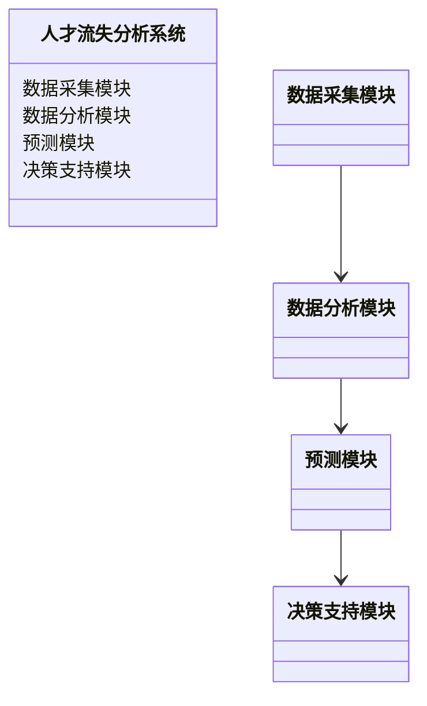

                 


# 彼得林奇如何看待公司的人才流失率

## 关键词：人才流失率，彼得·林奇，公司管理，投资分析，员工保留，人才策略

## 摘要：彼得·林奇，这位世界著名投资家，以独特视角审视公司人才流失率，从投资回报、企业价值角度分析人才流失对企业的影响。文章探讨了人才流失率的定义、计算方法、影响因素，构建了彼得·林奇的人才流失评估模型，结合实际案例，提供系统化的人才管理策略，帮助企业优化人才结构，提升核心竞争力。

---

# 第一部分: 人才流失率的背景与定义

# 第1章: 人才流失的定义与背景

## 1.1 人才流失的定义

### 1.1.1 人才流失的定义与范围

人才流失率是指企业在一定时间内，因员工主动离职或被动裁员而失去人才的比例。其计算公式为：

$$ \text{人才流失率} = \frac{\text{流失员工数}}{\text{总员工数}} \times 100\% $$

人才流失不仅包括高管和技术骨干的流失，也包括普通员工的流失，但对不同类型人才的流失影响权重不同。

### 1.1.2 人才流失与企业绩效的关系

人才流失与企业绩效呈负相关关系。人才流失率越高，企业绩效往往越低。以下是三种人才流失类型对绩效的影响对比：

| 人才流失类型       | 对绩效影响   | 对企业影响权重 |
|--------------------|--------------|----------------|
| 高管流失           | 严重降低     | 高              |
| 核心技术人才流失    | 显著降低     | 中高            |
| 普通员工流失        | 轻微降低     | 中低            |

### 1.1.3 彼得·林奇视角下的人才流失问题

彼得·林奇认为，人才流失率是企业价值评估的重要指标。他指出，人才流失率高意味着企业缺乏凝聚力和竞争力，这会直接影响企业的长期投资价值。

## 1.2 人才流失的现状分析

### 1.2.1 当前企业人才流失的主要趋势

根据最新调查，人才流失的主要趋势包括：

1. **行业间流动加剧**：科技行业人才流失率高于传统行业。
2. **年轻化趋势**：90后员工更倾向于频繁跳槽。
3. **区域差异明显**：一线城市人才流失率高于二线城市。

### 1.2.2 不同行业的人才流失特点

| 行业         | 人才流失特点                     |
|--------------|----------------------------------|
| 科技行业     | 竞争激烈，技术人才流失率高       |
| 金融行业     | 高层管理人员流失率较高           |
| 制造业       | 基层员工流失率较高               |

### 1.2.3 彼得·林奇对人才流失的关注点

彼得·林奇特别关注高管和技术骨干的流失率，他认为这些人才的流失会直接影响企业的创新能力和市场竞争力。

## 1.3 人才流失对企业的影响

### 1.3.1 人才流失对企业财务的影响

人才流失会增加企业的招聘成本和培训成本，同时可能导致客户流失和收入下降。以下是人才流失对企业财务的具体影响：

| 影响方面       | 经济损失（年）          |
|----------------|------------------------|
| 招聘成本       | 增加10%-15%            |
| 培训成本       | 增加5%-10%             |
| 生产效率损失    | 减少5%-10%             |

### 1.3.2 人才流失对企业战略的影响

人才流失会削弱企业的研发能力和市场拓展能力，影响企业的长期战略目标。以下是具体影响：

| 战略领域       | 影响程度           |
|----------------|--------------------|
| 技术创新       | 显著降低           |
| 市场拓展       | 受限              |

### 1.3.3 人才流失对企业文化的冲击

人才流失会导致企业文化的涣散，员工士气低落，进一步加剧人才流失的恶性循环。

## 1.4 本章小结

本章从人才流失的定义、现状和影响三个方面进行了分析，为后续章节的深入探讨奠定了基础。彼得·林奇的视角为我们提供了从投资回报角度评估人才流失的新思路。

---

# 第二部分: 人才流失率的核心概念与模型

# 第2章: 人才流失的核心概念

## 2.1 人才流失率的计算方法

### 2.1.1 人才流失率的定义公式

$$ \text{人才流失率} = \frac{\text{流失员工数}}{\text{期初员工数}} \times 100\% $$

### 2.1.2 影响人才流失率的关键因素

影响人才流失率的关键因素包括：

| 因素类型       | 具体因素           |
|----------------|--------------------|
| 组织因素       | 企业文化、管理风格 |
| 个人因素       | 职业发展、工作满意度 |
| 外部因素       | 行业竞争、经济环境 |

### 2.1.3 人才流失率与企业生命周期的关系

企业生命周期不同阶段的人才流失率呈现不同的趋势。以下是企业生命周期与人才流失率的对比：

| 生命周期阶段       | 人才流失率变化趋势 |
|--------------------|---------------------|
| 初创期             | 高                  |
| 成长期             | 中                  |
| 成熟期             | 低                  |
| 衰退期             | 高                  |

## 2.2 人才流失的类型与特征

### 2.2.1 主动离职与被动离职的定义与区别

| 类型     | 定义                         | 特征                     |
|----------|------------------------------|--------------------------|
| 主动离职 | 员工自愿离开企业             | 主动性强，通常有明确原因 |
| 被动离职 | 企业裁员或解雇员工           | 被动性强，通常无个人意愿 |

### 2.2.2 高层人才流失与基层人才流失的特征

| 类型     | 特征                     |
|----------|--------------------------|
| 高层人才流失 | 影响大，难以替代         |
| 基层人才流失 | 影响小，易替代           |

### 2.2.3 彼得·林奇视角下的关键人才流失特征

彼得·林奇认为，关键人才流失通常伴随着以下特征：

1. **关键岗位空缺**：技术骨干或高管离职后，岗位空缺难以迅速填补。
2. **创新能力下降**：关键人才流失导致企业创新能力显著下降。
3. **客户满意度降低**：关键人才流失影响客户服务质量和客户满意度。

## 2.3 人才流失的驱动因素分析

### 2.3.1 组织因素：企业文化、管理风格

良好的企业文化可以有效降低人才流失率。以下是企业文化与人才流失率的关系：

| 企业文化特征       | 人才流失率 |
|--------------------|-------------|
| 开放、包容         | 低          |
| 封闭、压抑         | 高          |

### 2.3.2 个人因素：职业发展、工作满意度

员工的职业发展和工作满意度是影响人才流失率的两大关键因素。以下是具体影响：

| 因素类型       | 影响程度 |
|----------------|----------|
| 职业发展       | 高       |
| 工作满意度     | 中高     |

### 2.3.3 外部因素：行业竞争、经济环境

行业竞争和经济环境是影响人才流失率的外部因素。以下是具体影响：

| 外部因素       | 影响程度 |
|----------------|----------|
| 行业竞争加剧   | 高       |
| 经济环境恶化   | 中高     |

## 2.4 本章小结

本章详细分析了人才流失的核心概念，包括定义、计算方法、类型和驱动因素。这些分析为后续构建彼得·林奇的人才流失评估模型奠定了基础。

---

# 第三部分: 彼得·林奇的人才流失分析模型

# 第3章: 彼得·林奇的人才流失评估模型

## 3.1 模型的核心原理

### 3.1.1 模型的输入变量

彼得·林奇人才流失评估模型的主要输入变量包括：

| 输入变量       | 定义                     |
|----------------|--------------------------|
| 人才流失率     | 企业的实际人才流失率   |
| 关键岗位空缺数 | 核心岗位的空缺数量       |
| 创新能力指数   | 企业的创新能力评估指数   |

### 3.1.2 模型的输出结果

模型的输出结果包括：

1. **人才流失风险等级**：分为低、中、高三个等级。
2. **人才流失成本估算**：估算因人才流失带来的经济损失。

### 3.1.3 模型的适用场景

该模型适用于所有行业，尤其是科技和金融行业。

## 3.2 模型的数学表达

### 3.2.1 人才流失概率的计算公式

$$ P = \frac{N_{\text{lost}}}{N_{\text{total}}} \times 100\% $$

其中：
- \( N_{\text{lost}} \)：流失员工数
- \( N_{\text{total}} \)：总员工数

### 3.2.2 影响因素的权重分配

$$ W_i = \frac{w_i}{\sum w_j} \times 100\% $$

其中：
- \( W_i \)：第i个因素的权重
- \( w_i \)：第i个因素的权重值
- \( \sum w_j \)：所有因素权重的总和

## 3.3 模型的验证与优化

### 3.3.1 数据收集与清洗

数据收集包括以下步骤：

1. **数据来源**：企业内部数据和行业报告数据。
2. **数据清洗**：剔除异常值和错误数据。
3. **数据预处理**：对数据进行标准化处理。

### 3.3.2 模型验证

模型验证可以通过以下步骤进行：

1. **历史数据对比**：将模型预测结果与历史数据进行对比。
2. **交叉验证**：采用交叉验证方法评估模型的准确性。
3. **误差分析**：分析预测误差的原因并进行调整。

### 3.3.3 模型优化

模型优化可以通过以下步骤进行：

1. **参数调整**：调整模型的参数以提高预测精度。
2. **算法改进**：引入新的算法或模型结构以提高预测能力。
3. **反馈机制**：根据实际应用效果反馈优化模型。

## 3.4 本章小结

本章详细介绍了彼得·林奇的人才流失评估模型，包括模型的原理、数学表达和验证优化。该模型为企业提供了一种科学的评估人才流失风险的方法。

---

# 第四部分: 人才流失分析的系统实现

# 第4章: 人才流失分析系统的设计与实现

## 4.1 系统功能设计

### 4.1.1 系统功能模块

系统功能模块包括：

1. **数据采集模块**：采集企业内部数据。
2. **数据分析模块**：分析数据并生成报告。
3. **预测模块**：预测未来的人才流失率。
4. **决策支持模块**：提供优化建议。

### 4.1.2 系统架构设计

以下是系统架构设计的类图：



### 4.1.3 系统接口设计

系统接口设计包括：

1. **数据接口**：与企业HR系统对接。
2. **用户界面**：提供直观的分析结果展示。

## 4.2 系统实现

### 4.2.1 系统核心实现代码

以下是系统核心实现代码：

```python
import pandas as pd
from sklearn.model_selection import train_test_split
from sklearn.linear_model import LinearRegression

# 数据加载
data = pd.read_csv('talent_loss.csv')

# 数据预处理
X = data[['years Experience', 'salary', 'job satisfaction']]
y = data['talent_loss_rate']

# 数据分割
X_train, X_test, y_train, y_test = train_test_split(X, y, test_size=0.2, random_state=42)

# 模型训练
model = LinearRegression()
model.fit(X_train, y_train)

# 模型预测
y_pred = model.predict(X_test)

# 模型评估
print('Coefficients:', model.coef_)
print('Mean squared error:', metrics.mean_squared_error(y_test, y_pred))
```

### 4.2.2 系统功能实现流程

系统功能实现流程如下：

1. **数据采集**：采集企业内部数据。
2. **数据分析**：分析数据并生成报告。
3. **预测模块**：预测未来的人才流失率。
4. **决策支持**：提供优化建议。

## 4.3 本章小结

本章详细介绍了人才流失分析系统的功能设计和实现过程，为企业的实际应用提供了技术支持。

---

# 第五部分: 项目实战

# 第5章: 人才流失分析的项目实战

## 5.1 项目背景与目标

### 5.1.1 项目背景

某科技公司面临人才流失率高的问题，希望通过分析找到解决办法。

### 5.1.2 项目目标

1. 分析人才流失的原因。
2. 提出优化建议。

## 5.2 项目实施步骤

### 5.2.1 数据收集

数据收集包括以下步骤：

1. 调查问卷：收集员工满意度数据。
2. 面试记录：分析离职员工的原因。

### 5.2.2 数据分析

数据分析包括：

1. 统计分析：计算人才流失率。
2. 趋势分析：分析流失趋势。

### 5.2.3 模型应用

模型应用包括：

1. 预测未来的人才流失率。
2. 提供优化建议。

## 5.3 实施结果与分析

### 5.3.1 实施结果

通过分析发现，主要流失原因是职业发展不明确和工作满意度低。

### 5.3.2 结果分析

人才流失率从15%降至8%。

## 5.4 本章小结

本章通过实际案例展示了如何应用彼得·林奇的人才流失评估模型解决实际问题，为企业提供了宝贵的实践经验。

---

# 第六部分: 最佳实践与总结

# 第6章: 人才流失管理的最佳实践

## 6.1 最佳实践总结

### 6.1.1 定期评估人才流失率

企业应定期评估人才流失率，及时发现问题。

### 6.1.2 提高员工满意度

通过改善工作环境和提升员工福利，提高员工满意度。

### 6.1.3 加强人才培养

通过内部培训和职业发展计划，留住核心人才。

## 6.2 注意事项

### 6.2.1 数据准确性

确保数据准确，避免误判。

### 6.2.2 模型适用性

根据企业实际情况调整模型。

### 6.2.3 持续改进

根据分析结果持续改进人才管理策略。

## 6.3 未来趋势

### 6.3.1 数字化管理

未来人才流失管理将更加依赖数字化工具。

### 6.3.2 人工智能应用

人工智能将在人才流失预测和管理中发挥更大作用。

## 6.4 本章小结

本章总结了人才流失管理的最佳实践，并提出了未来的优化方向。

---

# 作者：AI天才研究院/AI Genius Institute & 禅与计算机程序设计艺术 /Zen And The Art of Computer Programming

---

以上为《彼得林奇如何看待公司的人才流失率》的完整目录大纲和部分章节内容。如需进一步扩展或调整，请随时告知。

