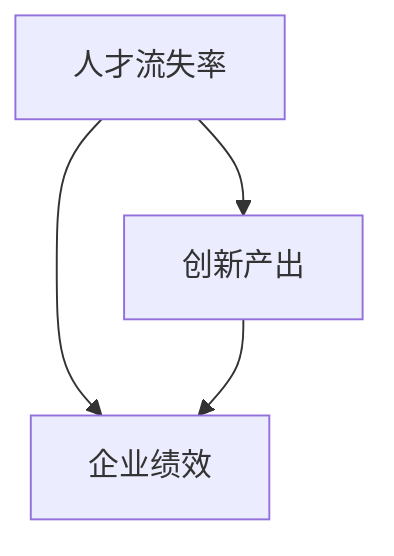
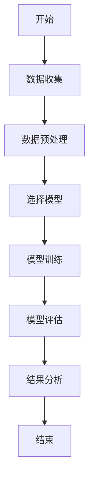
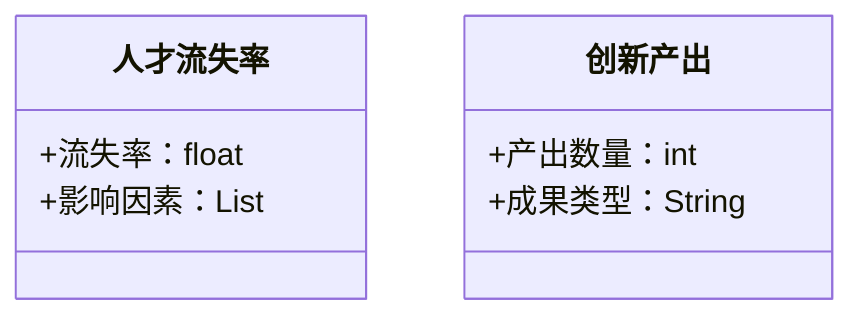
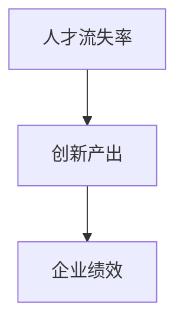

                 


# 彼得林奇如何看待公司的人才流失率与创新产出的关系

## 关键词：人才流失率、创新产出、彼得林奇、企业创新、人才管理

## 摘要：本文从彼得林奇的视角出发，分析人才流失率与创新产出之间的关系。通过定义和对比核心概念，建立数学模型，设计系统架构，并结合实际案例，探讨如何通过优化人才流失率来提升创新产出。

---

## 第一部分：背景介绍

## 第1章：人才流失率与创新产出的关系概述

### 1.1 问题背景

#### 1.1.1 人才流失的定义与影响
人才流失率是指企业在一定时期内员工离职的比例。高人才流失率可能导致企业知识储备减少、团队士气下降，进而影响创新产出。

#### 1.1.2 创新产出的定义与重要性
创新产出是指企业在产品、技术或管理方面的创新成果。创新是企业保持竞争力的关键，而人才是创新的核心驱动力。

#### 1.1.3 人才流失与创新产出的关联性
人才流失率与创新产出之间存在动态关系。高流失率可能导致创新资源不足，而低流失率可能表明企业缺乏活力。

---

### 1.2 问题描述

#### 1.2.1 人才流失对企业创新的潜在影响
人才流失可能导致创新团队不稳定，影响项目的持续推进。

#### 1.2.2 创新产出对企业发展的关键作用
创新是企业差异化竞争的核心，创新能力强的企业更有可能在市场中占据优势。

#### 1.2.3 问题的边界与外延
本文仅讨论人才流失率与创新产出之间的关系，不涉及其他外部因素。

---

### 1.3 问题解决

#### 1.3.1 人才流失与创新产出的关系模型
建立一个动态平衡模型，分析两者之间的相互作用。

#### 1.3.2 彼得林奇的核心观点
彼得林奇认为，适度的人才流失可以激发企业活力，但过高流失率会损害创新产出。

#### 1.3.3 关系的动态平衡与优化
通过优化人才管理，找到人才流失率与创新产出的最佳平衡点。

---

## 第2章：人才流失率与创新产出的核心要素

### 2.1 核心概念与组成

#### 2.1.1 人才流失率的计算与影响因素
人才流失率 = 离职员工数 / 总员工数 × 100%

#### 2.1.2 创新产出的衡量标准与评估方法
创新产出可以通过专利数量、新产品发布频率等指标衡量。

#### 2.1.3 核心要素的相互作用
人才流失率和创新产出相互影响，形成一个动态系统。

---

### 2.2 关系的属性特征对比

#### 2.2.1 人才流失率的特征分析
| 特性 | 描述 |
|------|------|
| 时间性 | 短期流失可能影响创新，长期流失更严重 |
| 可测量性 | 可通过离职率量化 |

#### 2.2.2 创新产出的特征分析
| 特性 | 描述 |
|------|------|
| 累积性 | 累积性 | 长期创新成果积累 |

#### 2.2.3 两者关系的属性对比表
| 属性 | 人才流失率 | 创新产出 |
|------|------------|----------|
| 影响因素 | 员工满意度、薪酬 | 技术投入、团队能力 |

---

### 2.3 ER实体关系图



---

## 第二部分：算法原理与数学模型

## 第3章：人才流失与创新产出的关系模型

### 3.1 算法原理

#### 3.1.1 线性回归模型
线性回归用于分析人才流失率与创新产出之间的线性关系。

#### 3.1.2 相关系数分析
相关系数用于衡量两者之间的相关性。

#### 3.1.3 非线性关系的可能性
可能存在非线性关系，需进一步验证。

---

### 3.2 数学模型与公式

#### 3.2.1 线性回归模型
$$ y = \beta x + \epsilon $$
其中，$y$ 表示创新产出，$x$ 表示人才流失率，$\beta$ 为回归系数，$\epsilon$ 为误差项。

#### 3.2.2 相关系数公式
$$ r = \frac{\sum (x_i - \bar{x})(y_i - \bar{y})}{\sqrt{\sum (x_i - \bar{x})^2 \sum (y_i - \bar{y})^2}} $$

---

### 3.3 算法流程图



---

## 第三部分：系统分析与架构设计

## 第4章：系统分析与架构设计方案

### 4.1 问题场景介绍

#### 4.1.1 项目介绍
设计一个企业人才流失率与创新产出分析系统。

### 4.2 系统功能设计

#### 4.2.1 领域模型


#### 4.2.2 系统架构图


---

## 第四部分：项目实战

## 第5章：项目实战

### 5.1 环境安装

#### 5.1.1 安装Python
```bash
pip install numpy
pip install matplotlib
```

### 5.2 系统核心实现源代码

#### 5.2.1 数据分析代码
```python
import numpy as np
import matplotlib.pyplot as plt

# 示例数据
x = [10, 20, 30, 40, 50]
y = [5, 15, 25, 35, 45]

# 线性回归计算
slope, intercept = np.polyfit(x, y, 1)
line = slope * x + intercept

plt.scatter(x, y)
plt.plot(x, line, 'r')
plt.show()
```

#### 5.2.2 代码解释
该代码计算并绘制了人才流失率与创新产出的线性回归关系图。

### 5.3 实际案例分析

#### 5.3.1 案例分析
以某科技公司为例，分析其人才流失率与创新产出的关系。

---

## 第五部分：最佳实践

## 第6章：最佳实践

### 6.1 小结
通过分析，彼得林奇认为适度的人才流失率有助于创新，但需控制流失率过高的风险。

### 6.2 注意事项
企业在优化人才流失率时，需综合考虑员工满意度和创新需求。

### 6.3 拓展阅读
建议阅读彼得林奇的《彼得·林奇的成功投资》。

---

## 作者：AI天才研究院 & 禅与计算机程序设计艺术

