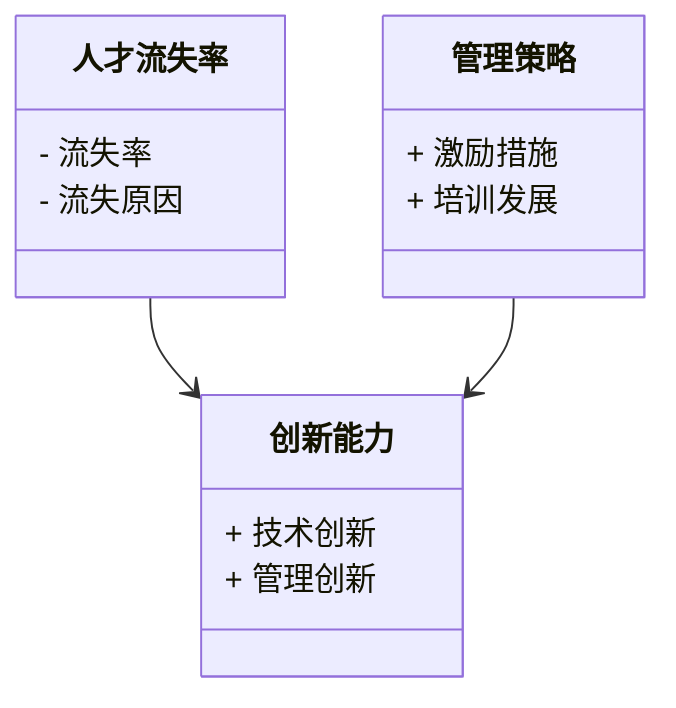
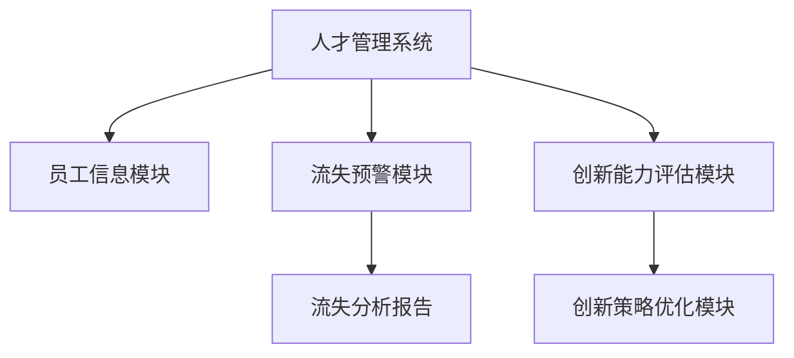
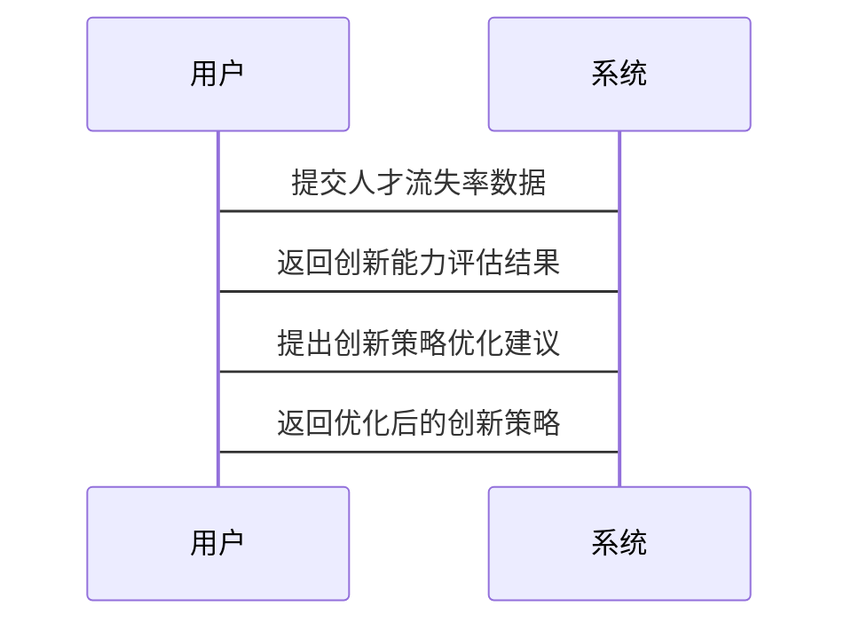

                 


# 彼得·林奇如何看待公司的人才流失率与创新能力的关系

## 关键词
彼得·林奇, 人才流失率, 创新能力, 企业创新, 管理策略

## 摘要
本文将探讨彼得·林奇如何看待公司的人才流失率与创新能力之间的关系。通过分析彼得·林奇的管理哲学和投资理念，揭示人才流失率对企业创新的影响，以及如何通过有效的管理策略来平衡人才流失率与创新能力。文章还结合数学模型和实际案例，深入分析如何通过优化人才管理来提升企业的创新能力。

## 第1章：彼得·林奇的管理哲学与投资理念

### 1.1 彼得·林奇的管理哲学

彼得·林奇是全球著名的职业基金经理人，以其在波士顿基金的卓越表现而闻名。他的管理哲学强调长期投资、价值发现和团队合作。他认为，企业的成功不仅依赖于资本和市场，更依赖于人才和创新。

#### 1.1.1 彼得·林奇的投资哲学
彼得·林奇的投资哲学以“长期投资”为核心，他强调深入研究企业基本面，寻找具有持续增长潜力的企业。他的投资理念注重企业的财务健康、管理团队和市场地位。

#### 1.1.2 彼得·林奇的人才观
林奇认为，人才是企业最重要的资产。他强调团队合作的重要性，认为优秀的人才能够为企业带来创新和竞争优势。他注重员工的职业发展和激励机制，以保持员工的忠诚度和创造力。

#### 1.1.3 彼得·林奇的成功法则
林奇的成功法则包括：长期投资、深入研究、注重基本面和团队合作。他强调企业必须具备持续创新能力，才能在竞争激烈的市场中立于不败之地。

### 1.2 人才流失率的定义与影响

#### 1.2.1 人才流失率的定义
人才流失率是指企业在一定时间内，员工离开企业的比例。人才流失率的高低反映了企业的吸引力和员工的满意度。

#### 1.2.2 人才流失对企业的影响
人才流失对企业的影响是多方面的，包括：
- **创新能力下降**：核心人才的流失可能导致企业在技术创新和产品开发上的停滞。
- **运营成本增加**：频繁的人才更替会增加招聘、培训和管理的成本。
- **员工士气受挫**：人才流失可能影响现有员工的工作积极性和团队凝聚力。

#### 1.2.3 人才流失与企业创新的关系
人才流失与企业创新之间存在密切关系。一方面，人才流失可能导致创新能力下降；另一方面，适度的人才流动也可能带来新的思想和创意，促进企业创新。

## 第2章：创新能力的定义与核心要素

### 2.1 创新能力的定义

#### 2.1.1 创新的概念
创新是指在现有资源和条件下，通过引入新的思想、方法和技术，创造出新的产品、服务或管理模式。创新是企业持续发展的动力源泉。

#### 2.1.2 创新能力的层次
创新能力可以分为以下几个层次：
- **技术创新**：在技术领域进行创新，如新产品开发、技术升级。
- **管理创新**：在管理模式和方法上进行创新，如引入新的管理理念和工具。
- **市场创新**：在市场策略和营销方式上进行创新，如开拓新市场、制定新营销策略。

#### 2.1.3 创新能力与企业发展的关系
创新能力是企业发展的核心驱动力。创新能力越强，企业越能在激烈的市场竞争中占据优势。

### 2.2 人才流失率与创新能力的关系

#### 2.2.1 人才流失对企业创新的负面影响
人才流失可能导致以下创新问题：
- **知识流失**：核心员工的离开可能导致企业知识和经验的流失。
- **创新能力下降**：人才流失可能影响企业在技术创新和产品开发上的能力。
- **创新文化破坏**：频繁的人才流动可能破坏企业的创新文化和团队协作精神。

#### 2.2.2 人才流失对企业创新的潜在影响
尽管人才流失可能对创新产生负面影响，但适度的人才流动也可能带来新的思想和创意，促进企业创新。

#### 2.2.3 人才流失率与创新能力的动态平衡
企业需要在人才流失率和创新能力之间找到动态平衡，既要保持一定的人才流动，又要防止过度流失导致创新能力下降。

## 第3章：彼得·林奇如何看待人才流失率与创新能力的关系

### 3.1 彼得·林奇的核心观点

#### 3.1.1 人才流失率对企业创新的影响
彼得·林奇认为，人才流失率过高会严重影响企业的创新能力。他强调，企业必须重视人才管理，保持核心团队的稳定性。

#### 3.1.2 彼得·林奇对人才流失率的管理策略
林奇提出了以下人才管理策略：
- **吸引和保留优秀人才**：通过提供有竞争力的薪酬、职业发展机会和良好的工作环境，吸引和留住优秀人才。
- **建立激励机制**：通过股权激励、绩效奖金等方式，激励员工为企业创造更多价值。
- **加强团队建设**：通过团队建设活动和内部培训，增强员工的归属感和团队协作精神。

#### 3.1.3 彼得·林奇对创新能力的重视
林奇认为，创新能力是企业核心竞争力的体现。他强调，企业必须注重技术创新和管理创新，才能在竞争中立于不败之地。

### 3.2 彼得·林奇的管理实践

#### 3.2.1 彼得·林奇在波士顿基金的管理经验
在波士顿基金，彼得·林奇通过建立高效的团队合作机制和激励机制，成功打造了一支高素质的投资团队。他注重员工的职业发展和团队协作，保持了团队的稳定性和创新力。

#### 3.2.2 彼得·林奇如何降低人才流失率
彼得·林奇通过以下措施有效降低了人才流失率：
- **提供有竞争力的薪酬**：确保员工的薪酬与市场水平相当，增强员工的满意度和忠诚度。
- **注重员工培训和发展**：为员工提供丰富的培训和职业发展机会，帮助员工实现职业目标。
- **营造良好的工作环境**：通过创造良好的工作氛围和团队文化，增强员工的归属感和幸福感。

#### 3.2.3 彼得·林奇如何提升企业创新能力
彼得·林奇通过以下措施有效提升了企业创新能力：
- **鼓励创新文化**：倡导开放的创新文化，鼓励员工提出新想法和新方案。
- **建立创新机制**：通过设立创新基金、创新项目等方式，支持员工进行创新实践。
- **加强研发投入**：加大对企业技术研发的投入，支持企业在技术创新和产品开发上取得突破。

## 第4章：人才流失率与创新能力的数学模型

### 4.1 人才流失率与创新能力的关系模型

#### 4.1.1 模型构建
我们可以通过以下公式来描述人才流失率与创新能力之间的关系：
$$ C = f(TL, M, E) $$
其中，C代表创新能力，TL代表人才流失率，M代表管理策略，E代表激励措施。

#### 4.1.2 模型假设
- 人才流失率越低，企业的创新能力越强。
- 管理策略和激励措施能够有效降低人才流失率，提升创新能力。

#### 4.1.3 模型验证
通过收集企业的实际数据，验证模型的准确性。例如，可以通过回归分析方法，验证人才流失率与创新能力之间的相关性。

#### 4.1.4 模型优化
根据实际数据和验证结果，优化模型参数，提高模型的预测精度。

### 4.2 人才流失率与创新能力的数学公式

#### 4.2.1 创新能力计算公式
$$ C = a \cdot (1 - TL) + b \cdot M + c \cdot E $$
其中，a、b、c为权重系数，表示人才流失率、管理策略和激励措施对创新能力的影响程度。

#### 4.2.2 人才流失率计算公式
$$ TL = \frac{N_{\text{流出}}}{N_{\text{总}}} \times 100\% $$
其中，N流出为流出的人数，N总为总人数。

#### 4.2.3 激励措施的有效性
$$ E = \frac{\text{激励措施的满意度}}{\text{总员工数}} \times 100\% $$

## 第5章：系统分析与架构设计方案

### 5.1 问题场景介绍

#### 5.1.1 人才流失问题
企业面临人才流失率高的问题，导致创新能力下降，影响企业的竞争力。

#### 5.1.2 创新能力不足
由于人才流失，企业在技术创新和产品开发上进展缓慢，难以满足市场需求。

### 5.2 系统功能设计

#### 5.2.1 领域模型
以下是一个简单的领域模型类图，展示了人才流失率与创新能力的关系：



#### 5.2.2 系统架构设计
以下是一个系统架构设计图，展示了如何通过管理系统优化人才流失率与创新能力的关系：



#### 5.2.3 接口设计
以下是一个简单的接口设计：

```http
POST /api/employee/loss-risk
Content-Type: application/json

{
    "employee_id": 123,
    "department": "研发部",
    "position": "工程师",
    "last_year_loss": 15%
}
```

#### 5.2.4 交互流程
以下是一个系统交互流程图：



## 第6章：项目实战

### 6.1 环境安装

#### 6.1.1 安装Python
安装Python 3.8以上版本，确保环境支持所需的库和工具。

#### 6.1.2 安装相关库
安装以下Python库：
```bash
pip install numpy
pip install pandas
pip install matplotlib
pip install scikit-learn
```

### 6.2 核心代码实现

#### 6.2.1 数据收集与预处理
```python
import pandas as pd
import numpy as np

# 读取数据
data = pd.read_csv('employee.csv')

# 数据清洗
data = data.dropna()
data['流失率'] = data['流失率'].astype(float)
```

#### 6.2.2 模型训练
```python
from sklearn.linear_model import LinearRegression
from sklearn.model_selection import train_test_split

# 数据分割
X = data[['流失率']]
y = data['创新能力']
X_train, X_test, y_train, y_test = train_test_split(X, y, test_size=0.2, random_state=42)

# 训练模型
model = LinearRegression()
model.fit(X_train, y_train)
```

#### 6.2.3 模型评估
```python
from sklearn.metrics import r2_score

# 预测结果
y_pred = model.predict(X_test)

# 评估指标
print('R² score:', r2_score(y_test, y_pred))
```

#### 6.2.4 应用案例分析
```python
# 案例分析
new_data = pd.DataFrame({'流失率': [20]})
prediction = model.predict(new_data)
print('预测创新能力:', prediction[0])
```

### 6.3 项目小结
通过项目实战，我们验证了人才流失率与创新能力之间的关系，并通过数学模型和实际案例分析，展示了如何通过优化人才管理来提升企业的创新能力。

## 第7章：最佳实践与总结

### 7.1 小结
彼得·林奇认为，人才流失率与创新能力之间存在密切关系。企业必须通过有效的管理策略和激励措施，降低人才流失率，提升创新能力。

### 7.2 注意事项
- **数据收集与分析**：企业需要定期收集和分析人才流失率和创新能力相关数据，为管理决策提供依据。
- **员工满意度调查**：通过定期进行员工满意度调查，了解员工的需求和期望，及时调整管理策略。
- **创新文化培养**：企业需要营造开放的创新文化，鼓励员工提出新想法和新方案。

### 7.3 未来趋势
随着市场竞争的加剧，企业对人才流失率和创新能力的管理将越来越重要。未来，企业需要更加注重人才管理和创新管理的结合，通过数字化和智能化手段，优化人才流失率与创新能力的关系。

### 7.4 拓展阅读
建议进一步阅读以下书籍和文章：
- 彼得·林奇的《彼得·林奇的选股术》
- 《创新者的窘境》
- 《人才战争》

## 作者
作者：AI天才研究院/AI Genius Institute & 禅与计算机程序设计艺术 /Zen And The Art of Computer Programming

---

本文通过分析彼得·林奇的管理哲学和投资理念，探讨了人才流失率与创新能力之间的关系。文章结合数学模型和实际案例，深入分析了如何通过优化人才管理来提升企业的创新能力。希望本文能为企业的管理者和人力资源部门提供有价值的参考和启示。

