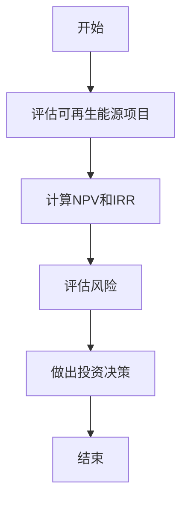
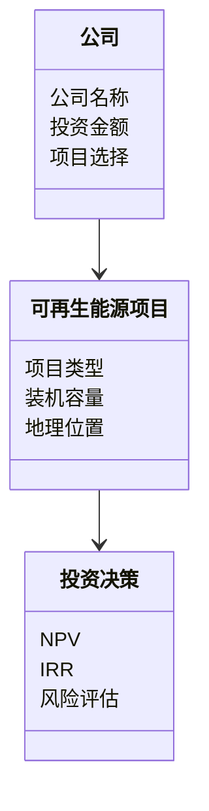
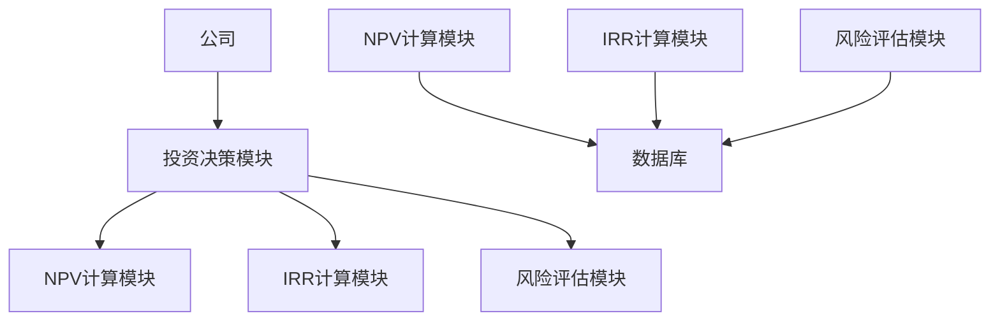
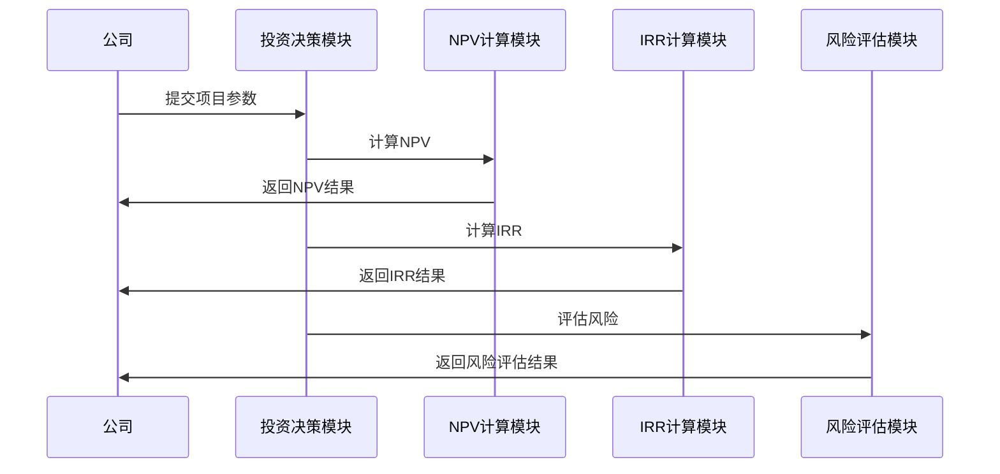

                 


# 彼得林奇如何看待公司的可再生能源转型策略

## 关键词：
彼得林奇, 可再生能源, 能源转型, 投资策略, 碳中和, 可持续发展

## 摘要：
本文深入分析了彼得·林奇作为投资专家，如何看待公司进行可再生能源转型的策略。从投资的角度，探讨了可再生能源转型的背景、核心概念、算法原理、系统架构、项目实战以及最佳实践，为公司制定可再生能源转型策略提供了专业的见解和建议。

---

## 第一部分 背景介绍

### 1.1 可再生能源转型的背景

#### 1.1.1 全球能源趋势
- 全球能源结构正在从化石能源向可再生能源转型，气候变化和环境问题推动了这一趋势。
- 国际政策和法规（如巴黎协定）要求减少碳排放，推动可再生能源的使用。

#### 1.1.2 问题背景
- 传统能源的不可持续性：化石燃料的有限性和环境问题。
- 可再生能源的兴起：技术进步降低了成本，提高了效率。

#### 1.1.3 问题描述
- 如何在公司内部实现可再生能源转型？
- 如何评估转型的成本、风险和收益？
- 如何制定长期的能源战略？

#### 1.1.4 转型的必要性
- 符合全球可持续发展目标。
- 降低成本，提高能源效率。
- 投资可再生能源项目可以获得长期稳定的收益。

### 1.2 可再生能源转型的核心要素
- **技术**：可再生能源技术的创新和应用。
- **经济**：投资回报和成本控制。
- **环境**：减少碳排放，实现可持续发展。

---

## 第二部分 核心概念与联系

### 2.1 可再生能源转型的核心概念

#### 2.1.1 技术维度
- 可再生能源技术：太阳能、风能、生物质能等。
- 技术成熟度和成本分析。

#### 2.1.2 经济维度
- 投资成本：可再生能源项目的初期投资较高。
- 运营成本：可再生能源的维护和运营成本较低。
- 收益：通过可再生能源项目获得长期收益。

#### 2.1.3 环境维度
- 减少碳排放。
- 保护生态系统。

### 2.2 传统能源与可再生能源的对比

| **维度**       | **传统能源**               | **可再生能源**               |
|-----------------|----------------------------|------------------------------|
| 资源可用性       | 有限，不可再生             | 无限，可再生                 |
| 环境影响         | 高，温室气体排放           | 低，几乎无排放               |
| 成本             | 初始成本低，运营成本高     | 初始成本高，运营成本低       |
| 可持续性         | 不可持续                   | 可持续                     |

### 2.3 可再生能源转型的ER实体关系图

```mermaid
er
    %% 可再生能源转型的ER实体关系图
    %% 实体：公司、可再生能源项目、投资、风险
    %% 关系：公司投资可再生能源项目，评估风险。
    entity 公司 {
        关键属性：公司名称、行业、规模
        外键：投资ID
    }

    entity 可再生能源项目 {
        关键属性：项目类型、装机容量、地理位置
        外键：投资ID
    }

    entity 投资 {
        关键属性：投资金额、时间、回报率
        外键：公司ID、项目ID
    }

    entity 风险 {
        关键属性：风险类型、概率、影响
        外键：项目ID
    }

    公司 --> 投资 --> 可再生能源项目 --> 风险
```

---

## 第三部分 算法原理讲解

### 3.1 可再生能源投资策略的算法原理

#### 3.1.1 投资评估模型

- **净现值（Net Present Value，NPV）**：
  $$ NPV = \sum_{t=0}^{n} \frac{CF_t}{(1 + r)^t} $$
  其中，\( CF_t \) 是第 \( t \) 年的现金流，\( r \) 是贴现率。

- **内部收益率（Internal Rate of Return，IRR）**：
  $$ IRR 是使得 NPV = 0 的贴现率。$$

#### 3.1.2 风险评估模型

- **风险矩阵**：
  - 低概率、低影响：接受风险。
  - 低概率、高影响：规避风险。
  - 高概率、低影响：接受风险。
  - 高概率、高影响：规避风险。

#### 3.1.3 投资决策算法



#### 3.1.4 Python实现

```python
def calculate_npv(cash_flows, discount_rate):
    npv = 0
    for t, cf in enumerate(cash_flows):
        npv += cf / (1 + discount_rate) ** t
    return npv

def calculate_irr(cash_flows):
    from scipy.financial import irr
    return irr(cash_flows)

# 示例数据
cash_flows = [-100, 50, 60, 70]
discount_rate = 0.1

npv = calculate_npv(cash_flows, discount_rate)
irr = calculate_irr(cash_flows)

print(f"NPV: {npv}")
print(f"IRR: {irr}")
```

---

## 第四部分 系统分析与架构设计

### 4.1 问题场景介绍

- 公司当前依赖化石燃料，需要转型为可再生能源。
- 需要评估多个可再生能源项目，选择最优投资方案。

### 4.2 系统功能设计

#### 4.2.1 领域模型



#### 4.2.2 系统架构设计



### 4.3 接口设计

- **输入接口**：接收公司投资数据和项目参数。
- **输出接口**：输出NPV、IRR和风险评估结果。

### 4.4 交互序列图



---

## 第五部分 项目实战

### 5.1 实际案例分析

#### 5.1.1 案例背景

- 某公司计划投资一个太阳能项目，预算为100万美元，预期寿命为10年，年现金流分别为-100万、50万、60万、70万。

#### 5.1.2 NPV和IRR计算

使用上述Python代码，计算NPV和IRR。

#### 5.1.3 风险评估

- 风险1：政策变化，概率为中等，影响为高。
- 风险2：技术问题，概率为低，影响为中等。

#### 5.1.4 投资决策

- 根据NPV和IRR结果，判断项目是否可行。
- 根据风险评估结果，制定风险缓解策略。

### 5.2 环境安装

- **安装Python和相关库**：
  - 安装Python 3.x
  - 安装`scipy`和`pandas`库。

### 5.3 核心代码实现

```python
import numpy as np
from scipy.financial import irr

def calculate_npv(cash_flows, discount_rate):
    return np.npv(discount_rate, *cash_flows)

def calculate_irr(cash_flows):
    return np.irr(cash_flows)

# 示例数据
cash_flows = [-1000000, 500000, 600000, 700000]
discount_rate = 0.1

npv = calculate_npv(cash_flows, discount_rate)
irr = calculate_irr(cash_flows)

print(f"NPV: {npv}")
print(f"IRR: {irr}")
```

### 5.4 代码解读与分析

- **NPV计算**：计算可再生能源项目的净现值，判断项目的 profitability。
- **IRR计算**：计算内部收益率，判断项目的吸引力。

### 5.5 项目小结

通过案例分析，展示了如何使用NPV和IRR评估可再生能源项目，并制定投资决策。

---

## 第六部分 总结与展望

### 6.1 最佳实践 tips

- **长期视角**：关注可再生能源的长期投资回报。
- **风险管理**：制定全面的风险评估和缓解策略。
- **技术跟踪**：持续关注可再生能源技术的创新和成本下降。

### 6.2 小结

彼得·林奇认为，可再生能源转型是公司实现可持续发展的重要策略，通过合理的投资评估和风险管理，可以实现长期稳定的收益。

### 6.3 注意事项

- **政策风险**：密切关注相关政策变化。
- **技术风险**：确保技术的可靠性和先进性。
- **财务风险**：合理控制投资成本和回报周期。

### 6.4 拓展阅读

- 书籍：《彼得·林奇的投资之道》。
- 文章：《可再生能源投资的机遇与挑战》。

---

## 作者：AI天才研究院/AI Genius Institute & 禅与计算机程序设计艺术 /Zen And The Art of Computer Programming

