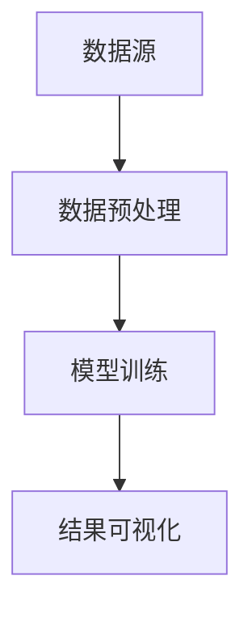

                 


# 彼得林奇如何看待公司的员工满意度

> 关键词：彼得林奇, 员工满意度, 投资者视角, 公司绩效, 员工保留

> 摘要：本文从彼得林奇的投资视角分析员工满意度对公司的价值和影响，探讨如何通过员工满意度预测和提升公司绩效，降低员工流失率，提升整体竞争力。

---

## 第一部分：员工满意度的背景与概述

### 第1章：员工满意度的基本概念

#### 1.1 员工满意度的定义
- **员工满意度**：员工对其工作环境、薪酬福利、职业发展和公司文化等多方面的综合感受和评价。  
  $$\text{员工满意度} = \sum (\text{满意度因子} \times \text{权重})$$

- **重要性**：高满意度员工通常表现出更高的生产力和忠诚度，是公司长期成功的关键因素。

- **彼得林奇的视角**：彼得林奇认为员工满意度是公司价值的重要组成部分，直接影响员工的创造力和公司的长期绩效。

---

### 第2章：彼得林奇的视角

#### 2.1 彼得林奇对员工满意度的重视
- **投资理念**：彼得林奇关注员工满意度，因为满意的员工能为公司创造更多价值，进而提升公司股价。
- **员工满意度与公司价值**：满意度高的员工队伍能降低流动率，减少招聘和培训成本，同时提高产品质量和服务水平。

#### 2.2 员工满意度与公司绩效的关系
- **直接影响**：员工满意度与生产力、创新性和客户满意度密切相关。
- **间接影响**：满意的员工能提升客户满意度，进而增强品牌忠诚度和市场竞争力。

---

## 第二部分：员工满意度的核心概念与理论

### 第3章：员工满意度的核心要素

#### 3.1 影响员工满意度的关键因素
| **因素**       | **权重** | **影响程度** |
|------------------|----------|--------------|
| 薪酬福利         | 0.3      | 高           |
| 工作环境         | 0.25     | 中           |
| 上级关系         | 0.2      | 高           |
| 职业发展         | 0.15     | 高           |
| 工作成就感       | 0.1      | 中           |

---

### 第4章：员工满意度与公司绩效的关系模型

#### 4.1 满意度影响公司绩效的路径分析
1. **员工满意度 → 员工忠诚度**：满意的员工更愿意留在公司，降低流动率。
2. **员工忠诚度 → 生产力提升**：稳定的员工队伍能提高工作效率和质量。
3. **生产力提升 → 客户满意度**：高质量的产品和服务提升客户忠诚度。
4. **客户满意度 → 市场竞争力**：满意的客户更愿意回购，扩大市场份额。

#### 4.2 彼得林奇的满意度模型
$$
\text{公司价值} = f(\text{员工满意度}, \text{创新性}, \text{生产力})
$$

---

## 第三部分：员工满意度的数学模型与算法

### 第5章：员工满意度的量化模型

#### 5.1 基于因子分析的满意度模型
1. **因子分析**：提取影响员工满意度的关键因子（如薪酬、工作环境）。
2. **权重计算**：通过问卷调查和数据分析确定各因子的权重。

#### 5.2 满意度预测模型
$$
\text{满意度} = \beta_1x_1 + \beta_2x_2 + \dots + \beta_nx_n + \epsilon
$$
其中，$x_i$ 是各因子的得分，$\beta_i$ 是回归系数，$\epsilon$ 是误差项。

---

### 第6章：员工满意度的算法实现

#### 6.1 回归分析示例
1. **数据预处理**：收集员工满意度调查数据，标准化处理。
2. **模型训练**：使用线性回归算法，计算各因子的回归系数。
3. **结果解读**：分析各因子对满意度的影响程度。

#### 6.2 代码实现
```python
import pandas as pd
from sklearn.linear_model import LinearRegression
from sklearn.metrics import r2_score

# 数据加载与预处理
data = pd.read_csv('employee_satisfaction.csv')
X = data[['薪酬', '工作环境', '上级关系', '职业发展', '工作成就感']]
y = data['满意度']

# 模型训练
model = LinearRegression()
model.fit(X, y)
coefficients = model.coef_
r2 = r2_score(y, model.predict(X))

# 结果输出
print('回归系数:', coefficients)
print('R²:', r2)
```

---

## 第四部分：系统分析与架构设计

### 第7章：问题场景介绍

#### 7.1 系统功能设计
- **数据收集模块**：通过问卷调查收集员工满意度数据。
- **分析模块**：计算各因子的权重和满意度得分。
- **可视化模块**：生成图表展示结果。

#### 7.2 系统架构设计


---

## 第五部分：项目实战

### 第8章：环境安装与代码实现

#### 8.1 环境安装
1. 安装Python和相关库（Pandas、Scikit-learn）。
2. 下载员工满意度数据集。

#### 8.2 核心代码实现
```python
import pandas as pd
from sklearn.linear_model import LinearRegression
from sklearn.metrics import r2_score

# 数据加载与预处理
data = pd.read_csv('employee_satisfaction.csv')
X = data[['薪酬', '工作环境', '上级关系', '职业发展', '工作成就感']]
y = data['满意度']

# 模型训练
model = LinearRegression()
model.fit(X, y)
coefficients = model.coef_
r2 = r2_score(y, model.predict(X))

# 结果输出
print('回归系数:', coefficients)
print('R²:', r2)
```

---

## 第六部分：最佳实践与总结

### 第9章：最佳实践

#### 9.1 小结
- 员工满意度是公司绩效的重要预测指标。
- 彼得林奇的投资理念提醒我们关注员工满意度的长期影响。

#### 9.2 注意事项
- 数据收集要真实可靠。
- 模型需要定期更新和优化。

#### 9.3 未来趋势
- 结合人工智能和大数据技术，建立更精准的员工满意度预测模型。

#### 9.4 拓展阅读
- 彼得林奇的《彼得林奇选股术》
- 相关学术文献和研究论文。

---

## 作者信息

作者：AI天才研究院/AI Genius Institute & 禅与计算机程序设计艺术/Zen And The Art of Computer Programming

---

**摘要**：本文从彼得林奇的投资视角出发，详细分析了员工满意度对公司的价值和影响，探讨了如何通过数学模型和算法量化员工满意度，并结合实际案例展示了如何利用这些模型提升公司绩效。文章结构清晰，内容详实，结合理论与实践，为投资者和企业管理者提供了有价值的参考。

