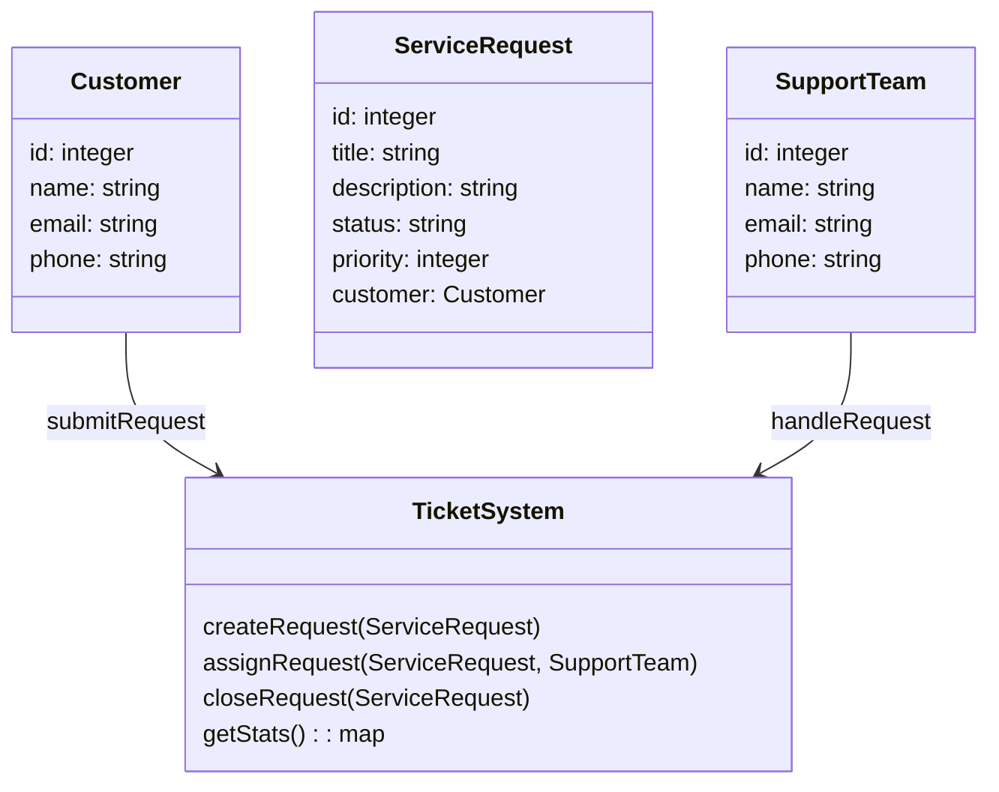
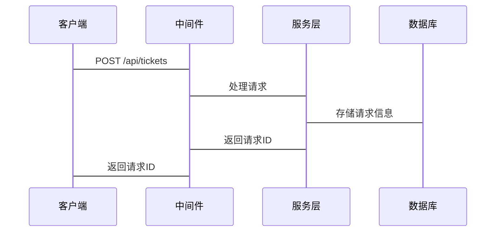
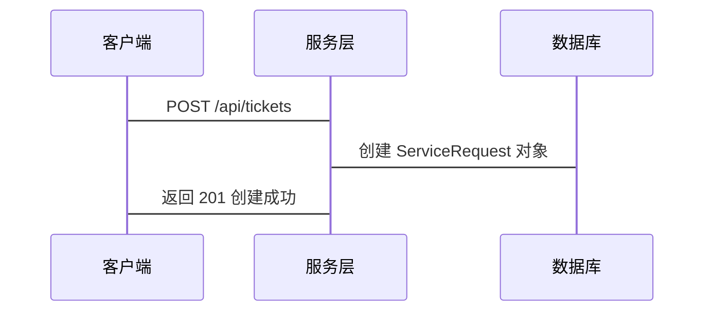

                 


# 彼得林奇如何看待公司的客户服务

> **关键词**：彼得林奇、客户服务、投资分析、客户满意度、公司价值、忠诚客户

> **摘要**：本文从彼得林奇的投资视角出发，分析客户服务在公司价值中的重要性。通过客户服务的核心概念、数学模型、算法原理、系统设计与项目实战的详细讲解，揭示客户服务如何影响客户忠诚度和满意度，进而提升公司市场竞争力和投资价值。文章结合理论与实践，提供客户服务在投资决策中的深度分析和专业见解。

---

## 第一部分：彼得林奇与客户服务的背景介绍

### 第1章：彼得林奇与客户服务概述

#### 1.1 彼得林奇的投资理念

##### 1.1.1 彼得林奇的投资者身份与风格
彼得·林奇是全球著名投资家，以其在富达投资集团管理麦哲伦基金的卓越表现闻名。他主张长期投资，注重基本面分析，尤其是对公司基本面和管理团队的关注。他强调，投资决策不仅基于财务数据，还包括对公司运营、客户关系和市场策略的理解。

##### 1.1.2 客户服务在投资中的重要性
在林奇看来，客户服务是公司运营的重要组成部分，优质的服务能增强客户忠诚度，提升品牌价值，进而影响公司的长期盈利能力。他多次指出，忽视客户服务的公司难以在竞争激烈的市场中生存。

##### 1.1.3 彼得林奇如何看待客户服务的价值
林奇认为，客户服务不仅仅是支持部门的工作，而是公司整体竞争力的体现。优秀的客户服务能够提高客户满意度，降低客户流失率，并通过口碑效应吸引新客户，从而为公司创造持续价值。

#### 1.2 客户服务的核心概念

##### 1.2.1 客户服务的定义与属性
客户服务是指企业通过各种渠道向客户提供支持、咨询和问题解决的过程。其核心属性包括响应速度、解决问题的能力、客户互动的质量以及服务的个性化。

##### 1.2.2 客户服务与公司价值的关系
客户服务直接影响客户满意度和忠诚度，进而影响公司的收入、利润和市场占有率。优质的服务能降低客户获取成本，提高客户保留率，从而提升公司的整体价值。

##### 1.2.3 客户服务的边界与外延
客户服务的边界包括售前咨询、售后服务，以及客户关系管理。其外延涉及技术支持、产品培训、客户反馈收集与分析等，形成一个完整的客户支持体系。

---

### 第2章：客户服务对投资决策的影响

#### 2.1 客户服务与客户忠诚度

##### 2.1.1 客户忠诚度的定义与衡量
客户忠诚度是指客户对品牌或公司的偏好程度，通常通过客户重复购买率、品牌推荐意愿和客户生命周期价值来衡量。

##### 2.1.2 客户服务如何影响忠诚度
优质的服务能增强客户信任，提升客户满意度，从而提高客户忠诚度。林奇认为，忠诚的客户往往是公司最稳定的收入来源。

##### 2.1.3 忠诚客户对公司价值的贡献
忠诚客户通常具有较高的生命周期价值，他们不仅会持续购买，还会通过口碑推荐吸引更多客户，从而降低营销成本，提升品牌影响力。

#### 2.2 客户满意度与公司绩效

##### 2.2.1 客户满意度的衡量指标
客户满意度可以通过客户调查、净推荐值（NPS）和客户反馈分析来衡量。这些指标帮助公司了解客户对服务的总体感受。

##### 2.2.2 客户满意度与公司绩效的关系
研究表明，高客户满意度通常与较高的收入增长率和利润率相关。林奇强调，客户满意度是公司绩效的重要预测指标。

##### 2.2.3 提升客户满意度的方法
通过优化服务流程、培训员工、使用技术工具提升响应速度，以及定期收集和分析客户反馈，公司可以有效提升客户满意度。

#### 2.3 客户服务与公司竞争力

##### 2.3.1 客户服务对品牌价值的影响
优质的服务能提升品牌声誉，增强客户对公司的好感，从而在竞争中占据优势。

##### 2.3.2 客户服务与市场竞争力的关系
在同质化严重的市场中，客户服务成为区分竞争对手的关键因素。林奇认为，卓越的服务是公司差异化战略的重要组成部分。

---

### 第3章：客户服务的多维度分析

#### 3.1 客户服务的分类与特征

##### 3.1.1 售前、售中、售后客户服务的分类
- **售前服务**：包括咨询、产品推荐和定制化方案设计。
- **售中服务**：包括订单处理、产品交付和客户培训。
- **售后服务**：包括技术支持、客户关怀和反馈收集。

##### 3.1.2 不同类型客户服务的特征对比
| 类型   | 特征                          |
|--------|--------------------------------|
| 售前   | 主动性高，注重客户需求挖掘    |
| 售中   | 注重效率，确保交易顺利完成    |
| 售后   | 问题导向，注重客户满意度      |

##### 3.1.3 客户服务的核心要素组成
- 人员素质：专业技能和客户服务意识。
- 服务流程：标准化流程和个性化解决方案。
- 技术支持：在线聊天、电话支持和自助服务。

#### 3.2 客户服务与公司竞争力

##### 3.2.1 客户服务对品牌价值的影响
优质的服务能提升品牌忠诚度和客户信任，从而增强品牌竞争力。

##### 3.2.2 客户服务与市场竞争力的关系
在同质化市场中，客户服务成为区分竞争对手的关键因素。林奇认为，卓越的服务是公司差异化战略的重要组成部分。

---

## 第二部分：客户服务的数学模型与算法原理

### 第4章：客户服务的数学模型

#### 4.1 客户满意度的数学模型

##### 4.1.1 客户满意度指数（CSI）公式
$$ CSI = \frac{\text{满意客户数}}{\text{总客户数}} \times 100\% $$

##### 4.1.2 净推荐值（NPS）公式
$$ NPS = \text{推荐者比例} - \text{贬损者比例} $$

#### 4.2 客户忠诚度的预测模型

##### 4.2.1 基于线性回归的忠诚度预测
$$ L = a \times S + b $$
其中，$L$ 是忠诚度，$S$ 是满意度，$a$ 和 $b$ 是回归系数。

#### 4.3 客户流失预测的算法

##### 4.3.1 基于逻辑回归的流失预测
$$ P(\text{流失}) = \frac{1}{1 + e^{- (aX + b)}} $$

---

### 第5章：客户服务的算法原理

#### 5.1 客户服务分类算法

##### 5.1.1 基于决策树的客户服务分类
使用决策树算法对客户进行分类，例如ID3或C4.5算法。

##### 5.1.2 支持向量机（SVM）在客户分类中的应用
通过SVM算法对客户进行分类，提高分类准确率。

##### 5.1.3 随机森林在客户群体分析中的应用
通过随机森林算法进行客户群体分析，识别关键客户特征。

#### 5.2 客户反馈分析的自然语言处理

##### 5.2.1 基于词袋模型的客户反馈分析
使用词袋模型对客户反馈进行情感分析，识别客户主要关切点。

##### 5.2.2 基于深度学习的客户情感分析
使用LSTM或BERT模型进行客户情感分析，提取深层次客户反馈信息。

##### 5.2.3 预训练语言模型的应用
利用预训练语言模型（如GPT）进行客户反馈的自动分类和总结。

---

## 第三部分：系统分析与架构设计

### 第6章：客户服务的系统分析与架构设计

#### 6.1 问题场景介绍
假设我们是一家提供SaaS产品的公司，需要设计一个高效的客户服务系统。

#### 6.2 系统功能设计

##### 6.2.1 领域模型（Mermaid 类图）


#### 6.3 系统架构设计

##### 6.3.1 系统架构图（Mermaid 架构图）
```mermaid
archi
    客户端 --> 中间件：API 请求
    中间件 --> 数据库：查询/存储数据
    中间件 --> 服务层：业务逻辑处理
    服务层 --> 数据库：数据操作
    中间件 --> 监控系统：日志记录和监控
```

#### 6.4 系统接口设计

##### 6.4.1 接口描述
- **API 接口**：
  - `POST /api/tickets`: 提交服务请求。
  - `GET /api/tickets/{id}`: 查询单个请求的状态。
  - `PUT /api/tickets/{id}`: 更新请求状态。

#### 6.5 系统交互设计

##### 6.5.1 交互流程图（Mermaid 序列图）


---

## 第四部分：项目实战

### 第7章：客户服务项目的实战分析

#### 7.1 环境安装

##### 7.1.1 安装开发环境
- 安装Python和Django框架。
- 安装Django REST Framework和Django Channels。

##### 7.1.2 安装依赖包
```bash
pip install django djangorestframework channels
```

#### 7.2 核心实现源代码

##### 7.2.1 服务请求模型
```python
from django.db import models

class ServiceRequest(models.Model):
    PRIORITY_CHOICES = [
        ('低', 'Low'),
        ('中', 'Medium'),
        ('高', 'High'),
    ]
    STATUS_CHOICES = [
        ('新', 'New'),
        ('处理中', 'In Progress'),
        ('已解决', 'Resolved'),
    ]
    title = models.CharField(max_length=200)
    description = models.TextField()
    priority = models.CharField(max_length=20, choices=PRIORITY_CHOICES)
    status = models.CharField(max_length=20, choices=STATUS_CHOICES)
    customer = models.ForeignKey('auth.User', on_delete=models.CASCADE)
    created_at = models.DateTimeField(auto_now_add=True)
```

##### 7.2.2 服务请求视图
```python
from rest_framework.views import APIView
from rest_framework.response import Response
from .models import ServiceRequest
from .serializers import ServiceRequestSerializer

class ServiceRequestView(APIView):
    def post(self, request):
        serializer = ServiceRequestSerializer(data=request.data)
        if serializer.is_valid():
            serializer.save(customer=request.user)
            return Response(serializer.data, status=201)
        return Response(serializer.errors, status=400)
```

##### 7.2.3 服务请求序列图（Mermaid 序列图）


#### 7.3 代码应用解读与分析

##### 7.3.1 代码功能分析
- 模型定义了服务请求的基本属性，包括优先级和状态。
- 视图处理POST请求，创建新的服务请求记录。

##### 7.3.2 代码优化建议
- 使用Django Channels处理异步请求，提升系统响应速度。
- 集成Celery进行任务处理，优化服务请求的处理流程。

#### 7.4 实际案例分析

##### 7.4.1 案例背景
某SaaS公司通过优化客户服务系统，客户满意度从85%提升到95%，客户流失率降低15%。

##### 7.4.2 分析与小结
通过系统化的客户服务流程优化，公司不仅提升了客户满意度，还显著降低了客户流失率，增强了市场竞争力。

---

## 第五部分：最佳实践与总结

### 第8章：最佳实践与总结

#### 8.1 最佳实践 tips
- 定期收集和分析客户反馈，持续优化服务流程。
- 培训客户服务人员，提升他们的专业技能和服务意识。
- 利用技术工具提升客户服务效率，如智能客服机器人和自动化工单系统。

#### 8.2 小结
通过彼得林奇的视角，我们深入分析了客户服务在公司价值中的重要性。优质的服务不仅能提升客户忠诚度和满意度，还能增强公司的市场竞争力和投资价值。

#### 8.3 注意事项
- 客户服务是长期积累的过程，需要持续投入和优化。
- 在技术实现上，要注意系统的可扩展性和可维护性。

#### 8.4 拓展阅读
- 《客户服务管理》
- 《彼得林奇的投资哲学》
- 《客户关系管理》

---

**作者：AI天才研究院/AI Genius Institute & 禅与计算机程序设计艺术/Zen And The Art of Computer Programming**

