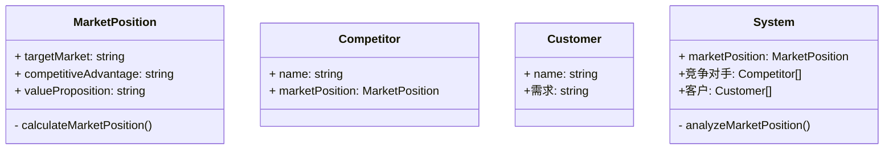
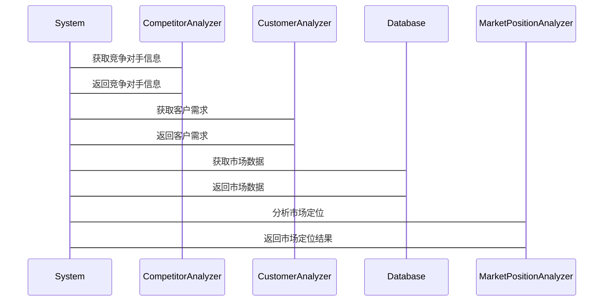

                 


# 彼得林奇如何看待公司的市场定位

## 关键词：
彼得林奇，市场定位，投资分析，企业战略，竞争优势，价值主张

## 摘要：
本文从彼得·林奇的投资视角，详细分析公司市场定位的核心概念、评估方法和实际应用。通过背景介绍、核心要素分析、策略探讨、行业案例以及系统架构设计，深入解读市场定位对企业战略和投资决策的影响。结合算法原理和项目实战，提供实用的市场定位分析框架和实践建议。

---

# 第1章: 市场定位的核心概念与背景

## 1.1 市场定位的基本概念

### 1.1.1 市场定位的定义与内涵
市场定位是指企业将其产品或服务定位在目标市场中的特定位置，通过独特的价值主张满足客户需求。彼得·林奇认为，市场定位是企业成功的关键，它决定了企业的竞争优势和盈利能力。

$$市场定位 = 目标市场 + 竞争优势 + 价值主张$$

### 1.1.2 市场定位的重要性
市场定位直接影响企业的市场份额、品牌价值和投资吸引力。林奇强调，正确的市场定位能够帮助企业识别核心竞争优势，避免竞争红海，从而实现可持续增长。

### 1.1.3 彼得·林奇对市场定位的重视
林奇在投资分析中，始终关注企业的市场定位。他认为，市场定位不仅决定了企业的盈利能力，还影响投资者的决策。以下是林奇对市场定位的几个关键观点：

1. **专注核心市场**：企业应专注于特定的目标市场，避免过于分散。
2. **竞争优势明显**：市场定位必须突出企业的独特优势。
3. **动态调整**：市场定位需要根据市场变化进行调整。

## 1.2 彼得·林奇的市场定位分析方法

### 1.2.1 彼得·林奇的投资理念概述
林奇的投资理念基于基本面分析，他强调长期投资和价值发现。他认为，市场定位是企业基本面分析的重要组成部分，能够帮助投资者识别具有持续竞争优势的企业。

### 1.2.2 市场定位在投资分析中的地位
市场定位分析是林奇投资策略的核心步骤之一。他认为，企业的市场定位决定了其盈利能力、成长潜力和抗风险能力。

### 1.2.3 林奇的市场定位评价标准
林奇提出了几个市场定位评价标准：

1. **目标市场的吸引力**：市场是否具有增长潜力。
2. **竞争优势的可持续性**：企业是否能够在竞争中保持优势。
3. **价值主张的清晰度**：企业的价值主张是否能够吸引目标客户。

## 1.3 市场定位与企业战略的关系

### 1.3.1 市场定位对企业战略的影响
市场定位是企业战略的核心。正确的市场定位能够指导企业的资源分配、产品开发和营销策略。

### 1.3.2 企业战略与市场定位的互动关系
企业战略和市场定位是相互影响的。战略决策会影响市场定位，而市场定位又会影响战略实施。

### 1.3.3 彼得·林奇视角下的企业定位案例
林奇通过分析多个企业的市场定位，提出了许多经典案例。例如，他分析过可口可乐和百事可乐的市场定位策略，认为可口可乐的市场定位更加清晰，竞争优势更加明显。

---

# 第2章: 市场定位的核心要素分析

## 2.1 目标市场的选择

### 2.1.1 目标市场的定义与分类
目标市场是指企业选择特定的客户群体作为主要服务对象。目标市场的选择直接影响企业的市场定位和竞争优势。

### 2.1.2 彼得·林奇如何筛选目标市场
林奇在筛选目标市场时，通常关注以下几点：

1. **市场规模**：市场是否足够大，能够支持企业的长期发展。
2. **竞争状况**：市场是否存在过度竞争，企业是否能够脱颖而出。
3. **客户需求**：目标客户的需求是否清晰，是否能够通过企业的价值主张得到有效满足。

### 2.1.3 目标市场选择的误区与注意事项
企业在选择目标市场时，常常会陷入以下误区：

1. **过于分散**：试图满足所有客户的需求，导致资源浪费。
2. **忽视竞争对手**：没有充分分析竞争对手的市场定位。
3. **忽视客户需求**：没有深入理解目标客户的真正需求。

## 2.2 竞争优势的识别

### 2.2.1 竞争优势的定义与类型
竞争优势是指企业在特定市场中相对于竞争对手的独特优势。竞争优势可以分为成本优势、质量优势、品牌优势等。

### 2.2.2 彼得·林奇如何分析企业的竞争优势
林奇在分析企业的竞争优势时，通常关注以下几个方面：

1. **成本控制**：企业的生产成本是否低于竞争对手。
2. **产品质量**：产品是否具有独特的功能或更高的质量。
3. **品牌影响力**：企业品牌是否具有强大的市场影响力。

### 2.2.3 竞争优势的动态变化
竞争优势并非一成不变，它会随着市场环境的变化而变化。企业需要不断调整其竞争优势，以应对市场的变化。

## 2.3 企业价值主张的构建

### 2.3.1 价值主张的定义与作用
价值主张是指企业通过其产品或服务为客户创造的价值。价值主张是市场定位的核心，它决定了企业如何吸引和留住客户。

### 2.3.2 彼得·林奇如何构建企业价值主张
林奇认为，价值主张的核心在于满足客户的核心需求。他通常关注以下几点：

1. **客户痛点**：客户在使用产品或服务过程中遇到的主要问题。
2. **解决方案**：企业提供产品的独特功能或服务。
3. **客户价值**：产品或服务为客户带来的实际利益。

### 2.3.3 价值主张与市场定位的关系
价值主张是市场定位的核心，它决定了企业的市场定位。企业只有通过独特的价值主张，才能在竞争中脱颖而出。

---

# 第3章: 市场定位的策略与方法

## 3.1 市场定位的常见策略

### 3.1.1 差异化策略
差异化策略是指通过提供独特的产品或服务，与竞争对手形成差异化。这种策略适用于市场需求多样化的市场。

### 3.1.2 成本领先策略
成本领先策略是指通过降低生产成本，提供价格更低的产品或服务，吸引价格敏感的客户。

### 3.1.3 专一化策略
专一化策略是指专注于特定的市场或客户群体，提供高度专业的产品或服务。

## 3.2 彼得·林奇的市场定位评估框架

### 3.2.1 林奇的市场定位评估维度
林奇在评估市场定位时，通常关注以下几个维度：

1. **目标市场的吸引力**：市场的规模、增长潜力和竞争状况。
2. **竞争优势的可持续性**：企业是否能够在长期的竞争中保持优势。
3. **价值主张的清晰度**：企业是否能够通过价值主张吸引目标客户。

### 3.2.2 市场定位评估的步骤与方法
林奇的市场定位评估步骤如下：

1. **确定目标市场**：选择具有潜力的市场。
2. **分析竞争对手**：了解竞争对手的市场定位和竞争优势。
3. **评估自身优势**：分析自身的竞争优势和价值主张。
4. **制定定位策略**：根据分析结果，制定市场定位策略。

### 3.2.3 林奇的市场定位评分标准
林奇提出了以下评分标准：

1. **目标市场评分**：市场吸引力越高，评分越高。
2. **竞争优势评分**：竞争优势越明显，评分越高。
3. **价值主张评分**：价值主张越清晰，评分越高。

## 3.3 市场定位的动态调整

### 3.3.1 市场环境变化对定位的影响
市场环境的变化，如技术进步、政策变化和客户需求的变化，都会影响市场定位。

### 3.3.2 企业内部变化对定位的影响
企业内部的变化，如产品创新、成本变化和组织结构调整，也会影响市场定位。

### 3.3.3 彼得·林奇视角下的定位调整案例
林奇通过分析多个企业的市场定位调整案例，提出了许多宝贵的经验。例如，他分析过苹果公司如何通过技术创新和品牌建设，成功调整其市场定位。

---

# 第4章: 市场定位的行业案例分析

## 4.1 零售行业的市场定位分析

### 4.1.1 零售行业的市场定位特点
零售行业的市场定位通常关注客户体验和价格敏感性。林奇认为，零售企业应通过差异化策略，吸引特定客户群体。

### 4.1.2 彼得·林奇视角下的零售企业定位案例
以亚马逊为例，亚马逊通过提供独特的在线购物体验，成功实现了市场定位的差异化。

## 4.2 技术行业的市场定位分析

### 4.2.1 技术行业的市场定位特点
技术行业的市场定位通常关注技术创新和产品差异化。林奇认为，技术企业应通过持续创新，保持竞争优势。

### 4.2.2 彼得·林奇视角下的技术企业定位案例
以苹果公司为例，苹果通过技术创新和品牌建设，成功实现了市场定位的差异化。

## 4.3 金融行业的市场定位分析

### 4.3.1 金融行业的市场定位特点
金融行业的市场定位通常关注客户信任和风险管理。林奇认为，金融机构应通过提供高质量的金融服务，建立市场信任。

### 4.3.2 彼得·林奇视角下的金融企业定位案例
以高盛为例，高盛通过提供专业的金融服务，成功实现了市场定位的差异化。

---

# 第5章: 系统分析与架构设计方案

## 5.1 问题场景介绍
本文将从系统架构的角度，分析市场定位的实现过程。通过构建市场定位系统，帮助企业实现市场定位的自动化和智能化。

## 5.2 项目介绍
本项目旨在通过构建市场定位系统，帮助企业实现市场定位的自动化和智能化。系统将基于彼得·林奇的市场定位理论，结合现代信息技术，提供高效的市场定位解决方案。

## 5.3 系统功能设计

### 5.3.1 领域模型设计
领域模型是市场定位系统的核心。以下是领域模型的Mermaid类图：



### 5.3.2 系统架构设计
系统架构设计是市场定位系统的关键。以下是系统架构的Mermaid架构图：

```mermaid
container MarketPositionSystem {
    MarketPositionAnalyzer
    CompetitorAnalyzer
    CustomerAnalyzer
    Database
}
MarketPositionAnalyzer --> CompetitorAnalyzer
MarketPositionAnalyzer --> CustomerAnalyzer
MarketPositionAnalyzer --> Database
```

### 5.3.3 系统接口设计
系统接口设计是市场定位系统的重要组成部分。以下是系统接口的Mermaid序列图：



---

# 第6章: 项目实战

## 6.1 环境安装
本项目需要以下环境：

1. Python 3.8及以上版本
2. Mermaid工具
3. Jupyter Notebook

## 6.2 系统核心实现源代码

```python
class MarketPosition:
    def __init__(self, targetMarket, competitiveAdvantage, valueProposition):
        self.targetMarket = targetMarket
        self.competitiveAdvantage = competitiveAdvantage
        self.valueProposition = valueProposition

    def calculateMarketPosition(self):
        # 计算市场定位
        return f"{self.targetMarket} - {self.competitiveAdvantage} - {self.valueProposition}"

class Competitor:
    def __init__(self, name, marketPosition):
        self.name = name
        self.marketPosition = marketPosition

class System:
    def __init__(self):
        self.marketPosition = None
        self.competitors = []
        self.customers = []

    def analyzeMarketPosition(self):
        if not self.marketPosition:
            return "市场定位未设置"
        return self.marketPosition.calculateMarketPosition()

# 示例用法
marketPosition = MarketPosition("高端客户", "卓越服务", "创新产品")
system = System()
system.marketPosition = marketPosition
print(system.analyzeMarketPosition())
```

---

# 第7章: 总结与展望

## 7.1 总结
本文从彼得·林奇的投资视角，详细分析了公司市场定位的核心概念、评估方法和实际应用。通过背景介绍、核心要素分析、策略探讨、行业案例以及系统架构设计，深入解读了市场定位对企业战略和投资决策的影响。

## 7.2 最佳实践 tips
1. 企业应根据自身情况，选择合适的市场定位策略。
2. 市场定位需要根据市场环境的变化进行动态调整。
3. 企业应通过技术创新和产品差异化，保持竞争优势。

## 7.3 注意事项
1. 市场定位需要结合企业的实际情况。
2. 市场定位需要长期坚持，不能急于求成。
3. 企业应关注市场环境的变化，及时调整市场定位。

## 7.4 拓展阅读
1. 彼得·林奇的其他著作。
2. 市场定位相关的经典书籍。

---

# 作者：AI天才研究院/AI Genius Institute & 禅与计算机程序设计艺术 /Zen And The Art of Computer Programming

