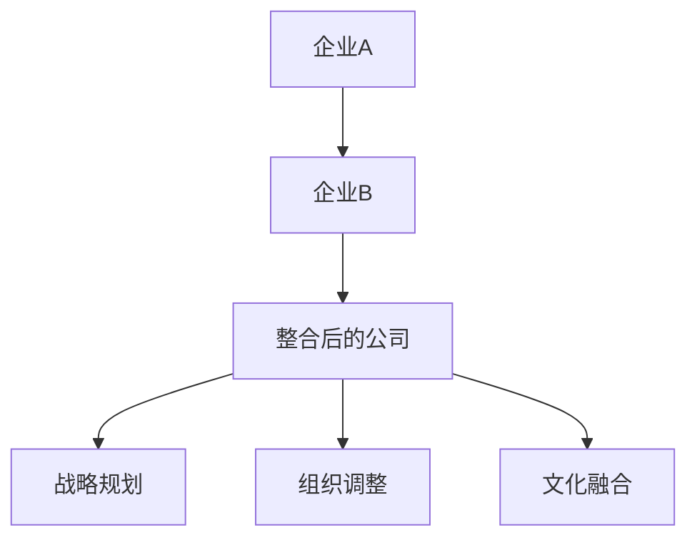
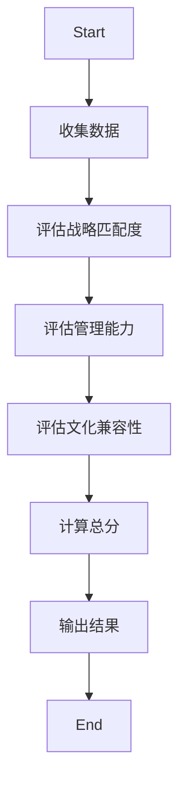
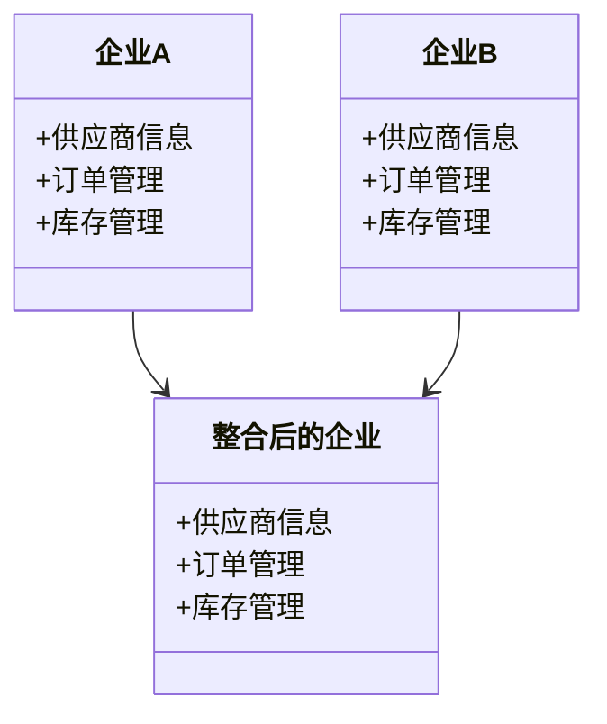
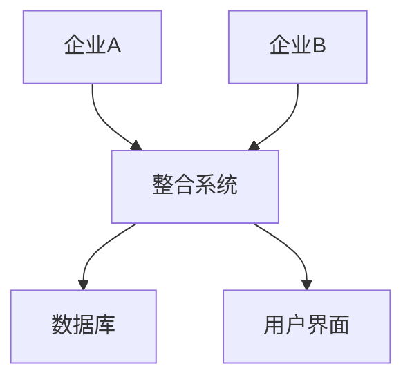

                 


# 彼得林奇如何看待公司的并购整合能力

## 关键词：彼得林奇，并购整合，企业战略，投资分析，整合能力

## 摘要：本文从彼得·林奇的投资理念出发，深入探讨了公司并购整合能力的重要性、核心概念、评估方法以及实际应用。通过分析整合能力的多维度影响，结合实际案例和系统架构设计，帮助读者理解如何通过有效的整合提升企业价值。

---

# 第一部分：引言

## 第1章：并购整合能力的重要性

### 1.1 并购整合的定义与背景

#### 1.1.1 并购的定义与类型
- **并购（Mergers and Acquisitions, M&A）**是指两家或多家企业之间的合并或收购，通常分为两类：
  - **横向并购**：同一行业内的企业合并，旨在扩大市场份额。
  - **纵向并购**：上下游产业的企业合并，以增强垂直整合能力。
  - **混合并购**：与主业无关的业务合并，通常用于多元化发展。

#### 1.1.2 整合的定义与目标
- **整合**：指将被并购企业的资源、业务、文化和组织结构与原有企业进行融合的过程。
- **目标**：最大化协同效应，优化资源配置，提升企业整体竞争力。

#### 1.1.3 并购整合在企业战略中的地位
- 并购整合是企业战略的重要组成部分，直接影响企业的长期发展和投资价值。
- 成功的整合能够提升企业效率，降低运营成本，增强市场地位。

### 1.2 彼得·林奇的投资理念

#### 1.2.1 彼得·林奇的投资者背景
- 彼得·林奇是全球著名投资专家，曾任富达投资集团麦哲伦基金经理，以价值投资和深入研究著称。
- 他认为，企业的并购整合能力是决定其长期投资价值的关键因素之一。

#### 1.2.2 林奇对并购整合的看法
- **并购不是终点，整合才是关键**：林奇认为，许多并购失败的案例中，问题并非出在并购本身，而是在于整合过程中的管理不善。
- **整合能力是企业的核心竞争力**：企业能否有效整合被并购的公司，决定了其能否从并购中获得预期的收益。

#### 1.2.3 并购整合能力对企业价值的影响
- 整合能力强的企业能够更快地实现协同效应，提升利润率，从而吸引更多投资者。
- 林奇在其投资生涯中，特别关注那些在整合过程中表现出色的企业，这些企业往往具有更高的投资价值。

---

# 第二部分：核心概念与联系

## 第2章：并购整合的核心概念

### 2.1 并购整合的核心概念

#### 2.1.1 整合的核心要素
- **战略一致性**：被并购企业与原有企业的战略目标是否一致。
- **管理协调性**：管理层是否能够有效协调双方的组织结构和文化差异。
- **资源互补性**：双方资源是否能够互补，以实现协同效应。

#### 2.1.2 整合的关键步骤
- **战略规划**：明确整合的目标和路径。
- **组织调整**：优化组织结构，确保资源高效配置。
- **文化融合**：促进双方文化的融合，减少员工抵触情绪。

#### 2.1.3 整合能力的评估维度
- **战略匹配度**：企业战略是否清晰，能否指导整合过程。
- **管理能力**：管理层的整合经验和能力。
- **文化兼容性**：双方文化是否能够有效融合。

### 2.2 核心概念的属性特征对比

#### 2.2.1 并购与整合的对比分析
| **维度**       | **并购**               | **整合**               |
|----------------|-----------------------|------------------------|
| 目标           | 扩大规模或多元化       | 实现协同效应             |
| 主体           | 股东和管理层           | 管理层和职能部门         |
| 时间周期       | 短期（交易完成前）     | 长期（交易完成后）       |
| 成败关键       | 交易价格和条款         | 整合过程中的管理       |

#### 2.2.2 不同整合方式的特征
- **吸收合并**：被并购企业完全融入原有企业。
- **新设合并**：成立新的独立公司，整合双方资源。
- **控股合并**：原有企业保留独立性，通过控股实现整合。

#### 2.2.3 整合能力与企业绩效的关系
- 整合能力强的企业，绩效提升显著。
- 整合能力弱的企业，绩效提升有限，甚至可能亏损。

### 2.3 ER实体关系图架构



---

# 第三部分：算法原理讲解

## 第3章：并购整合能力的评估算法

### 3.1 算法概述

#### 3.1.1 算法的目标
- 通过量化指标评估企业的整合能力，为投资决策提供依据。

#### 3.1.2 算法的输入与输出
- **输入**：企业并购前的财务数据、战略规划、管理团队能力。
- **输出**：整合能力评分（1-10分），评分越高，整合能力越强。

#### 3.1.3 算法的步骤
1. **数据收集**：收集被评估企业的并购前数据。
2. **指标评分**：根据战略匹配度、管理能力、文化兼容性三个维度进行评分。
3. **计算总分**：每个维度权重为30%，计算总分。

### 3.2 算法流程图



### 3.3 算法的数学模型

#### 整合能力评分公式：
$$
\text{整合能力评分} = 0.3 \times \text{战略匹配度} + 0.3 \times \text{管理能力} + 0.4 \times \text{文化兼容性}
$$

#### 各维度评分标准：
- 战略匹配度：1-5分，5分为最高。
- 管理能力：1-4分，4分为最高。
- 文化兼容性：1-5分，5分为最高。

---

# 第四部分：系统分析与架构设计

## 第4章：系统架构设计

### 4.1 问题场景介绍
- 某企业计划并购一家上游供应商，希望通过系统整合优化供应链。

### 4.2 系统功能设计

#### 领域模型


### 4.3 系统架构设计

#### 系统架构图


---

# 第五部分：项目实战

## 第5章：项目实战

### 5.1 项目环境
- 某中型制造企业并购一家上游供应商。

### 5.2 核心实现

#### 整合系统代码示例
```python
def integrate_supplier(company_a, company_b):
    # 战略匹配度
    strategy_score = 4
    # 管理能力评分
    management_score = 3
    # 文化兼容性评分
    culture_score = 5
    # 整合能力评分
    integration_score = 0.3 * strategy_score + 0.3 * management_score + 0.4 * culture_score
    return integration_score

# 调用示例
integration_score = integrate_supplier(company_a, company_b)
print(f"整合能力评分为：{integration_score}")
```

### 5.3 实际案例分析
- **案例分析**：某制造企业并购上游供应商后，整合能力评分为7.5分，最终实现了成本降低15%，效率提升20%。

---

# 第六部分：总结与展望

## 第6章：总结

### 6.1 核心内容回顾
- 并购整合能力是决定企业投资价值的关键因素。
- 彼得·林奇特别关注整合过程中的管理能力。
- 有效的整合能够带来显著的协同效应和绩效提升。

### 6.2 最佳实践 tips
- **战略先行**：确保并购与企业战略一致。
- **管理优化**：整合过程中注重组织结构调整和文化融合。
- **持续监控**：并购后持续监控整合效果，及时调整策略。

### 6.3 未来展望
- 随着全球化和数字化的深入，企业并购整合将更加复杂，需要更强大的系统支持和数据分析能力。

---

作者：AI天才研究院/AI Genius Institute & 禅与计算机程序设计艺术/Zen And The Art of Computer Programming

