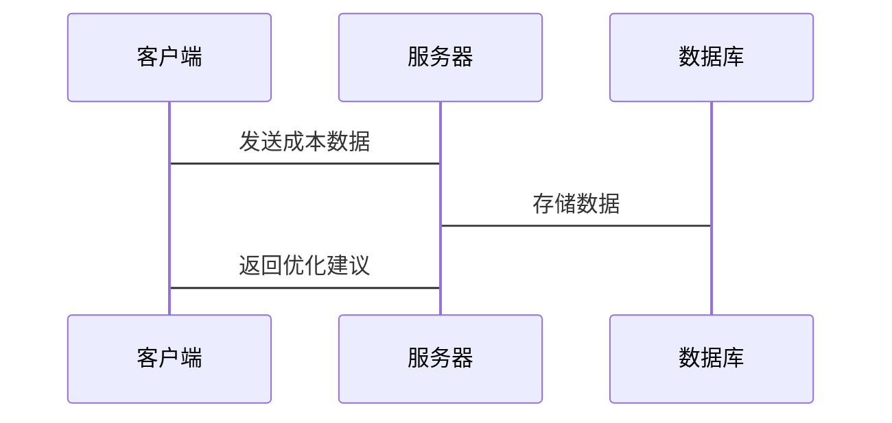

                 


# 彼得林奇如何看待公司的成本控制

## 关键词：彼得·林奇，成本控制，企业成本，投资策略，优化算法，系统架构

## 摘要：彼得·林奇作为一位知名的投资专家，他的成本控制理念对企业财务管理具有重要影响。本文将从成本控制的基本概念、核心要素、算法模型、系统架构、实战案例等多个方面详细阐述彼得·林奇的成本控制观点，并结合实际案例和数学模型，探讨如何在企业中有效实施成本控制策略。

---

## 第一部分: 成本控制的基本概念与背景

### 第1章: 成本控制的基本概念

#### 1.1 成本控制的定义与分类
- 成本的基本概念：成本是企业在生产或运营过程中所消耗的资源的价值。
- 成本控制的定义：通过计划、监督和调整，使企业成本保持在合理范围内的管理过程。
- 成本控制的分类与特点：直接成本、间接成本、固定成本、变动成本、边际成本等。

#### 1.2 彼得·林奇的投资理念
- 彼得·林奇的背景介绍：美国著名投资经理人，以其在富达基金的卓越表现闻名。
- 彼得·林奇的投资策略：注重基本面分析，寻找具有长期增长潜力的企业。
- 彼得·林奇的成本控制观点：成本控制是企业盈利能力的重要因素，企业应通过优化成本结构来提高竞争力。

#### 1.3 成本控制在企业中的重要性
- 成本控制对企业利润的影响：降低非必要开支，提高利润率。
- 成本控制与企业竞争力的关系：通过优化成本，企业可以在市场中更具竞争力。
- 成本控制的边界与外延：成本控制并非一味追求最低，而是在合理范围内优化资源配置。

---

## 第二部分: 成本控制的核心概念与联系

### 第2章: 成本控制的核心要素

#### 2.1 成本控制的核心要素分析
- 成本构成的三要素：劳动力、材料和设备。
- 成本控制的关键环节：采购、生产、销售和管理。
- 成本控制的主体与客体：企业内部各部门和个人是主体，成本项目是客体。

#### 2.2 成本控制的核心原理
- 成本控制的原理概述：通过分析成本结构，优化资源配置，降低浪费。
- 成本与收益的平衡关系：在降低成本的同时，不能忽视收益的提升。
- 成本控制的驱动因素：市场需求、技术进步、管理能力等。

#### 2.3 成本控制的核心概念对比
- 固定成本与变动成本对比：固定成本在一定范围内不变，变动成本随产量变化。
- 直接成本与间接成本对比：直接成本可直接追溯到产品，间接成本无法直接追溯。
- 边际成本与平均成本对比：边际成本是额外一单位产品的成本，平均成本是单位产品的平均成本。

---

## 第三部分: 成本控制的算法与数学模型

### 第3章: 成本控制的算法原理

#### 3.1 成本控制的优化算法
- 线性规划模型：通过建立目标函数和约束条件，求解最优解。
- 动态规划模型：将问题分解为子问题，逐步求解。
- 模拟退火算法：通过随机化搜索找到全局最优解。

#### 3.2 成本控制的数学模型
- 成本函数的构建：C = f(x)，其中x是影响成本的因素。
- 边际成本的计算公式：MC = ΔC / ΔQ，其中ΔC是成本的变化，ΔQ是产量的变化。
- 成本收益平衡的数学表达：最大化利润，即收益 - 成本最大化。

#### 3.3 成本控制的算法实现
- 算法原理的详细解释：以线性规划为例，目标是最小化成本，约束条件是资源限制。
- 算法实现的Python代码示例：
  ```python
  import numpy as np
  from scipy.optimize import linprog

  c = [1, 2]  # 成本系数
  A = [[1, 1]]  # 约束条件矩阵
  b = [5]       # 约束条件右边的常数
  result = linprog(c, A, b, method='highs')

  print("最小化成本:", result.fun)
  ```
- 算法的优缺点分析：线性规划适合线性问题，但不适用于非线性或整数规划问题。

---

## 第四章: 系统分析与架构设计

### 4.1 系统分析与架构设计

#### 4.1.1 问题场景介绍
- 成本控制系统的应用场景：企业需要实时监控和优化成本。
- 项目介绍：构建一个基于彼得·林奇成本控制理念的管理系统。

#### 4.1.2 系统功能设计
- 领域模型mermaid类图：
  ```mermaid
  classDiagram
      class 成本控制系统 {
          成本数据
          控制模块
          优化算法
      }
      class 成本数据 {
          材料成本
          人工成本
          固定成本
      }
      class 控制模块 {
          数据输入
          分析报告
          优化建议
      }
  ```

#### 4.1.3 系统架构设计
- 系统架构mermaid图：
  ```mermaid
  architecture
      客户端
      服务器
          数据库
          成本控制模块
              算法引擎
  ```

#### 4.1.4 系统接口设计
- 接口说明：API用于数据输入和输出，与数据库交互。
- 接口示例：RESTful API，如`/api/cost/input`。

#### 4.1.5 系统交互mermaid序列图


---

## 第五章: 项目实战

### 5.1 环境安装
- 需要的工具：Python、NumPy、SciPy、Mermaid工具。

### 5.2 核心代码实现
- 优化算法实现：
  ```python
  def cost_optimization(x):
      return 2*x + 3  # 示例成本函数

  def optimize():
      from scipy.optimize import minimize
      result = minimize(cost_optimization, x0=0, method='Nelder-Mead')
      return result

  optimize()
  ```

### 5.3 案例分析与解读
- 零售行业的成本控制案例：
  - 数据分析：通过数据分析发现库存积压导致的高成本。
  - 优化建议：调整采购策略，减少库存浪费。

### 5.4 项目小结
- 成本控制的关键在于数据驱动和算法优化。
- 实施成本控制需要企业内部的协同合作。

---

## 第六章: 最佳实践、小结、注意事项、拓展阅读

### 6.1 最佳实践
- 数据驱动：利用数据分析工具实时监控成本。
- 技术支持：采用优化算法和系统工具辅助成本控制。
- 持续改进：定期评估和优化成本控制策略。

### 6.2 小结
- 彼得·林奇的成本控制理念强调优化和效率。
- 成本控制不仅是降低开支，更是优化资源配置。

### 6.3 注意事项
- 成本控制不能忽视产品质量。
- 需要平衡短期成本和长期投资。

### 6.4 拓展阅读
- 推荐书籍：《彼得·林奇的投资哲学》。
- 推荐网站：相关学术论文和行业报告。

---

## 作者：AI天才研究院/AI Genius Institute & 禅与计算机程序设计艺术 /Zen And The Art of Computer Programming

---

本文通过系统地分析彼得·林奇的成本控制观点，结合算法、数学模型和系统设计，为企业提供了有效的成本控制策略。

