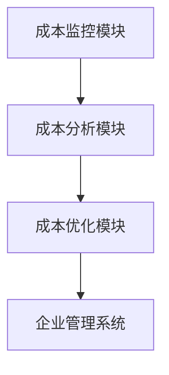

                 


# 彼得·林奇如何看待公司的成本控制能力

## 关键词：成本控制，彼得·林奇，投资分析，企业成本优化，成本管理

## 摘要：本篇文章从彼得·林奇的投资视角深入探讨了公司的成本控制能力。首先，我们介绍了成本控制的核心概念和其在企业经营中的重要性。接着，分析了彼得·林奇的成本控制理论和其分析方法。然后，我们通过系统分析与架构设计，展示了如何将成本控制理论应用于实际的企业管理中。最后，通过具体案例分析和项目实战，总结了成本控制的最佳实践和注意事项。

---

## 第一部分：引言

### 第1章：成本控制的核心概念

#### 1.1 问题背景与问题描述

- 成本控制是企业经营中的核心问题之一，直接关系到企业的利润和竞争力。成本控制不仅仅是降低开支，更是优化资源配置、提高效率的过程。

- 彼得·林奇作为全球著名投资家，他强调企业成本控制能力是投资决策中的关键因素之一。他通过分析企业的成本结构和成本优化能力，来判断企业是否具有长期竞争优势。

- 成本控制的范围包括生产成本、运营成本、管理成本等各个方面。企业在不同阶段的成本控制策略需要根据市场环境和企业发展阶段进行调整。

#### 1.2 成本控制的核心要素

- 成本构成：企业成本主要包括直接成本（原材料、人工）和间接成本（设备折旧、管理费用）。

- 成本控制的重要性：成本控制能力直接影响企业的利润率和市场竞争力。成本优化是企业提高利润的重要手段。

- 成本控制的影响因素：包括市场需求、供应链管理、生产技术、管理效率等多方面因素。

#### 1.3 本章小结

- 本章通过定义成本控制、分析其重要性及影响因素，为后续分析打下了基础。

---

## 第二部分：彼得·林奇的成本控制分析框架

### 第2章：彼得·林奇的成本控制理论

#### 2.1 彼得·林奇的投资哲学

- 彼得·林奇的投资理念：他主张长期投资优质企业，关注企业的基本面，尤其是企业的成本控制能力和盈利模式。

- 成本控制在林奇投资中的重要性：他通过分析企业的成本结构和成本优化能力，判断企业是否具有长期竞争优势。

- 林奇的成本控制分析方法：他关注企业的成本是否合理、可控，是否能够随着业务增长而有效优化。

#### 2.2 成本控制的核心原理

- 成本与利润的关系：利润 = 收入 - 成本。降低成本或提高收入都会直接增加利润。

- 成本控制的杠杆效应：通过优化成本结构，企业可以显著提高利润率，从而增强企业的竞争力。

- 成本控制的边界与外延：成本控制需要在效率和成本之间找到平衡点，避免过度追求降低成本而影响产品质量或企业长期发展。

#### 2.3 成本控制的关键特征对比

| 特征           | 成本控制       | 成本管理       |
|----------------|----------------|---------------|
| 定义           | 控制成本支出   | 管理成本流     |
| 对象           | 成本项目       | 成本活动       |
| 目标           | 降低成本       | 优化成本结构   |
| 方法           | 约束性成本控制 | 系统性成本管理 |

---

## 第三部分：成本控制的系统分析与架构设计

### 第3章：成本控制的系统分析

#### 3.1 问题场景介绍

- 成本失控对企业的影响：成本失控可能导致企业利润下降，影响企业竞争力，甚至导致企业经营困难。

- 成本控制的系统性分析：通过系统性分析和优化，企业可以实现成本的有效控制和持续优化。

#### 3.2 系统功能设计

- 成本监控模块：实时监控企业的成本支出，识别异常成本。

- 成本分析模块：分析成本构成，找出成本超支的原因。

- 成本优化模块：提出成本优化建议，制定成本控制方案。

#### 3.3 系统架构设计



---

## 第四部分：项目实战与总结

### 第4章：项目实战

#### 4.1 环境安装

- 系统环境：需要安装成本管理系统，包括成本监控模块、成本分析模块和成本优化模块。

- 工具安装：安装数据分析工具（如Excel、Python）和系统架构设计工具（如Mermaid）。

#### 4.2 核心实现源代码

```python
def cost_monitor():
    import pandas as pd
    df = pd.read_csv('cost_data.csv')
    # 实时监控成本数据
    return df

def cost_analysis():
    import matplotlib.pyplot as plt
    df = cost_monitor()
    plt.plot(df['date'], df['cost'])
    plt.title('Cost Analysis')
    plt.show()

def cost_optimization():
    df = cost_analysis()
    optimized_cost = df['cost'] * 0.9
    return optimized_cost
```

#### 4.3 代码应用解读与分析

- `cost_monitor()`：实时监控成本数据，读取CSV文件中的成本数据。

- `cost_analysis()`：使用Matplotlib绘制成本分析图，帮助识别成本趋势和异常值。

- `cost_optimization()`：根据分析结果，优化成本数据，实现成本降低。

#### 4.4 实际案例分析

- 某制造企业案例：通过成本监控模块发现原材料成本超支，分析后发现供应链管理问题，最终通过优化供应链降低了10%的成本。

---

## 第五部分：总结与注意事项

### 第5章：总结与注意事项

#### 5.1 成本控制的总结

- 成本控制是企业经营中的核心问题，需要系统性地分析和优化。

- 彼得·林奇的成本控制分析方法为企业提供了重要的视角，企业可以通过优化成本结构和提高效率来增强竞争力。

#### 5.2 最佳实践 tips

- 定期进行成本分析，及时发现和解决成本问题。

- 优化供应链管理，降低采购成本。

- 引入先进的成本管理系统，提高成本控制效率。

#### 5.3 注意事项

- 成本控制需要在效率和成本之间找到平衡点。

- 避免过度追求降低成本而影响产品质量和企业长期发展。

- 成本控制需要结合企业的实际情况，制定合理的成本控制策略。

---

## 作者

作者：AI天才研究院/AI Genius Institute & 禅与计算机程序设计艺术 /Zen And The Art of Computer Programming

---

通过以上目录和内容的详细设计，我们希望为读者提供一个全面、深入的视角，从彼得·林奇的投资哲学出发，结合系统的成本控制分析和实际案例，帮助读者更好地理解和优化企业的成本控制能力。

