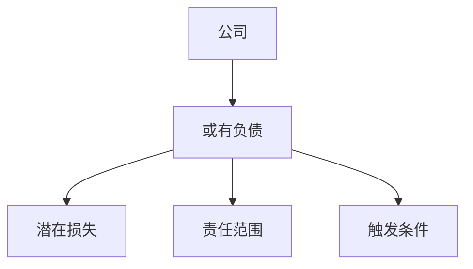

                 

# 彼得林奇如何看待公司的或有负债对长期价值的影响

## 关键词：彼得·林奇，或有负债，公司价值，风险管理，投资策略

## 摘要：本文深入探讨了彼得·林奇对或有负债对公司长期价值影响的见解。通过分析或有负债的核心概念、其对财务状况和市场风险的影响，结合风险管理策略和投资决策的视角，全面揭示了或有负债在公司价值评估中的重要性。文章结合实例分析，展示了彼得·林奇如何通过识别和管理或有负债来优化投资组合，为读者提供了深刻的理解和实践指导。

---

## 第一部分: 或有负债的定义与背景

### 第1章: 或有负债的核心概念

#### 1.1 或有负债的定义
或有负债是指公司由于过去的交易或事项，导致其可能承担的潜在债务或责任。这种负债并非确定无疑，而是基于某种条件或事件的发生而触发。例如，未决诉讼、担保责任、重组义务等都属于或有负债的范畴。

#### 1.2 或有负债与财务报表的关系
或有负债通常不会直接反映在公司的资产负债表中，但其潜在影响可能对公司的财务状况产生重大影响。例如，如果或有负债最终成为实际负债，可能会导致公司资产减少或负债增加。

#### 1.3 或有负债的分类与特征
或有负债可以根据其性质和来源进行分类。常见的分类包括：
1. **未决诉讼**：由于法律纠纷可能导致的赔偿责任。
2. **担保责任**：为其他方提供的担保可能引发的偿债义务。
3. **重组义务**：企业重组过程中可能产生的债务。
4. **环境责任**：由于环境污染可能产生的 cleanup 费用。

---

### 第2章: 彼得·林奇与或有负债的研究背景

#### 2.1 彼得·林奇的投资理念
彼得·林奇是全球著名的价值投资者，强调基本面分析和长期投资。他认为，投资者应关注企业的财务健康状况、管理层质量以及行业前景。

#### 2.2 或有负债在企业价值评估中的重要性
或有负债可能对企业的真实价值产生重大影响。例如，如果一家公司存在大量未决诉讼或担保责任，其实际价值可能远低于表面的账面价值。

#### 2.3 研究或有负债对长期价值影响的意义
通过分析或有负债，投资者可以更好地评估企业的财务风险，从而做出更明智的投资决策。彼得·林奇认为，识别和评估或有负债是投资成功的关键之一。

---

## 第二部分: 或有负债的核心概念与联系

### 第3章: 或有负债的核心概念

#### 3.1 或有负债的定义与属性
- **定义**：或有负债是基于某种条件或事件而产生的潜在债务。
- **属性**：或有负债具有不确定性、潜在性和触发条件。

#### 3.2 或有负债的分类与对比（表格）
| 类型       | 描述                     | 示例                         |
|------------|--------------------------|------------------------------|
| 未决诉讼   | 由于法律纠纷产生的潜在债务 | 某公司因专利侵权被起诉       |
| 担保责任   | 为第三方提供的担保       | 某公司为其子公司提供贷款担保 |
| 重组义务   | 企业重组过程中产生的债务 | 某公司因资产重组需要支付费用 |
| 环境责任   | 由于环境污染产生的 cleanup 费用 | 某公司因排放超标被罚款       |

---

### 第4章: 或有负债的ER实体关系图

---

## 第三部分: 或有负债对长期价值的影响分析

### 第5章: 或有负债对财务状况的影响

#### 5.1 或有负债对资产的影响
- 如果或有负债最终成为实际负债，公司可能需要出售资产或减少其他资产来偿还债务。
- 例如，如果某公司因未决诉讼被判决赔偿，其资产可能被强制出售。

#### 5.2 或有负债对负债的影响
- 或有负债可能导致公司实际负债增加，从而影响其偿债能力。
- 例如，担保责任可能使公司面临更多的债务负担。

#### 5.3 或有负债对所有者权益的影响
- 或有负债可能减少公司的所有者权益，因为其潜在的损失可能需要从所有者权益中扣除。

---

### 第6章: 或有负债对市场风险的影响

#### 6.1 或有负债对股价波动的影响
- 或有负债的存在可能导致股价波动，尤其是在潜在损失较大时。
- 例如，未决诉讼的结果可能对公司股价产生重大影响。

#### 6.2 或有负债对投资者信心的影响
- 或有负债可能削弱投资者对公司的信心，导致股价下跌。
- 例如，如果某公司存在大量或有负债，投资者可能选择抛售股票。

#### 6.3 或有负债对行业竞争的影响
- 或有负债可能影响公司的竞争能力，尤其是在行业整合或重组时。
- 例如，重组义务可能导致公司在竞争中处于劣势。

---

## 第四部分: 彼得·林奇的或有负债风险管理策略

### 第7章: 彼得·林奇的风险管理框架

#### 7.1 风险识别与评估
- 彼得·林奇强调，投资者应识别潜在的或有负债，并评估其对公司的潜在影响。
- 例如，通过分析公司的财务报表和法律文件，识别未决诉讼或担保责任。

#### 7.2 风险控制与缓解
- 彼得·林奇建议，投资者应通过分散投资和严格监控来降低或有负债带来的风险。
- 例如，避免将所有资金投资于存在大量或有负债的公司。

#### 7.3 风险监控与反馈
- 彼得·林奇强调，投资者应持续监控或有负债的变化，并根据情况调整投资策略。
- 例如，定期审查公司财务报表，及时发现潜在的或有负债变化。

---

### 第8章: 彼得·林奇的或有负债管理策略

#### 8.1 分散投资策略
- 彼得·林奇建议投资者通过分散投资来降低或有负债带来的风险。
- 例如，投资于多个行业和公司的股票，以避免单一公司的或有负债风险。

#### 8.2 严格监控潜在风险
- 彼得·林奇强调，投资者应严格监控公司或有负债的变化，并及时调整投资组合。
- 例如，密切关注公司财务报表和法律公告，识别潜在的或有负债风险。

#### 8.3 风险与收益的平衡
- 彼得·林奇认为，投资者应在风险和收益之间找到平衡点，避免因追求高收益而忽视或有负债风险。
- 例如，选择财务健康、或有负债较少的公司进行投资。

---

## 第五部分: 或有负债对投资决策的影响

### 第9章: 或有负债在投资决策中的作用

#### 9.1 或有负债对投资价值的影响
- 或有负债可能影响公司的实际价值，投资者应将其纳入考虑范围。
- 例如，存在大量或有负债的公司可能低估其真实价值。

#### 9.2 或有负债对投资评级的影响
- 或有负债可能影响公司的信用评级，从而影响其融资成本和股价。
- 例如，担保责任可能导致公司信用评级下降，进而影响其债券价格。

#### 9.3 或有负债对投资组合的影响
- 或有负债可能影响投资组合的风险和收益，投资者应根据或有负债情况调整投资组合。
- 例如，避免将过多资金投资于存在大量或有负债的公司。

---

## 第六部分: 总结与启示

### 第10章: 总结

#### 10.1 或有负债的核心概念与影响
- 或有负债是公司潜在的债务或责任，可能对公司的财务状况和市场价值产生重大影响。
- 彼得·林奇认为，识别和评估或有负债是投资成功的关键之一。

#### 10.2 彼得·林奇的投资智慧
- 彼得·林奇强调，投资者应关注公司的财务健康状况，避免投资于存在大量或有负债的公司。
- 通过分散投资和严格监控，投资者可以有效管理或有负债带来的风险。

#### 10.3 对未来的展望
- 随着全球经济的不断发展，或有负债的种类和复杂性也将增加，投资者需要更加警惕潜在风险。

---

## 作者：AI天才研究院/AI Genius Institute & 禅与计算机程序设计艺术 /Zen And The Art of Computer Programming

