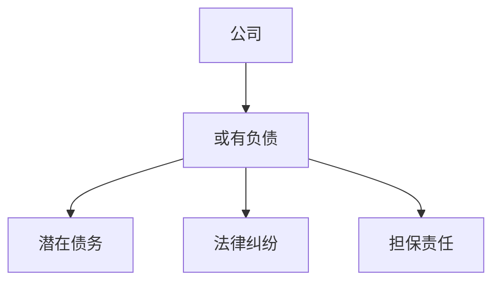
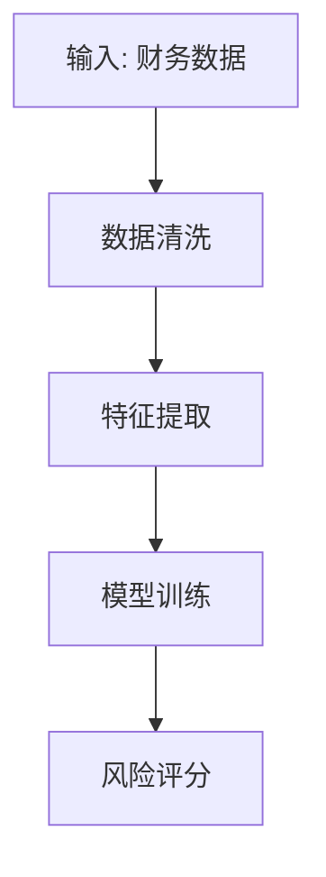
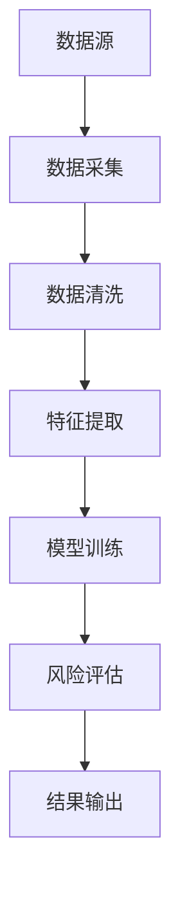

                 


# 彼得林奇如何看待公司的或有负债风险

## 关键词：公司财务风险，或有负债，彼得林奇，投资分析，风险管理

## 摘要：  
本文从彼得·林奇的视角出发，系统分析了公司在面对或有负债风险时的关键要素，探讨了如何识别、评估和管理或有负债，以降低财务风险，保障企业稳健发展。通过理论与实践结合，为企业提供风险管理的实用参考。

---

# 第一部分: 或有负债的基本概念与背景

## 第1章: 或有负债的定义与分类

### 1.1 或有负债的定义与分类

#### 1.1.1 或有负债的定义
或有负债是指公司可能在未来承担的潜在债务或责任，通常源于法律纠纷、担保、未决诉讼或承诺事项等。与直接负债不同，或有负债具有不确定性，只有在特定条件下才会转化为实际负债。

#### 1.1.2 或有负债的主要分类
1. **担保责任**：公司为其他方提供担保，可能因担保方无法履行债务而承担连带责任。
2. **未决诉讼**：公司涉及未决法律诉讼，可能因败诉而承担赔偿责任。
3. **承诺事项**：公司对未来的合同或承诺事项可能承担履行责任。
4. **潜在债务**：源于经营活动中可能产生的债务，如供应商索赔等。

#### 1.1.3 或有负债的产生原因与影响
- **产生原因**：
  - 企业经营中的法律纠纷。
  - 为其他方提供担保或信用支持。
  - 经营活动中未履行的承诺或合同。
- **影响**：
  - 增加企业的财务不确定性。
  - 影响企业信用评级和融资能力。
  - 可能导致企业财务状况恶化。

### 1.2 公司或有负债的背景与重要性

#### 1.2.1 企业财务风险的现状
现代企业经营中，或有负债已成为影响企业财务健康的重要因素。特别是在高度竞争的市场环境中，企业可能因法律纠纷、担保责任等或有负债而面临财务危机。

#### 1.2.2 或有负债在企业风险管理中的地位
或有负债是企业全面风险管理的重要组成部分，尤其是在评估企业信用风险和财务稳定性时，或有负债的影响不容忽视。

#### 1.2.3 彼得·林奇对或有负债的关注点
彼得·林奇在其投资分析中，特别关注企业的或有负债风险，认为这直接影响企业的财务健康和投资价值。他强调，投资者应警惕那些或有负债高企的企业，因为这些企业可能面临财务危机。

---

# 第二部分: 或有负债与财务风险的核心联系

## 第2章: 或有负债与财务风险的关系

### 2.1 或有负债对财务风险的影响

#### 2.1.1 或有负债对财务风险的影响
- 或有负债可能增加企业的财务负担，影响其偿债能力。
- 或有负债的存在可能导致企业信用评级下降，进而影响融资成本。

#### 2.1.2 彼得·林奇的分析视角
彼得·林奇认为，或有负债是企业财务健康的重要指标。他强调，投资者应仔细审查企业的或有负债情况，尤其是那些或有负债金额较大或性质不明确的企业，可能隐藏着巨大的财务风险。

### 2.2 或有负债的核心概念原理

#### 2.2.1 或有负债的特征对比表
| 特征 | 或有负债 | 其他负债 |
|------|----------|----------|
| 性质 | 潜在的、未确定的 | 确定的、已发生的 |
| 影响 | 可能影响未来财务状况 | 直接影响当前财务状况 |
| 计量 | 需要估计 | 可直接计量 |

#### 2.2.2 或有负债的ER实体关系图


---

# 第三部分: 或有负债风险的算法原理

## 第3章: 或有负债风险评估的算法流程

### 3.1 算法流程图


### 3.2 算法实现代码示例

#### 3.2.1 数据预处理
```python
import pandas as pd
from sklearn.impute import SimpleImputer

# 加载数据
data = pd.read_csv('or_liabilities.csv')

# 处理缺失值
imputer = SimpleImputer(strategy='mean')
data_imputed = imputer.fit_transform(data)
```

#### 3.2.2 模型训练
```python
from sklearn.ensemble import RandomForestClassifier

# 特征选择
features = data_imputed[:, :-1]
target = data_imputed[:, -1]

# 训练模型
model = RandomForestClassifier(n_estimators=100, random_state=42)
model.fit(features, target)
```

#### 3.2.3 风险评分
```python
# 预测风险评分
predicted_risk = model.predict(features)
```

### 3.3 数学模型与公式

#### 3.3.1 贝叶斯定理的应用
或有负债风险评估中，贝叶斯定理可以用于计算某公司发生或有负债的概率。公式如下：
$$ P(A|B) = \frac{P(B|A) \cdot P(A)}{P(B)} $$
其中：
- $A$ 表示“公司发生或有负债”。
- $B$ 表示“公司财务数据的特征”。

---

# 第四部分: 系统分析与架构设计

## 第4章: 或有负债风险评估系统设计

### 4.1 功能设计
- 数据采集与清洗模块：收集企业财务数据，处理缺失值和异常值。
- 特征提取模块：从财务数据中提取关键特征，用于风险评估。
- 模型训练模块：使用机器学习算法训练风险评估模型。
- 风险评估模块：根据模型输出风险评分，帮助企业识别高风险企业。

### 4.2 系统架构图


### 4.3 系统接口设计
- 输入接口：接收企业的财务数据。
- 输出接口：输出企业的风险评分和风险分析报告。

### 4.4 系统交互流程图


---

# 第五部分: 项目实战

## 第5章: 或有负债风险评估项目实战

### 5.1 环境安装
- 安装Python和必要的库：
  ```bash
  pip install pandas scikit-learn mermaid
  ```

### 5.2 核心实现代码

#### 5.2.1 数据预处理
```python
import pandas as pd
from sklearn.impute import SimpleImputer

# 加载数据
data = pd.read_csv('or_liabilities.csv')

# 处理缺失值
imputer = SimpleImputer(strategy='mean')
data_imputed = imputer.fit_transform(data)
```

#### 5.2.2 模型训练
```python
from sklearn.ensemble import RandomForestClassifier

# 特征选择
features = data_imputed[:, :-1]
target = data_imputed[:, -1]

# 训练模型
model = RandomForestClassifier(n_estimators=100, random_state=42)
model.fit(features, target)
```

### 5.3 案例分析

#### 5.3.1 案例背景
假设某制造企业涉及一起未决诉讼，可能需要承担赔偿责任。我们需要评估该诉讼对企业财务状况的影响。

#### 5.3.2 数据分析
- 公司财务数据：
  - 营业收入：1000万美元
  - 净利润：100万美元
  - 或有负债：潜在赔偿500万美元

#### 5.3.3 风险评估
- 使用上述模型预测，该企业的风险评分为0.7（高风险）。
- 结论：企业因潜在的500万美元赔偿，面临较高的财务风险。

---

# 第六部分: 最佳实践与小结

## 第6章: 最佳实践与小结

### 6.1 最佳实践
- **定期审查或有负债**：企业应定期审查或有负债情况，及时发现潜在风险。
- **谨慎提供担保**：企业在为其他方提供担保时，应充分评估对方的偿债能力。
- **建立风险管理机制**：企业应建立完善的财务风险管理体系，将或有负债风险纳入日常管理。

### 6.2 小结
通过本文的分析，我们可以看出，或有负债是企业财务风险管理中的重要组成部分。彼得·林奇的投资理念提醒我们，忽视或有负债风险的企业，可能面临巨大的财务危机。因此，企业应高度重视或有负债的管理，确保财务健康和稳健发展。

---

# 作者：AI天才研究院/AI Genius Institute & 禅与计算机程序设计艺术 /Zen And The Art of Computer Programming

