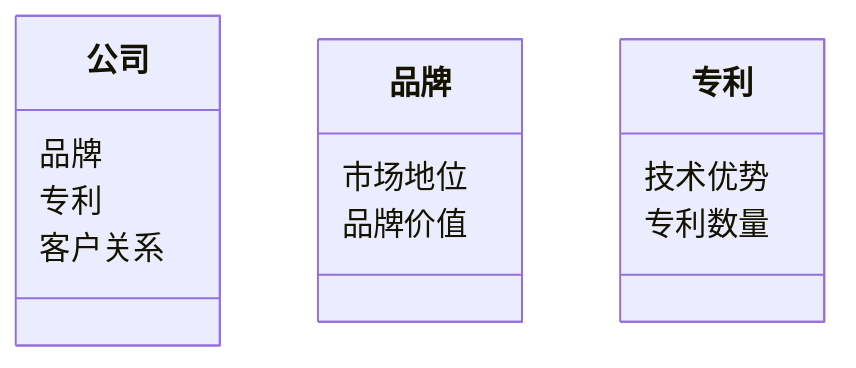
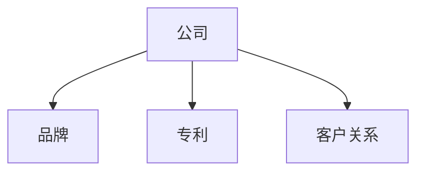

                 


# 彼得·林奇如何看待公司的无形资产价值

## 关键词：彼得·林奇，无形资产，投资分析，资产评估，企业价值

## 摘要：本文探讨了彼得·林奇对公司在无形资产方面的看法，分析了无形资产的定义、重要性、评估方法，并通过实际案例展示了如何将这些分析应用到投资决策中。

---

# 第1章 引言

## 1.1 无形资产的定义与重要性
- **无形资产**指的是企业拥有但没有实物形态的资产，包括品牌、专利、客户关系、版权等。
- 这些资产的价值通常不体现在财务报表中，但对企业的长期成功至关重要。
- 无形资产的评估需要考虑其对公司的竞争力、市场地位和未来盈利能力的影响。

## 1.2 彼得·林奇的投资理念
- 彼得·林奇是一位著名的投资专家，他强调对公司基本面的深入分析，尤其是无形资产的价值。
- 他认为，无形资产是企业竞争优势的核心，能够为公司创造持续的价值。

---

# 第2章 无形资产的核心概念

## 2.1 无形资产的分类与特征
- **品牌**：品牌的强弱直接影响企业的市场份额和客户忠诚度。
- **专利与技术**：独特的技术和专利可以为公司提供竞争优势。
- **客户关系**：稳定的客户关系是企业持续收入的保障。
- **版权与商誉**：这些资产反映了公司的声誉和市场地位。

### 2.2 无形资产的属性对比
| 属性          | 无形资产   | 有形资产   |
|---------------|------------|------------|
| 存在形式      | 抽象       | 具体       |
| 计量方式      | 难以量化   | 可以量化   |
| 生命周期      | 长期       | 可变       |

## 2.3 无形资产与有形资产的区别
- 无形资产通常无法被分割，而有形资产可以。
- 无形资产的价值可能随时间波动，而有形资产的价值相对稳定。

---

# 第3章 彼得·林奇的分析框架

## 3.1 识别无形资产的方法
- **市场地位分析**：评估公司在市场中的地位，尤其是品牌影响力。
- **竞争优势分析**：识别公司的核心竞争力，如专利和技术优势。

## 3.2 无形资产评估模型
- **相对估值法**：通过比较同行业公司的估值来确定目标公司的无形资产价值。
- **DCF模型**：通过现金流折现法评估公司的整体价值，考虑无形资产的影响。

### 3.2.1 相对估值法的步骤
1. 选择可比公司。
2. 计算可比公司的平均市盈率或市净率。
3. 应用这些比率到目标公司，估算其无形资产价值。

### 3.2.2 DCF模型的步骤
1. 预测未来现金流。
2. 确定适当的折现率。
3. 计算现值，得出整体估值。

---

# 第4章 无形资产的评估方法

## 4.1 相对估值法
- **公式**：$$EV = \frac{EV_{\text{可比公司}} \times 市盈率}{目标公司的市盈率}$$
- **Mermaid流程图**：
```mermaid
graph TD
A[开始] -> B[选择可比公司]
B -> C[计算可比公司平均市盈率]
C -> D[应用到目标公司]
D -> E[得出估值]
```

## 4.2 DCF模型
- **公式**：$$\text{现值} = \sum_{t=1}^{n} \frac{\text{现金流}}{(1 + r)^t}$$
- **Mermaid流程图**：
```mermaid
graph TD
A[开始] -> B[预测现金流]
B -> C[确定折现率]
C -> D[计算现值]
D -> E[得出整体估值]
```

---

# 第5章 系统分析与架构设计

## 5.1 系统功能设计
- **领域模型**：使用Mermaid类图展示公司、品牌、专利等实体之间的关系。


## 5.2 系统架构设计
- **Mermaid架构图**：


---

# 第6章 项目实战

## 6.1 案例分析
- **公司案例**：以苹果公司为例，分析其品牌和技术专利的无形资产价值。

## 6.2 核心代码实现
- 使用Python代码实现相对估值法和DCF模型，评估公司的无形资产价值。

### 6.2.1 Python代码实现
```python
import numpy as np

def relative_valuation(target_company_pe, comparable_companies_pe, target_company_ebitda):
    return target_company_ebitda * (comparable_companies_pe / target_company_pe)

def dcf_valuation(cash_flows, discount_rate):
    return np.sum(cash_flows / (1 + discount_rate)**range(len(cash_flows)))

# 示例数据
target_company_pe = 15
comparable_companies_pe = 18
target_company_ebitda = 100

cash_flows = [50, 60, 70]
discount_rate = 0.08

# 计算相对估值
relative_valuation_result = relative_valuation(target_company_pe, comparable_companies_pe, target_company_ebitda)
print(f"相对估值结果：{relative_valuation_result}")

# 计算DCF估值
dcf_valuation_result = dcf_valuation(cash_flows, discount_rate)
print(f"DCF估值结果：{dcf_valuation_result}")
```

---

# 第7章 最佳实践与总结

## 7.1 小结
- 无形资产是企业价值的重要组成部分。
- 投资者应重视无形资产的评估，尤其是在选择投资标的时。

## 7.2 注意事项
- 无形资产的评估具有主观性，需结合实际情况进行调整。
- 需要长期跟踪和分析，及时调整评估结果。

## 7.3 未来趋势
- 随着技术的发展，无形资产的重要性将更加突出。
- 投资者需要不断提升对无形资产的分析能力。

## 7.4 拓展阅读
- 建议阅读彼得·林奇的《彼得·林奇的投资哲学》和相关投资分析书籍。

---

# 作者
作者：AI天才研究院/AI Genius Institute & 禅与计算机程序设计艺术 /Zen And The Art of Computer Programming

