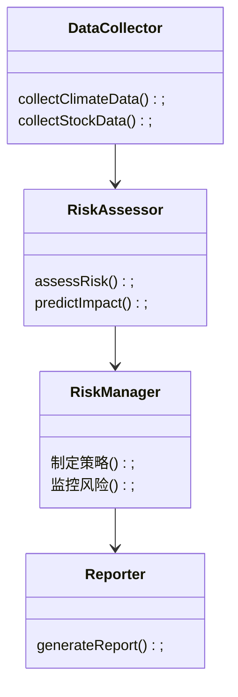

                 


# 彼得林奇如何看待公司的气候变化风险管理

## 关键词：气候变化风险管理、彼得林奇、企业风险管理、可持续发展、环境影响评估、投资策略

## 摘要：  
气候变化作为全球性挑战，对企业经营产生了深远影响。本文从彼得·林奇的视角出发，系统分析气候变化风险管理的核心概念、框架、算法原理、系统设计及项目实战，探讨企业在气候变化背景下的风险管理策略与投资决策优化方法。

---

## 第一部分：气候变化风险管理的背景与重要性

### 第1章：气候变化的现状与影响

#### 1.1 气候变化的定义与现状
- **1.1.1 气候变化的定义与核心特征**
  气候变化是指全球气候系统长期变化的现象，主要表现为温度上升、极端天气频发等。其核心特征包括人为性（温室气体排放）、全球性和不可逆性。

- **1.1.2 气候变化对全球经济的影响**
  气候变化导致资源枯竭、灾害频发，影响农业、能源、交通等多个领域，推高企业运营成本，降低生产效率。

- **1.1.3 气候变化对企业风险管理的挑战**
  企业面临物理风险（如极端天气破坏资产）、转型风险（政策变化导致成本上升）和责任风险（诉讼与声誉损失）。

#### 1.2 气候变化对企业的影响
- **1.2.1 气候变化对企业财务风险的影响**
  气候相关灾害可能导致企业资产损失、保险费用上升，影响财务稳定性。

- **1.2.2 气候变化对企业供应链的冲击**
  供应链中断、原材料价格上涨，影响企业生产效率和成本控制。

- **1.2.3 气候变化对企业声誉与社会责任的挑战**
  企业若不积极应对气候变化，可能面临消费者和投资者的信任危机。

#### 1.3 气候变化风险管理的重要性
- **1.3.1 风险管理的核心概念与框架**
  风险管理是识别、评估和应对潜在威胁的过程，是企业稳健经营的关键。

- **1.3.2 气候变化风险管理的必要性**
  气候变化带来的不确定性对企业运营构成威胁，有效的风险管理可以降低损失，确保企业可持续发展。

- **1.3.3 风险管理与企业可持续发展的关系**
  风险管理是企业实现可持续发展的重要工具，通过减少环境影响，企业可以提升竞争力和长期价值。

---

## 第二部分：气候变化风险管理的核心概念与框架

### 第2章：气候变化风险管理的核心概念

#### 2.1 气候相关风险的分类
- **2.1.1 物理风险：极端天气事件的影响**
  物理风险包括洪水、干旱等极端天气事件对企业资产和运营的影响。例如，制造业企业可能因洪水导致生产线停工，造成巨大损失。

- **2.1.2 转移风险：政策与法规变化的影响**
  转移风险指政府为应对气候变化而实施的政策（如碳税、限制措施）对企业运营成本的影响。例如，高碳排放企业可能面临更高的合规成本。

- **2.1.3 诉讼风险：气候变化相关的法律纠纷**
  企业可能因未能履行环境责任而面临诉讼，导致财务和声誉损失。

#### 2.2 气候风险管理的框架
- **2.2.1 风险评估与量化方法**
  企业需要评估气候变化带来的潜在损失，并将其量化为财务指标。例如，使用情景分析法评估不同气候变化情景对企业利润的影响。

- **2.2.2 风险缓解与应对策略**
  风险缓解策略包括技术创新、资产保护、多元化供应链等。例如，企业可以通过投资可再生能源降低对化石燃料的依赖。

- **2.2.3 风险监控与报告机制**
  企业需要建立实时监控机制，跟踪气候变化相关风险的变化，并定期向利益相关者报告。

#### 2.3 气候风险管理的核心要素
- **2.3.1 数据收集与分析**
  数据是风险管理的基础，企业需要收集历史气候数据、市场数据和政策数据，分析其对业务的影响。

- **2.3.2 模型构建与预测**
  使用气候模型预测未来气候变化趋势，评估其对企业的影响。例如，使用气象模型预测未来十年内极端天气事件的概率。

- **2.3.3 决策支持与优化**
  基于数据分析和模型预测，为企业制定最优的风险应对策略。例如，优化供应链布局以减少自然灾害影响。

---

### 第3章：气候变化风险管理的框架与工具

#### 3.1 气候风险管理框架的构建
- 气候风险管理框架包括目标设定、风险识别、评估、应对和监控五个步骤。企业应根据自身特点和行业特点，制定个性化的风险管理框架。

#### 3.2 气候风险管理工具的使用
- 企业可以使用多种工具进行风险管理，如气候情景分析工具、风险评估模型等。例如，使用情景分析工具评估不同气候变化情景对企业的影响。

---

## 第三部分：气候变化风险管理的算法原理与实现

### 第4章：气候变化风险管理的算法原理

#### 4.1 风险评估模型
- 风险评估模型是气候变化风险管理的核心工具，帮助企业量化气候变化带来的风险。常见的模型包括线性回归模型和蒙特卡洛模拟。

#### 4.2 风险评估模型的实现
- 使用Python实现线性回归模型，评估气候变化对股价的影响。例如，通过收集历史气候数据和股价数据，训练模型预测极端天气事件对企业股价的影响。

```python
import pandas as pd
import numpy as np
from sklearn.linear_model import LinearRegression

# 数据加载与预处理
data = pd.read_csv('climate_stock_data.csv')
X = data[['temperature', 'rainfall']]  # 气候变量
y = data['stock_price']  # 目标变量

# 模型训练
model = LinearRegression()
model.fit(X, y)

# 模型预测
new_data = pd.DataFrame({'temperature': [25.5, 26.0], 'rainfall': [100, 120]})
predictions = model.predict(new_data)
print(predictions)
```

---

## 第四部分：系统设计与架构

### 第5章：系统设计与架构

#### 5.1 系统功能设计
- 系统功能包括数据采集、风险评估、策略制定和监控报告。通过Mermaid类图展示系统功能模块之间的关系。



#### 5.2 系统架构设计
- 系统架构采用分层设计，包括数据层、业务逻辑层和用户界面层。通过Mermaid架构图展示系统架构。

```mermaid
architectural
    网络层
    数据库层
    服务层
    用户界面层
```

---

## 第五部分：项目实战

### 第6章：项目实战

#### 6.1 环境安装
- 需要安装Python、Pandas、Scikit-learn等库。通过以下命令安装：
  ```bash
  pip install pandas scikit-learn
  ```

#### 6.2 核心代码实现
- 使用Python编写风险评估模型，实现气候变化对股价的影响预测。

```python
import pandas as pd
from sklearn.linear_model import LinearRegression
from sklearn.metrics import mean_squared_error

# 数据加载与预处理
data = pd.read_csv('climate_stock_data.csv')
X = data[['temperature', 'rainfall']]
y = data['stock_price']

# 模型训练
model = LinearRegression()
model.fit(X, y)

# 模型评估
predicted = model.predict(X)
mse = mean_squared_error(y, predicted)
print(f'均方误差：{mse}')
```

#### 6.3 案例分析
- 通过具体案例分析，展示模型的应用。例如，分析某制造企业在不同气候变化情景下的风险敞口。

---

## 第六部分：最佳实践与总结

### 第7章：最佳实践

#### 7.1 最佳实践
- 定期更新风险管理模型，适应气候变化的新趋势。
- 加强与利益相关者的沟通，提升透明度。
- 投资于可持续发展项目，降低环境风险。

#### 7.2 小结
- 气候变化风险管理是企业可持续发展的重要组成部分，需要企业从战略高度进行规划和实施。

#### 7.3 注意事项
- 数据质量是风险管理的关键，确保数据的准确性和完整性。
- 模型的选择应基于企业的具体需求和数据特征。

#### 7.4 拓展阅读
- 推荐阅读《可持续投资：气候变化风险管理》和《彼得·林奇的投资策略》。

---

## 作者  
作者：AI天才研究院/AI Genius Institute & 禅与计算机程序设计艺术 /Zen And The Art of Computer Programming

