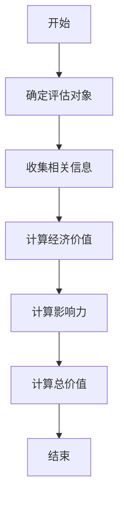
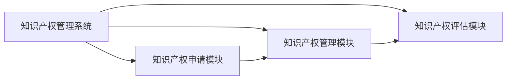

                 


# 彼得林奇如何看待公司的知识产权战略

> 关键词：彼得·林奇，知识产权战略，企业投资，专利管理，商业价值

> 摘要：本文从彼得·林奇的投资哲学出发，探讨了知识产权战略在企业中的重要性。通过详细分析知识产权的核心概念、评估方法、系统架构和实际案例，展示了如何将知识产权战略与企业投资策略相结合，为企业创造更大价值。

---

## 第一章：知识产权战略的背景与重要性

### 1.1 知识产权的基本概念

#### 1.1.1 知识产权的定义
知识产权是指个人或企业对其创造的智力成果所享有的专有权。它包括专利、商标、版权、商业秘密等多种形式。知识产权的核心价值在于其独占性和可转化性，能够为企业创造长期的经济价值。

#### 1.1.2 知识产权的类型
- **专利**：保护发明的技术方案，通常涉及产品或方法的创新。
- **商标**：用于区分商品或服务的来源，具有品牌识别功能。
- **版权**：保护文学、艺术和科学作品的原创性。
- **商业秘密**：未公开的商业信息，具有实际或潜在的经济价值。

#### 1.1.3 知识产权的保护范围
知识产权的保护范围包括法律保护、合同管理和技术措施。企业需要通过法律手段（如专利申请、商标注册）和技术手段（如加密技术）来维护其知识产权。

### 1.2 知识产权在企业中的价值

#### 1.2.1 知识产权对企业竞争力的影响
知识产权是企业核心竞争力的重要组成部分。通过拥有自主知识产权，企业可以形成技术壁垒，防止竞争对手的模仿，从而在市场中获得竞争优势。

#### 1.2.2 知识产权与企业利润的关系
知识产权的价值体现在其带来的经济收益上。例如，专利可以为企业带来 licensing 收入，商标可以提升品牌价值，从而提高产品售价和市场份额。

#### 1.2.3 知识产权在企业战略中的地位
知识产权战略是企业战略的重要组成部分。它不仅影响企业的技术创新能力，还决定了企业在行业中的地位和话语权。

### 1.3 彼得·林奇的投资哲学

#### 1.3.1 彼得·林奇的投资理念
彼得·林奇是全球著名投资专家，强调长期投资和价值发现。他认为，企业的核心价值在于其竞争优势，而知识产权正是企业竞争优势的重要来源。

#### 1.3.2 投资哲学与知识产权战略的结合
林奇的投资哲学强调选择具有持续创新能力的企业。知识产权战略的实施能够帮助企业保持技术创新，从而增强企业的核心竞争力。

#### 1.3.3 知识产权在企业估值中的作用
知识产权是企业估值的重要组成部分。拥有大量高价值知识产权的企业通常具有更高的市场估值。

---

## 第二章：知识产权战略的核心概念与联系

### 2.1 知识产权的属性特征对比

#### 2.1.1 专利
- 保护对象：技术方案
- 保护期限：通常为20年
- 保护方式：专利申请、授权

#### 2.1.2 商标
- 保护对象：品牌标识
- 保护期限：10年（可续展）
- 保护方式：商标注册

#### 2.1.3 版权
- 保护对象：文学、艺术作品
- 保护期限：作者 lifetime + 50年
- 保护方式：自动保护或版权登记

#### 2.1.4 商业秘密
- 保护对象：未公开的商业信息
- 保护期限：无固定期限
- 保护方式：法律保护和合同管理

### 2.2 知识产权与企业战略的关系

#### 2.2.1 知识产权在企业战略中的位置
知识产权是企业战略的重要组成部分，特别是在技术驱动型行业。它不仅影响企业的技术创新能力，还决定了企业的市场地位。

#### 2.2.2 知识产权与企业核心竞争力的关系
知识产权是企业核心竞争力的重要来源。通过拥有自主知识产权，企业可以形成技术壁垒，防止竞争对手的模仿。

#### 2.2.3 知识产权在企业扩张中的作用
知识产权是企业扩张的重要工具。例如，通过专利 licensing，企业可以快速进入新市场，扩大市场份额。

### 2.3 知识产权的ER实体关系图

```mermaid
er
    entity 知识产权 {
        key 专利号
        属性 类型
        属性 申请日期
        属性 有效期
    }
    entity 企业 {
        key 企业ID
        属性 企业名称
        属性 所属行业
    }
    entity 专利申请 {
        专利号 --> 企业ID
        关系：企业提交专利申请
    }
```

---

## 第三章：知识产权战略的算法原理

### 3.1 知识产权价值评估算法

#### 3.1.1 知识产权价值评估的数学模型
$$ V = \sum_{i=1}^{n} (p_i \times q_i) $$
其中，\( V \) 表示知识产权的总价值，\( p_i \) 表示第 \( i \) 个知识产权的影响力，\( q_i \) 表示第 \( i \) 个知识产权的经济价值。

#### 3.1.2 知识产权评估流程


#### 3.1.3 代码实现
```python
def calculate_ip_value(ips):
    total_value = 0
    for ip in ips:
        influence = ip['influence']
        economic_value = ip['economic_value']
        total_value += influence * economic_value
    return total_value

# 示例
ips = [
    {'influence': 0.8, 'economic_value': 100000},
    {'influence': 0.6, 'economic_value': 80000}
]
total_value = calculate_ip_value(ips)
print(f"知识产权总价值为：${total_value}")
```

---

## 第四章：知识产权战略的系统分析与架构设计

### 4.1 企业知识产权管理体系

#### 4.1.1 系统功能设计
- **知识产权申请**：包括专利申请、商标注册等。
- **知识产权管理**：包括知识产权的维护、监控和保护。
- **知识产权评估**：包括知识产权的价值评估和风险评估。

#### 4.1.2 系统架构设计


---

## 第五章：知识产权战略的项目实战

### 5.1 案例分析：科技公司知识产权价值评估

#### 5.1.1 环境安装
- 安装Python和相关库（如pandas、numpy）。

#### 5.1.2 代码实现
```python
import pandas as pd

# 示例数据
data = {
    '专利号': ['1234', '5678', '9012'],
    '申请日期': ['2020-01-01', '2021-02-01', '2022-03-01'],
    '有效期': ['2040-01-01', '2041-02-01', '2042-03-01']
}

df = pd.DataFrame(data)
print(df)
```

#### 5.1.3 案例分析
通过分析某科技公司的专利数据，评估其知识产权的经济价值和市场影响力。

---

## 第六章：知识产权战略的最佳实践

### 6.1 小结
知识产权战略是企业核心竞争力的重要组成部分。通过有效的知识产权管理，企业可以提升其市场地位和盈利能力。

### 6.2 注意事项
- 知识产权保护需要法律支持。
- 知识产权战略需要与企业整体战略相结合。

### 6.3 拓展阅读
推荐阅读彼得·林奇的《投资最重要的事情》和《股票投资策略》。

---

# 结论

知识产权战略是企业成功的关键因素之一。通过有效管理和利用知识产权，企业可以提升其核心竞争力，实现可持续发展。

---

作者：AI天才研究院/AI Genius Institute & 禅与计算机程序设计艺术 /Zen And The Art of Computer Programming

