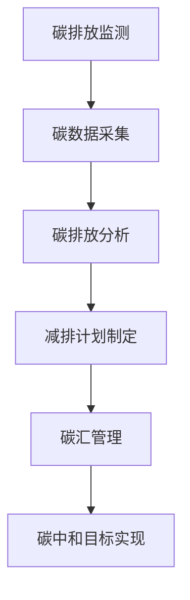

                 

# 彼得林奇如何看待公司的碳中和战略实施进度

---

## 关键词：  
碳中和、彼得·林奇、企业战略、可持续发展、投资价值、气候变化

---

## 摘要：  
本文从彼得·林奇的投资哲学出发，分析他对公司碳中和战略实施进度的看法。首先，介绍碳中和战略的定义、目标和实施路径，探讨其对企业运营和投资价值的影响。其次，结合彼得·林奇的价值投资理念，分析碳中和战略对企业发展和投资决策的重要性。最后，通过实际案例和系统架构设计，详细阐述碳中和战略的实施方法和对投资机会的影响。文章旨在为企业制定碳中和战略提供理论支持和实践指导。

---

# 正文

## 第一部分：碳中和战略的背景与概念

### 第1章：碳中和战略的定义与背景

#### 1.1 碳中和的定义与目标

碳中和是指在一定时间内，通过减少温室气体排放或增加碳汇，使二氧化碳的净排放量为零的过程。其实现路径包括减少化石能源使用、发展可再生能源、提高能效、碳捕获与封存等。碳中和的目标是应对全球气候变化，实现可持续发展。

#### 1.2 碳中和战略对企业的影响

企业需要在生产和运营中减少碳排放，这不仅有助于降低运营成本，还能提升企业的社会责任形象。碳中和战略的实施可能改变企业的商业模式，例如向绿色能源转型、优化供应链等。此外，碳中和战略对投资决策的影响也至关重要，投资者越来越关注企业的碳排放表现。

#### 1.3 彼得·林奇与碳中和战略的关联

彼得·林奇是全球著名投资家，他的投资哲学以“价值投资”为核心，注重企业的基本面分析和长期价值。碳中和战略作为企业的长期目标，符合林奇的价值投资理念。他认为，企业实施碳中和战略不仅能提升社会责任形象，还能通过技术创新和成本优化提升企业的长期竞争力。

---

### 第2章：碳中和战略的核心要素

#### 2.1 碳排放的来源与分类

碳排放主要来自工业生产、交通运输和电力消耗。企业需要识别自身的碳排放来源，制定针对性的减排策略。例如，制造业可以通过优化生产流程减少碳排放，而物流企业可以通过使用新能源车辆降低碳排放。

#### 2.2 碳减排与碳中和的实现方法

碳减排包括减少化石能源使用、提高能效、发展可再生能源等。碳中和则需要通过碳捕获与封存技术来抵消剩余的碳排放。例如，企业可以投资碳捕获技术，将二氧化碳封存在地下，实现碳中和目标。

#### 2.3 碳中和战略的实施步骤

实施碳中和战略需要经过目标设定、计划制定、执行和监控等步骤。企业应首先量化自身的碳排放，设定减排目标，并制定详细的行动计划。例如，某企业可以通过引入可再生能源、优化供应链等方式逐步减少碳排放。

---

## 第二部分：彼得·林奇视角下的碳中和战略分析

### 第3章：彼得·林奇的投资哲学与碳中和战略

#### 3.1 彼得·林奇的投资哲学

彼得·林奇的投资哲学强调长期价值投资，注重企业的基本面分析。他认为，企业的长期价值取决于其核心竞争力、盈利能力和社会责任感。碳中和战略作为企业社会责任的重要组成部分，符合林奇的价值投资理念。

#### 3.2 碳中和战略对投资价值的影响

碳中和战略的实施可能提升企业的长期价值。例如，通过减少碳排放，企业可以降低运营成本，同时提升品牌形象。此外，实施碳中和战略的企业可能在政策支持和市场环境下获得更多的投资机会。

---

## 第三部分：碳中和战略的系统架构与实施

### 第4章：碳中和战略的系统架构设计

#### 4.1 系统功能设计

碳中和战略的系统架构需要涵盖碳排放监测、减排计划制定、碳汇管理等功能。例如，企业可以通过物联网技术实时监测碳排放数据，制定针对性的减排计划。

#### 4.2 系统架构设计

以下是碳中和战略系统架构的Mermaid图：

#### 4.3 系统接口设计

系统接口需要实现碳排放数据的采集、分析和管理功能。例如，企业可以与政府机构、碳交易平台等接口对接，实现碳排放数据的共享和交易。

---

### 第5章：碳中和战略的实施案例分析

#### 5.1 实施背景

某制造企业希望通过实施碳中和战略降低碳排放，提升企业竞争力。该企业首先量化自身的碳排放，识别主要的碳排放源，制定减排目标。

#### 5.2 实施过程

企业通过引入可再生能源、优化生产流程等方式逐步减少碳排放。同时，企业与供应商合作，推动整个供应链的绿色转型。

#### 5.3 实施效果

通过实施碳中和战略，企业不仅降低了碳排放，还提升了品牌形象和市场竞争力。此外，企业的运营成本也有所降低。

---

## 第四部分：碳中和战略的投资机会与未来展望

### 第6章：碳中和战略的投资机会分析

#### 6.1 新能源领域的投资机会

碳中和战略推动了新能源行业的发展，例如太阳能、风能等可再生能源的投资机会。投资者可以通过投资新能源企业获得较高的回报。

#### 6.2 节能减排技术的投资机会

碳中和战略促进了节能减排技术的发展，例如高效能设备、碳捕获技术等。投资者可以通过投资相关技术的研发和应用获得收益。

#### 6.3 碳交易市场的投资机会

碳交易市场是碳中和战略的重要组成部分。投资者可以通过参与碳交易市场，购买或出售碳配额，实现投资收益。

---

### 第7章：碳中和战略的挑战与对策

#### 7.1 碳中和战略实施的挑战

碳中和战略的实施可能面临技术、资金和政策等多方面的挑战。例如，部分企业缺乏足够的资金和技术支持，难以实现减排目标。

#### 7.2 应对策略

企业可以通过技术创新、政策支持和合作伙伴关系等方式应对挑战。例如，企业可以与政府、非政府组织和投资者合作，共同推动碳中和战略的实施。

---

## 第五部分：总结与展望

### 第8章：碳中和战略的未来展望

#### 8.1 碳中和战略的发展趋势

随着全球气候变化问题的加剧，碳中和战略将成为企业发展的核心目标之一。未来，企业将更加注重绿色转型和可持续发展。

#### 8.2 碳中和战略的投资机会

碳中和战略将带来更多的投资机会，特别是在新能源、节能环保等领域。投资者需要关注这些领域的技术创新和市场动态。

#### 8.3 碳中和战略的长期价值

碳中和战略不仅是企业的社会责任，也是实现长期价值的重要途径。通过实施碳中和战略，企业可以提升竞争力，实现可持续发展。

---

## 作者信息

作者：AI天才研究院/AI Genius Institute & 禅与计算机程序设计艺术 /Zen And The Art of Computer Programming

