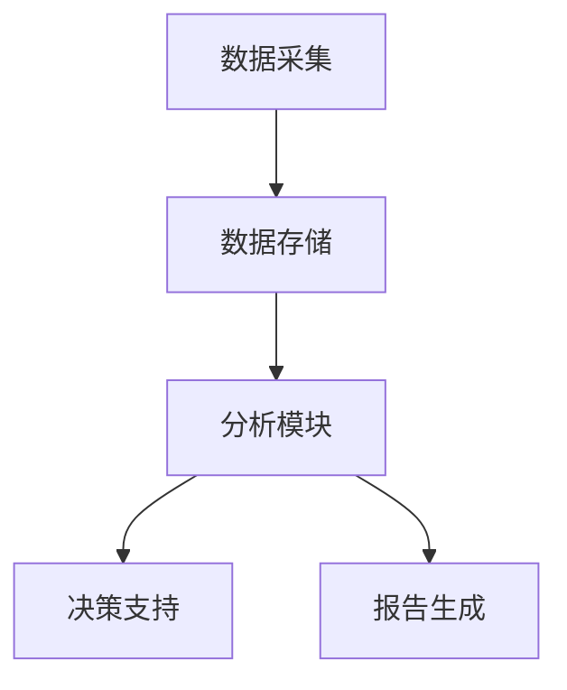
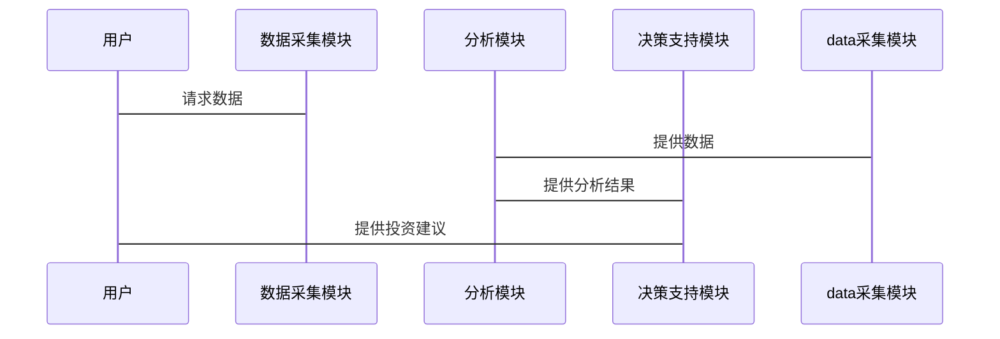

                 


# 彼得·林奇如何看待公司的股东回报

## 关键词：
- 彼得·林奇
- 股东回报
- 投资策略
- 股票分析
- 成长型投资

## 摘要：
本文深入探讨了彼得·林奇的投资理念及其对股东回报的见解。通过分析林奇的选股标准、投资策略和长期视角，文章揭示了如何通过基本面分析和成长型投资为股东创造最大价值。结合实际案例和系统架构，本文为投资者提供了实用的指导和建议。

---

## 第一部分: 股东回报的核心概念与背景

### 第1章: 股东回报的基本概念

#### 1.1 股东回报的定义与类型
股东回报指的是股东通过持有公司股票所获得的收益，主要分为两类：**股息**和**资本增值**。股息是公司分配给股东的利润部分，而资本增值则来自股价的上涨。

#### 1.2 股东回报的驱动因素
- **公司盈利能力**：公司净利润是股东回报的核心驱动因素。
- **股票市场的波动性**：市场波动会影响股价，从而影响资本增值。
- **宏观经济环境**：经济状况和政策变化会影响公司的业绩和股价。

#### 1.3 股东回报的重要性
股东回报不仅是投资者的收益来源，也是公司吸引和留住投资者的关键因素。健康的股东回报机制有助于公司长期发展和股东利益的实现。

### 第2章: 彼得·林奇的投资理念

#### 2.1 彼得·林奇的生平简介
彼得·林奇是美国著名的投资专家，以其在成长型投资领域的卓越表现而闻名。他的投资哲学强调基本面分析和长期持有优质股票。

#### 2.2 林奇如何看待股东回报
林奇认为，股东回报的核心在于公司本身的盈利能力和发展潜力。他注重公司的基本面，尤其是ROE（净资产收益率）和利润率等指标。

### 第3章: 股东回报的衡量与评估

#### 3.1 股东回报的衡量指标
- **股息率**：股息与股价的比率，反映分红能力。
- **股价增长率**：股价上涨幅度，衡量资本增值。
- **净资产收益率（ROE）**：净利润与净资产的比率，反映公司盈利能力。

#### 3.2 股东回报的评估方法
- **市盈率分析**：股价与每股收益的比率，评估股票的估值。
- **市净率分析**：股价与每股净资产的比率，适用于评估资产密集型公司。
- **股息支付率分析**：股息与净利润的比率，反映分红政策。

---

## 第二部分: 彼得·林奇的投资策略与股东回报

### 第4章: 林奇的选股标准

#### 4.1 林奇选股的核心标准
- **公司基本面分析**：关注ROE、利润率等财务指标。
- **行业地位分析**：选择行业龙头或有竞争优势的公司。
- **财务健康状况**：评估资产负债表的健康性，避免高负债公司。

#### 4.2 林奇选股的量化指标
- **市盈率与市净率对比**：通过比较市盈率和市净率，寻找低估股票。
- **股息率与股息增长对比**：关注高股息率且股息增长稳定的公司。
- **资产负债率分析**：低负债率公司风险较低。

### 第5章: 林奇的投资策略与股东回报

#### 5.1 林奇的成长型投资策略
- **成长型投资的定义**：投资于收入和利润快速增长的公司。
- **林奇的成长型投资标准**：选择ROE高、收入增长快且稳定的公司。
- **成长型投资与股东回报的关系**：通过长期持有高成长公司股票，实现资本增值。

#### 5.2 林奇的价值型投资策略
- **价值型投资的定义**：寻找市场价格低于内在价值的股票。
- **林奇的价值型投资标准**：关注低市盈率、低市净率且股息率高的公司。
- **价值型投资与股东回报的关系**：通过买入低估股票，等待价值回归实现收益。

### 第6章: 林奇对股东回报的长期展望

#### 6.1 长期投资与股东回报
- **长期投资的优势**：避免短期波动影响，实现资本增值。
- **林奇对长期投资的建议**：选择优质公司长期持有，定期评估和调整。
- **长期投资的风险与机会**：市场波动和经济变化中的机会与风险。

---

## 第三部分: 系统分析与架构设计

### 第7章: 系统分析与架构设计方案

#### 7.1 问题场景介绍
投资者需要一个系统化的框架来评估公司和选择股票，以实现最大股东回报。本文提供了一个基于彼得·林奇投资理念的分析框架。

#### 7.2 系统功能设计
- **领域模型**：公司基本面分析、财务指标评估、投资策略选择。
- **系统架构**：数据采集、分析模块、决策支持。

#### 7.3 系统架构设计（Mermaid）



#### 7.4 系统接口设计
- 数据接口：连接财务数据源。
- 分析接口：提供财务指标计算和评估。
- 决策接口：输出投资建议和股票选择。

#### 7.5 系统交互设计（Mermaid）



---

## 第四部分: 项目实战

### 第8章: 项目实战

#### 8.1 环境安装
- 安装Python和相关库（pandas、numpy、matplotlib）。
- 数据源：获取公司财务数据和股价数据。

#### 8.2 核心实现源代码
```python
import pandas as pd
import numpy as np

# 示例数据
data = {
    '公司名称': ['A公司', 'B公司', 'C公司'],
    'ROE': [0.2, 0.3, 0.15],
    '净利润增长率': [0.15, 0.2, 0.05],
    '市盈率': [15, 20, 12],
    '市净率': [1.5, 2, 1]
}

df = pd.DataFrame(data)

# 计算综合得分
df['综合得分'] = df[['ROE', '净利润增长率']].mean(axis=1) * 100

print(df)
```

#### 8.3 代码应用解读与分析
上述代码展示了如何计算公司的综合得分，结合ROE和净利润增长率，帮助投资者选择高成长公司。通过实际数据计算，投资者可以更好地理解林奇的投资策略。

#### 8.4 案例分析
以某公司为例，分析其财务数据，评估其投资价值，并展示如何通过林奇的策略选择股票。

---

## 第五部分: 最佳实践与小结

### 第9章: 最佳实践与小结

#### 9.1 投资策略 tips
- 长期投资优于短期交易。
- 结合成长型和价值型策略，寻找低估的高成长公司。

#### 9.2 小结
彼得·林奇的投资理念为股东回报提供了系统的分析框架。通过基本面分析和长期持有，投资者可以实现财富增长。

#### 9.3 注意事项
- 定期评估和调整投资组合。
- 保持对市场的敏感性和对公司的持续关注。

---

## 作者：AI天才研究院/AI Genius Institute & 禅与计算机程序设计艺术 /Zen And The Art of Computer Programming

