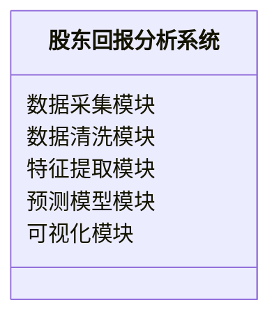

                 


# 彼得林奇如何看待公司的股东回报政策演变

## 关键词：彼得·林奇，股东回报政策，股息，股票回购，资本增值，公司治理

## 摘要：本文深入探讨了彼得·林奇对股东回报政策演变的看法，分析了不同股东回报形式对公司价值的影响，并结合实际案例，总结了如何在股东回报与公司发展之间找到平衡点。

---

## 第一部分：股东回报政策的背景与核心概念

### 第1章：股东回报政策的定义与重要性

#### 1.1 股东回报政策的定义
- **股东回报**：公司通过股息、股票回购或资本增值等方式，向股东分配的收益。
- **股息支付率**：股息与净利润的比率，反映公司分红的意愿和能力。
- **股东回报政策**：公司如何分配收益给股东的策略，包括股息、回购和资本增值。

#### 1.2 股东回报政策的演变历史
- **早期阶段**：股东回报主要依赖于股息支付，公司通过稳定的分红吸引投资者。
- **现代阶段**：随着市场环境的变化，股票回购和资本增值逐渐成为重要的回报形式。
- **演变趋势**：公司根据自身情况灵活调整回报方式，以平衡股东利益和公司发展需求。

### 第2章：彼得·林奇的投资理念与股东回报政策

#### 2.1 彼得·林奇的背景与投资哲学
- **投资哲学**：强调基本面分析、长期投资和对公司管理层的信任。
- **关注点**：更倾向于通过股息支付和资本增值实现股东回报的最大化。
- **案例分析**：以富达基金为例，探讨林奇如何通过合理的回报政策实现投资目标。

#### 2.2 林奇对股东回报政策的分析框架
- **股息政策**：稳定且合理的股息支付率能够增强股东信心。
- **股票回购**：在股价被低估时进行回购，可以提高每股收益和股东价值。
- **资本增值**：通过公司的成长和股价上涨实现资本增值，是长期投资者的首选。

### 第3章：股东回报政策的核心概念与联系

#### 3.1 股东回报政策的核心概念
- **股息支付率**：公司利润分配给股东的比例，影响股东的投资决策。
- **股票回购规模**：公司回购股票的数量和时机，影响市场对公司估值的看法。
- **资本增值潜力**：公司未来增长的潜力，直接影响股价的长期表现。

#### 3.2 股东回报政策与公司价值的关系
- **股息支付率与股价**：高股息支付率通常意味着公司具有稳定的盈利能力和分红能力，吸引追求稳定收益的投资者。
- **股票回购与市场信心**：大规模回购表明公司对其股价的低估有信心，可能提升市场对公司价值的认可。
- **资本增值与长期增长**：资本增值潜力高的公司，往往能够吸引长期投资者，推动股价持续上涨。

---

## 第二部分：股东回报政策的数学模型与算法分析

### 第4章：股东回报政策的数学模型

#### 4.1 股东回报预测模型
- **股息支付率预测公式**：
  $$股息支付率 = \frac{净利润 \times 股息率}{流通股数量}$$
- **股票回购规模预测公式**：
  $$股票回购规模 = \frac{现金流}{股价} \times 回购比例$$

#### 4.2 股东回报政策的算法流程


### 第5章：股东回报政策的系统架构与设计方案

#### 5.1 系统功能模块
- **数据采集模块**：收集公司财务数据、股价信息等。
- **数据清洗模块**：处理数据中的异常值和缺失值。
- **特征提取模块**：提取关键的财务指标，如净利润、现金流、股价等。
- **预测模型模块**：基于历史数据建立预测模型，计算股息支付率和股票回购规模。
- **可视化模块**：将预测结果以图表形式展示，便于分析和决策。

#### 5.2 系统架构图


---

## 第三部分：项目实战与总结

### 第6章：项目实战分析

#### 6.1 项目背景与目标
- **项目背景**：以某公司为例，分析其股东回报政策的演变过程。
- **项目目标**：预测未来股息支付率和股票回购规模，评估股东回报潜力。

#### 6.2 核心实现代码
```python
import pandas as pd
import numpy as np
import matplotlib.pyplot as plt

# 示例数据
data = {
    '年份': [2018, 2019, 2020, 2021, 2022],
    '净利润': [100, 120, 150, 180, 200],
    '现金流': [50, 60, 70, 80, 90],
    '股价': [50, 55, 60, 65, 70]
}

df = pd.DataFrame(data)

# 计算股息支付率
df['股息支付率'] = (df['净利润'] * 0.02) / df['股价']

# 计算股票回购规模
df['股票回购规模'] = (df['现金流'] / df['股价']) * 0.1

print(df)
```

#### 6.3 数据可视化
```python
plt.figure(figsize=(10, 6))
plt.plot(df['年份'], df['股价'], label='股价')
plt.plot(df['年份'], df['股息支付率'], label='股息支付率')
plt.xlabel('年份')
plt.ylabel('数值')
plt.legend()
plt.show()
```

### 第7章：总结与展望

#### 7.1 总结
- 彼得·林奇认为，股东回报政策的演变应根据公司实际情况灵活调整。
- 股东回报政策的核心在于平衡股东利益和公司发展需求。
- 合理的回报政策能够增强市场信心，促进公司长期发展。

#### 7.2 展望
- 随着市场环境的变化，股东回报政策将继续演变，公司应根据自身情况选择最优策略。
- 投资者应关注公司回报政策的合理性，选择与自身投资目标相符的公司。

#### 7.3 最佳实践 tips
- 定期评估公司回报政策，确保其与公司发展阶段和市场环境相匹配。
- 关注公司管理层的决策能力和战略规划，选择值得长期投资的公司。
- 在选择回报形式时，考虑自身的投资目标和风险承受能力。

---

## 作者：AI天才研究院/AI Genius Institute & 禅与计算机程序设计艺术/Zen And The Art of Computer Programming

