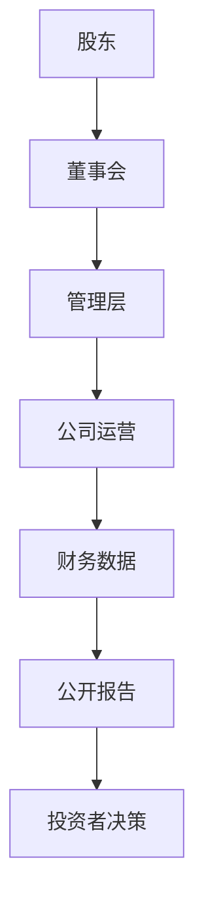

                 


# 彼得·林奇如何看待公司的股东沟通策略

## 关键词：股东沟通，彼得·林奇，投资策略，透明度，信息对称

## 摘要：本文从彼得·林奇的投资理念出发，探讨了股东沟通的重要性、核心概念、策略分析以及系统设计。通过实际案例和数学模型，深入剖析了股东沟通的关键要素，并提出了优化建议。

---

# 第1章: 股东沟通策略的背景与意义

## 1.1 股东沟通的定义与核心要素

### 1.1.1 股东沟通的定义
股东沟通是指公司与其股东之间的信息交流过程，旨在传递公司经营状况、财务数据、战略规划等信息，帮助股东做出投资决策。

### 1.1.2 股东沟通的核心要素
1. **透明度**：信息的公开程度直接影响股东的信任度。
2. **及时性**：信息的发布速度影响股东的决策效率。
3. **真实性**：信息的准确性是股东信任的基础。

### 1.1.3 股东沟通的重要性
良好的股东沟通有助于提升公司形象、增强投资者信心，同时也有助于公司及时发现经营中的问题。

---

## 1.2 彼得·林奇与股东沟通的独特视角

### 1.2.1 彼得·林奇的投资者背景
彼得·林奇是美国著名投资经理人，以其对基本面的深入分析和对中小企业的关注而闻名。

### 1.2.2 林奇对股东沟通的理解
林奇强调，公司应通过定期报告、电话会议等方式与股东保持联系，确保信息的透明度和及时性。

### 1.2.3 林奇沟通策略的成功案例
例如，林奇在管理麦哲伦基金时，通过详细的季度报告和电话会议，与投资者保持了良好的沟通。

---

## 1.3 股东沟通的现状与挑战

### 1.3.1 当前股东沟通的主要形式
包括定期报告、股东大会、电话会议等。

### 1.3.2 沟通中的主要问题与挑战
1. **信息不对称**：部分公司可能隐瞒负面信息。
2. **沟通渠道单一**：传统沟通方式效率较低。

### 1.3.3 林奇策略的现实意义
林奇的沟通策略为现代企业提供了重要参考，强调透明和及时。

---

# 第2章: 股东沟通的核心概念与联系

## 2.1 核心概念的原理分析

### 2.1.1 透明度与信息对称
透明度越高，信息对称越强，股东决策越准确。

### 2.1.2 及时性与决策效率
及时的信息传递有助于股东快速做出决策。

### 2.1.3 真实性与信任建立
真实的信息是建立股东信任的基础。

---

## 2.2 核心概念的属性特征对比表

| 概念       | 透明度 | 及时性 | 真实性 |
|------------|--------|--------|--------|
| 林奇策略   | 高     | 高     | 高     |
| 传统模式   | 中     | 中     | 中     |

---

## 2.3 实体关系图（Mermaid）



---

# 第3章: 彼得·林奇的股东沟通策略分析

## 3.1 林奇的沟通策略概述

### 3.1.1 以事实为基础的沟通
林奇强调基于数据的沟通，避免主观判断。

### 3.1.2 以数据为导向的决策
通过财务数据和市场数据，帮助投资者做出理性决策。

### 3.1.3 以透明为原则的互动
通过定期报告和电话会议，保持与股东的透明互动。

---

## 3.2 算法原理分析

### 3.2.1 数据收集与处理
包括收集公司财务数据、市场数据等。

### 3.2.2 模型构建与验证
通过数学模型分析公司价值。

### 3.2.3 结果输出与反馈
将分析结果反馈给股东，供其参考。

---

## 3.3 数学模型与公式

### 3.3.1 市盈率模型
$$ P/E = \frac{Price}{Earnings} $$

### 3.3.2 股息率模型
$$ Dividend Yield = \frac{Dividend}{Price} $$

---

# 第4章: 股东沟通的系统分析与架构设计

## 4.1 问题场景介绍

### 4.1.1 沟通效率低下
传统沟通方式效率低，信息传递慢。

### 4.1.2 信息不对称问题
股东难以获取真实信息。

### 4.1.3 投资者信任缺失
缺乏透明度导致信任不足。

---

## 4.2 系统功能设计

### 4.2.1 信息收集模块
负责收集公司财务数据和市场数据。

### 4.2.2 数据分析模块
对数据进行清洗、分析和建模。

### 4.2.3 沟通策略模块
根据分析结果生成沟通策略。

---

## 4.3 系统架构设计


---

# 第5章: 项目实战与案例分析

## 5.1 环境安装与数据准备

### 5.1.1 数据源选择
选择可靠的财务数据源，如公司年报。

### 5.1.2 工具安装与配置
安装Python和相关库，如Pandas、Matplotlib。

---

## 5.2 核心代码实现

### 5.2.1 数据清洗代码

```python
import pandas as pd

data = pd.read_csv('shareholder_data.csv')
data = data.dropna()
data.to_csv('cleaned_data.csv', index=False)
```

---

## 5.3 实际案例分析

### 5.3.1 案例介绍
以某公司为例，分析其股东沟通策略。

### 5.3.2 代码应用解读
通过代码分析公司财务数据，评估其透明度。

### 5.3.3 结果分析
根据分析结果，提出优化建议。

---

# 第6章: 总结与最佳实践

## 6.1 小结
总结全文，强调股东沟通的重要性。

## 6.2 注意事项
提醒企业在沟通中注意透明度和真实性。

## 6.3 拓展阅读
推荐相关书籍和文章，供读者深入学习。

---

# 作者：AI天才研究院 & 禅与计算机程序设计艺术

---

这篇文章从背景、核心概念、策略分析、系统设计和项目实战等多方面，全面探讨了彼得·林奇的股东沟通策略，结合实际案例和数学模型，为读者提供了深刻的见解。

