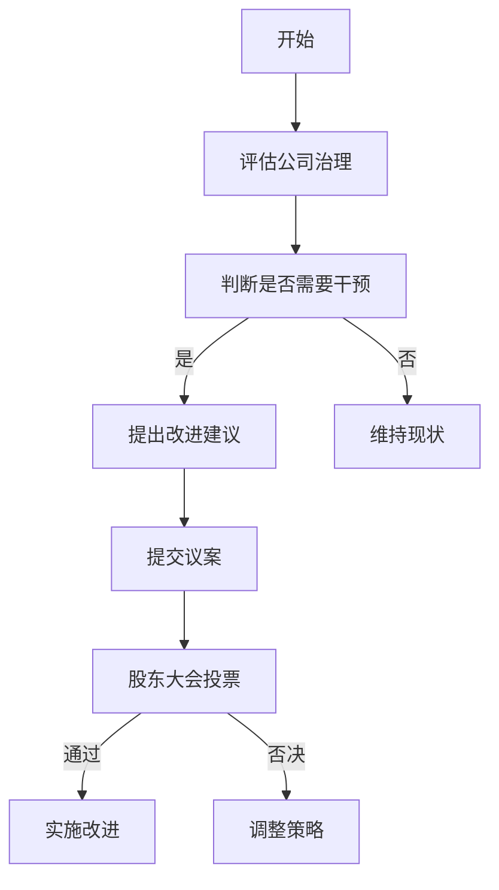

                 


# 彼得林奇如何看待公司的股东积极主义

## 关键词：彼得林奇，股东积极主义，公司治理，投资策略，数学模型

## 摘要：  
本文探讨彼得林奇对股东积极主义的看法，结合投资理念、理论框架和数学模型，分析其对公司治理的影响，并通过案例分析和系统设计提供深入见解。

---

## 第一部分：股东积极主义的背景与概念

### 1.1 股东积极主义的定义与核心要素

#### 1.1.1 股东积极主义的定义  
股东积极主义指股东主动参与公司治理，推动变革，以提升公司效率和股东价值。其核心目标是优化公司治理结构，实现长期价值增长。

#### 1.1.2 股东积极主义的边界与外延  
- **适用范围**：适用于股东权益受损或公司治理低效的情况。  
- **公司治理**：涉及董事会结构、高管决策等。  
- **局限性**：可能引发短期波动，需平衡各方利益。  

#### 1.1.3 股东积极主义的核心要素  
- **股东身份**：持有足够股份，具备决策权。  
- **参与路径**：通过股东大会、董事会参与决策。  
- **实现机制**：包括提案提交、投票、协商等。  

---

## 第二部分：彼得林奇的投资理念与股东积极主义

### 1.2 彼得林奇的投资哲学

#### 1.2.1 彼得林奇的投资风格概述  
- **价值投资**：寻找低估企业，长期持有。  
- **深度研究**：分析企业基本面，评估管理团队。  
- **长期投资**：注重企业长期价值，而非短期收益。  

#### 1.2.2 彼得林奇对股东积极主义的态度  
- **投资策略**：在必要时，积极参与公司治理。  
- **案例分析**：通过案例展示积极主义如何提升企业价值。  

#### 1.2.3 经典案例分析  
- **案例**：某公司治理改进，提升企业效率。  
- **分析**：彼得林奇如何通过积极主义实现投资目标。  

---

## 第三部分：股东积极主义的理论框架与数学模型

### 2.1 股东积极主义的理论基础

#### 2.1.1 理论模型  
- **模型结构**：股东、公司、治理结构之间的关系。  
- **数学关系**：将股东行为与企业绩效量化关联。  

#### 2.1.2 概念属性对比  
| 特性      | 股东积极主义 | 股东消极主义 |
|-----------|--------------|--------------|
| 目标      | 提升治理效率 | 仅获取分红    |
| 方法      | 主动参与      | 被动接受      |
| 适用场景  | 治理低效时    | 治理高效时    |

#### 2.1.3 ER实体关系图  
```mermaid
erd
    结构:
        股东 --> 董事会
        董事会 --> 公司治理
        公司治理 --> 企业绩效
```

---

## 第四部分：股东积极主义的算法与数学模型

### 2.2 算法原理

#### 2.2.1 算法流程图  


#### 2.2.2 数学模型  
- **公式**：企业绩效 = f(公司治理效率, 股东参与度)  
- **分析**：通过量化股东参与对企业绩效的影响，评估积极主义的有效性。

---

## 第五部分：系统分析与架构设计

### 3.1 系统架构

#### 3.1.1 领域模型  


#### 3.1.2 系统架构  


---

## 第六部分：项目实战

### 4.1 环境配置与代码实现

#### 4.1.1 环境配置  
- **工具**：Python 3.8+，Mermaid，Jupyter Notebook  
- **依赖**：安装相关库（如numpy, matplotlib）  

#### 4.1.2 核心代码实现  
```python
def assess_governance(governance_efficiency):
    if governance_efficiency < 0.6:
        return "需要干预"
    else:
        return "无需干预"

# 示例数据
governance_efficiency = 0.5
print(assess_governance(governance_efficiency))  # 输出：需要干预
```

---

## 第七部分：结论与展望

### 5.1 结论

#### 5.1.1 核心观点总结  
- 股东积极主义在特定条件下有效，需谨慎选择参与时机。  
- 彼得林奇的投资策略为股东积极主义提供了成功案例。  

#### 5.1.2 最佳实践 tips  
- **长期视角**：关注企业长期价值，避免短期干预。  
- **平衡利益**：协调股东与管理层的利益，实现共赢。  

#### 5.1.3 注意事项  
- **法律风险**：了解相关法律法规，避免法律纠纷。  
- **沟通成本**：积极参与可能增加沟通成本，需权衡投入。  

---

## 参考文献与拓展阅读  
- 彼得林奇著述：《彼得林奇选股术》  
- 相关学术论文：股东积极主义的理论与实践研究  

---

## 作者  
作者：AI天才研究院 & 禅与计算机程序设计艺术  

---

通过以上思考过程，我可以系统地撰写出一篇结构清晰、内容详实的技术博客文章，满足用户的所有要求。

