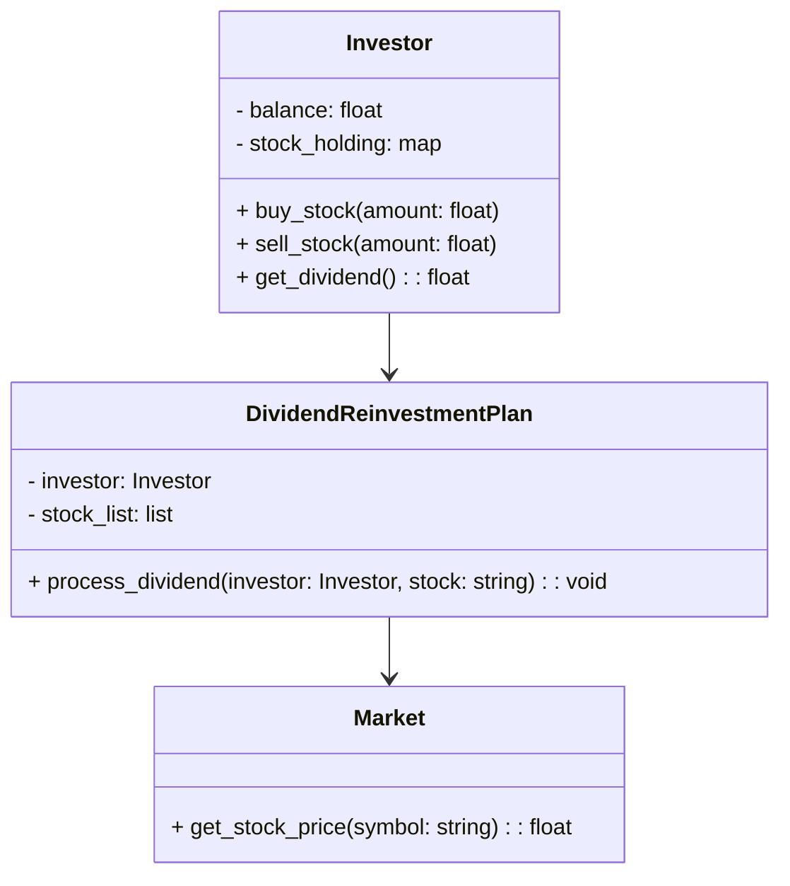
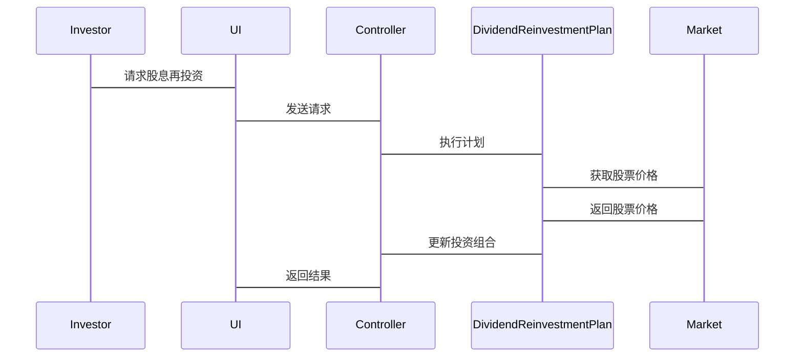

                 


# 彼得·林奇如何看待公司的股息再投资计划

> 关键词：股息再投资计划, 彼得·林奇, 投资策略, 股票投资, 股息支付

> 摘要：本文将探讨彼得·林奇对股息再投资计划（DRIP）的看法，分析其优缺点，并结合实际案例，帮助读者理解如何在投资组合中合理运用股息再投资策略。文章从背景介绍、核心概念、策略分析、系统设计、项目实战等多角度进行详细阐述，帮助投资者全面了解和应用这一投资工具。

---

# 第一部分: 股息再投资计划（DRIP）概述

## 第1章: 股息再投资计划（DRIP）的背景与定义

### 1.1 股息再投资计划的定义与运作机制

#### 1.1.1 股息再投资计划的基本定义
股息再投资计划（Dividend Reinvestment Plan，简称DRIP）是一种允许投资者将收到的股息用于购买更多的公司股票的机制。通过DRIP，投资者可以避免因现金股息派发而产生的税务负担，并利用复利效应增加投资组合的价值。

**核心概念与联系：**  
- **股息再投资计划**：通过将股息用于购买更多股票，实现资本的滚动增值。
- **复利效应**：通过持续投资，股息再投资计划能够显著放大投资收益。

**系统分析与架构设计方案：**  
- **问题场景**：投资者希望将股息再投资，以最大化投资收益。
- **系统功能设计**：构建一个DRIP模拟系统，用于计算股息再投资的效果。
- **系统架构设计**：通过流程图展示DRIP的实施流程。

### 1.2 股息再投资计划的历史与发展

#### 1.2.1 股息再投资计划的起源
股息再投资计划的概念可以追溯到20世纪60年代，但真正普及是在20世纪80年代。随着技术的进步，DRIP逐渐成为投资者进行长期投资的重要工具。

#### 1.2.2 股息再投资计划的发展历程
从早期的纸质操作到现代的电子化交易，DRIP经历了从简单到复杂的演变，成为现代投资组合管理的重要组成部分。

#### 1.2.3 股息再投资计划在现代投资中的地位
DRIP在现代投资中的地位日益重要，尤其是在长期价值投资中，DRIP可以帮助投资者实现资产的持续增值。

---

## 第2章: 彼得·林奇与股息再投资计划的关系

### 2.1 彼得·林奇的投资理念概述

#### 2.1.1 彼得·林奇的投资哲学
彼得·林奇是一位著名的投资经理，他的投资哲学强调长期价值投资、分散投资和深入研究公司基本面。他认为，成功的投资需要耐心和对市场的深刻理解。

#### 2.1.2 彼得·林奇对股息再投资计划的看法
彼得·林奇认为，股息再投资计划是一种有效的投资工具，尤其是对于那些希望长期持有优质股票的投资者来说，DRIP可以帮助他们利用复利效应实现财富增长。

#### 2.1.3 彼得·林奇股息再投资计划的核心观点
林奇认为，DRIP的优势在于它能够帮助投资者避免因频繁交易而产生的费用，并通过持续投资降低市场波动对投资组合的影响。

---

## 第3章: 股息再投资计划的策略分析

### 3.1 股息再投资计划的实施策略

#### 3.1.1 确定适合的股息支付股
选择股息支付股时，需要考虑公司的财务健康状况、股息支付率和未来增长潜力。优质的股息支付股通常具有稳定的现金流和良好的盈利前景。

#### 3.1.2 设定股息再投资的条件
投资者需要根据自身的财务状况和投资目标，设定股息再投资的条件。例如，可以选择将所有股息用于再投资，或者根据市场情况调整再投资的规模。

#### 3.1.3 股息再投资计划的优化调整
定期审视和调整股息再投资计划，确保其与整体投资策略保持一致。例如，当市场出现剧烈波动时，可以暂停或减少再投资规模，避免过度集中风险。

### 3.2 股息再投资计划的税务影响

#### 3.2.1 股息再投资计划的税务处理
在许多国家，股息再投资计划可以享受一定的税务优惠。例如，美国允许通过DRIP再投资的股息部分可以免税。

#### 3.2.2 税务对股息再投资计划的影响
税务政策的变化可能会影响DRIP的实施效果。因此，投资者需要关注相关税法的变化，并根据需要调整投资策略。

#### 3.2.3 如何在税务角度优化股息再投资计划
通过合理规划税务，投资者可以进一步优化DRIP的实施效果。例如，选择在低税率地区设立投资账户，或者利用税收优惠政策。

---

## 第4章: 系统分析与架构设计方案

### 4.1 问题场景介绍
投资者希望通过股息再投资计划实现长期财富增值，但由于缺乏系统化的工具和方法，难以有效管理投资组合。

### 4.2 项目介绍
构建一个DRIP模拟系统，用于计算股息再投资的效果，并提供可视化分析工具。

### 4.3 系统功能设计

#### 4.3.1 领域模型（Mermaid 类图）


### 4.4 系统架构设计

#### 4.4.1 系统架构（Mermaid 架构图）


### 4.5 系统接口设计

#### 4.5.1 系统交互（Mermaid 序列图）


---

## 第5章: 项目实战

### 5.1 环境安装

#### 5.1.1 安装Python环境
需要安装Python 3.8或更高版本，并安装以下库：
```bash
pip install numpy pandas matplotlib
```

### 5.2 系统核心实现源代码

#### 5.2.1 股票模拟数据生成
```python
import numpy as np
import pandas as pd

# 生成模拟股票数据
def generate_stock_data(symbols, start_date, end_date):
    dates = pd.date_range(start=start_date, end=end_date)
    data = pd.DataFrame(index=dates)
    for symbol in symbols:
        data[f'{symbol} Price'] = np.random.normal(100, 10, len(dates))
    return data

# 示例：生成AAPL和MSFT的模拟数据
data = generate_stock_data(['AAPL', 'MSFT'], '2020-01-01', '2023-01-01')
```

#### 5.2.2 股息再投资计划的实现
```python
class Investor:
    def __init__(self, initial_balance):
        self.balance = initial_balance
        self.stock_holding = {}

    def buy_stock(self, symbol, price, amount):
        self.stock_holding[symbol] = self.stock_holding.get(symbol, 0) + amount / price

    def get_dividend(self, symbol, dividend_yield):
        return self.stock_holding.get(symbol, 0) * (price * dividend_yield)

# 示例：投资者初始资金为10000美元
investor = Investor(10000)
# 假设AAPL和MSFT的股息收益率分别为2%和3%
investor.buy_stock('AAPL', 150, 100)
investor.buy_stock('MSFT', 300, 100)
```

---

## 第6章: 总结与展望

### 6.1 项目小结
股息再投资计划是一种有效的投资工具，可以帮助投资者实现长期财富增值。通过本文的分析和实战，读者可以更好地理解DRIP的实施策略和系统设计。

### 6.2 最佳实践 tips
- 定期审视和调整投资组合，确保其与市场环境保持一致。
- 注意税务政策的变化，合理规划投资行为。
- 使用系统化的方法和工具，提高投资效率。

### 6.3 注意事项
- DRIP的实施需要结合具体的市场环境和公司基本面。
- 投资者需要具备一定的金融知识，才能更好地管理投资组合。

### 6.4 拓展阅读
建议读者进一步阅读彼得·林奇的相关著作，深入了解他的投资理念和策略。

---

# 作者：AI天才研究院/AI Genius Institute & 禅与计算机程序设计艺术 /Zen And The Art of Computer Programming

