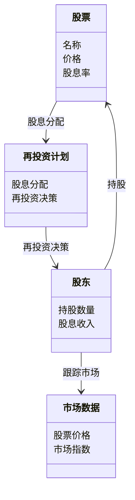
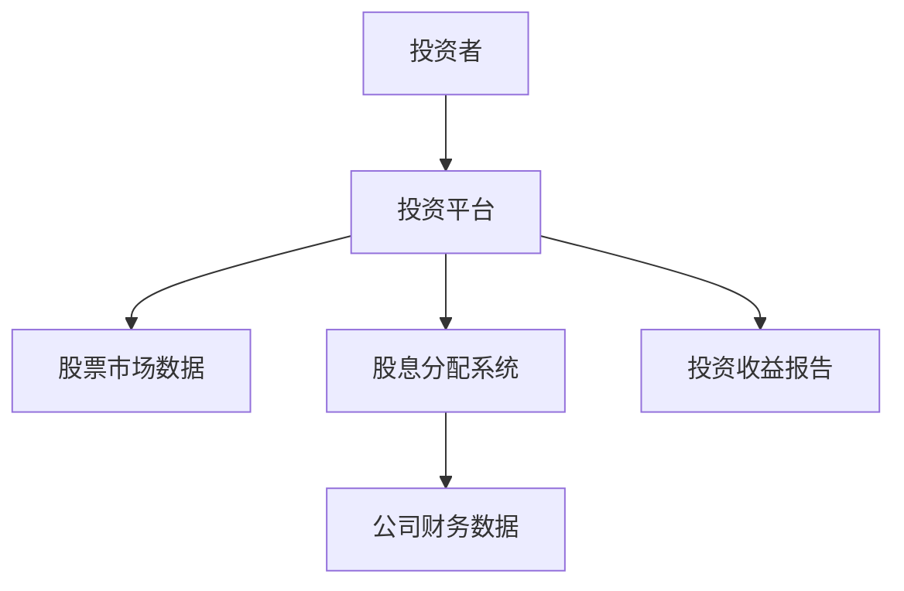

                 


# 彼得林奇如何看待公司的股息再投资计划对长期回报的影响

> 关键词：股息再投资，彼得林奇，长期回报，投资策略，股息政策，复利效应，现金流折现

> 摘要：本文从彼得林奇的投资哲学出发，详细分析了股息再投资计划对长期回报的影响。通过介绍股息再投资的背景、核心概念、数学模型、系统分析和实际案例，本文揭示了股息再投资的机制、优缺点、长期回报的驱动因素，以及如何在实际投资中应用。通过本文的分析，读者将能够全面理解股息再投资的价值，并能够在自己的投资策略中合理运用这一工具。

---

## 第1章: 股息再投资的背景与重要性

### 1.1 股息再投资的定义与背景

#### 1.1.1 股息再投资的定义
股息再投资是指将公司分配给股东的股息，按照一定的比例或金额再投资于公司股票或其他资产的过程。这种投资方式通常通过再投资计划（DRIPs，Dividend Reinvestment Plans）实现，允许投资者用收到的股息自动购买更多的公司股票，而无需支付额外的佣金或费用。

#### 1.1.2 股息再投资的起源与演变
股息再投资的概念可以追溯到18世纪，但真正的发展是在20世纪，特别是在美国，随着DRIPs的普及，股息再投资成为一种重要的投资工具。通过DRIPs，投资者可以避免支付额外的交易费用，同时利用复利效应最大化投资回报。

#### 1.1.3 股息再投资在投资组合中的作用
股息再投资不仅可以增加投资组合的规模，还能通过复利效应放大收益。此外，股息再投资还能帮助投资者在市场波动中分散风险，降低投资成本。

### 1.2 股息再投资的重要性

#### 1.2.1 股息再投资的优势
- **复利效应**：通过再投资股息，投资者可以将收益再次投入，从而加速财富积累。
- **成本降低**：DRIPs通常免佣金，降低了交易成本。
- **自动投资**：股息再投资可以自动化，便于长期坚持。

#### 1.2.2 股息再投资的风险
- **市场波动**：股息再投资依赖于市场的表现，市场下跌时可能造成损失。
- **公司股息政策变化**：公司可能减少或取消股息分配，影响再投资的规模。

#### 1.2.3 股息再投资与长期回报的关系
股息再投资通过复利效应，能够在长期内显著提升投资回报。研究表明，股息再投资的效果在长期表现中尤为明显，尤其是在市场表现稳定或向好的情况下。

---

## 第2章: 彼得林奇与股息再投资

### 2.1 彼得林奇的背景

#### 2.1.1 彼得林奇的投
彼得·林奇（Peter Lynch）是美国著名的投资经理人，曾管理富达麦哲伦基金（Fidelity Magellan Fund），创造了辉煌的投资业绩。他的投资哲学强调长期持有、深入研究和分散投资，尤其关注那些具有强大基本面和增长潜力的公司。

#### 2.1.2 彼得林奇的投资哲学
彼得林奇认为，成功的投资需要深入研究公司基本面，寻找那些具有竞争优势、管理优秀且财务健康的公司。他主张长期持有优质股票，避免频繁交易，并通过股息再投资进一步放大收益。

#### 2.1.3 彼得林奇对股息再投资的看法
彼得林奇认为，股息再投资是实现长期收益的重要工具。他强调，通过再投资股息，投资者可以利用复利效应，逐步积累财富。他尤其看好那些股息增长稳定且公司具有持续盈利能力的股票。

---

## 第3章: 股息再投资的核心概念与数学模型

### 3.1 股息再投资的核心概念

#### 3.1.1 股息再投资的机制
股息再投资的机制包括股息分配、再投资决策、股票购买和收益积累。通过DRIPs，投资者可以自动将股息用于购买更多股票，无需手动操作。

#### 3.1.2 股息再投资与其他投资策略的对比
| 对比维度       | 股息再投资                | 其他投资策略（如定期定额投资） |
|----------------|--------------------------|--------------------------------|
| 投资来源       | 股息收入                 | 自有资金或定期存款             |
| 成本           | 通常免佣金               | 可能涉及交易费用               |
| 收益           | 受股息和股价双重影响     | 受市场波动影响更大             |
| 适用场景       | 适合长期持有股息型股票   | 适合分散投资多种资产           |

#### 3.1.3 股息再投资的优缺点
- **优点**：复利效应、降低成本、自动化投资。
- **缺点**：依赖市场表现、股息政策变化可能影响收益。

### 3.2 股息再投资的数学模型

#### 3.2.1 复利计算公式
股息再投资的收益可以通过复利公式计算：
$$
FV = P \times (1 + r)^n
$$
其中，$P$ 是初始投资，$r$ 是年化收益率，$n$ 是投资年数。

#### 3.2.2 现金流折现模型
股息再投资的现值可以通过现金流折现模型计算：
$$
PV = \frac{D}{r - g}
$$
其中，$D$ 是股息的现值，$r$ 是折现率，$g$ 是股息增长率。

---

## 第4章: 系统分析与架构设计

### 4.1 系统模型
股息再投资系统的组成包括：
1. **输入**：股息分配、市场数据。
2. **处理**：股息再投资决策、股票购买。
3. **输出**：投资收益、资产报告。

### 4.2 领域模型
使用mermaid绘制领域模型类图：



### 4.3 系统架构
使用mermaid绘制系统架构图：



### 4.4 接口设计
主要接口包括：
1. **股息分配接口**：接收股息数据并触发再投资。
2. **市场数据接口**：获取实时市场数据用于决策。
3. **投资报告接口**：生成投资收益报告。

---

## 第5章: 项目实战与案例分析

### 5.1 环境安装
需要安装以下工具：
- Python编程环境（如Anaconda）
- 数据分析库（如Pandas、NumPy）
- 图表绘制库（如Matplotlib、Seaborn）

### 5.2 核心代码实现

```python
import pandas as pd
import numpy as np
import matplotlib.pyplot as plt

# 示例：股息再投资的收益计算
initial_investment = 1000
dividend_rate = 0.05
years = 10

# 计算复利
def compound_interest(principal, rate, time):
    return principal * (1 + rate) ** time

# 计算股息再投资收益
final_value = compound_interest(initial_investment, dividend_rate, years)
print(f"最终价值：{final_value:.2f}")

# 绘制收益曲线
years = np.arange(1, 11)
values = [initial_investment * (1 + dividend_rate)**year for year in years]

plt.plot(years, values)
plt.title('股息再投资收益曲线')
plt.xlabel('年数')
plt.ylabel('价值')
plt.show()
```

### 5.3 案例分析
以可口可乐为例，分析股息再投资的长期回报：
1. **初始投资**：1000美元。
2. **股息率**：假设为5%。
3. **投资时间**：10年。
4. **最终价值**：$1000 \times (1 + 0.05)^{10} = 1628.89$美元。

---

## 第6章: 结论与展望

### 6.1 结论
股息再投资通过复利效应和自动化投资，能够显著提升长期回报。彼得林奇的投资哲学为股息再投资提供了理论支持，而实际案例也证明了其有效性。

### 6.2 展望
未来，随着技术的进步，股息再投资将更加智能化和自动化。投资者可以通过AI驱动的投资工具进一步优化投资策略。

### 6.3 最佳实践Tips
1. **选择优质股**：投资具有稳定股息和良好基本面的公司。
2. **长期持有**：避免频繁交易，享受复利效应。
3. **分散投资**：通过投资多个公司分散风险。

---

## 作者

作者：AI天才研究院/AI Genius Institute & 禅与计算机程序设计艺术 /Zen And The Art of Computer Programming

