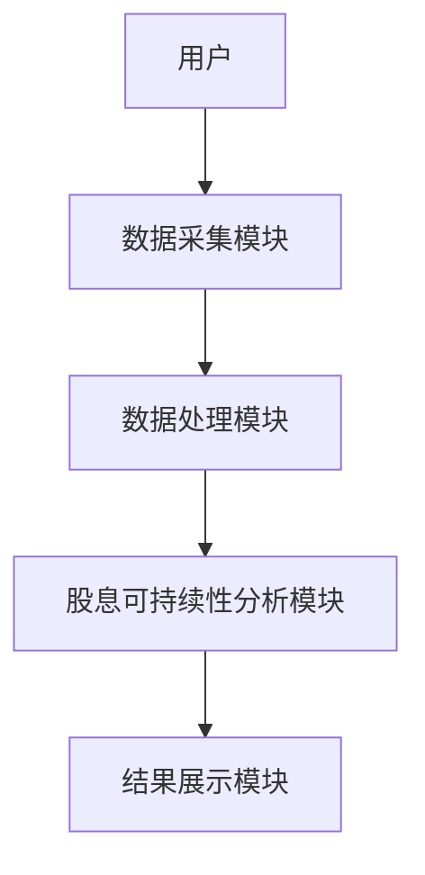
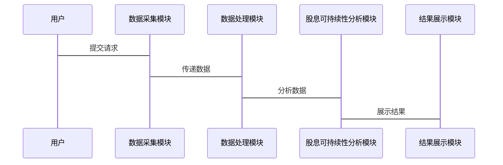

                 


# 彼得林奇如何看待公司的股息可持续性

> 关键词：股息支付，可持续性，财务指标，现金流，股息率

> 摘要：本文从彼得·林奇的投资理念出发，深入分析股息可持续性的核心概念，探讨如何通过财务指标、行业特性和公司治理结构等多维度评估股息的可持续性，并结合实际案例和系统架构设计，为投资者提供科学的股息投资策略。

---

# 第一部分: 股息可持续性概述

## 第1章: 股息可持续性的基本概念

### 1.1 股息支付的基本概念

#### 1.1.1 股息支付的定义
股息是指公司向股东分配的利润部分，通常以现金或股票形式支付。股息支付是公司与股东之间的一种分配机制，反映了公司盈利能力与股东回报之间的关系。

#### 1.1.2 股息支付的类型
股息支付主要有现金股息、股票股息、财产股息和混合股息四种类型。其中，现金股息最为常见，是公司直接向股东分配现金。

#### 1.1.3 股息支付的动机与目的
公司支付股息的主要动机包括：回报股东、维持股价稳定、优化资本结构、避免过度积累等。合理的股息支付策略有助于提升股东信心和公司形象。

### 1.2 股息可持续性的定义与特征

#### 1.2.1 股息可持续性的定义
股息可持续性是指公司长期稳定支付股息的能力，通常取决于公司的财务状况、盈利能力和现金流稳定性。

#### 1.2.2 股息可持续性的核心特征
- 财务稳定性：公司是否有足够的现金流和利润来支持持续的股息支付。
- 盈利能力：公司是否能够保持稳定的盈利水平。
- 负债情况：公司是否存在过高的债务负担，影响股息支付能力。

#### 1.2.3 股息可持续性与企业财务健康的关系
股息可持续性是企业财务健康的重要指标。持续的股息支付表明公司具有稳定的盈利能力和良好的财务状况，能够为股东创造长期价值。

## 第2章: 彼得·林奇的投资理念

### 2.1 彼得·林奇的背景介绍

#### 2.1.1 彼得·林奇的生平简介
彼得·林奇（Peter Lynch）是美国著名的职业棒球运动员和投资家，以其在棒球界和投资界的双重成就闻名。

#### 2.1.2 彼得·林奇的投资风格
彼得·林奇以价值投资和成长投资相结合的投资风格著称，注重分析公司的基本面和财务数据，寻找具有持续盈利能力和良好管理的公司。

#### 2.1.3 彼得·林奇的代表作品
彼得·林奇的代表作品包括《彼得·林奇的成功投资》和《彼得·林奇的投资策略》，这些书籍详细阐述了他的投资理念和方法。

### 2.2 彼得·林奇与股息投资

#### 2.2.1 彼得·林奇对股息投资的看法
彼得·林奇认为，股息支付是公司财务健康的重要指标，稳定的股息支付能力反映了公司的盈利能力和财务稳定性。

#### 2.2.2 彼得·林奇的经典股息投资案例
彼得·林奇在投资生涯中选择了许多具有稳定股息支付能力的公司，例如可口可乐和强生公司。

#### 2.2.3 彼得·林奇股息投资的核心理念
彼得·林奇强调，投资者应该选择那些具有持续盈利能力和良好股息支付能力的公司，避免投资于股息支付不稳定或财务状况不佳的公司。

---

# 第二部分: 股息可持续性分析框架

## 第3章: 股息可持续性的核心影响因素

### 3.1 财务指标分析

#### 3.1.1 净利润与股息支付的关系
净利润是公司支付股息的基础，公司只有在净利润足够的情况下才能支付股息。通过分析净利润率和股息支付率，可以评估公司的股息支付能力。

#### 3.1.2 自由现金流与股息支付能力
自由现金流是公司用于股息支付和其他投资活动的现金流来源。充足的自由现金流是公司持续支付股息的重要保障。

#### 3.1.3 负债率与股息支付的可持续性
高负债率会增加公司的财务负担，影响股息支付能力。因此，低负债率是股息可持续性的重要保障。

### 3.2 行业特性分析

#### 3.2.1 不同行业股息支付的特点
不同行业的股息支付能力存在显著差异。例如，公用事业和消费必需品行业通常具有较高的股息支付能力，而高科技行业股息支付能力较低。

#### 3.2.2 行业周期性对股息支付的影响
行业周期性波动会影响公司的盈利能力和现金流，从而影响股息支付的可持续性。例如，在经济衰退期间，一些行业可能会减少股息支付。

#### 3.2.3 行业政策对股息支付的约束
行业政策和法规也会影响股息支付。例如，某些行业可能受到严格的监管，限制其股息支付能力。

### 3.3 公司治理结构分析

#### 3.3.1 公司治理对股息支付的影响
良好的公司治理结构能够确保公司管理层的决策符合股东利益，从而提高股息支付的可持续性。

#### 3.3.2 股东结构与股息支付的关系
股东结构影响公司的股息支付策略。例如，机构投资者通常更注重股息收入，而散户投资者可能更关注资本增值。

#### 3.3.3 管理层决策对股息支付的影响
公司管理层的决策直接影响股息支付。管理层需要在股息支付和再投资之间找到平衡，以确保公司的长期发展和股东利益。

## 第4章: 股息可持续性评估模型

### 4.1 股息支付能力评估指标

#### 4.1.1 股息支付率（DPR）
股息支付率是公司支付的股息占净利润的比例，反映了公司股息支付的可持续性。

公式：$$\text{股息支付率} = \frac{\text{股息支付总额}}{\text{净利润}}$$

#### 4.1.2 股息与自由现金流比（DCF Yield）
DCF Yield是股息支付与自由现金流的比率，用于评估公司股息支付的可持续性。

公式：$$\text{DCF Yield} = \frac{\text{股息支付总额}}{\text{自由现金流}}$$

#### 4.1.3 股息增长能力评估
股息增长能力是公司未来股息支付能力的重要指标。可以通过历史股息增长率和预期股息增长率来评估。

### 4.2 股息可持续性综合评估框架

#### 4.2.1 财务健康状况评估
通过分析公司的财务指标，如净利润率、负债率等，评估公司的财务健康状况。

#### 4.2.2 行业环境评估
分析行业周期性、行业政策和竞争格局，评估行业对股息支付的影响。

#### 4.2.3 公司治理与管理层评估
评估公司治理结构和管理层决策，确保公司管理层能够持续支付股息。

## 第5章: 彼得·林奇股息投资策略的数学模型

### 5.1 股息支付能力的量化分析

#### 5.1.1 净利润与股息支付的关系公式
$$\text{股息支付总额} = \text{净利润} \times \text{股息支付率}$$

#### 5.1.2 自由现金流与股息支付的数学模型
$$\text{自由现金流} = \text{净利润} - \text{资本支出}$$

#### 5.1.3 股息支付率的计算公式
$$\text{股息支付率} = \frac{\text{股息支付总额}}{\text{净利润}}$$

### 5.2 股息可持续性综合评分模型

#### 5.2.1 综合评分指标体系
- 股息支付率（DPR）
- 股息与自由现金流比（DCF Yield）
- 股息增长能力
- 财务指标健康状况
- 行业环境
- 公司治理与管理层评估

#### 5.2.2 综合评分的计算方法
通过加权平均法计算各指标的综合评分，权重根据行业和公司具体情况调整。

#### 5.2.3 模型的验证与优化
通过历史数据验证模型的有效性，并根据市场变化和公司具体情况优化模型。

---

# 第三部分: 系统架构与

## 第6章: 系统架构与

### 6.1 系统功能设计

#### 6.1.1 数据采集模块
- 数据来源：公司财务报表、行业报告、市场数据等。
- 数据类型：净利润、自由现金流、股息支付率、负债率等。

#### 6.1.2 数据处理模块
- 数据清洗：处理缺失值、异常值等。
- 数据转换：将数据转换为可分析的格式。

#### 6.1.3 股息可持续性分析模块
- 财务指标分析：计算股息支付率、DCF Yield等指标。
- 行业特性分析：分析行业周期性、政策影响等。
- 公司治理评估：评估公司治理结构和管理层决策。

### 6.2 系统架构设计

#### 6.2.1 系统架构图


#### 6.2.2 系统接口设计
- 数据采集接口：从数据库或外部数据源获取数据。
- 数据处理接口：对数据进行清洗和转换。
- 分析接口：计算股息可持续性指标并生成报告。

#### 6.2.3 系统交互设计


---

# 第四部分: 项目实战

## 第7章: 项目实战

### 7.1 环境安装

#### 7.1.1 安装Python
```bash
# 安装Python
apt-get install python3
```

#### 7.1.2 安装相关库
```bash
# 安装Pandas、NumPy、Matplotlib
pip install pandas numpy matplotlib
```

### 7.2 系统核心实现源代码

#### 7.2.1 数据采集模块
```python
import pandas as pd

def get_data(ticker):
    # 获取公司财务数据
    data = pd.read_csv(f'data/{ticker}.csv')
    return data
```

#### 7.2.2 数据处理模块
```python
def process_data(data):
    # 数据清洗和转换
    data = data.dropna()
    data['DPR'] = data['股息支付总额'] / data['净利润']
    return data
```

#### 7.2.3 股息可持续性分析模块
```python
def analyze_dividends(data):
    # 计算股息可持续性指标
    data['DCF Yield'] = data['股息支付总额'] / data['自由现金流']
    return data
```

### 7.3 代码应用解读与分析

#### 7.3.1 数据采集模块
从指定路径读取公司财务数据，返回数据框。

#### 7.3.2 数据处理模块
对数据进行清洗（删除缺失值）并计算股息支付率（DPR）。

#### 7.3.3 股息可持续性分析模块
计算股息与自由现金流比（DCF Yield），评估股息支付的可持续性。

### 7.4 实际案例分析

#### 7.4.1 案例选择
选择苹果公司作为案例，分析其股息支付的可持续性。

#### 7.4.2 数据分析
```python
data = get_data('AAPL')
processed_data = process_data(data)
analysis_data = analyze_dividends(processed_data)
```

#### 7.4.3 结果展示
展示苹果公司的股息支付率和DCF Yield，评估其股息可持续性。

### 7.5 项目小结

通过本项目，我们学会了如何使用Python和相关库进行股息可持续性分析，掌握了彼得·林奇的投资理念，并通过实际案例分析验证了模型的有效性。

---

# 第五部分: 总结

## 第8章: 总结

### 8.1 最佳实践 tips
- 选择具有稳定股息支付能力和良好财务状况的公司。
- 结合行业特性和公司治理结构进行综合评估。
- 定期监控公司财务数据和市场变化，及时调整投资策略。

### 8.2 小结
本文从彼得·林奇的投资理念出发，详细分析了股息可持续性的核心概念和评估方法，结合系统架构设计和实际案例分析，为投资者提供了科学的股息投资策略。

### 8.3 注意事项
- 股息支付能力受到多种因素影响，投资者需要综合考虑。
- 市场变化和公司具体情况可能影响股息支付的可持续性。
- 投资者应保持对市场的敏感性和对公司的持续关注。

### 8.4 拓展阅读
- 彼得·林奇的《彼得·林奇的成功投资》
- 《股息投资实战策略》
- 《财务报表分析与投资决策》

---

作者：AI天才研究院/AI Genius Institute & 禅与计算机程序设计艺术/Zen And The Art of Computer Programming

