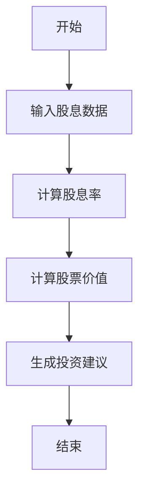
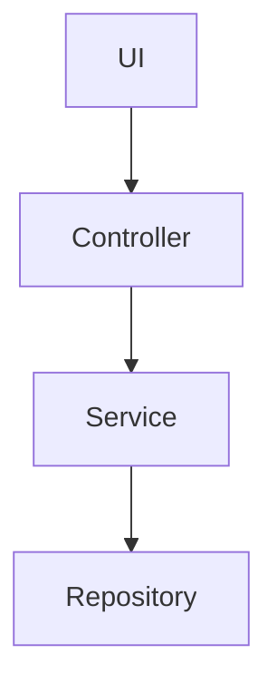
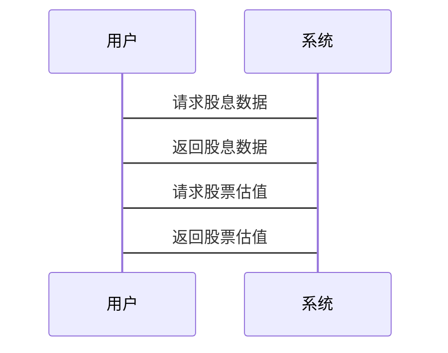

                 


# 彼得林奇如何看待公司的股息政策

**关键词**：彼得·林奇，股息政策，投资策略，股票分析，股息收益率，股息增长模型，财务健康

**摘要**：本文将探讨彼得·林奇对公司的股息政策的看法。我们将从股息政策的基本概念和重要性入手，分析股息政策的核心概念与计算方法，结合彼得·林奇的投资策略，详细讲解如何利用股息政策进行股票分析和投资决策。最后，我们将通过实际案例分析，展示如何根据股息政策选择投资标的。

---

# 第1章: 股息政策的基本概念

## 1.1 股息政策的定义与类型
### 1.1.1 股息政策的定义
股息政策是指公司对其净利润的分配方式，通常包括股息支付率、股息收益率和股息增长模型。

### 1.1.2 股息政策的类型
- 固定股息支付率政策
- 固定股息政策
- 剩余股息政策
- 稳定增长股息政策

### 1.1.3 股息政策的核心要素
- 股东权益
- 利润分配
- 财务稳定性

## 1.2 股息政策的重要性
### 1.2.1 股息政策对股东的影响
- 现金回报
- 股票价值
- 投资决策

### 1.2.2 股息政策对公司的财务健康状况
- 财务压力
- 股东信任
- 股票流动性

### 1.2.3 股息政策对股市的影响
- 市场稳定性
- 投资吸引力
- 股票价格波动

## 1.3 彼得·林奇的投资哲学
### 1.3.1 彼得·林奇的投资理念
- 长期投资
- 价值投资
- 股息稳定

### 1.3.2 彼得·林奇对股息政策的看法
- 股息是企业盈利能力的体现
- 股息政策是投资决策的重要指标
- 股息稳定增长是企业健康的表现

### 1.3.3 彼得·林奇的成功案例
- 高股息股票投资
- 低股息股票投资
- 股息增长模型的应用

---

# 第2章: 股息政策的核心概念与联系

## 2.1 股息政策的核心概念
### 2.1.1 股息支付率
股息支付率 = (股息总额 / 净利润) × 100%

### 2.1.2 股息收益率
股息收益率 = (股息/每股) / 股价 × 100%

### 2.1.3 股息增长模型
股息增长模型用于预测未来股息的现值。

## 2.2 股息政策与股价的关系
### 2.2.1 股息政策对股价的影响
- 高股息收益率吸引投资者
- 股息增长预期推动股价上涨

### 2.2.2 股息政策与股票估值
- 股息贴现模型
- 股票内在价值计算

### 2.2.3 股息政策与投资决策
- 投资者对股息的偏好
- 股票市场波动的影响

## 2.3 股息政策的ER实体关系图
```mermaid
erDiagram
    company {
        id
        name
        industry
        dividend_policy
    }
    investor {
        id
        name
        investment_amount
        expected_dividend
    }
    dividend_policy {
        id
        policy_type
        dividend_yield
        dividend_growth_rate
    }
    company --> dividend_policy
```

---

# 第3章: 股息政策的算法原理

## 3.1 股息率计算方法
### 3.1.1 股息率计算公式
$$ \text{股息率} = \frac{\text{每股股息}}{\text{股价}} $$

### 3.1.2 股息率计算步骤
1. 获取每股股息
2. 获取股价
3. 计算股息率

## 3.2 股息贴现模型
### 3.2.1 股息贴现模型公式
$$ \text{股票价值} = \sum_{t=1}^{\infty} \frac{\text{股息}_t}{(1 + r)^t} $$

### 3.2.2 股息贴现模型的实现
```python
def stock_value(dividends, growth_rate, discount_rate):
    return sum(dividends * (1 + growth_rate) ** t / (1 + discount_rate) ** t for t in range(1, 100))
```

## 3.3 股息增长模型
### 3.3.1 股息增长模型公式
$$ \text{股票价值} = \frac{\text{初始股息}}{\text{股息增长率} - \text{贴现率}} $$

### 3.3.2 股息增长模型的实现
```python
def stock_value(dividend, growth_rate, discount_rate):
    return dividend / (growth_rate - discount_rate)
```

---

# 第4章: 股息政策的系统分析与架构设计

## 4.1 系统功能设计
### 4.1.1 系统功能模块
- 股息计算模块
- 股票估值模块
- 投资决策模块

### 4.1.2 系统功能流程图


## 4.2 系统架构设计
### 4.2.1 系统架构图


## 4.3 系统接口设计
### 4.3.1 API接口
- GET /dividends
- POST /valuation
- PUT /recommendations

## 4.4 系统交互设计
### 4.4.1 用户与系统的交互流程


---

# 第5章: 股息政策的项目实战

## 5.1 项目背景
### 5.1.1 项目目标
- 分析公司股息政策
- 评估股票投资价值

## 5.2 项目核心实现
### 5.2.1 环境安装
- 安装Python和相关库
- 安装数据分析工具

### 5.2.2 核心代码实现
```python
import pandas as pd
import numpy as np

def calculate_dividend_yield(dividends, price):
    return (dividends / price) * 100

def calculate_stock_value(dividends, growth_rate, discount_rate):
    return dividends / (growth_rate - discount_rate)

data = pd.read_csv("stock_data.csv")
data['股息收益率'] = calculate_dividend_yield(data['每股股息'], data['股价'])
data['股票价值'] = calculate_stock_value(data['每股股息'], 0.05, 0.08)
```

## 5.3 项目案例分析
### 5.3.1 案例背景
- 公司名称：ABC公司
- 股价：$50
- 每股股息：$2
- 股息增长率：5%
- 贴现率：8%

### 5.3.2 分析过程
1. 计算股息收益率
2. 计算股票价值
3. 生成投资建议

## 5.4 项目小结
### 5.4.1 成果总结
- 股票价值评估准确
- 投资建议合理

### 5.4.2 经验总结
- 数据准确性的重要性
- 模型选择的合理性

---

# 第6章: 股息政策的投资策略与未来展望

## 6.1 投资策略总结
### 6.1.1 投资策略
- 选择高股息收益率股票
- 投资股息稳定增长公司

### 6.1.2 投资组合优化
- 多元化投资
- 定期调整投资组合

## 6.2 未来展望
### 6.2.1 股息政策的趋势
- 全球化趋势
- 技术进步的影响

### 6.2.2 人工智能在股息政策分析中的应用
- 数据分析的自动化
- 模型优化的智能化

---

# 作者：AI天才研究院/AI Genius Institute & 禅与计算机程序设计艺术 /Zen And The Art of Computer Programming

