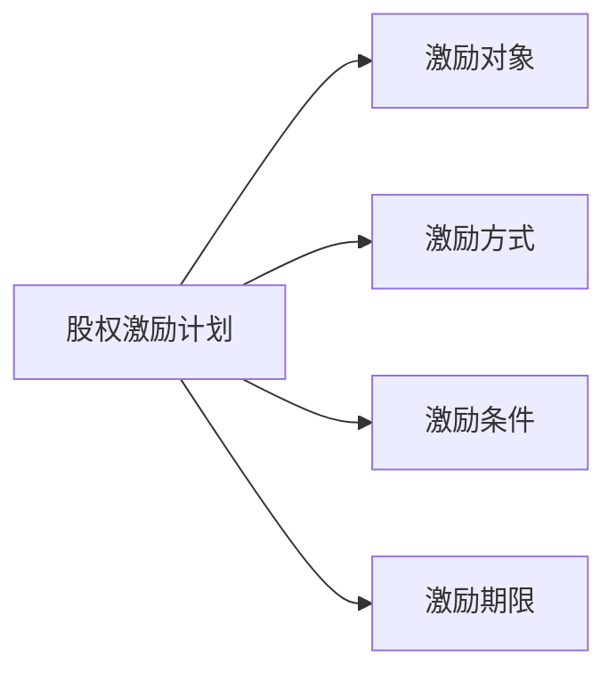
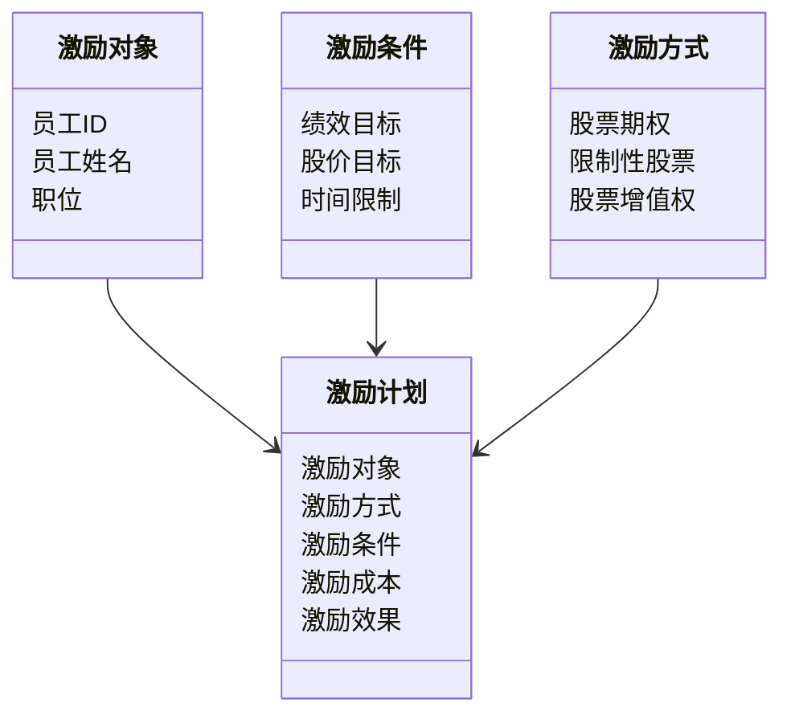
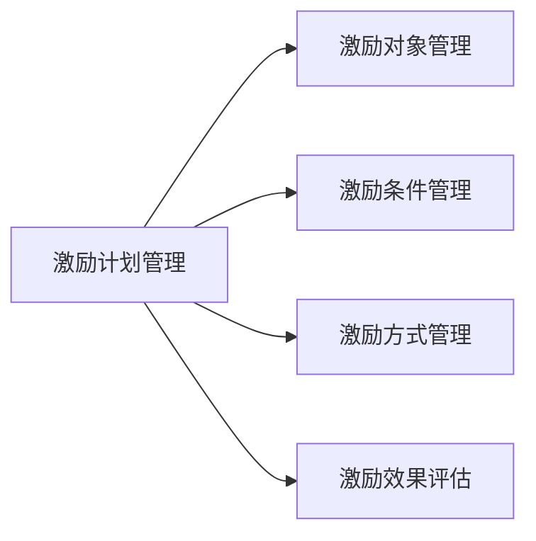

                 


# 彼得林奇如何看待公司的股权激励计划有效性

> 关键词：股权激励，彼得林奇，公司治理，投资回报，管理行为

> 摘要：本文从彼得林奇的投资理念出发，深入分析股权激励计划的有效性，探讨股权激励计划在公司治理中的作用，以及如何通过数学模型和算法原理来评估股权激励计划的实际效果。文章结合实际案例，详细讲解股权激励计划的实施背景、核心概念、评估方法和优化策略，为读者提供全面的视角和实用的指导。

---

## 第一部分: 股权激励计划的背景与核心概念

### 第1章: 股权激励计划的基本概念与历史发展

#### 1.1 股权激励计划的定义与核心要素

股权激励计划是一种通过向公司管理层和核心员工提供公司股票或其衍生品来激励其长期绩效的机制。其核心要素包括：

- **激励对象**：通常包括公司高管、核心员工和技术骨干。
- **激励方式**：包括股票期权、限制性股票、股票增值权等。
- **激励条件**：通常与公司业绩、股价表现或个人绩效挂钩。
- **激励期限**：通常为3-5年，以确保激励的长期性。



#### 1.2 股权激励计划的类型与特点

股权激励计划主要分为以下几种类型：

- **股票期权**：允许激励对象以固定价格购买公司股票。
- **限制性股票**：激励对象需要满足特定条件才能获得股票。
- **股票增值权**：激励对象获得股票增值部分的收益。

下表对比了三种激励方式的优缺点：

| 激励方式 | 优点 | 缺点 |
|----------|------|------|
| 股票期权 | 灵活性高，激励性强 | 可能导致管理层短期行为 |
| 限制性股票 | 约束性强，激励与绩效挂钩 | 实施复杂，成本较高 |
| 股票增值权 | 风险低，激励效果稳定 | 激励效果不如股票期权直接 |

#### 1.3 彼得林奇与股权激励计划的关联

彼得林奇是美国著名基金经理，以其价值投资理念闻名。他认为，股权激励计划的有效性取决于以下几个方面：

- **激励对象的长期性**：激励计划应鼓励管理层关注公司长期价值。
- **激励条件的合理性**：激励条件应与公司业绩挂钩，避免短期行为。
- **激励机制的公平性**：激励计划应公平合理，避免内部人控制。

#### 1.4 股权激励计划的实施背景

随着公司治理的不断完善，股权激励计划在全球范围内逐渐普及。以下是股权激励计划实施的背景：

- **公司治理需求**：通过股权激励计划，将管理层利益与股东利益绑定。
- **吸引和留住人才**：通过提供长期激励，吸引和留住核心员工。
- **提升公司绩效**：通过激励计划，激发管理层和员工的积极性。

---

## 第二部分: 股权激励计划的有效性分析框架

### 第2章: 彼得林奇视角下的股权激励计划有效性评估

#### 2.1 股权激励计划的有效性维度

从彼得林奇的视角来看，股权激励计划的有效性可以从以下几个维度进行评估：

- **经济维度**：激励计划是否提升了股东价值。
- **管理维度**：激励计划是否改善了管理层行为。
- **市场维度**：激励计划是否促进了股价上涨。

#### 2.2 彼得林奇的评估标准

彼得林奇认为，股权激励计划的有效性应基于以下几个标准：

- **投资回报率**：激励计划是否带来了超额投资回报。
- **管理层行为**：激励计划是否促使管理层做出长期决策。
- **股价表现**：激励计划是否推动了股价的长期上涨。

#### 2.3 股权激励计划的实施效果评价

彼得林奇强调，股权激励计划的实施效果应通过以下几个方面进行评价：

- **激励收益与成本的对比**：计算激励计划的净收益。
- **激励计划的实施效果与公司绩效的关联性**：通过回归分析验证激励效果。

---

## 第三部分: 股权激励计划的数学模型与算法原理

### 第3章: 股权激励计划的数学模型构建

#### 3.1 股权激励计划的激励效果模型

股权激励计划的激励效果可以通过以下公式进行量化：

$$激励效果 = \frac{激励收益}{激励成本}$$

其中：

- **激励收益** = 股票价格增长 × 激励股份比例
- **激励成本** = 激励股份价值 × 行权价格折扣率

#### 3.2 彼得林奇投资模型与股权激励的结合

彼得林奇的投资模型可以与股权激励计划结合，通过以下公式进行分析：

$$投资价值 = \frac{企业内在价值}{市场价值}$$

其中，股权激励计划对内在价值的影响可以通过以下方式计算：

$$内在价值变化 = 激励计划带来的绩效提升 × 激励计划的覆盖范围$$

#### 3.3 股权激励计划的优化算法

以下是优化股权激励计划的算法流程图：


---

## 第四部分: 股权激励计划的系统分析与架构设计

### 第4章: 股权激励计划的系统分析与架构设计

#### 4.1 问题场景介绍

股权激励计划的实施需要解决以下问题：

- **激励对象选择**：如何选择合适的激励对象。
- **激励条件设计**：如何设计合理的激励条件。
- **激励计划优化**：如何优化激励计划以提升效果。

#### 4.2 系统功能设计

以下是股权激励计划的系统功能设计：



#### 4.3 系统架构设计

以下是股权激励计划的系统架构设计：



---

## 第五部分: 股权激励计划的项目实战

### 第5章: 股权激励计划的项目实战

#### 5.1 环境安装与配置

以下是项目实战所需的环境安装步骤：

1. 安装Python和相关库（如numpy、pandas、matplotlib）。
2. 安装Jupyter Notebook用于数据可视化。

#### 5.2 系统核心实现源代码

以下是股权激励计划评估的Python代码实现：

```python
import numpy as np
import pandas as pd
import matplotlib.pyplot as plt

# 定义激励效果计算函数
def calculate_incentive_effectiveness(incentive_cost, incentive收益):
    effectiveness = incentive收益 / incentive_cost
    return effectiveness

# 读取数据
data = pd.read_csv('incentive_data.csv')

# 计算激励效果
effectiveness = calculate_incentive_effectiveness(data['incentive_cost'], data['incentive收益'])

# 可视化结果
plt.bar(data['员工ID'], effectiveness)
plt.title('股权激励计划效果分析')
plt.xlabel('员工ID')
plt.ylabel('激励效果')
plt.show()
```

---

## 第六部分: 股权激励计划的最佳实践与小结

### 第6章: 股权激励计划的最佳实践

#### 6.1 小结

股权激励计划的有效性取决于以下几个关键因素：

- **激励对象的选择**：应选择对公司绩效有直接影响的核心员工。
- **激励条件的设计**：应与公司绩效挂钩，避免短期行为。
- **激励计划的优化**：应根据公司实际情况进行动态调整。

#### 6.2 注意事项

- **避免过度激励**：激励成本过高可能损害股东利益。
- **注重公平性**：激励计划应公平合理，避免引发内部矛盾。
- **加强监管**：应建立有效的监管机制，防止内部人控制。

#### 6.3 拓展阅读

- 彼得林奇的《投资之道》
- 公司治理相关的学术文献

---

## 作者：AI天才研究院/AI Genius Institute & 禅与计算机程序设计艺术/Zen And The Art of Computer Programming

