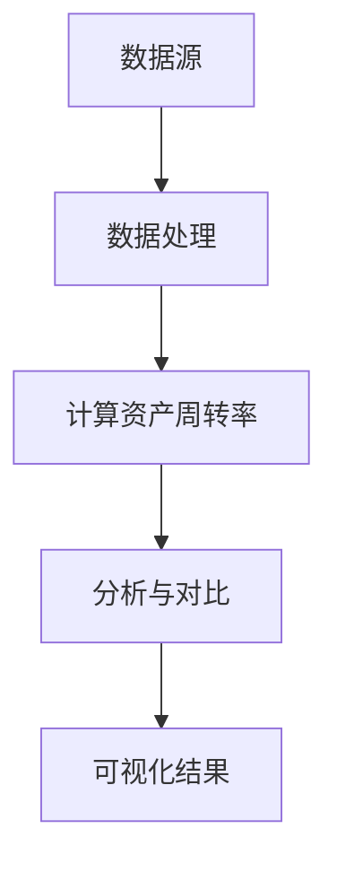
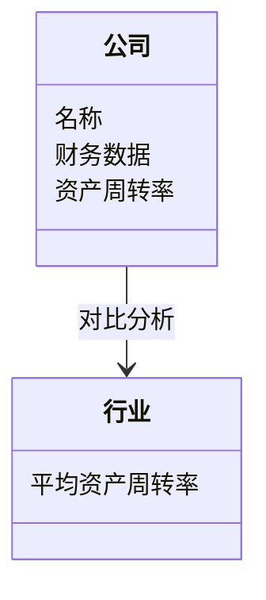

                 

# 彼得林奇如何看待公司的资产周转率

> 关键词：彼得林奇、资产周转率、投资分析、公司估值、财务指标

> 摘要：本文探讨了资产周转率在投资分析中的重要性，详细分析了彼得林奇如何通过资产周转率评估公司价值，并提供了相关的数学模型和实际案例。

---

# 正文

## 第一部分：背景介绍

### 第1章：资产周转率的基本概念

#### 1.1 资产周转率的定义与计算方法

资产周转率（Asset Turnover Ratio）是衡量公司资产使用效率的重要指标，反映了公司每单位资产所产生的销售收入。其计算公式为：

$$ \text{资产周转率} = \frac{\text{销售收入}}{\text{平均总资产}} $$

资产周转率的计算需要考虑公司的销售收入和平均总资产。例如，某公司销售收入为1000万元，年初总资产为800万元，年末总资产为1200万元，则平均总资产为1000万元，资产周转率为1倍。

#### 1.2 资产周转率在投资分析中的作用

资产周转率不仅是衡量公司运营效率的重要指标，也是评估公司价值的关键因素。高资产周转率通常意味着公司能够更高效地利用资产创造收入，进而提高盈利能力。在投资决策中，资产周转率可以帮助投资者识别出那些管理效率高、资产使用效率强的公司。

#### 1.3 彼得林奇对资产周转率的重视

彼得林奇是美国著名投资专家，以其基本面分析和价值投资理念闻名。他认为，资产周转率是评估公司运营效率和价值的重要指标。通过分析资产周转率，彼得林奇能够识别出那些具有竞争优势和成长潜力的公司。他尤其关注那些资产周转率高、盈利能力强且估值合理的公司。

## 第二部分：核心概念与属性

### 第2章：资产周转率的核心概念与属性

#### 2.1 资产周转率的驱动因素

资产周转率受多种因素影响，包括行业特性、公司规模和管理效率等。例如，零售行业通常具有较高的资产周转率，而制造业则可能较低。此外，公司规模和管理效率也会影响资产周转率。大型公司由于资产规模较大，可能在资产周转率上表现不如小型公司。

#### 2.2 资产周转率与公司价值的关系

资产周转率与公司价值密切相关。高资产周转率通常意味着公司能够更高效地利用资产创造利润，从而提高公司的整体价值。然而，资产周转率并非越高越好，需要结合行业特点和公司具体情况综合分析。

#### 2.3 资产周转率的优缺点分析

- **优点**：资产周转率能够反映公司的资产使用效率，帮助投资者识别出管理效率高、资产使用效率强的公司。
- **缺点**：资产周转率受行业特性和公司规模影响较大，不同行业的资产周转率差异显著，单纯依赖资产周转率难以全面评估公司价值。

## 第三部分：算法原理

### 第3章：资产周转率的数学模型与公式

#### 3.1 资产周转率的计算公式

资产周转率的计算公式为：

$$ \text{资产周转率} = \frac{\text{销售收入}}{\text{平均总资产}} $$

其中，平均总资产计算公式为：

$$ \text{平均总资产} = \frac{\text{年初总资产} + \text{年末总资产}}{2} $$

#### 3.2 资产周转率与ROA的关系

资产周转率与资产净利率（ROA）密切相关。ROA的计算公式为：

$$ \text{ROA} = \frac{\text{净利润}}{\text{平均总资产}} $$

资产周转率与ROA的关系为：

$$ \text{ROA} = \text{资产周转率} \times \text{净利率} $$

其中，净利率为净利润占销售收入的比例。

#### 3.3 资产周转率的行业基准与比较

资产周转率的行业基准通常由行业平均水平决定。例如，零售行业的资产周转率通常高于制造业。通过横向和纵向比较，可以评估公司在行业中的相对位置。

## 第四部分：系统分析与架构设计方案

### 第4章：系统分析与架构设计方案

#### 4.1 系统架构设计

系统架构设计包括数据收集、计算、分析和可视化四个模块。数据收集模块负责获取公司财务数据，计算模块负责计算资产周转率，分析模块负责对比分析，可视化模块负责呈现结果。

#### 4.2 数据流图

#### 4.3 实体关系图

## 第五部分：项目实战

### 第5章：项目实战

#### 5.1 案例分析

以零售行业为例，选取两家公司A和公司B进行分析。假设公司A的销售收入为1000万元，平均总资产为800万元，资产周转率为1.25倍；公司B的销售收入为1500万元，平均总资产为1000万元，资产周转率为1.5倍。通过比较，公司B的资产周转率更高，说明其资产使用效率更好。

## 第六部分：最佳实践与小结

### 第6章：最佳实践与小结

#### 6.1 投资建议

投资者应结合资产周转率、净利率和行业特点进行综合分析。同时，关注公司的管理效率和成长潜力，选择那些资产周转率高、盈利能力强且估值合理的公司。

#### 6.2 注意事项

资产周转率的分析应结合行业特性和公司具体情况，避免单纯依赖资产周转率进行投资决策。

#### 6.3 未来研究方向

未来可以进一步研究资产周转率与公司市值的关系，以及如何通过资产周转率预测公司业绩变化。

---

# 作者

作者：AI天才研究院/AI Genius Institute & 禅与计算机程序设计艺术 /Zen And The Art of Computer Programming

---

以上为文章的详细大纲和内容，根据需要可以进一步扩展每个部分的具体内容，以确保文章的完整性和深度。

