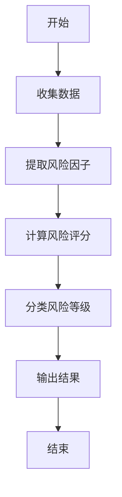

                 


# 彼得林奇如何看待公司的资产负债表外风险

> 关键词：彼得·林奇，资产负债表外风险，财务分析，投资策略，风险评估

> 摘要：本文深入探讨了彼得·林奇对资产负债表外风险的分析方法和见解。通过系统化的分析框架、数学模型和实际案例，详细解读了如何识别和评估资产负债表外风险，以及这些风险对公司投资价值的影响。文章从核心概念、算法原理、系统架构等多个维度展开，结合实际案例和最佳实践，为投资者提供了全面的指导。

---

## 第一部分: 背景介绍

### 第1章: 资产负债表外风险的核心概念

#### 1.1 问题背景与定义
- **1.1.1 资产负债表外风险的定义**  
  资产负债表外风险是指公司资产负债表中未直接反映的潜在风险，包括法律风险、声誉风险、运营风险等。  
- **1.1.2 该问题的核心要素**  
  - 风险来源：法律纠纷、供应链问题、政策变化等。  
  - 风险影响：可能影响公司财务状况、股东权益和投资价值。  
- **1.1.3 背景与重要性**  
  资产负债表外风险通常隐藏在财务数据之外，但其对公司的影响不容忽视。投资者需要通过深入分析识别这些风险。

#### 1.2 彼得·林奇的分析视角
- **1.2.1 林奇的财务分析方法**  
  彼得·林奇以基本面分析著称，他强调通过研究公司财务报表和行业趋势来评估投资价值。  
- **1.2.2 资产负债表外风险的识别**  
  林奇认为，资产负债表外风险是公司财务健康的重要组成部分，通常通过分析公司治理、法律纠纷和行业环境来识别。  
- **1.2.3 林奇对风险的分类与评估**  
  林奇将风险分为系统性风险和非系统性风险，并通过权重分析法评估其对投资的影响。

#### 1.3 核心概念的结构与组成
- **1.3.1 核心概念的属性特征对比表**  
  | 属性 | 资产负债表内风险 | 资产负债表外风险 |
  |------|------------------|------------------|
  | 数据来源 | 财务报表         | 非财务信息       |
  | 影响范围 | 财务状况         | 公司声誉、法律等 |
  | 分析难度 | 直接             | 间接             |
- **1.3.2 ER实体关系图**  
  通过ER图展示公司、风险来源、影响因素之间的关系。

---

## 第二部分: 核心概念与联系

### 第2章: 资产负债表外风险的识别与分析

#### 2.1 风险识别方法
- **2.1.1 常见的资产负债表外风险类型**  
  - 法律风险：诉讼、合同纠纷等。  
  - 声誉风险：产品质量、高管丑闻等。  
  - 运营风险：供应链中断、技术落后等。  
- **2.1.2 风险识别的关键指标**  
  - 法律纠纷数量：公司涉及的诉讼案件数量。  
  - 媒体负面报道：公司声誉受到的影响。  
  - 供应链稳定性：供应商的可靠性和替代性。  

#### 2.2 彼得·林奇的分析框架
- **2.2.1 林奇的财务分析框架**  
  林奇通过分析公司历史财务数据，识别潜在的财务风险。  
- **2.2.2 资产负债表外风险的评估流程**  
  - 数据收集：收集公司治理、法律、行业等信息。  
  - 风险识别：通过定性分析识别潜在风险。  
  - 风险评估：结合定量模型评估风险影响。  

#### 2.3 风险与财务报表的关系
- **2.3.1 资产负债表外风险对财务报表的影响**  
  资产负债表外风险可能通过影响公司收入、成本和利润间接反映在财务报表中。  
- **2.3.2 林奇对财务报表的解读方法**  
  林奇强调通过分析财务报表中的趋势和异常值，识别资产负债表外风险。

---

## 第三部分: 算法原理讲解

### 第3章: 资产负债表外风险的评估算法

#### 3.1 算法原理
- **3.1.1 算法的输入与输出**  
  - 输入：公司治理信息、法律纠纷数据、行业趋势等。  
  - 输出：风险评分、风险等级。  
- **3.1.2 算法的数学模型**  
  风险评分模型：$$ \text{风险评分} = \sum (\text{风险因子} \times \text{权重}) $$  
- **3.1.3 算法的实现步骤**  
  1. 数据收集与清洗。  
  2. 风险因子提取。  
  3. 风险评分计算。  
  4. 风险等级分类。

#### 3.2 算法流程图


#### 3.3 算法实现代码
```python
def calculate_risk_score(company_data):
    # 风险因子权重
    weights = {
        '法律纠纷': 0.3,
        '声誉风险': 0.3,
        '运营风险': 0.4
    }
    # 风险评分计算
    risk_score = 0
    for factor, weight in weights.items():
        risk_score += company_data[factor] * weight
    return risk_score

# 示例数据
company_data = {
    '法律纠纷': 2,
    '声誉风险': 1,
    '运营风险': 3
}

score = calculate_risk_score(company_data)
print(f"风险评分：{score}")
```

---

## 第四部分: 数学模型与公式

### 第4章: 数学模型与

---

## 第五部分: 系统分析与架构设计

### 第5章: 系统分析与架构设计

#### 5.1 问题场景介绍
- 投资者需要通过系统化的工具评估公司的资产负债表外风险。

#### 5.2 系统功能设计
- **领域模型**：通过mermaid类图展示公司、风险因子、风险评分之间的关系。

#### 5.3 系统架构设计
- **系统架构图**：展示系统的模块划分和交互流程。

#### 5.4 系统接口设计
- **API接口**：定义数据输入和输出格式。

#### 5.5 系统交互设计
- **序列图**：展示用户与系统的交互流程。

---

## 第六部分: 项目实战

### 第6章: 项目实战

#### 6.1 环境安装
- 安装Python、数据分析库（如Pandas、NumPy）。

#### 6.2 系统核心实现源代码
```python
import pandas as pd

def calculate_risk_score(company_data):
    weights = {
        '法律纠纷': 0.3,
        '声誉风险': 0.3,
        '运营风险': 0.4
    }
    risk_score = sum(company_data[factor] * weight for factor, weight in weights.items())
    return risk_score

# 示例数据
data = {
    '公司名称': ['A', 'B', 'C'],
    '法律纠纷': [2, 1, 3],
    '声誉风险': [1, 2, 1],
    '运营风险': [3, 2, 4]
}

df = pd.DataFrame(data)
df['风险评分'] = df.apply(lambda x: calculate_risk_score(x), axis=1)
print(df)
```

#### 6.3 代码应用解读与分析
- 代码实现风险评分模型，并对数据进行分析和可视化。

#### 6.4 实际案例分析
- 以具体公司为例，分析其资产负债表外风险。

#### 6.5 项目小结
- 总结项目实施过程中的关键点和经验教训。

---

## 第七部分: 总结与展望

### 第7章: 总结与展望

#### 7.1 最佳实践 tips
- 定期更新风险评估模型，结合实时数据进行分析。

#### 7.2 小结
- 通过系统化的分析框架和数学模型，投资者可以更好地识别和评估资产负债表外风险。

#### 7.3 注意事项
- 风险评估需要结合定性分析和定量分析，避免单一方法的局限性。

#### 7.4 拓展阅读
- 推荐相关书籍和论文，进一步深入学习资产负债表外风险的评估方法。

---

作者：AI天才研究院/AI Genius Institute & 禅与计算机程序设计艺术 /Zen And The Art of Computer Programming

