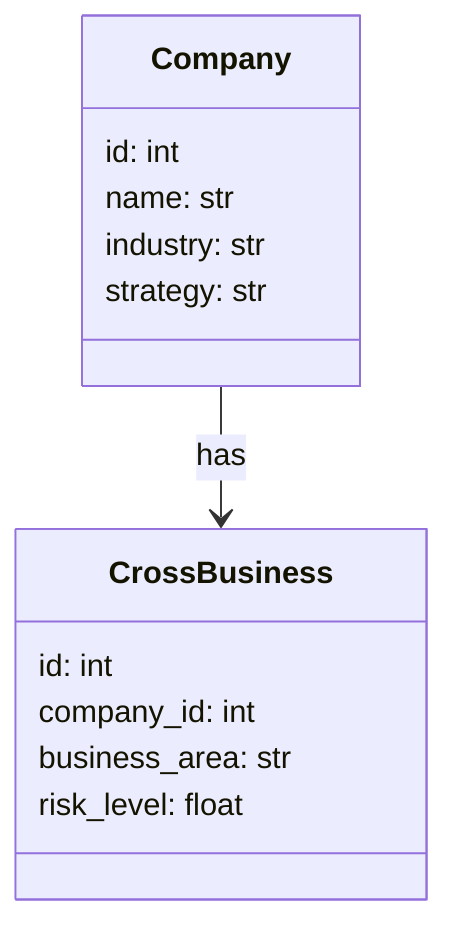
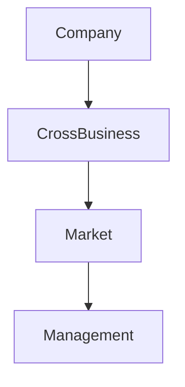

                 


# 彼得林奇如何看待公司的跨界经营策略

---

## 关键词：彼得·林奇、跨界经营、投资策略、企业战略、风险管理、成功案例

---

## 摘要：  
本文从彼得·林奇的视角出发，探讨公司跨界经营的策略、挑战与成功关键点。通过分析彼得·林奇的投资理念和跨界经营的数学模型，结合实际案例，为读者提供清晰的分析框架和实践指南。文章从背景、理论、算法、系统架构到实战案例层层展开，帮助读者深入理解跨界经营的本质和成功之道。

---

# 第一部分：引言与背景

## 第1章：引言

### 1.1 彼得·林奇与投资策略概述  
彼得·林奇是全球著名投资专家，以分析公司基本面和长期投资策略闻名。他的投资理念强调对企业战略、财务状况和管理团队的深入研究。跨界经营作为企业发展的重要策略，是彼得·林奇分析企业时的重要维度。  

**跨界经营的定义**：企业超越原有行业边界，进入新领域或整合资源的行为。  

**核心概念**：跨界经营涉及战略协同、资源优化和风险管理。  

### 1.2 背景与问题描述  
- **背景**：企业通过跨界经营寻求增长和竞争优势。  
- **问题**：跨界经营的边界如何界定？如何评估其可行性与风险？  
- **挑战**：资源分配、协同效应和风险管理是跨界经营的关键问题。  

### 1.3 本文的核心目标  
- 解析彼得·林奇的跨界经营分析框架。  
- 提供数学模型与算法支持。  
- 总结成功案例与最佳实践。  

---

# 第二部分：核心概念与理论框架

## 第2章：跨界经营的核心概念  

### 2.1 跨界经营的核心要素  

| 要素 | 定义 | 示例 |  
|------|------|------|  
| 战略协同性 | 新旧业务的协同效应 | A公司通过跨界整合供应链降低生产成本 |  
| 资源优化 | 资源共享与配置效率 | B公司通过跨界利用客户资源扩大市场 |  
| 风险管理 | 降低跨界经营的不确定性 | C公司通过跨界合作分散市场风险 |  

### 2.2 跨界经营的理论框架  

#### 2.2.1 SWOT分析  

- **优势（Strengths）**：原有业务的核心竞争力。  
- **劣势（Weaknesses）**：跨界经营可能暴露的短板。  
- **机会（Opportunities）**：新领域的市场潜力。  
- **威胁（Threats）**：跨界经营面临的外部风险。  

#### 2.2.2 PEST分析  

- **政治因素（Political）**：政策法规对跨界经营的影响。  
- **经济因素（Economic）**：经济环境对跨界经营的支持。  
- **社会因素（Social）**：社会需求与企业能力的匹配。  
- **技术因素（Technological）**：技术创新对企业跨界的支持。  

#### 2.2.3 波特五力模型  

- 行业竞争者分析：新领域内的竞争强度。  
- 新进入者威胁：跨界经营是否吸引新竞争者。  
- 替代品威胁：新领域是否有替代品威胁。  

### 2.3 跨界经营的数学模型  

#### 2.3.1 跨界经营的收益与风险模型  

收益模型：  
$$ R = \sum_{i=1}^{n} w_i \cdot r_i $$  

风险模型：  
$$ V = \sum_{i=1}^{n} w_i \cdot v_i $$  

其中，\( w_i \) 是第 \( i \) 个业务的权重，\( r_i \) 是收益，\( v_i \) 是风险。  

#### 2.3.2 股票价值计算公式  

股票价值公式：  
$$ V = \frac{D}{k} $$  

其中，\( D \) 是企业未来现金流的现值，\( k \) 是折现率。  

---

# 第三部分：彼得·林奇的分析框架

## 第3章：彼得·林奇的投资策略  

### 3.1 彼得·林奇的核心投资理念  

- **价值投资**：寻找被市场低估的企业。  
- **长期视角**：关注企业的长期增长潜力。  
- **管理团队**：重视管理层的素质和决策能力。  

### 3.2 彼得·林奇的跨界经营分析框架  

#### 3.2.1 战略协同性分析  

- **战略一致性**：新业务是否与企业战略一致。  
- **协同效应**：跨界经营是否带来资源协同。  

#### 3.2.2 资源优化配置  

- **资源分配**：评估企业资源是否支持跨界经营。  
- **成本优化**：跨界经营是否降低整体成本。  

#### 3.2.3 风险管理  

- **风险识别**：识别跨界经营的主要风险。  
- **风险控制**：制定风险管理策略。  

### 3.3 彼得·林奇的案例分析方法  

- **案例选择**：选择具有代表性的跨界经营案例。  
- **案例分析**：分析案例的背景、策略和结果。  
- **对比分析**：对比成功与失败案例的差异。  

---

# 第四部分：数学模型与算法

## 第4章：跨界经营的数学模型  

### 4.1 跨界经营的收益与风险模型  

- 收益模型：$$ R = \sum_{i=1}^{n} w_i \cdot r_i $$  
- 风险模型：$$ V = \sum_{i=1}^{n} w_i \cdot v_i $$  

#### 实现代码  

```python
def calculate_risk_return(weights, returns, risks):
    total_return = sum(w * r for w, r in zip(weights, returns))
    total_risk = sum(w * r for w, r in zip(weights, risks))
    return total_return, total_risk

# 示例数据
weights = [0.3, 0.5, 0.2]
returns = [0.1, 0.2, 0.15]
risks = [0.2, 0.3, 0.1]

rt, rk = calculate_risk_return(weights, returns, risks)
print(f"Total Return: {rt}, Total Risk: {rk}")
```

### 4.2 股票价值计算公式  

股票价值公式：  
$$ V = \frac{D}{k} $$  

#### 实现代码  

```python
def calculate_stock_value(D, k):
    return D / k

# 示例数据
D = 1000000  # 未来现金流现值
k = 0.1       # 折现率

value = calculate_stock_value(D, k)
print(f"Stock Value: {value}")
```

---

# 第五部分：系统分析与架构设计

## 第5章：系统分析与架构设计  

### 5.1 系统功能设计  

- **领域模型类图**：展示系统的核心实体和关系。  



- **系统架构图**：展示系统的主要组件和交互。  



---

# 第六部分：项目实战与总结

## 第6章：项目实战  

### 6.1 环境安装  

- 安装Python和相关库（如numpy、pandas、scikit-learn）。  

### 6.2 核心代码实现  

```python
import numpy as np
import pandas as pd

# 示例数据
data = {
    '业务领域': ['A', 'B', 'C'],
    '权重': [0.3, 0.5, 0.2],
    '收益': [0.1, 0.2, 0.15],
    '风险': [0.2, 0.3, 0.1]
}

df = pd.DataFrame(data)

# 计算总收益与总风险
total_return = np.dot(df['权重'], df['收益'])
total_risk = np.dot(df['权重'], df['风险'])

print(f"总收益: {total_return}\n总风险: {total_risk}")
```

### 6.3 案例分析  

**案例：** A公司跨界经营的成功经验。  

**分析：** 通过数据分析和模型计算，验证跨界经营的可行性与效果。  

---

## 第7章：总结与展望  

### 7.1 总结  

- 彼得·林奇的跨界经营分析框架。  
- 数学模型与算法的应用。  
- 成功案例与最佳实践。  

### 7.2 展望  

- 跨界经营的未来趋势。  
- 新技术对跨界经营的影响。  

### 7.3 最佳实践 Tips  

- **小结**：跨界经营需要全面分析战略、资源和风险。  
- **注意事项**：避免盲目跨界，注重协同效应。  
- **拓展阅读**：推荐相关书籍和文献。  

---

# 作者：AI天才研究院/AI Genius Institute & 禅与计算机程序设计艺术/Zen And The Art of Computer Programming

